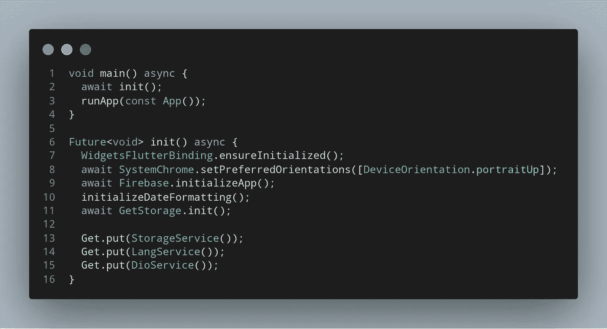
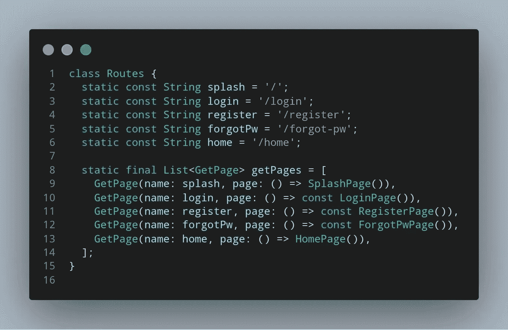
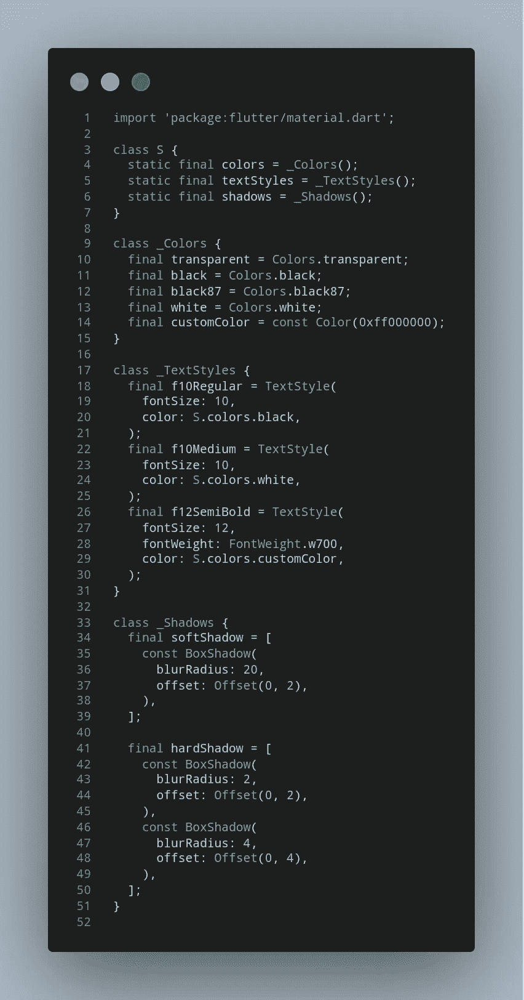
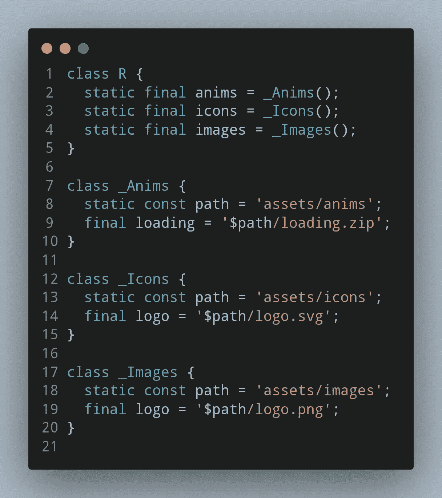
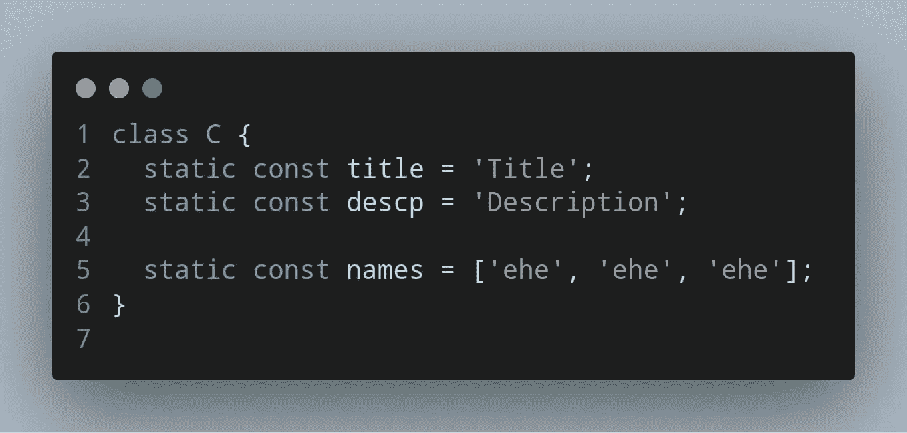
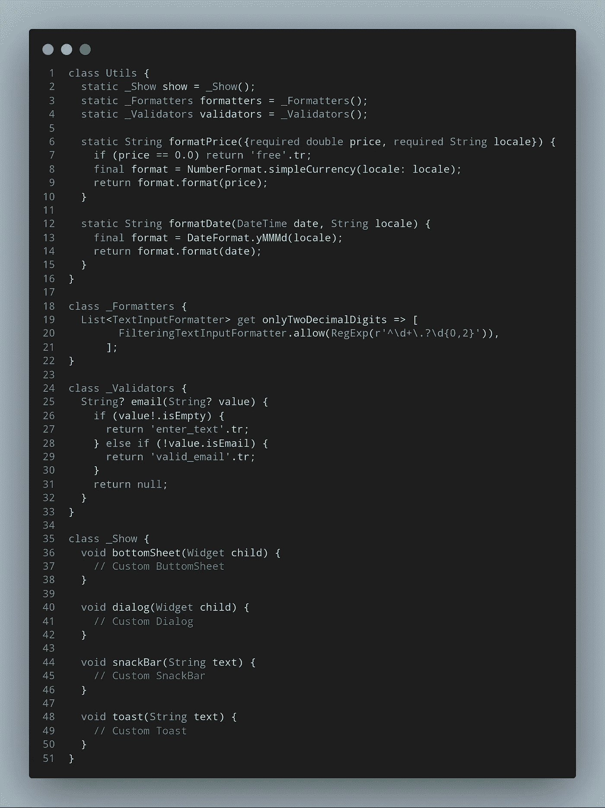

# 5 个颤振技巧，改善代码结构

> 原文：<https://itnext.io/5-flutter-tips-for-better-code-structure-fa514845a903?source=collection_archive---------2----------------------->


## 以下是我对更好的编码方法的拙见

这篇文章的目的只是给你一个更好的结构的想法，你可以做你自己的方式。他们不是最好的，但总比没有好

# 1.将 init 操作从 main 函数中分离出来，使其更加简洁



# 2.你可以简单地管理路线，没有任何麻烦

## 使用

```
Get.toNamed(Routes.login);
```

## 如何



# 3.你也可以在一个地方管理你的风格

## 使用

```
// S stands for StylesS.colors.redS.textStyles.f10MediumS.shadows.softShadow
```

## 如何



# 4.像老板一样管理你的资源！

## 使用

```
// R stands for Resources// Animations
R.anims.loading// SVG images
R.icons.logo// Images
R.images.logo
```

## 如何



# 5.可能我们大多数人都这样使用，但是以防万一

## 使用

```
// C stands for Constants
C.title
C.names
C.descp
```

## 如何



# 6.我们一直在一个地方使用的便利工具

## 使用

```
Utils.formatDate(date,locale);Utils.formatters.onlyTwoDecimalDigits;Utils.show.dialog();
```

## 如何



# 感谢您的阅读！

如果你喜欢这篇文章，请点击👏按钮(你知道你可以升到 50 吗？)