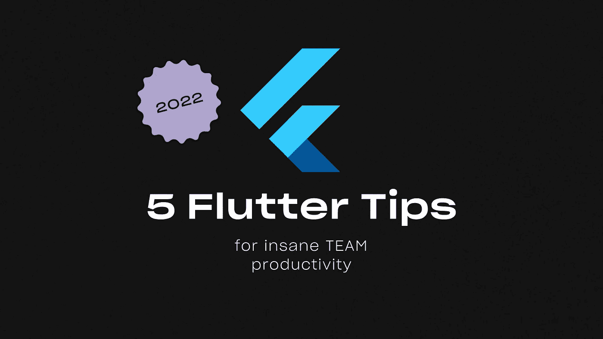
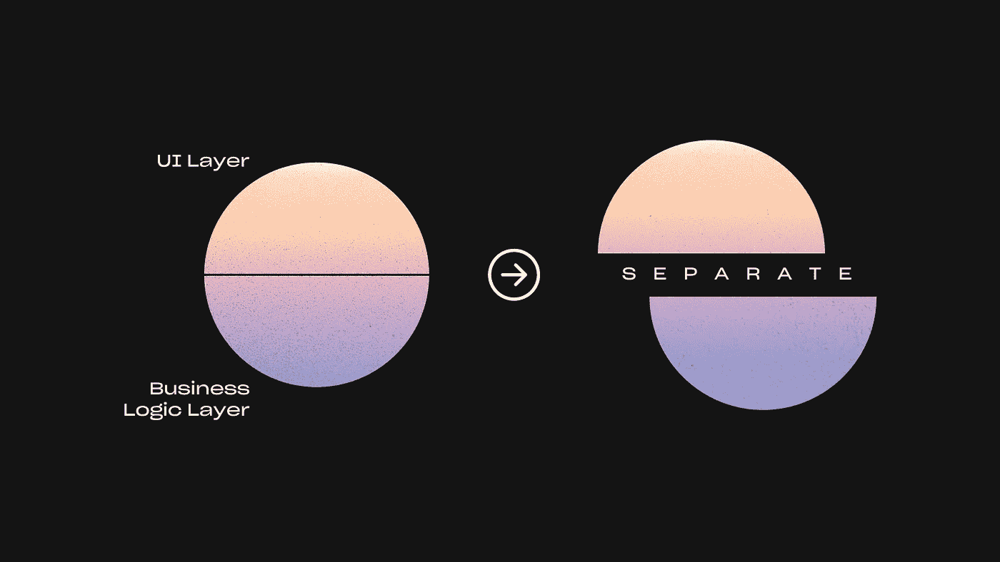
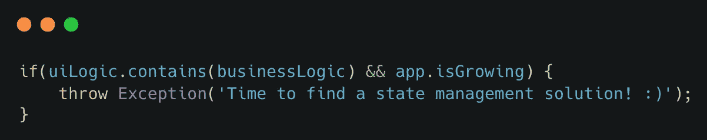
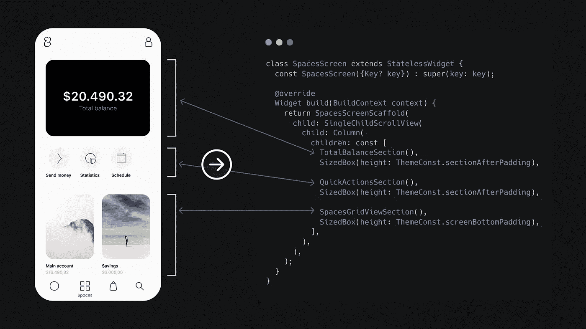
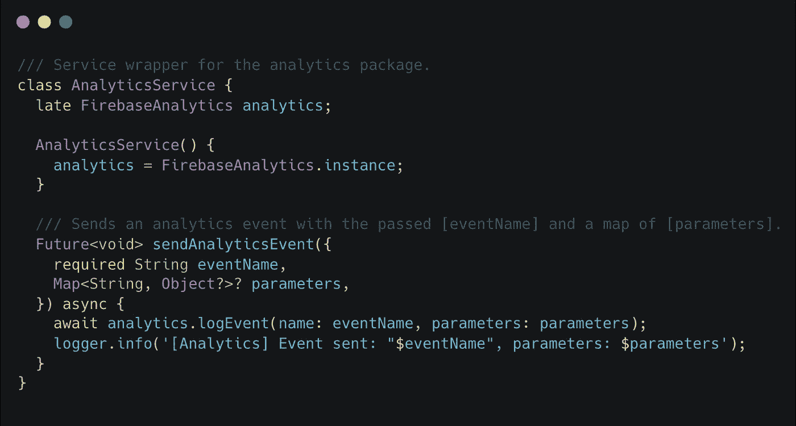
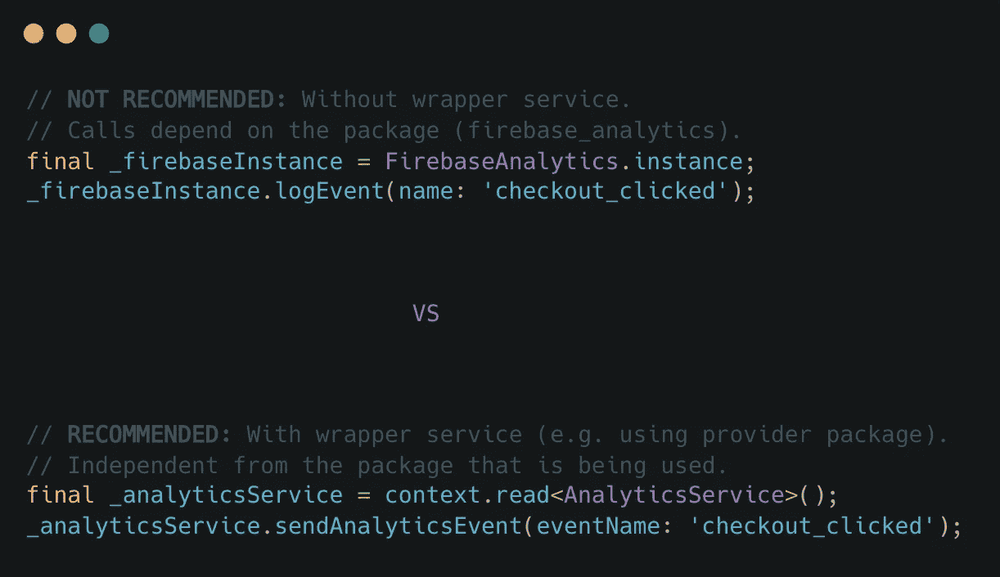
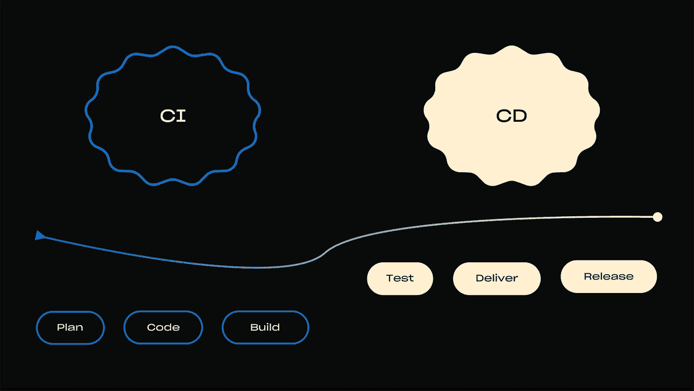

# 疯狂团队生产力的 5 个技巧

> 原文：<https://itnext.io/5-flutter-tips-for-insane-team-productivity-ec1b4f37f617?source=collection_archive---------1----------------------->

# 1.定义清晰的架构并记录内部最佳实践📃

最重要的事情之一是让所有团队成员达成共识。尤其是在新团队成员入职时，可能会出现这样的问题:

*   “我需要更新设计系统，我应该在代码的哪里做？”
*   *“我们如何在业务逻辑层处理 API 错误？”*
*   *“我们有窗口小部件条件渲染的最佳实践吗？”*
*   *“我应该为这个特性编写什么样的测试？”*

理想情况下，大多数问题应该通过您团队中的**架构**和**最佳实践**的完整文档来回答。

然而，如果您的团队仍然处于没有严格设定最佳实践和缺乏文档的阶段，我强烈建议您**尝试下面的**:

1.  与您的开发团队召开一次会议，讨论应用程序的所有不同部分— *从状态管理到小部件等等*。
2.  分析、研究并最终**确定第一套指南** *(书面形式)* **您认为**哪些指南**会消除团队中**不断出现**的&问题**。
3.  尝试**将**指导方针**的第一次迭代** *(例如在你的下一次冲刺中)*。
4.  过一会儿**观察结果**并再次与你的团队讨论有用的部分，但也尝试找出定义过于松散或不完整的部分。
5.  **根据需要不断重复**文档。
    此外，不要忘记重复*(重构)*代码中一开始就有问题的部分，对于这些部分，再多的文档也无法提供足够的信息。

一致性是关键。一致性伴随着指导方针而来。找到并定义你的标准最佳实践，这将有助于你的团队对你的代码库的细节充满信心。

> 提示:你可以使用免费工具，如**来记录这些最佳实践。我也是**建筑图**的超级粉丝——以一种易于理解的视觉格式呈现建筑部分。其中一个不错的**免费可视化工具**是[**fig ma**](https://www.figma.com/)**/**[**fig jam**](https://www.figma.com/figjam/)。**

# **2.分离业务和 UI 逻辑**

****

**从我的经验来看——**这个是必须的**。我敢说，如果你把业务& UI 逻辑纠缠在一起，保持小部件干净几乎是不可能的。**

****

**如果您的小部件中存在业务逻辑，并且您的应用程序正在增长→是时候找到状态管理解决方案了！:)**

## **分离的好处:**

*   **使**易于测试**两个 UI &业务逻辑层**分开****
*   **更容易的重构**
*   ****快速调试****
*   ****更快地实施新功能****

**根据我个人的经验，我可以强烈推荐 [**集团状态管理包**](https://pub.dev/packages/bloc) 。它足够成熟和灵活，因此适用于几乎所有的使用案例。如果您害怕 BLOC 附带的可能的样板代码*(您已经听说过)*→您可以阅读[**Flutter:BLOCs at Scale | 2—Keeping BLOCs Lean**](/flutter-blocs-at-scale-2-keeping-blocs-lean-1b659536e3ec)，其中我讨论了如何利用像可重用块这样的概念，这将减少样板代码的数量。
如果你的 app 不需要 BLOC 的所有可能性，可以使用 **Cubit** *(包含在同一个包里)*。**

# **3.将小部件的渲染功能限制在 60 行代码以内**

**如果你的小部件是一大堆代码，你的团队将会有很大的问题。大约 60 行代码的限制是我最喜欢的个人准则，它迫使我和我的团队保持小部件结构良好和清晰。**

****

**感谢杰出的设计师 Sabina mo wich([https://www . behance . net/gallery/131947637/Mobile-Banking-UI-design](https://www.behance.net/gallery/131947637/Mobile-Banking-UI-design))允许我使用她的设计🎨**

**上图展示了一个例子，说明我们如何在保持代码量最少的同时，在屏幕级别上构建我们的小部件。**

****逻辑上** **将 UI 分成多个子部分**和**子部件**帮助我们实现一组清晰且可维护的 UI 代码。**

**还在好奇为什么小部件的大小会成为这么大的问题吗？**

*   **仅仅一个 300 多行代码的小部件就可能让评审者“精疲力尽”,以至于他可能很容易忘记他之后的深入工作。**
*   **当你连续 5 分钟寻找需要你编辑的代码时，实现简单的 UI 设计改变变得很麻烦。**
*   **它**阻碍了部件的可重用性**，而**促进了代码复制**。**

> **提示:拥有多个小部件比拥有一个大部件要好得多。另外，**使用类部件**而不是函数(出于性能原因)。**

*****注意:如果你对如何编写干净的小部件并保持你的 UI 代码结构化感到好奇，请务必点击我的个人资料上的关注按钮。我将很快深入讨论这个话题。*****

# **4.围绕包创建 API 包装器**

**当你阅读一个包的文档时，它通常会显示这个包的 API 的**直接用法。这让特别缺乏经验的开发人员感到困惑，因为他们认为**在随机位置直接调用包的函数**会污染代码库**是一种好的实践**。****

只不过通常不是这样——原因如下:

*   想象一下，你想用一个类似的包来**替换这个包——现在你需要**重构你整个代码库的所有调用**→这是一个非常平凡的&容易出错的过程。**
*   随着时间的推移**包会发生突破性的变化**，这意味着我们需要**改变所有代码** *(与上述问题类似)。*
*   使得编写测试更加困难。

> 相反，您应该选择包装服务类，它灵活且易于维护。

**例如:**

让我们假设我们想要在我们的应用程序中实现**分析**。在安装了我们选择的分析包*(例如* `*firebase_analytics*` *)* 之后，让我们创建一个`**AnalyticsService**`包装器服务类。这样，我们可以定义自己的 API，并且**在未来的包变化方面保持灵活性**。

这个类可能看起来像这样:

包的**直接使用**与服务类的**使用的比较:**

> 提示:**松耦合**在灵活性和可扩展性方面提供了明显的好处。与长期收益相比，轻微开销的警告(这是样板代码)无关紧要。

# 5.自动化 CI/CD

最后但同样重要的是，设置 CI/CD 管道。

建立一个好的*“实现-测试-合并-部署-发布”*管道非常重要。虽然每个管道看起来都有一点不同，但它们都有一个共同点，那就是当一个管道投入使用时，它每周都会为你节省几个小时的手工劳动。

我目前最喜欢的颤振 CI/CD 工具组合是 **Github Actions +浪子。**该组合使您能够轻松设计可以在不同条件下在不同分支上运行的工作流。

**例如:**

*   当你合并一个 PR `development <-- feature`分支，**你可以运行** dart analyzer / linter，测试，生成文档等等。
*   当你合并一个 PR `main <-- development`分支时，你可以**运行上面的所有步骤，增加构建/版本号** + **运行快速通道**，其中**构建**发布版本，而**将内部发布版本**部署到谷歌 Play 商店和 App Store。

所有这一切终于可以实现了，不再需要在紧张的期限内(周五晚上)进行大量手动操作。享受你的啤酒🍺🌞

## *谢谢你

给每一个正在阅读这篇文章并且已经走了这么远的人。
如果你想要**更多类似**的文章，请随意:

*   💬**评论**你自己与 Flutter 一起工作的经历。也可以随意提出您感兴趣的主题，并认为需要更多的生产准备报道。
*   👏**发几个拍手**。这将激励我继续分享关于颤振开发的生产准备技巧。
*   ➕ **在我的媒体上按跟随**，所以你不会错过新的提示。
*   🔗在你的社区内分享文章。