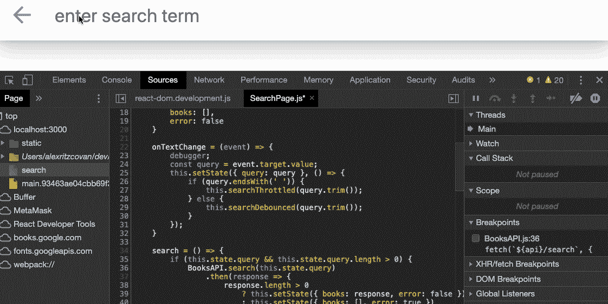
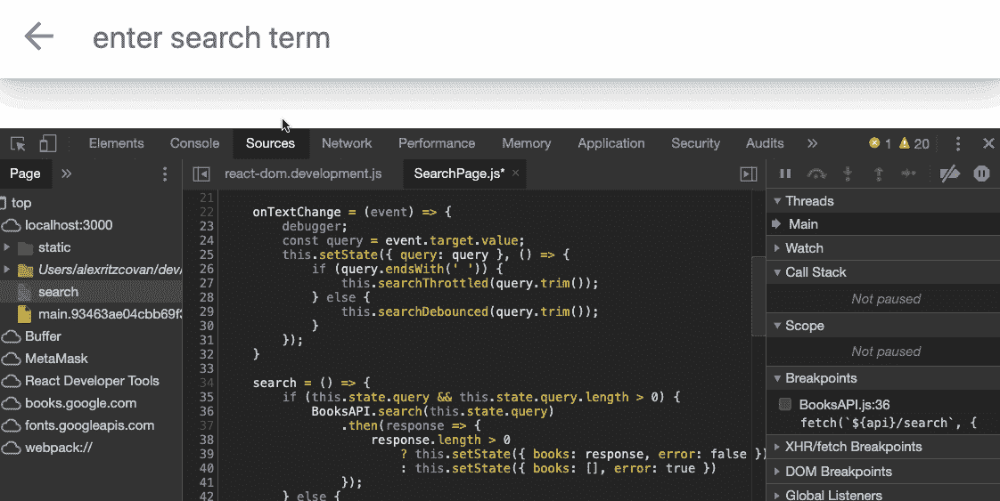
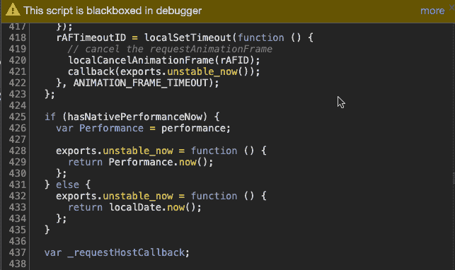
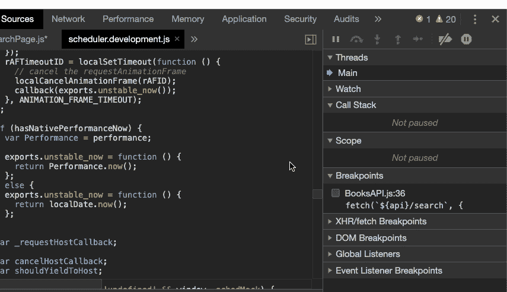
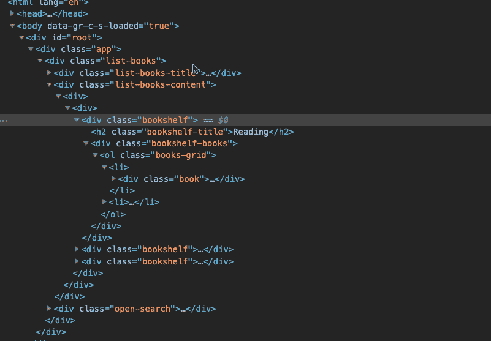
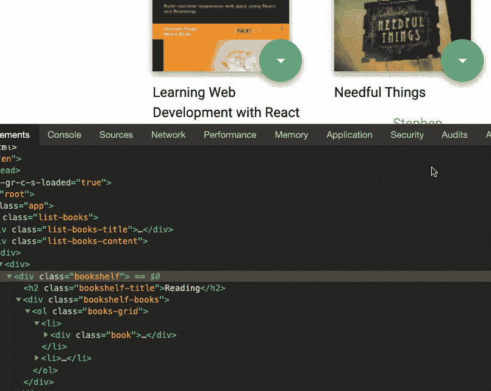
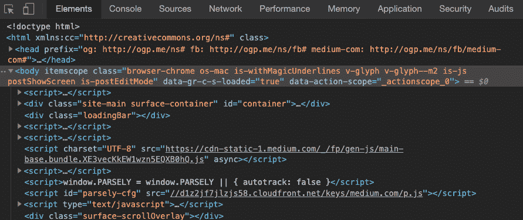
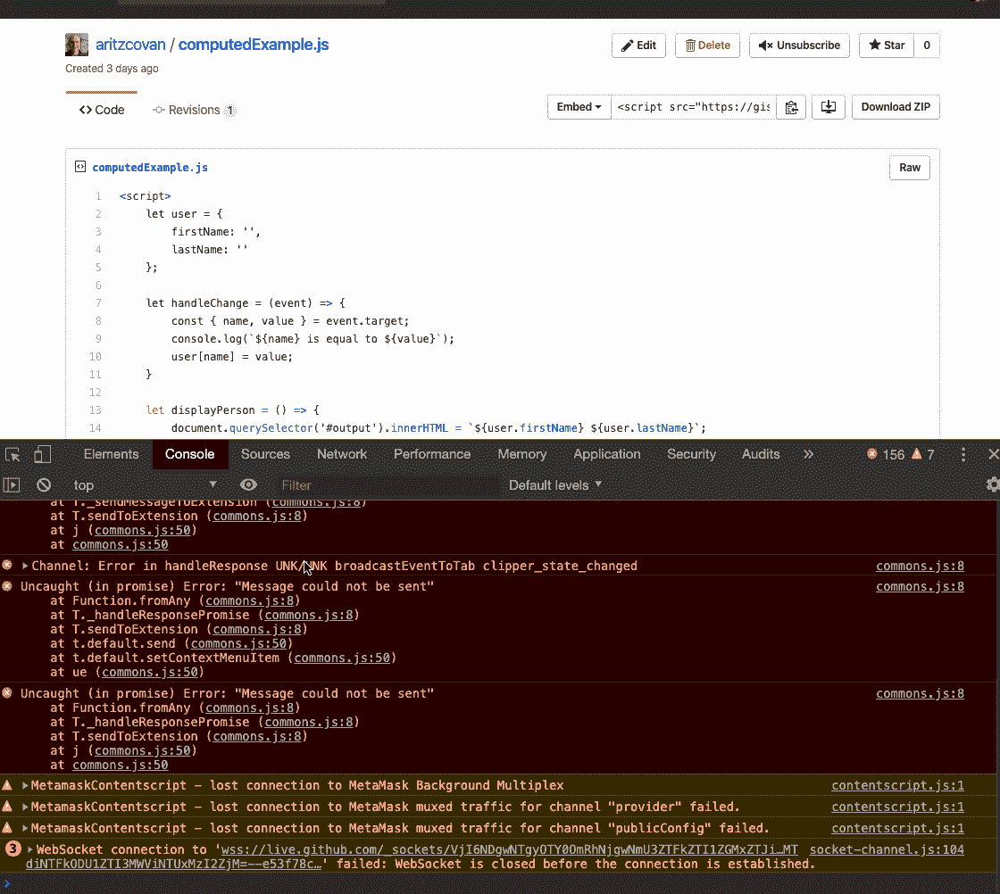
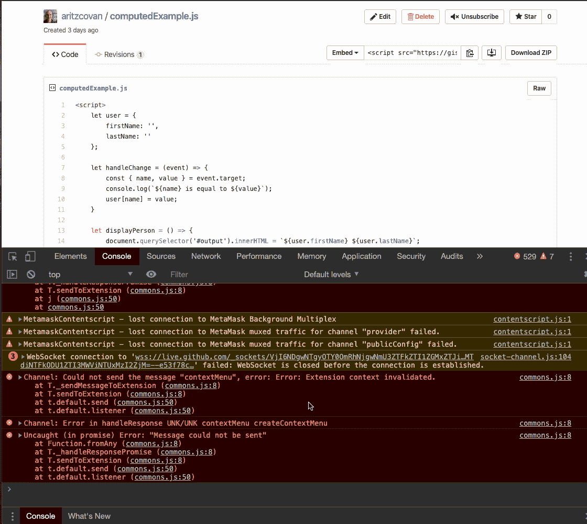
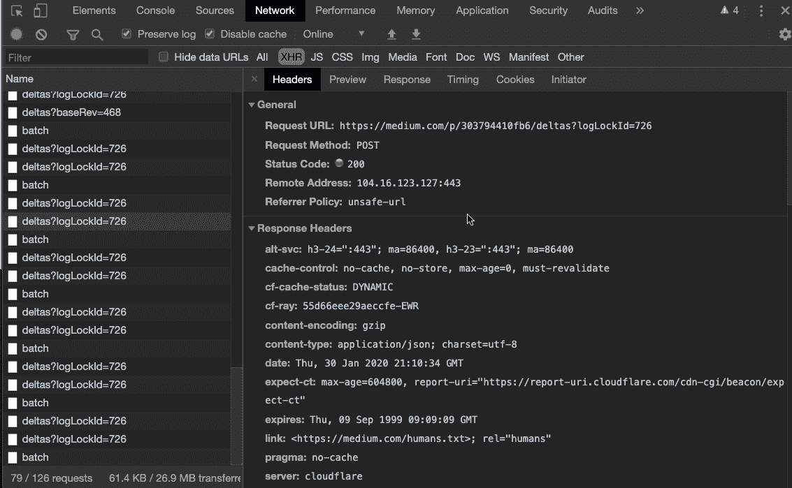

# Chrome DevTools 的 5 个必备特性

> 原文：<https://itnext.io/5-more-awesome-features-in-chrome-devtools-303794410fb6?source=collection_archive---------1----------------------->

## 向网络开发忍者的身份迈进一步

[Zan](https://unsplash.com/@zanilic?utm_source=medium&utm_medium=referral) 在 [Unsplash](https://unsplash.com?utm_source=medium&utm_medium=referral) 上的照片

如果你是一名活跃的网络开发人员，你可能会经常使用 Chrome DevTools。说到在 web 上开发现代应用程序，DevTools 是必不可少的。没有 DevTools 在网上工作就像驾驶一架没有窗户的飞机。我们可能会到达我们要去的任何地方，但它会比我们需要的要困难得多。

在我们开始之前，如果您想继续，请确保您的浏览器中已经打开了 DevTools。你可以在 mac 上按 command+option+J，在 windows 上按 control+shift+J。

事不宜迟，下面是 Chrome DevTools 中的 *5 个更棒的特性。*

## 调试器；

我一直用这个。通常情况下，您正在处理一个大型代码文件，并且需要查看特定代码行上发生了什么。

您可以打开“源代码”面板，搜索您感兴趣的位置，并设置一个断点。试试这个。转到代码编辑器，将调试器语句放到您关注的区域。调试器语句在功能上与标准断点相同。

在下一页执行时，将触发调试器语句，执行将停止，让您有机会检查变量并逐句通过您的代码。

例如，这里我有一个页面，它是 React 应用程序的一部分，用于执行搜索。我怀疑我在 *onTextChange* 事件处理程序中有问题，所以我在那里放了一个调试器语句，看看发生了什么。这就是它的作用。

调试器使暂停执行变得容易

我通常在任何需要使用 console.log()的地方使用 debugger 语句，但是我发现使用 debugger 更快更容易。不喜欢什么？

## 黑盒脚本

这个可以和调试器一起工作。很多时候，当调试和单步调试您的代码时，调试器会跳出您的代码，进入一些供应商的代码。这既费时又烦人。此外，很有可能无论问题是什么，都不在供应商代码中。为了避免这种中断，将供应商代码黑盒化，调试器将不会继续进入其中。看看这个:

将供应商代码黑盒化

如果您决定不再希望或需要对供应商代码进行黑盒处理，只需在源代码面板中右键单击该文件，然后选择“停止黑盒处理”

停止黑盒

不再浪费时间查看供应商代码！

## 事件侦听器断点

让我们假设您正在尝试调试与某个事件相关的问题。也许你需要一个目标鼠标点击，你想打破任何时候发生的事件。没有必要去搜寻你的消息来源来找到处理者。让 DevTools 为您完成这项工作。看看这个。

设置事件侦听器断点

正如你所看到的，我们可以选择只监听*鼠标点击事件或者我们可以选择*任何与鼠标相关的*事件。此外，我们不仅限于鼠标事件。我们可以从页面上的任何对象捕获任何事件。超级有用！*

## DOM 断点

这是另一个你不知道你需要的 DevTools 特性。使用现代 web 应用程序并不像过去那样，世界都是静态页面。页面通常是动态的，一直在变化。使用 DOM 断点，您可以隔离一个 DOM 元素，并在该元素发生变化时停止执行。

让我们打开元素窗格，在 DOM 节点上设置一个断点。

为子树修改设置 DOM 断点

如果需要，我们可以在多个条件下中断。这里我们选择子树修改。设置好断点后，让我们与 UI 交互并触发它。

触发我们的 DOM 断点

当断点被触发时，DevTools 跳转到 Sources 面板并突出显示修改 DOM 的代码。

## 命令菜单

当在 DevTools 或任何开发环境中工作时，目标应该是让你的手一直放在键盘上。把你的手从键盘上拿开来操作鼠标是低效的，并且浪费大量的时间。解决办法？命令菜单！

要打开命令菜单，一旦 DevTools 打开，在 windows 上输入 control+shift+p 或在 mac 上输入 command+shift+p。

让我们使用命令菜单在面板之间切换，而不使用鼠标:

使用命令菜单更改面板

接下来，让我们移动 DevTools 停靠的位置:

更改停靠位置

让我们来看一个需要与同事分享的截图。

捕捉屏幕截图

命令菜单中内置了大量其他功能。要熟悉，只需打开菜单，滚动查看有什么可用的。

命令菜单中有很多很酷的东西

使用命令菜单可能一开始会让你慢一点，但这是值得的。花点时间学好它，你会获得更大的生产力。

现在你有了，DevTools 中的 5 个更棒的特性。

## 关键要点。

1.  使用 debugger 语句停止代码的执行。在您通常使用 console.log()的地方尝试一下。
2.  为了避免调试时进入供应商代码，请将这些供应商脚本黑盒化。
3.  使用事件侦听器断点面板可以轻松地在页面上的任何事件上设置和触发断点。
4.  当 DOM 元素被修改时，使用 DOM 断点来暂停执行。
5.  学会喜欢和使用命令菜单。这会节省你的时间，让你成为一个更有效率的开发者。

这篇文章是对你需要知道的 5 个 Chrome DevTools 工具的跟进,所以去看看吧。

一如既往，感谢阅读，如果你喜欢这篇文章，请分享它，并确保[查看我在 Medium](https://medium.com/@aritzcovan) 上的其他文章。

 [## 亚历克斯·里茨科万-中等

### 阅读 Alex Ritzcovan 在媒体上的文章。前 CTO 和软件开发人员。我热爱学习和分享…

medium.com](https://medium.com/@aritzcovan) 

再次感谢，祝学习愉快。

## 参考

[调试器语句](https://developers.google.com/web/tools/chrome-devtools/javascript/breakpoints#loc)

[黑盒脚本](https://developers.google.com/web/tools/chrome-devtools/javascript/reference#editor-blackbox)

[事件监听器断点](https://developers.google.com/web/tools/chrome-devtools/javascript/breakpoints#event-listeners)

[DOM 断点](https://developers.google.com/web/tools/chrome-devtools/javascript/breakpoints#dom)

[命令菜单](https://developers.google.com/web/tools/chrome-devtools/command-menu)