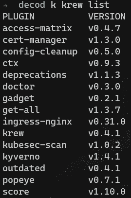

# 5 个必备的命令行 Kubernetes 工具

> 原文：<https://itnext.io/5-must-have-command-line-kubernetes-tools-b90bdb843ce6?source=collection_archive---------1----------------------->

图片由 [Darkmoon_Art](https://pixabay.com/users/darkmoon_art-1664300/?utm_source=link-attribution&utm_medium=referral&utm_campaign=image&utm_content=4230648) 来自 [Pixabay](https://pixabay.com/?utm_source=link-attribution&utm_medium=referral&utm_campaign=image&utm_content=4230648)

管理 Kubernetes 集群

## 介绍

随着 Kubernetes 的流行，它的复杂性也在增加。令人惊叹的开源社区和健康的供应商生态系统争相提供集群管理、开发、测试、安全等工具和服务。

在本文中，我们将重点关注基于[命令行](https://en.wikipedia.org/wiki/Command-line_interface)的工具和插件，以帮助您进行集群管理、观察、管理和日常活动。

要求是所有工具和插件必须:

*   源代码开放的
*   基于命令行
*   易于安装
*   为您的 Kubernetes 工作流程带来实实在在的好处

## 排名第一的 Kubectl krew 插件管理器

Kubernetes 插件管理器

**来源&安装:**

Krew 可以使用 git/curl 安装。只需复制并粘贴安装命令

 [## Krew - kubectl 插件管理器

### Krew 是 kubectl 命令行工具的插件管理器。Krew 帮助你:发现 kubectl 插件，将它们安装在…

krew.sigs.k8s.io](https://krew.sigs.k8s.io/) 

**工作原理:**

Krew 与 kubectl CLI 集成，并提供一种机制来安装额外的命令行工具作为插件。截至本文撰写时，有 **149** 个插件可用。

**如何使用:**

为了充分利用 krew 插件管理器，你需要发现哪些插件对你有用，并通过 krew 安装它们。然后就是简单的跑步问题`kubectl plugin-name -options`

以下是我经常使用的插件列表:

来源:作者

**好处:**

Krew 为发现和管理插件提供了一站式服务，使得添加新工具来改进您的 Kubernetes 工作流变得更加容易。

## #2 库贝克斯和库本斯

这实际上是两个独立的工具，但是它们大部分时间都用在一个工作流中，所以我把它们放在一起。

**来源&安装:**

通过 krew `kubectl krew install ns` & `kubectl krew install ctx`安装或独立/软件包安装:

 [## GitHub - ahmetb/kubectx:在 kubectl 中更快地在集群和名称空间之间切换的方法

### 这个存储库提供了 kubectx 和 kubens 工具。安装→在 v0.9.0 中，kubectx 和 kubens 现在在…

github.com](https://github.com/ahmetb/kubectx) 

**工作原理:**

两个插件都是用 Go 编写的，并修改 *kubeconfig* 切换到一个新的上下文或名称空间。

**使用方法:**

为了获得最佳体验，请在[交互模式](https://github.com/ahmetb/kubectx#interactive-mode)下使用这两个插件。该模式要求[安装 fzf](https://github.com/junegunn/fzf) ，并允许用光标而不是复制/粘贴来选择上下文。

下面是它在我的上下文中是如何工作的:

来源:作者

**好处:**

拥有这些工具的最大好处是不需要输入命令。那些工具是必备的！

## #3 Kube-ps1

这个插件与 kubectx 和 kubens 结合使用效果很好。一旦切换到不同的上下文/名称空间，您如何知道自己在哪里？

嗯，kube-ps1 正是这样做的。

**来源&安装:**

独立和软件包安装。此插件在 Windows 上不可用。

 [## GitHub-jonmosco/kube-PS1:Kubernetes bash 和 zsh 的提示信息

### 一个脚本，允许您将当前 Kubernetes 上下文和在 kubectl 上配置的名称空间添加到 Bash/Zsh 提示符中…

github.com](https://github.com/jonmosco/kube-ps1) 

**工作原理:**

Kube-ps1 将您的提示更改为包含关于当前上下文和名称空间的信息。

**如何使用:**

安装 kube-ps1 后，将代码片段添加到您的 shell (bash/zsh/fish)中。Kube-ps1 可通过`kubeoff`命令关闭，并使用`kubeon.`重新打开

以下是 kubectx、kubens 和 kube-ps1 的流程图:

**好处:**

使用 kube-ps1，可以更容易地避免混淆和可能的错误，因为我们总是知道我们所处的上下文和名称空间。

## # 4 Kail 流日志

可以流式传输属于部署的所有 pod 的日志，但是流式传输所有日志或基于查询标准的日志要困难得多。Kail 解决了这个问题

**来源&安装:**

通过 krew `kubectl krew install tail`安装或独立/软件包安装:

 [## GitHub - boz/kail: kubernetes 日志查看器

### 库伯内特的尾巴。从所有匹配的 pod 的所有容器中流式传输日志。按服务、副本集、部署匹配 pods

github.com](https://github.com/boz/kail) 

**工作原理:**

Kail 可以基于不同的匹配标准流式传输 pod 日志，例如，服务选择的所有 pod 或匹配任意标签的所有 pod。

**如何使用:**

最好有一个专门的窗口/面板，打开的 kail 日志符合您的标准。这是一个有两个窗口拆分的流程:

**好处:**

有了 kail，根据您的选择标准，流式传输日志和查看实时日志变得更加容易。

## #5 K9s — Kubernetes CLI 以时尚的方式管理您的集群！

最后，但肯定不是最不重要的，我最喜欢的工具，k9s。这是一个完全成熟的基于命令行的 CLI，用于管理和观察您的 Kubernetes 集群

**来源&安装:**

K9s 有很多安装选项，Windows 上也有。从 git repo 中获取:

 [## GitHub -出轨/k9s:🐶Kubernetes CLI 以时尚的方式管理您的集群！

### K9s 提供了一个终端 UI 来与您的 Kubernetes 集群进行交互。这个项目的目的是使它更容易…

github.com](https://github.com/derailed/k9s) 

**工作原理:**

K9s 是一个 CLI 工具，它使用您的终端来显示有关您当前所在集群的信息，它还支持其他更高级的功能，如端口转发、查看 Kubernetes 对象的 YAML 等等。

**如何使用:**

只需输入 k9s，您将看到 UI 的运行。

这里是一个工作流程，包括到目前为止提到的所有工具和插件。在这里，我在 Windows 10 上使用 WSL2，使用键盘快捷键将我的终端窗口分成 3 个窗格。我使用 kail 在右下方的窗格中显示我创建的 nginx pod 的日志。过了一会儿，我使用 k9s 将我的本地端口 8080 移植到一个 nginx 容器端口 80，并使用左下角面板中的 curl 与它进行交互。凯尔显示日志的时候。

**好处:**

K9s 使我能够在集群中快速移动，使用所有的 kubectl 特性等等。值得一提的是，尽管 k9s 提供了允许您更改集群上的资源的特性，但是这应该只在测试/开发集群上进行。

与生产集群交互的最佳方式是使用 GitOps 原则和工具。如果你想了解更多，请查看我最近在 Kubernetes 上的博客 GitOps。

## 结论

我们已经看到了一个典型的 Kubernetes 工作流是如何通过仅仅使用 5 个插件和工具得到显著改进的。正如您所注意到的，这些工具是面向集群管理的，另外还有一套针对开发人员的工具。在下一篇博客中会有更多的介绍！

您可以很容易地在本地机器上安装所有这些工具，但是也可以使用 Docker 运行带有所有这些工具(以及一些其他工具)的 kubectl。我已经用所有这些工具[创建了一个高度定制的 docker 映像](/portable-kubernetes-management-with-kubectl-in-docker-cb861a2c3c02?source=friends_link&sk=2eaa077c0e9d75af98695346d355c5bc)，所以不需要在本地安装它们。

还有什么我没有提到的 CLI 工具是您日常使用的吗？请在评论中告诉我们。