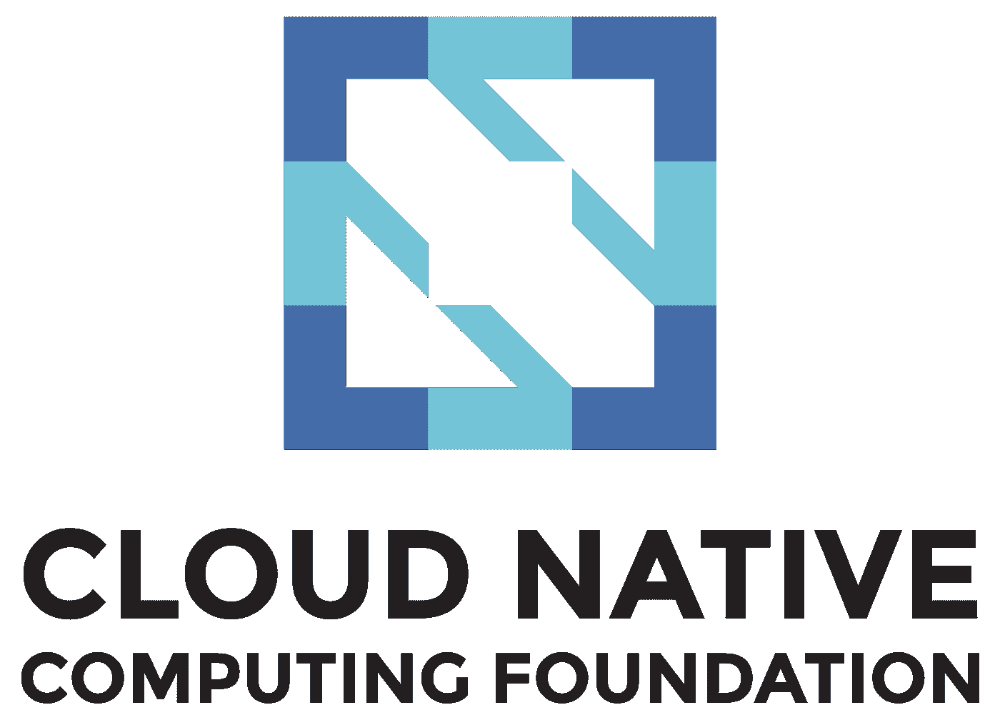
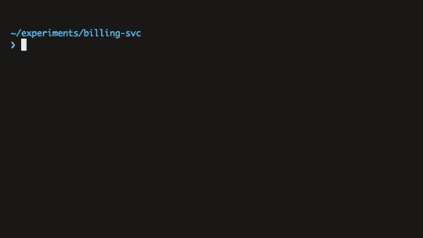
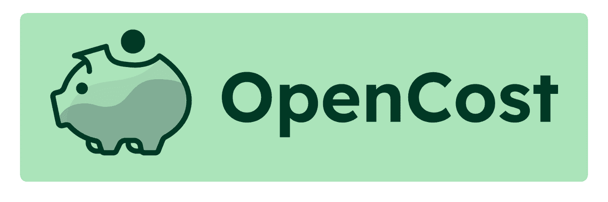
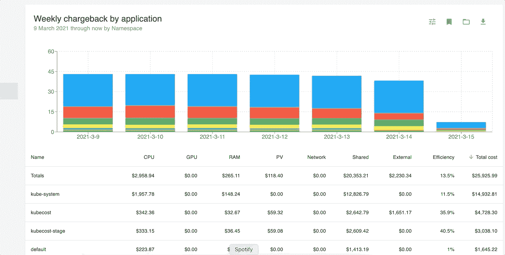
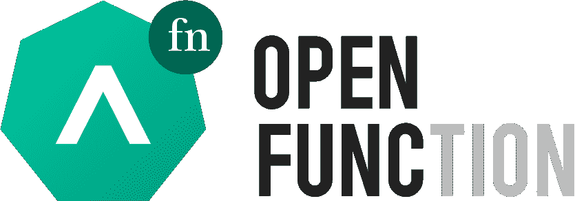
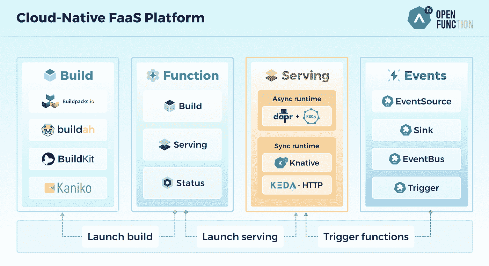
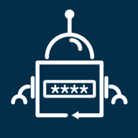
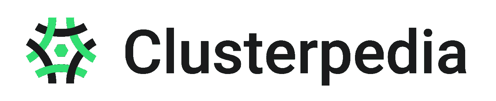
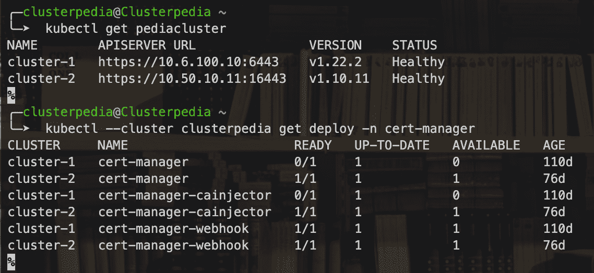

# 2023 年值得关注的 5 个新 CNCF 项目

> 原文：<https://itnext.io/5-new-cncf-projects-to-watch-in-2023-af5234ba6e87?source=collection_archive---------0----------------------->

欢迎来到我的 Kubernetes 博客。这些博客旨在为您提供有效的 Kubernetes 知识和工具，提高效率，同时减少压力和交付高质量解决方案的时间。点按“关注”按钮，以便在新故事发布时得到通知。

**让我们开始吧……**

云原生计算基金会(CNCF)成立于 2015 年，旨在传播和推广云原生基金会的开放标准和项目。CNCF 在市场上享有全球认可度，并在定义和强化云计算的未来方面发挥着至关重要的作用。

CNCF

目前，CNCF 下有 141 个上市项目，分为四个层次。

*   **沙盒**—*experimental 项目尚未在生产中广泛测试，处于技术前沿*
*   **孵化** — *项目被少量用户成功用于生产，并有一群健康的贡献者*
*   **已毕业** — *项目被认为是稳定的，被广泛采用，并已准备好投入生产，吸引了成千上万的贡献者*
*   **已存档的** — *已达到其生命周期终点并已失效的项目。*

那么让我们来看看 2023 年你应该关注的 CNCF 新项目

*   [柜员](https://github.com/SpectralOps/Teller)
*   [OpenCost](https://github.com/opencost/opencost)
*   [开启功能](https://github.com/OpenFunction/OpenFunction)
*   [外部秘密](https://github.com/external-secrets/external-secrets)
*   [集群儿科](https://github.com/clusterpedia-io/clusterpedia)

**柜员**

泰勒

Teller 于 2022 年 4 月加入 CNCF 项目，拥有 1.1K GitHub starts 和 25 个以上的源代码贡献者。

Teller 的主要目标是为开发人员服务，并提供一种安全的方式来使用敏感数据，而不会将它们硬编码到源代码、shell 中，或者将它们放错文件中。使用 teller.yaml 文件，您可以将 teller 配置为以 Vault、Consul、AWS Secret Manager、Google Secret Manager 等身份连接到 secret store，以便安全地提取和访问您的敏感数据。

柜员使用示例

Teller 还有一些特性，因为它可以用于 CI 流程的 DevSecOps 目的，检查源代码中的敏感信息，用作从文件、日志或应用程序输出等中减少敏感数据的工具。

**OpenCost**

开放成本

OpenCost 于 2022 年 6 月加入 CNCF 项目，拥有 2.9K GitHub starts 和 47 个源代码贡献者。

OpenCost 是一个厂商中立的开源项目，用于在 Kubernetes 环境中测量和分配基础设施成本。OpenCost 最初由 [kubecost](https://kubecost.com/) 开发，实现了最初由 kubecost 构建的原始成本分配引擎。

OpenCost 支持通过定制价格表与 AWS、GCP、Azure 和本地集群等主要云供应商进行计费集成。

OpenCost 的使用示例

**OpenFunction**

开放功能

OpenFunction 于 2022 年 4 月被添加到 CNCF 项目中，拥有 865 个 GitHub 启动和 25 个源代码贡献者。

OpenFunction 是一个开源的云原生 FAAS (function as a code platform ),用于在 Kubernetes 上构建和提供事件驱动的功能。OpenFucntion 利用 Tekton、keda、kenative、Dapr、shipwright 等开源项目构建完整的 FAAS 平台。

OpenFunction 的一个主要 CRD 是一个函数，它负责定义如何构建源代码以及该函数如何服务于事件。OpenFunction 允许您定义与函数交互的事件类型，自定义 CRD 作为触发器、事件源、事件总线等等。

开放功能拱

**外秘**

外部秘密

External-secrets 于 2022 年 7 月被添加到 CNCF 项目中，拥有 1.9k GitHub starts 和 300 多个源代码贡献者。

External-secrets 允许敏感数据从外部 secret store 复制到 Kubernetes secret。对 secret store 中相关秘密的任何更改都将同步到您的 k8s 秘密中，无需手动干预。

**集群百科**

集群百科

Clusterpedia 于 2022 年 6 月被添加到 CNCF 项目中，拥有 497 个 GitHub starts 和 35 个源代码贡献者。

Clusterpedia 是您的集群的 wikepida，它允许通过将 Kubernetes 资源同步到自己的数据库来对多个集群进行强大的复杂搜索，并且 Clusterpedia 与不同的资源版本兼容。

集群百科示例

**结论**
尽管被列为沙盒项目，上面列出的五个工具已经对社区产生了积极的影响，正如它们的 GitHub 项目所示。2022 年，CNCF 增加了更多有价值的项目，这些项目很有影响力，但不幸的是，为了让这个故事简短易读，这里没有展示。作为 DevOps 工程师，了解最新的相关项目是非常重要的，尤其是 CNCF 项目，因为它们定义并强化了云计算的未来。所以，去参观一下 https://www.cncf.io/吧，那里的项目可以帮助你的旅程。

谢谢，如果您有任何问题或需要任何帮助，您可以通过 LinkedIn 联系我。如果您想深入了解以下评论中的任何工具，请告诉我，或者直接发邮件给我。

***********************************************************************

链接:

www.devunet.com(访问我公司网站)

https://www.linkedin.com/in/dekel-malul/[(在 Linkedin 联系我)](https://www.linkedin.com/in/dekel-malul/)