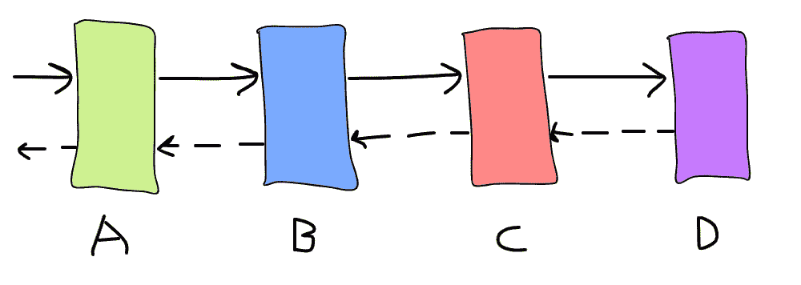
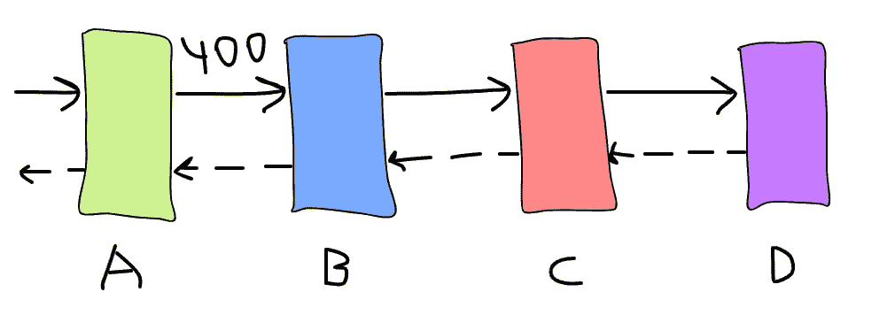
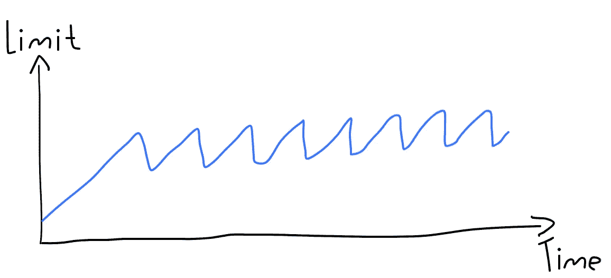

# 5 种模式让您的微服务具有容错能力

> 原文：<https://itnext.io/5-patterns-to-make-your-microservice-fault-tolerant-f3a1c73547b3?source=collection_archive---------0----------------------->


在 [Unsplash](https://unsplash.com/?utm_source=unsplash&utm_medium=referral&utm_content=creditCopyText) 上由[Duan Smetana](https://unsplash.com/@veverkolog?utm_source=unsplash&utm_medium=referral&utm_content=creditCopyText)拍摄的照片

在本文中，我将介绍微服务中的容错以及如何实现它。如果你在维基百科上查找，你会发现下面的定义:

> **容错**是一种使系统在其某些组件出现故障的情况下能够继续正常运行的属性。

对我们来说，*一个组件*意味着任何东西:微服务、数据库(DB)、负载平衡器(LB)，你能想到的。我不会讨论 DB/LB 容错机制，因为它们是特定于供应商的，启用它们最终会设置一些属性或更改部署策略。

作为一名软件工程师，**应用程序是我们拥有所有权力和责任的地方**，所以让我们来照顾它。以下是我将要介绍的模式列表:

*   超时设定
*   重试次数
*   断路器
*   最后期限
*   限速器

有些模式广为人知，你甚至怀疑它们是否值得一提，但是请坚持这篇文章——我将简要介绍基本的形式，然后**讨论它们的缺陷以及如何克服它们。**

# 超时设定

超时是一段指定的时间，允许等待某个事件发生。如果您使用 SO_TIMEOUT(也称为套接字超时或读取超时)会有一个问题，它表示任何两个连续数据包之间的超时，而不是整个响应的超时，因此更难实施 SLA，特别是当响应负载很大时。**您通常想要的是超时，它涵盖了从建立连接到响应的最后一个字节的整个交互。** SLA 通常用这样的超时来描述，因为它们对我们来说是人道和自然的。遗憾的是，它们不符合 SO_TIMEOUT 哲学。要在 JVM 世界中克服它，你可以使用 [JDK11](https://docs.oracle.com/en/java/javase/11/docs/api/java.net.http/java/net/http/HttpClient.html) 或 [OkHttp](https://square.github.io/okhttp/) 客户端。Go 在 std 库中也有一个机制。

如果你想深入研究—查看我以前的[文章](/why-i-like-go-http-client-as-a-java-developer-676ea1e698b4)。

# 重试次数

如果您的请求失败，请稍等片刻，然后重试。基本上就是这样，重试是有意义的，因为网络可能会降级一会儿，或者 GC 命中您的请求到达的特定实例。现在，想象一下这样的微服务链:



如果我们将每次服务的总尝试次数设置为 3，而服务 D 突然开始服务 100%的错误，会发生什么？这将导致重试风暴——链中的每个服务都开始重试它们的请求，因此大大增加了总负载，**因此 B 将面临 3 倍的负载，C — 9x 和 D — 27x！**冗余是实现高可用性的关键原则之一，但我怀疑在这种情况下集群 C 和 D 上是否有足够的空闲容量。将总尝试次数设置为 2 也没有多大帮助，此外，它还会使用户体验变差。

解决方案:

*   区分可重试错误和不可重试错误。当用户没有权限或者有效负载没有正确构造时，重试请求是没有意义的。相反，**重试请求超时或 5xx 是好的。**
*   采用错误预算技术，如果可重试的错误率超过阈值，当**停止重试时，例如，如果与服务 D 的 20%的交互导致错误，则停止重试并尝试适度降级。可以使用滚动窗口跟踪过去 N 秒内的错误数量。**

# 断路器

断路器可以解释为错误预算的更严格版本——当错误率太高时，功能将根本不会执行，并将返回回退结果(如果提供的话)。为了了解第三方是否恢复，无论如何都应该执行很小一部分请求。**我们想要的是给第三方一个恢复的机会，不需要做任何手动工作。**

你可能会说，如果功能在关键路径上，启用断路器是没有意义的，但请记住，这种短暂的受控“断电”可能会防止大的不可控断电。

虽然断路器和错误预算有相似的想法，但配置它们是有意义的。由于错误预算的破坏性较小，其阈值必须更小。

很长一段时间以来，Hystrix 都是 JVM 中的首选断路器实现。目前进入[维护模式](https://github.com/Netflix/Hystrix#hystrix-status)，建议改用 [resilience4j](https://github.com/resilience4j/resilience4j) 。

# 截止日期/分布式超时

我们已经在本文的第一部分讨论了超时，现在让我们看看如何使它们“分布式”。首先，重新访问相互调用的同一服务链:



服务 A 愿意等待最多 400 毫秒，并且请求需要所有 3 个下游服务完成一些工作。假设服务 B 用了 400 ms，现在准备调用服务 c，这合理吗？不要！服务超时，不再等待结果。继续前进只会浪费资源并增加重试风暴的可能性。

要实现它，我们必须向请求添加额外的元数据，这将有助于理解何时中断处理是合理的。理想情况下，这应该得到所有参与者的支持，并在整个系统中传播。

实际上，该元数据是以下之一:

*   **时间戳**:服务停止等待响应的时间点。首先，网关/前端服务将截止时间设置为'*当前时间戳+超时'。*接下来，任何下游服务都应该检查当前时间戳是否≥截止日期。如果答案是肯定的，那么关闭它是安全的，否则—开始处理。不幸的是，[时钟偏移](https://en.wikipedia.org/wiki/Clock_skew)有一个问题，机器可以有不同的时钟时间。如果发生这种情况，请求将被阻塞或/和立即被拒绝，从而导致停机。
*   **超时**:超过服务允许等待的时间。这实现起来有点棘手。和以前一样，你尽快设定最后期限。接下来，任何下游服务应该计算它花费了多少时间，从入站超时中减去它，并传递给下一个参与者。不要忘记排队等候的时间，这一点至关重要！因此，如果服务 A 被允许等待 400 毫秒，而服务 B 花费了 150 毫秒，则在调用服务 c 时，它必须附加 250 毫秒的截止时间超时。虽然它不计算花费在线路上的时间，但截止时间只能稍后触发，而不能提前触发，因此，可能会消耗稍多的资源，但不会破坏结果。在 GRPC，截止日期就是这样执行的。

最后要讨论的是——当超过截止时间时，不中断呼叫链有意义吗？答案是肯定的，**如果您的服务有足够的空闲容量，并且完成请求会使它变得更热(缓存/JIT)，那么继续处理是没问题的。**

# 限速器

前面讨论的模式主要解决级联故障的问题——依赖的服务在其依赖关系崩溃后崩溃，最终导致完全关闭的情况。现在，让我们来看看服务过载时的情况。有很多技术和特定领域的原因可能会发生，只要假设它发生了。


Joshua Hoehne 在 [Unsplash](https://unsplash.com/?utm_source=unsplash&utm_medium=referral&utm_content=creditCopyText) 上拍摄的照片

每个应用程序都有其未知的容量。**这个值是动态的，依赖于多个变量**——比如最近的代码变化、当前运行的 CPU 应用的型号、主机的繁忙程度等。

当负载超过容量时会发生什么？通常，这种恶性循环会发生:

1.  响应时间增长，GC 占用空间增加
2.  客户端获得更多超时，甚至更多负载到达
3.  转到 1，但更严重

这是一个可能发生的例子。当然，如果客户有错误的预算/断路器，第二项可能不会产生额外的负载，从而给一个机会离开这个循环。可能会发生其他事情——从 LB 的上游列表中删除实例可能会在 load 和 shut 邻居实例中产生更多的不平等，等等。

救援的限制者！他们的想法是优雅地卸掉传入的负载。理想情况下，过量负载应该这样处理:

1.  **限制器丢弃超出容量的额外负载，从而让应用服务符合 SLA 的请求**
2.  过多的负载重新分配给其他实例/群集自动扩展/群集由人工扩展

有两种类型的限制——速率和并发性，前者限制入站 RPS，后者限制任何时刻处理的请求数量。

为了简单起见，我将做一个**假设，对我们服务的所有请求在计算成本上几乎相等，并且具有相同的重要性。**计算不平等源于这样一个事实，即不同的用户可能有不同数量的数据与之相关联，例如最喜欢的电视连续剧或以前的订单。通常，采用分页有助于实现请求的计算平等。

速率限制器被更广泛地使用，但是不像并发限制那样提供强有力的保证，所以如果你想选择一个，坚持使用并发限制，原因如下。

在配置速率限制器时，我们认为我们应实施以下措施:

> 该服务在任何时间点每秒可以处理 N 个请求。

但是我们实际上宣布的是:

> **假设响应时间不变，**该服务在任何时间点每秒可以处理 N 个请求。

为什么这句话很重要？我会用直觉‘证明’它。对于那些希望得到基于数学的证明的人来说——看看[利特尔定律](https://en.wikipedia.org/wiki/Little%27s_law)。假设速率限制为 1000 RPS，响应时间为 1000ms，SLA 为 1200ms，在给定的 SLA 下，我们可以轻松地在一秒钟内满足 1000 个请求。

现在，响应时间增加了 50 毫秒(依赖服务开始做额外的工作)。从现在起，每秒钟服务将同时面对越来越多的请求，因为到达率大于服务率。拥有无限数量的工作线程意味着**您将耗尽资源并崩溃，尤其是在工作线程与操作系统线程 1:1 映射的环境中**。1000 个工作人员的并发限制将如何处理它？它将可靠地提供 1000/1.05 = ~950 RPS 而不违反 SLA，并丢弃其余的。此外，不需要重新配置来赶上！

每当依赖性改变时，我们可以更新速率限制，但是这是非常大负担，潜在地需要在每次改变时重新配置整个生态系统。

根据如何设置限制值，它是静态或动态限制器。

## 静态

在这种情况下，限制是手动配置的。价值可以通过定期的性能测试来评估。虽然，它不会 100%准确，但为了安全，它可以被模拟。**这种类型的限制要求在 CI/CD 管道周围工作，且资源利用率较低。**静态限制器可以通过限制工作线程池的大小(仅限并发)、添加计数请求的入站过滤器、 [NGINX 限制功能](https://docs.nginx.com/nginx/admin-guide/security-controls/controlling-access-proxied-http/)或 [envoy sidecar 代理](https://www.envoyproxy.io/docs/envoy/latest/api-v2/api/v2/cluster/circuit_breaker.proto.html)来实现。

## 动态的

这里，限制取决于指标，该指标会定期重新计算。**您的服务过载和响应时间增长之间很有可能存在关联。**如果是这样，指标可以是响应时间的统计函数，例如百分位数、中间值或平均值。还记得计算等式属性吗？这个特性是更精确计算的关键。

然后，定义一个谓词来回答指标是否健康。例如，p99 ≥ 500ms 被视为不健康，因此应降低限值。如何增加和减少限制应由应用反馈控制算法决定，如 [AIMD](https://en.wikipedia.org/wiki/Additive_increase/multiplicative_decrease) (用于 TCP 协议)。下面是它的伪代码:

```
if healthy {
    limit = limit + increase;
} else {
    limit = limit * decreaseRatio; // 0 < decreaseRatio < 1.0
}
```



AIMD 在行动

如您所见，限制增长缓慢，探测应用程序是否运行良好，如果发现错误行为，则急剧下降。

网飞开创了动态限制的理念，并开源了他们的解决方案，这里是[回购](https://github.com/Netflix/concurrency-limits)。它实现了几个反馈算法，静态限制器的实现，GRPC 集成和 Java servlet 集成。

哼，就这样！我希望你今天学到了新的有用的东西。我想指出的是**这个列表并不详尽，你可能还想获得良好的可观察性**，因为一些意想不到的事情可能会发生，最好了解你的应用程序目前正在发生什么。然而，实施这些将会解决你当前或潜在的大量问题。

## 参考

*   [谷歌 SRE 图书](https://landing.google.com/sre/sre-book/toc/index.html)，尤其是章节[解决级联故障](https://landing.google.com/sre/sre-book/chapters/addressing-cascading-failures/)和[处理过载](https://landing.google.com/sre/sre-book/chapters/handling-overload/)
*   [网飞关于动态限制的文章](https://medium.com/@NetflixTechBlog/performance-under-load-3e6fa9a60581)