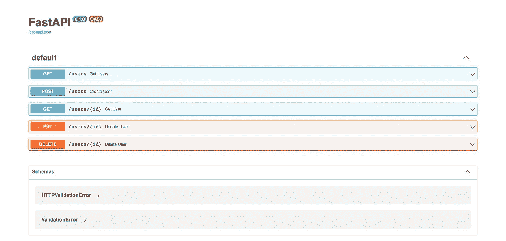
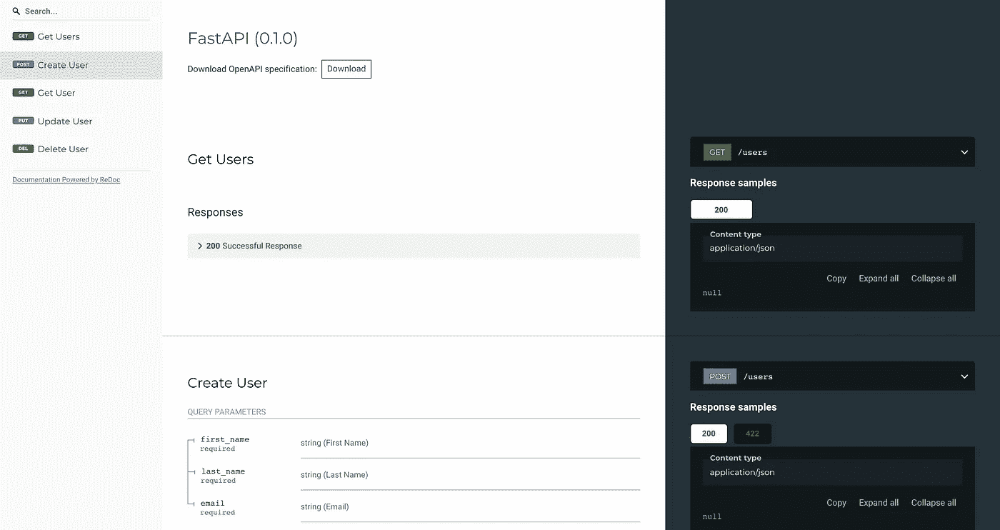

# 你应该使用 FastAPI 快速完成工作的 5 个理由

> 原文：<https://itnext.io/5-reasons-you-should-use-fastapi-to-get-stuff-done-quickly-6230ded3a8c6?source=collection_archive---------0----------------------->

在 [Unsplash](https://unsplash.com?utm_source=medium&utm_medium=referral) 上由 [Brad Neathery](https://unsplash.com/@bradneathery?utm_source=medium&utm_medium=referral) 拍摄的照片

大约一个月前，我在浏览一些博客时读到了 FastAPI。没过多久，我的团队不得不为我们开发的应用程序构建一个 API。因为 API 不太复杂，我们决定尝试一些新的东西，我们用 FastAPI 代替 Flask。

我使用这个框架的时间越长，我就越喜欢它。鉴于良好的第一印象，我想告诉你为什么我觉得 FastAPI 是一个伟大的工具的主要原因。也许他们会说服你也尝试一下！

# 用几行代码完成大量工作

立即引起我注意的是，拥有一个带有一些简单端点的工作 API 并不需要太多时间。我想写一个简单的 CRUD 作为本文的例子。下面是用户管理的 API 层的代码。我花了不到 10 分钟就做到了。

当您为 API 端点编写代码时，我们鼓励您键入您使用的参数。FastAPI 有一个利用类型注释的很酷的特性。如果一个参数无效，框架将呈现一个漂亮的 JSON 解释哪里出错了。因此，如果您忘记填写请求正文中的必填字段，您将得到如下响应:

如果参数的类型与预期的类型不匹配，您也会得到通知:

然而，这并不是您在编写代码时唯一可以免费获得的东西。

# 不需要写文档

我记得我不得不手动编写 API 文档的项目。这至少是一场噩梦。FastAPI 让这一切变得轻而易举，因为它会在您进行过程中为您生成文档。

如果你想看文档，只要设置好服务器，进入[http://localhost:8000/docs](http://localhost:8000/docs)就能看到漂亮的 OpenAPI UI。

如果你不喜欢 OpenAPI，还有一个选择。转到[http://localhost:8000/redoc](http://localhost:8000/redoc)查看 ReDoc 渲染的文档。

两个文档视图都允许您运行示例请求。所有这些特性使与其他人共享文档成为一项简单而愉快的任务。

FastAPI 本身也有健壮但易于掌握的文档。这是让框架变得容易上手的关键一环。

# 学习愉快

我喜欢 FastAPI 文档的地方在于它的可操作性。本文档没有让您陷入理论的迷宫，而是逐个特性地分解框架，然后用一个例子解释每一点。

这些例子的伟大之处在于它们突出了使功能工作的代码的关键部分。

在我迄今为止使用过的所有 Python 库中，这个库拥有最好的文档。你可以快速浏览，找到你需要的。当有更多的时间，你可以有一个适当的和全面的阅读文件。

到目前为止，我只关注了开发的速度和便利性。然而，FastAPI 不仅仅是这样。当它说它**是**快时，它没有说谎。让我们将它的性能与其他 Python 框架进行比较。

# 方便又快捷

当你访问[FastAPI](https://github.com/tiangolo/fastapi)的 GitHub 页面时，它吹嘘的第一件事就是性能。

TechEmpower 是一个门户网站，它对可用的 web 框架进行基准测试，并比较它们在不同用例中的性能。在我写这篇文章的时候， [FastAPI 是第四快的 Python 框架](https://www.techempower.com/benchmarks/#section=test&runid=7464e520-0dc2-473d-bd34-dbdfd7e85911&hw=ph&test=composite&l=v2qiv3-db&a=2)。它比 Flask 强很多，尽管 Flask 是一个相当成熟的框架。

最后一点不是关于框架本身，而是一个相关的库，它使得嵌入 AWS 生态系统变得容易。

# 与 AWS 无缝集成

Mangum 是一个库，它将来自 ALB 和 API Gateway 的请求转换成一种便于 web 应用程序使用的格式。我们的应用程序利用 Lambdas 进行托管，ALB 负责流量路由。当然，可以为传入的请求编写一个定制的解析器，但是相反，您可以用 Mangum 嵌入您的应用程序。这只是两行代码。

在我将应用程序部署到 AWS 之后，它立即开始理解传入的请求。我很惊讶这个过程会如此之快。

来自 Ruby on Rails 的背景，我欣赏帮助开发人员高效完成工作的工具。我喜欢用 FastAPI 构建的代码是描述性的，易于理解。

我知道关于这个框架还有很多东西需要学习，因为我才使用了两个星期。然而，我不得不承认，没有多少工具给我留下了如此深刻的第一印象，并给我带来了许多惊喜。我的一个朋友问我，这是否会让我从一个虔诚的 Ruby on Rails 追随者转变过来😄假设这比以前不那么确定了😉

所以，总而言之，如果你想快速完成工作，你应该试试 FastAPI！

# 资源:

*   [https://fastapi.tiangolo.com/](https://fastapi.tiangolo.com/)
*   [https://www.techempower.com/benchmarks/#section=test&runid = 7464 e520-0dc 2-473d-bd34-DBD FD 7 e 85911&HW = ph&test = composite&l = v2qi v3-db&a = 2](https://www.techempower.com/benchmarks/#section=test&runid=7464e520-0dc2-473d-bd34-dbdfd7e85911&hw=ph&test=composite&l=v2qiv3-db&a=2)
*   https://mangum.io/