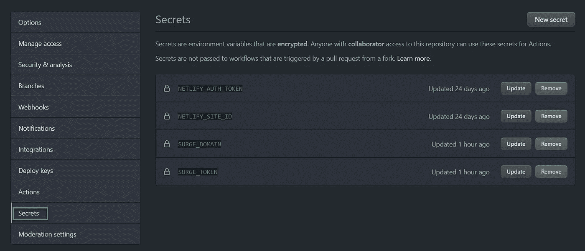

# 5 个静态网站部署选项

> 原文：<https://itnext.io/5-static-websites-deployment-options-d0aac1570331?source=collection_archive---------3----------------------->

克里斯蒂娜@ wocintechchat.com 在 [Unsplash](https://unsplash.com/s/photos/server?utm_source=unsplash&utm_medium=referral&utm_content=creditCopyText) 上的照片

静态网站已经成为现代浏览器消费的主流内容交付媒介。在这篇博客中，我们将看看使用自动化 CI/CD 管道和不同的主机提供商来部署一个示例静态网站的不同方法。

更有趣的是，示例网站是使用 [Blazor](https://dotnet.microsoft.com/apps/aspnet/web-apps/blazor) 设计的，并在 [PWA](https://en.wikipedia.org/wiki/Progressive_web_application) 选项打开的情况下使用 [Web Assembly](https://en.wikipedia.org/wiki/WebAssembly) 编译的。这表明，不仅简单的网站可以作为静态内容交付，而且潜在的复杂 web 应用程序也可以从这种交付机制中受益。

## 先决条件

如果你想继续下去，你可以查看带有 GitHub 动作的 [my git repository](https://github.com/Piotr1215/pwa-sample) 和带有部署脚本的 [Docker Hub](https://hub.docker.com/repository/docker/piotrzan/blazorindocker) 。

所有的构建和部署都是自动化的，并基于 GitHub 存储库的主分支的提交来触发。要部署到 Netlify 和 Surge，您需要在两个主机提供商中创建帐户，并使用 GitHub actions 模板功能用 Secrets 中的内容替换部署清单中的变量。要访问和设置机密，请转到项目设置页面并找到机密选项卡。

项目中的 GitHub 秘密管理

## 动机

我写这篇博客的动机是展示静态内容的不同部署选项，并介绍免费提供的现代内容交付机制的主题。

每个构建和部署都是完全自动化的，并利用了“管道作为代码”的概念，其中 CI/CD 管道中的每个步骤都表示为 yaml 文件的一部分。这个文件可以与您的源代码一起签入到存储库中，并作为工件之一进行版本化和维护。

让我们更详细地看看不同的部署选项。每个选项都有一个对应的 yaml 文件，详细说明了构建和部署站点所需的步骤。

## 1.部署到 GitHub 页面

[GitHub pages](https://pages.github.com/) 是 GitHub 中的一个内置部署选项。

## 2.部署到网络

[Netlify](https://www.netlify.com/) 正在倡导一种叫做 [JAM Stack](https://jamstack.org/) 的开发模式，这是一种预建的静态网站，使用 API 提供个性化内容。JAM Stack 代表**JavaScript API 标记。**

部署静态站点的有效指南:[https://docs.netlify.com/site-deploys/create-deploys/](https://docs.netlify.com/site-deploys/create-deploys/)

## 3.部署到 Docker Hub

为什么我们要将 web 页面部署到 docker 容器中？可移植性是一个答案，一旦内容被打包到 docker 映像中，它就很容易在任何操作系统上运行，不需要外部配置。这也是在 Kubernetes 集群上运行工作负载的第一步。

## 4.部署到公共云(Azure)

Azure Storage Account 提供了一个有趣的功能，可以直接在 blob 容器中托管静态网站，很容易在容器上添加自定义域或 CDN。

## 5.部署激增

部署到 Surge 与部署到 Netlify 非常相似。一个额外的步骤是安装节点。Surge 提供了非常快速的用户入门和简单的 CLI，即使没有 CI/CD 也能快速部署页面。需要明确的是，Netlify 提供了相同的功能，但是在帐户创建方面更复杂一些。

浪涌入门:[https://surge.sh/help/getting-started-with-surge](https://surge.sh/help/getting-started-with-surge)

## 结论

我们已经看到了不同的托管平台是如何与 GitHub 项目提交时触发的全自动 CI/CD 管道轻松集成的。当然，每个部署可以手动触发，每个主机提供商提供免费层。值得注意的是，CI/CD 管道不需要 GitHub 动作，事实上 Azure 管道是从 Azure DevOps 内部触发的。

所有提供商都提供额外的服务，如定制域、SSL 证书和分析。

快速内容交付成为基本的现代 DevOps 实践之一，在托管和交付静态内容领域，利用许多产品非常容易。