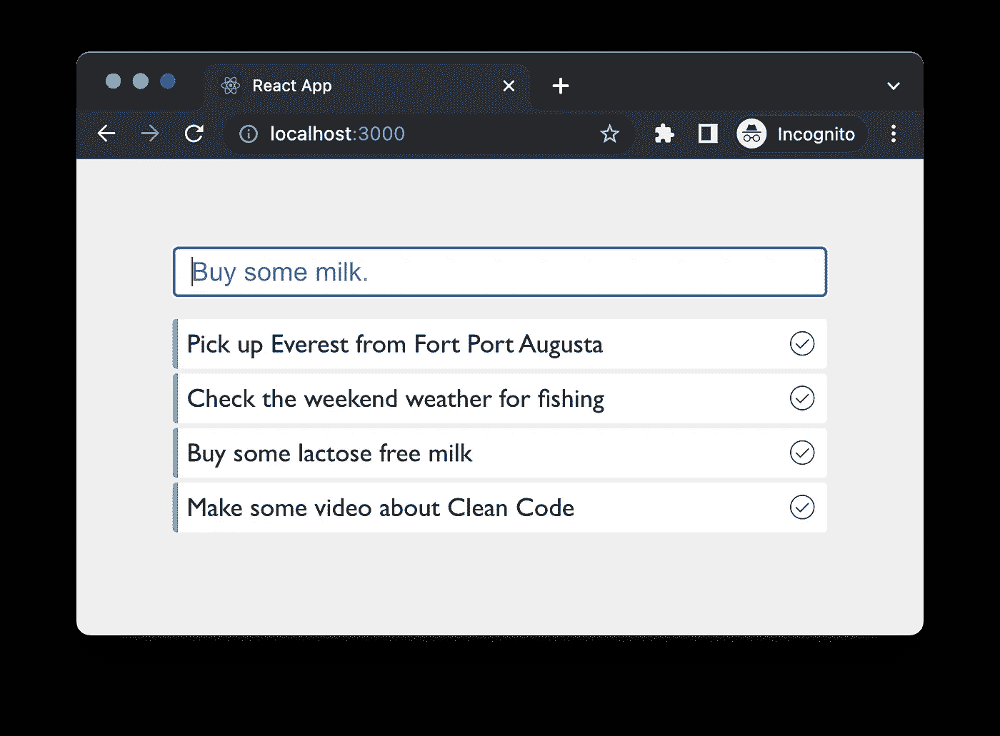
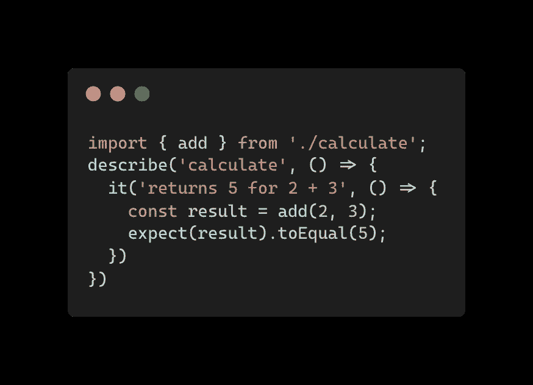
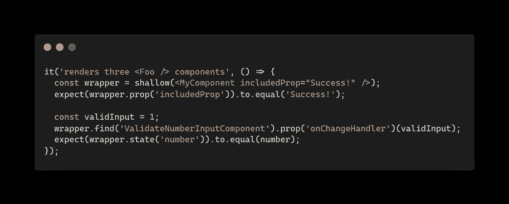
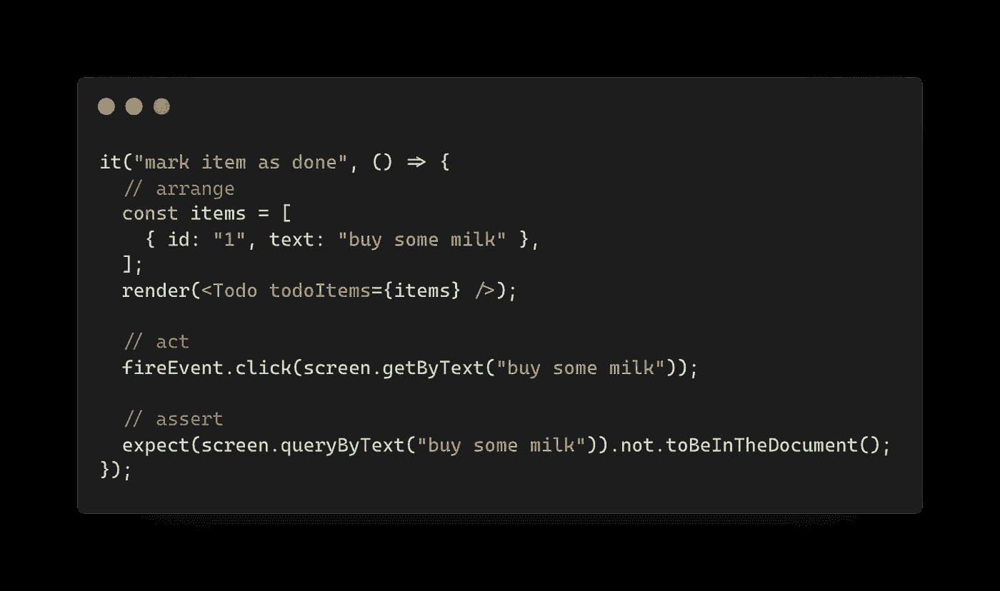

# 在 React 中更有效地应用 TDD 的 5 个步骤

> 原文：<https://itnext.io/5-steps-to-apply-tdd-more-effectively-in-react-c7b56978153b?source=collection_archive---------4----------------------->

在本文中，我将分享在日常工作流程中应用测试驱动开发的五个简单步骤。我相信这些步骤可以帮助你成为一个更好的开发者，我的意思是，一个更好的开发者。


由[杰拉尔丁·莱瓦](https://unsplash.com/@geraldine_lewa?utm_source=medium&utm_medium=referral)在 [Unsplash](https://unsplash.com?utm_source=medium&utm_medium=referral) 拍摄

我知道这个话题相当值得商榷，我也不想就做不做 TDD 展开一场战争。我是一名从业者，并从中看到了价值，我试图向人们展示他们如何从中受益，你不必遵循所有的步骤来为你的常规工作流程增加价值。

如果你有兴趣深入这个主题，我已经创建了[免费在线课程](https://icodeit.thinkific.com/courses/test-driven-development-with-react)，涵盖了本帖中讨论的所有主题以及更多内容。本课程旨在互动、吸引人，并包含实用的技巧和技术。课程结束时，你将对这门学科有一个扎实的理解，并能够在日常生活中运用所学。

# 1.任务分配

在本文中，我们将使用`Buy Some Milk`作为示例，如果您想了解更多关于实现的细节，[这里是它的视频](https://youtube.com/playlist?list=PLv8UD0lNnLNKTXyhs9Z3PEh3bon0ZNxqd)。



买些牛奶应用

多任务根本不起作用，尤其是在编码方面。我们的大脑被设计成一次只专注于一件事，而且只专注一小段时间。因此，要解决复杂的问题，无论是性能测量、重构遗留代码，还是实现复杂的逻辑，我们都需要将其分割成更小、更易管理的部分。

一个典型的用户故事(一个特性的子集)通常是一个复杂的问题，我们需要分解它们，分解的过程在这里被称为任务分配。

这是关键的一环，必须做好。但是不要害怕。像其他事情一样，你只需要一些练习。

作为程序员，我们自然会想到相对更深层次的问题，比如如果用户在字段中输入了一些无效文本，如果网络不稳定，如果用户在 web 应用程序上开始订购并被中断，然后决定在手机上继续订购，又会怎么样？需要考虑的场景很多，很难一下子全部想到。

这就是为什么我们需要一个任务列表来指导我们，让我们知道我们在哪里，还剩下多少项目来完成这个故事，我们可以将剩余的内容转移到更紧急的事情上等等。换句话说，我们需要战略性地考虑任务分配。

# 任务

每项任务一般应遵循`S.M.A.R.T`原则，

*   具体——任务必须具体说明必须做什么
*   可测量——应该有一些测试可以验证任务的成功
*   可实现——显然，我们不能做超出我们能力的事情
*   相关-任务应该链接到我们试图实现的内容，用户登录令牌可能不会直接链接到产品列表。
*   时间限制——我们应该留意它已经使用了多长时间。长任务可能表示任务过大或无法完成。

因此，根据 S.M.A.R.T 原则，不难为我们的示例`Buy Some Milk`列出一个任务列表:

*   呈现项目
*   呈现多个项目
*   添加待办事项
*   添加项目后清理输入框
*   将项目标记为完成

# 2.编写一个失败的测试

所以第一步是编写一个失败的测试。

# 确保测试机制正常工作

如果您要向现有代码添加测试，确保测试与产品代码相关联是很重要的。比如跑步者在听`__tests__/*.test.tsx`，当你加了一个`Todo.spec.tsx`，那么就会被忽略。当测试通过时，你可能会被误导，继续进行大的重构，直到为时已晚。

此外，我经常做的一个检查(我知道很多其他程序员也在做)是尽力破坏现有的测试。例如，给定当前的`calculate.test.ts`正在通过，我改变`calculate.ts`中的一些逻辑来查看测试是否失败。



添加功能

在`calculate`中，我将`add`修改为:

```
export const add = (x, y) => x - y;
```

如果代码失败，我知道`test`和`implementation`是连接的，然后我可以通过添加更多来增强测试(别忘了把它改回来:)。

# 编写测试

请记住，始终从消费者的角度进行测试。几年前，当`enzyme`在`React`社区非常流行时，最大的缺点是它倾向于测试内部状态而不是行为。

例如，使用`enzyme`，您可能有如下代码:



使用酶进行测试

但是使用`react-testing-library`，测试更加关注组件的行为，而不是内部状态。



反应-测试-测试行为库

注意这里的 API，`getByText`会检查 DOM 是否有这个内容(就像真正的用户在浏览器中会做的一样)，以及`toBeInTheDocument`，焦点转移到消费者(而不是开发者)。

当你写测试的时候，尽可能的描述行为。并验证业务价值，而不是内部状态。

# 3.用最少的努力修复测试

在这一步，你的首要任务应该是修复测试，而不是让代码看起来优秀或优雅。俗话说，**做得好不如做得完美**。

幻数、内联函数、嵌套 if-else 等。在这个阶段一切都很好。

但是不要就此打住。一旦你通过了测试(或再次通过)，寻找机会改进它们。

# 4.尽可能重构

马丁·福勒在他的书**重构:改进现有代码的设计**中，对重构有几个定义:

> *重构(名词):在不改变其可观察行为的情况下，对软件内部结构进行的改变，使其更容易理解，修改成本更低。*

和

> 重构(动词):通过应用一系列重构来重构软件，而不改变其可观察到的行为。重复上述步骤，直到完成所有任务，然后进入下一步。

这里的要点是:

1.  在不改变其可见行为的情况下进行更改
2.  一系列(较小的)变化

在重构过程中，您应该观察测试状态。一旦你完成了重构(重命名、将变量提取为常量或者将代码片段提取为函数)，它们应该总是处于`passing`状态。此外，保持每个变化小。一旦我做了一些重构并且测试通过，我通常会进行本地提交。如果您担心多个提交，您总是可以在推送到 remote 之前挤压它们。

他在他的第二版书中也定义了 46 个重构。如果你还没有，请在这里停下来，去阅读它。你会被赏识的，不客气。

所以基本上，你需要识别你的*快速和肮脏的*实现中的代码味道，并使用书中讨论的重构使其更容易理解。

你可能也想阅读我的其他帖子[这里](/react-clean-code-f7b7946cb9d3)一些[干净代码提示](/7-react-clean-code-tips-you-should-know-846b8108fc46)。

对重构后的代码感到满意后，可以重复开始列表中的下一个任务，并遵循步骤 2-4，直到完成所有任务。

# 5.要求同行评审

起初，我并不热衷于同行评审，但是当我意识到其他开发人员，甚至是初级开发人员，可以给我很好的建议，并惊讶于我可以从中学到很多东西时，现在这是我将代码合并到 master 之前的默认操作。

我更喜欢走一遍(5-10 分钟)来讨论背景、挑战以及我如何解决它们。当我走查的时候，我经常得到一些很棒的建议，这些建议可以使代码更清晰、更容易理解。

除了这些建议，同行评审还有其他好处:

*   与团队分享领域知识
*   了解其他人是如何看待这个问题的
*   讨论其他人可以使用的通用设计模式

# 摘要

同样，这不是一篇关于我们是否应该做 TDD 的文章。更重要的是你是否愿意尝试。你可以按照这些步骤，看看效果如何。这五个简单而有力的步骤是我的常规工作流程，我几乎在所有的任务中都这样做。我认为这让我和我的同事们在不同的项目中受益匪浅。

如果觉得有用，这里有一个[可打印版本](https://icodeit.ck.page/5-steps-tdd)，喜欢可以下载打印。

祝你好运，工作愉快。