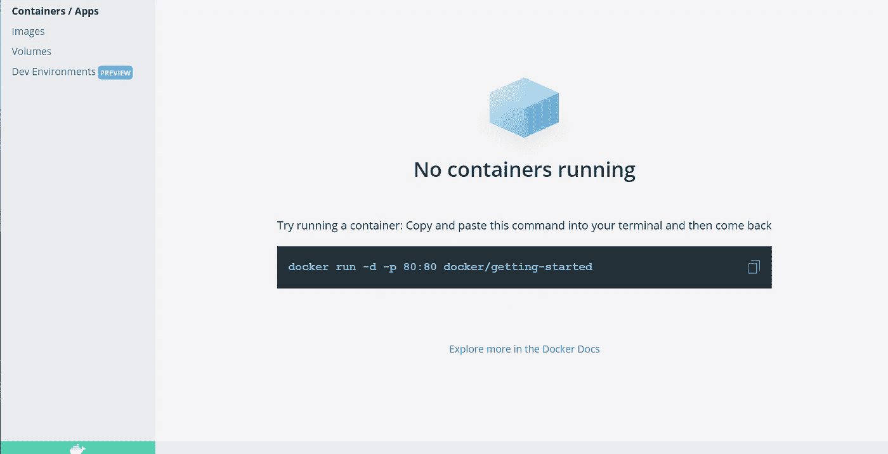
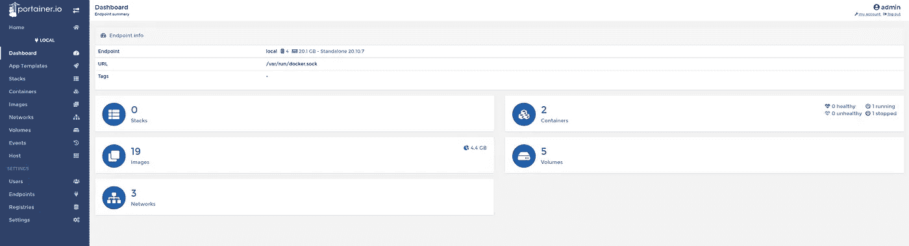
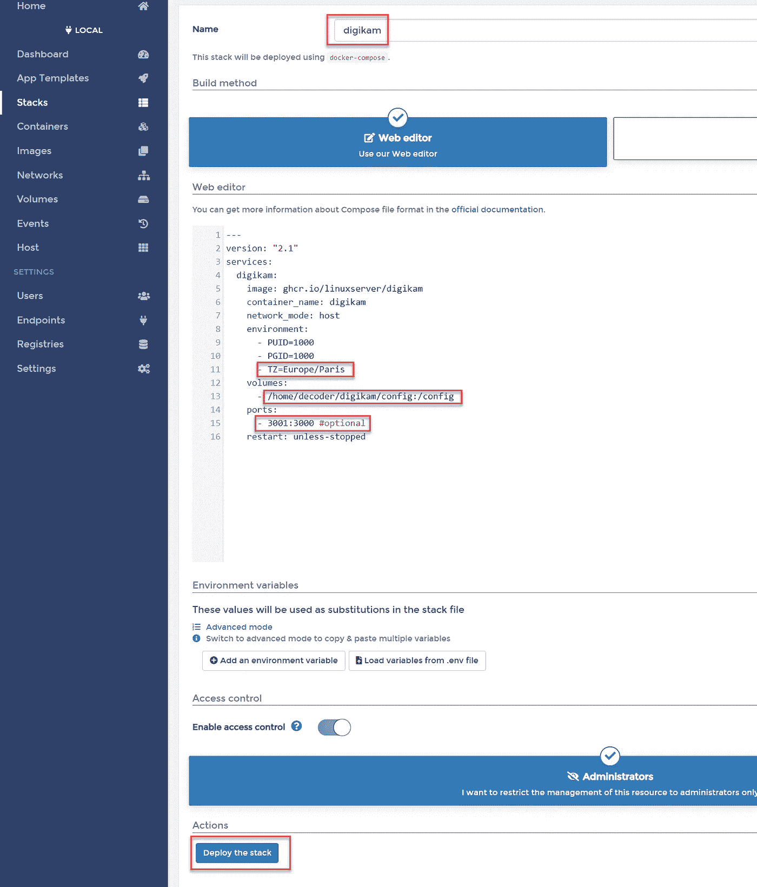
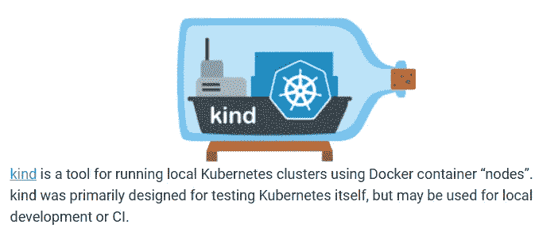

# 5 个不寻常的 Docker 容器用例

> 原文：<https://itnext.io/5-unusual-docker-container-use-cases-547804d64c35?source=collection_archive---------0----------------------->


安托万·佩蒂特维尔在 [Unsplash](https://unsplash.com/?utm_source=unsplash&utm_medium=referral&utm_content=creditCopyText) 上拍摄的照片

## 介绍

[Docker](https://www.docker.com/) 在 2013 年左右将集装箱技术引入主流。从那时起，容器化成为云和数字转型的一个组成部分。如今，大多数传统的服务器工作负载，如 web APIs、web 应用程序(广义的服务器端工作负载)，都是容器化的。见鬼，甚至微软也看到了墙上的字迹，自 2016 年以来，windows 容器也在那里(尽管有点重)。2017 年推出了 Kubernetes，这是一种容器编排，它进一步巩固了容器作为计算主力的强大地位。

## 基本使用案例

我们生活在容器化的黄金时代，以至于容器开始从更传统的服务器工作负载场景转移到更奇特的用例。

在我们进入这些之前，让我们回答一个问题，为什么容器和相关技术如此受欢迎。在我看来，这可以归结为三个因素:

*   可移植性:不再有“但是它可以在我的电脑上运行”的问题。如果它运行，它将在任何符合 [OCI 的容器运行时](https://opencontainers.org/)上运行。
*   **易于配置** : Docker 镜像(容器的蓝图)不仅打包了应用/服务二进制文件，还打包了它的所有依赖项。不再需要在开发人员和运营人员之间来回发送更复杂、更容易出错的配置 word 文档。
*   **标准化工具**:图像和容器是完全标准化的打包和运行时机制，这意味着工具链将在任何地方工作。不再有因公司而异的专有、复杂的部署和开发工具。现在都可以标准化了。

## 先决条件

如果您想继续，请安装这些先决条件。请注意，我使用的是带有 WLS2 的 Windows，因此一些安装步骤可能会因您的操作系统而异。

[Docker 桌面](https://hub.docker.com/editions/community/docker-ce-desktop-windows/)将在我们的机器上安装 Docker 主机，使我们能够运行工作负载。一旦 docker 启动并运行，您可能希望确保您运行的是 Linux 而不是 Windows 容器(右键单击托盘中的 Docker 图标)。完成后，继续第二步，安装 Portainer。



Docker 桌面

Portainer，一个用于管理 docker 主机(以及更多)的轻量级 web UI。要在 Linux、Windows 或 Mac 上安装 portainer，[请点击此链接](https://documentation.portainer.io/v2.0/deploy/ceinstalldocker/)。Portainer 将帮助我们快速部署 docker 工作负载。

要在 Windows WSL2 上快速安装 portainer，请运行以下命令:

```
docker volume create portainer_datadocker run -d -p 8000:8000 -p 9000:9000 --name=portainer --restart=always -v /var/run/docker.sock:/var/run/docker.sock -v portainer_data:/data portainer/portainer-c
```

导航到`localhost:9000`设置用户名和密码，连接到 docker 主机，然后开始。



门户用户界面

为了部署 docker 容器，我们不打算使用命令式的`docker CLI`，而是使用`docker compose`来描述和运行我们的应用程序。Docker compose 引入了一种声明式的容器运行方式。

> 要了解更多关于 docker 编写的信息，请查看 [docker 编写规范](https://compose-spec.io/)

## #1 在容器中运行 UI 应用程序

对于我们的第一个用例，我们将在一个容器中运行一个 UI 应用程序，并通过 web 浏览器连接到它！部署非常容易。我们使用名为 [digikam](https://www.digikam.org/) 的开源软件作为例子，但这几乎可以是任何东西，比如网络浏览器、Libre Office 等。遵循集装箱页面[https://docs.linuxserver.io/images/docker-digikam](https://docs.linuxserver.io/images/docker-digikam)上的说明



Portainer 部署

1.  导航到堆栈->添加堆栈
2.  为您的应用程序(堆栈)命名
3.  调整配置设置
4.  PUID 和 GUID 分别是运行 docker 主机的用户 ID 和组 ID。你可以通过打开 WSL 控制台并输入`id`来检查它
5.  根据你的情况调整 TZ
6.  为配置创建一个文件夹，我用一个快捷命令`mkdir -p /directory/config`在我的主目录下创建文件夹
7.  选择一个未被防火墙占用或阻止的端口。记住端口总是从外部进入容器，所以 3001(主机上的端口):3000(容器中的端口)

## #2 在容器中运行 Linux 桌面环境

什么什么？容器中的 Linux？事实上，尽管这种方法的实际应用可能有问题，但它确实很有趣:)。为了“澄清”，**我们在一个容器中运行一个 Linux 桌面，它在一个程序中运行，在 Linux 上运行，然后在 Windows 上运行…我们将通过浏览器访问 Linux 服务器！唷。**

[https://docs.linuxserver.io/images/docker-webtop](https://docs.linuxserver.io/images/docker-webtop)


[约吉·普尔纳马](https://unsplash.com/@yogipurnama?utm_source=unsplash&utm_medium=referral&utm_content=creditCopyText)在 [Unsplash](https://unsplash.com/s/photos/superman?utm_source=unsplash&utm_medium=referral&utm_content=creditCopyText) 拍摄的照片

将完全成熟的 Linux 桌面作为容器运行的一个可能的用例是，在您的机器上安装 Linux 之前，您可以测试各种 Linux 发行版和桌面环境(DE)。

## #3 在容器中运行 CLI 工具

通常需要一个或一组 CLI 工具来诊断或执行某些任务。Linux 提供了一个简单的安装工具的方法，但是如果你想添加一些定制，别名等等，这是很费时间的。集装箱来救援了！

我已经创建了一个这样的工具，并在博客中介绍了这个工具，它通过在 docker 容器中运行的`kubectl`以高度可定制的方式支持 Kubernetes 管理。如果你有兴趣的话，可以去看看。

## #4 在容器中运行您的编程环境

如果你是一个软件开发人员，你肯定知道安装你的项目需要编译或启动的各种依赖项的痛苦。如果你把你的开发转移到一个容器中，情况就不一样了！

查看 [Visual Studio 代码远程容器](https://code.visualstudio.com/docs/remote/containers)扩展以及 [GitPod](https://www.gitpod.io/) 项目。您还可以在容器内部运行测试！

## #5 在容器中运行 Kubernetes

有了 KIND 项目(Docker 中的 kubernetes)，您可以在 Docker 容器中运行整个 Kubernetes 集群。



种类

这使我们能够快速创建用于开发或运行测试或 CI/CD 流程的一次性集群。

## 结论

容器不仅仅可以用于服务器端的工作负载。有些用例更像是玩容器的一种有趣方式(比如 webtop)，但有些非常有用(比如在容器或类中开发)。

查看[牛逼 docker](https://github.com/veggiemonk/awesome-docker) 列表，了解更多 docker 资源。

对 Linux 服务器容器背后的团队也大声喊出来。很多很棒的内容和想法。

你是否以不寻常的方式见过/使用过 Docker 容器？