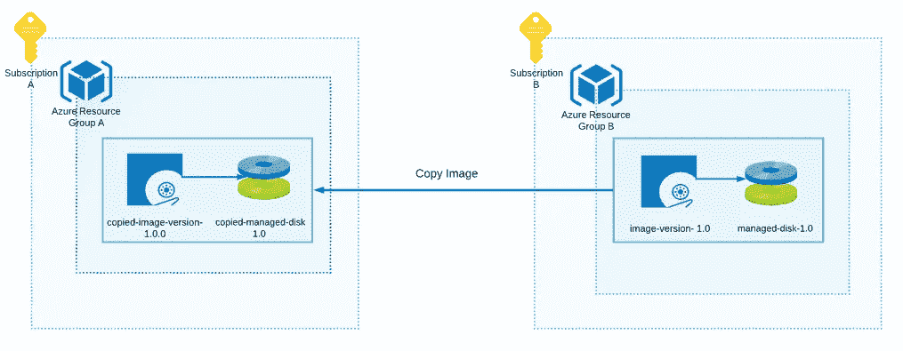
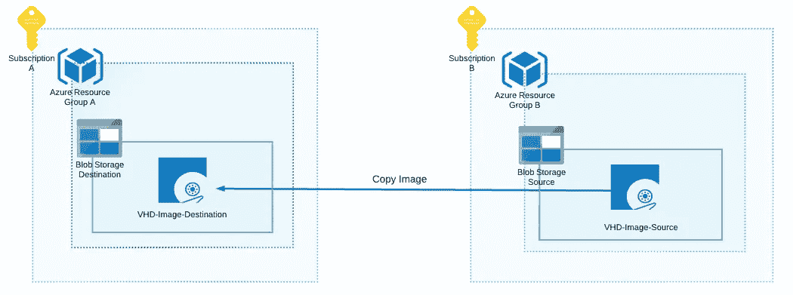
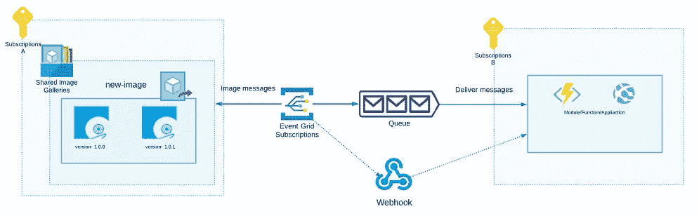

# 在 Azure 中管理和强化虚拟机映像的 6 种简单方法

> 原文：<https://itnext.io/6-easy-ways-to-manage-and-harden-vm-images-in-azure-1ab933099e7e?source=collection_archive---------3----------------------->


管理虚拟机映像可能是一场噩梦。这里有 6 个简单的方法来说明如何在 Azure 中无缝地构建、共享、测试和复制图像。另外，您还可以了解如何基于事件驱动架构构建图像通知。

# **问题**

无论您管理 100 台虚拟机还是 1000 多台构建和强化虚拟机映像的虚拟机，您是否手动管理映像？如果您这样做了，您就会知道这是非常昂贵的，并且会导致难以检测的错误和潜在的安全漏洞。

下面是我如何为我的客户解决这个问题。我为 Azure 创建图像管理的过程。

# 1.使用 Azure Image Builder 构建映像

Azure Image Builder 是一项允许您使用 Azure CLI 创建自定义映像的服务。基于 JSON 模板的图像创建，示例如下。

我必须把原来的模板剪下来，因为它太长了。[在这里](https://github.com/danielsollondon/azvmimagebuilder/blob/master/quickquickstarts/0_Creating_a_Custom_Linux_Managed_Image/helloImageTemplateLinux.json)你可以找到完整的例子。

ARM 模板非常简单，它包含以下属性:

*   *身份*部分是必需的，您必须为 image builder 创建托管身份，以获得创建和编辑图像的权限
*   *VmProfile* 用于设置虚拟机配置计划
*   *源*允许您指定基本图像参数。我使用最新的 Ubuntu Server 18.04 LTS 从 Canonical
    定制部分允许您指定虚拟机加固脚本。
*   *定制*部分允许您指定虚拟机强化脚本。

[在这里](https://docs.microsoft.com/en-us/azure/virtual-machines/linux/image-builder-json)您可以看到图像生成器选项的完整列表。

下面您可以找到基于提到的 JSON 模板构建映像的 CLI 命令。

在运行此模板之前，您应该启用 Azure Image Builder，设置权限，创建资源组，并创建托管身份。[在这里](https://github.com/danielsollondon/azvmimagebuilder/blob/master/quickquickstarts/0_Creating_a_Custom_Linux_Managed_Image/readme.md)你可以找到一个循序渐进的过程。

## 优势

模板和流程本身很容易理解，可以很容易地与 Azure DevOps 集成。

## 不足之处

image builder 仍在审查中，因此不建议在生产中使用它。与 Hashicorp Packer 相比，设置可能有点困难。(在下一节解释如何使用封隔器)。

# 2.使用 Hashicorp 打包程序构建图像

Hashicorp Packer 是一个多平台解决方案，允许基于 JSON 模板构建定制图像。JSON 模板结构良好，基于易于理解的对象模型。JSON 模板只有三个根对象:[通信器](https://www.packer.io/docs/communicators)、[构建器](https://www.packer.io/docs/builders)、[供应器](https://www.packer.io/docs/provisioners)和[后处理器](https://www.packer.io/docs/post-processors)。下面你可以找到 JSON 模板。

JSON 模板创建了 Ubuntu 的 VHD 映像，并预装了 NGINX web 服务器和其他更新。在这里你可以找到很多其他的模板。

要设置包装机，您可以使用[巧克力](https://chocolatey.org/)包装管理器:

```
choco install packer -y
```

您可以使用以下命令运行 JSON 模板:

```
packer build <path/your/template.json>
```

**在**运行模板之前，您需要创建具有适当权限的管理身份或服务主体，例如:

```
az ad sp create-for-rbac -n "ImageContributor" 
 --role contributor `    
 --scopes /subscriptions/<subscription_id> `     
 --sdk-auth > az-principal.auth
```

该命令自动创建带有`clientId`、`clientSecret`、`tenantId`、`subscriptionId`等字段的 JSON 文件。

[在这里](https://www.packer.io/docs/builders/azure-arm.html)你可以找到设置和运行封隔器模板的其他细节。

## 优势

Packer 和 JSON 模板简单易懂。它们允许您快速设置环境并开始构建映像。还有一个强大的社区。此外，打包程序支持多个云提供商。

## 不足之处

我没有发现任何严重的缺点。但是，在构建映像时，打包程序总是会移除一些映像操作所需的磁盘。例如，用于复制图像。

# 3.共享图像

若要在 Azure 中共享图像，您可以使用共享图像库。它可以:

*   创建图像定义
*   保留图像的版本
*   共享图像

例如，您可以在您的 Azure 订阅、资源组和租户之间共享图像。


在当前情况下，您可以创建一个用户组或单个用户/服务主体，仅为该共享图库分配参与者权限。

```
az ad sp create-for-rbac -n "ImageContributor" 
 --role contributor `    
 --scopes /subscriptions/<subscr-id>/resourceGroups/sig-we-rg/providers/Microsoft.Compute/galleries/testsig
```

因此，来自该组的用户可以在不同的订阅中基于这个共享映像库中的 Ubuntu 映像创建虚拟机。

```
az vm create `
  --resource-group myResourceGroup `
  --name UbuntuVM`
  --image "/subscriptions/<subscr-id>/resourceGroups/sig-we-rg/providers/Microsoft.Compute/galleries/testsig/images/ubuntu-server-image-def/versions/1.0.0" \
  --admin-username azureuser \
  --generate-ssh-keys
```

## 优势

Azure 共享图片库允许您在组织内轻松构建、共享、管理和自定义图片。SIG 拥有 Azure CLI，因此您可以轻松地自动化图像分发。

## 不足之处

该图像保留在共享的访问画廊中。因此，它在物理上停留在那里。因此，当您在订阅之间共享它时，您不能单独为每个订阅更改或删除它。

# 4.复制图像

通过复制图像，您可以将图像从一个订阅传递到另一个订阅，或者从一个资源组传递到另一个资源组。所有复制的图像都是相互独立的。您可以使用[*Azure Image Copy extension*](https://docs.microsoft.com/en-us/cli/azure/ext/image-copy-extension/image?view=azure-cli-latest)复制图像，或者使用 Go 实现手动复制。让我们看看下面的例子。

## 使用 Az 复制扩展复制图像



为了在订阅之间复制图像，我使用了 *Az 图像复制扩展*。它在资源组 a 中创建了一个新的映像(来自源映像)。
安装复制扩展:

```
az extension add --name image-copy-extension
```

复制命令:

**重要的**。创建托管映像后，打包程序会自动移除磁盘。

## 优势

Az 图像复制扩展易于使用和自动化。

## 不足之处

映像必须包含被管理的光盘，否则复制过程将失败，并显示“未找到资源”错误消息。

## 手动复制图像



如果 Az 复制映像扩展对您不起作用，您可以在存储帐户中创建一个 VHD 映像，并将其复制到另一个目标存储帐户。

流程工作流:

1.  创建两个存储帐户，源和目标
2.  在源存储帐户中创建 VHD 映像。您可以使用第一部分中的打包脚本。
3.  为 VHD 源映像生成共享访问签名。在这里你可以找到一个如何使用 Azure CLI 的例子。

4.并复制图像。为了演示，我使用了下面的 Go 脚本。您还可以使用**中的**、[、**工具，这里有**、](https://docs.microsoft.com/en-us/azure/virtual-machines/windows/disks-upload-vhd-to-managed-disk-powershell)、**的例子说明如何操作。**

## 优势

当前的图像处理工作流程是完全自定义的。所以，可以随时更改。此外，它可以是有用的，当 Az 图像复制扩展不适合你。例如，在创建映像时删除被管理的磁盘。

## 不足之处

您必须实施所有工作流程步骤，包括:

*   创造 VHD
*   生成和管理 SAS 令牌
*   复制图像
*   清理
*   转换图像

# 5.图像和磁盘转换

将 VHD 映像转换为托管磁盘，或将托管磁盘转换为 VHD 映像的操作。当您需要在映像复制过程中使用 Azure Shared Image Gallery 在整个组织中分发映像时，以及当您需要启动新的虚拟机时，这非常有用。

此外，当您有一些旧的 VHD，并且想要支持它、安装更新、设置自动备份、使用可用性和可用性区域时，它也很有用。

[这里的](https://docs.microsoft.com/en-us/azure/virtual-machines/managed-disks-overview)是托管映像的优势列表。

## 将 VHD 映像转换到被管理的磁盘

## 将托管磁盘转换为托管映像

## 优势

通过这两个 cmdlets，您可以跨不同的订阅和资源组向您的 Azure 共享映像交付映像。

## 不足之处

转换过程可能会很复杂，因为有些图像可能会过时，并且转换过程可能会失败。

# 6.测试图像

要测试映像，您可以简单地从映像库中启动新的虚拟机，并使用映像定义。

## 优势

命令和过程本身相当简单。

## 不足之处

它不检查 JSON 配置中是否正确安装了特定的软件和服务。所以这个逻辑必须单独实现。

# 图像发布/订阅子系统概念(奖金)

跨多个订阅或资源组管理映像可能会很困难，尤其是当您不断生成新版本的映像，或者您有一些自动化流程来启动新的虚拟机时。

在这种情况下，您需要构建一个通知系统，用于在创建新图像、新版本或图像定义出现在 Azure 共享图像库中等等时通知不同的组件。您可以使用带有过滤器的 Azure Event Grid 轻松创建它。

下面你可以看到如何用事件网格来完成。你可以使用 Queue、Webhook，甚至 *Azure Service Bus* 向目标组件传递消息。



下面的例子演示了如何用*图像过滤器*创建事件网格。

[在这里](https://github.com/Boriszn/AzureValidationMiddleware/blob/master/src/Deployment/AzureValidationMiddlewareFunctionAppDeployResources.yaml#L65)你可以找到完整的 Azure DevOps pipeline，以及如何部署该事件网格和链接其他所需资源的步骤。

# 结论

就是这样。基于这些方法，您可以轻松地在 Azure DevOps 中设置映像强化和管理管道。