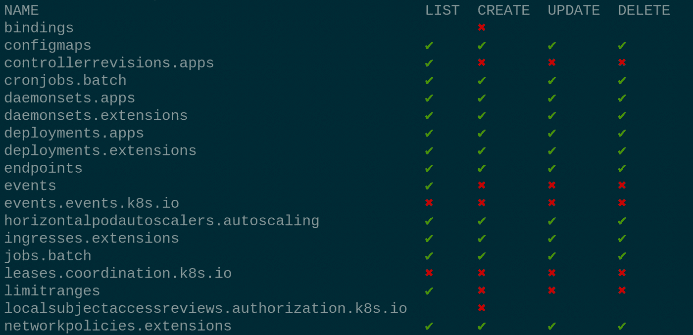
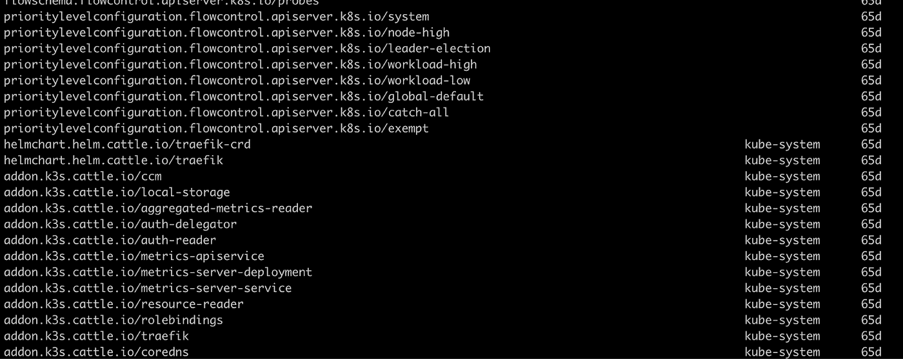
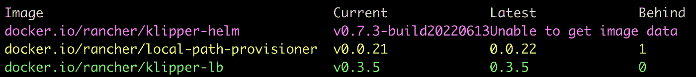

# 你必须尝试的 6 个 kubectl 插件

> 原文：<https://itnext.io/6-kubectl-plugins-you-must-try-1411dcbcf950?source=collection_archive---------0----------------------->

这里是来自 kubectl 插件管理工具的六个插件。

那么让我们从什么是 krew 开始吧？

大多数 Kubernetes 用户都熟悉 kubectl util，但是您知道您可以扩展您的 kubectl 功能吗？

Krew 是 kubectl 的插件管理器，它的工作方式类似于传统的 yum、apt、apk、brew 和其他包管理器。Krew 提供了一种简单的方法来检索和管理 kubectl util 的插件。

如果你是第一次接触 krew，我建议你去看看，并使用他提供的插件(【https://krew.sigs.k8s.io/】T2)

**那么，我们要审查的 6 个插件是什么？**

*   库贝普格
*   拉克塞斯
*   凯托尔
*   库贝特尔分数
*   库贝特尔树
*   过时的

**Kubepug**

库贝普格

仅在今年，Kubernetes 就推出了三个新的主要版本。每个版本都引入了新特性、错误修复、改进、API 弃用和删除的 API。

Kubepug 是一个预升级检查器，它将帮助您在迁移到新的主要版本之前，在您的 Kubernetes 资源中找到不推荐使用和删除的 API。

([https://github.com/rikatz/kubepug](https://github.com/rikatz/kubepug))

**拉克塞斯**

拉克塞斯

许多 Kubernetes 集群管理员实施最小特权原则来保证集群的安全，并在不同的集群租户之间建立隔离。

这个插件将帮助您了解每个用户在集群上所有给定资源上拥有的特权。

([https://github.com/corneliusweig/rakkess](https://github.com/corneliusweig/rakkess))

**Kube-Score**

库贝分数

在 CI/CD 管道中，大多数流程都包括静态代码分析，以检查开发人员的代码质量，但是用于将资源部署到生产环境的清单呢？

Kube-score 是一个针对 Kubernetes 清单对象的静态代码分析工具。输出是一个建议列表，列出了在安全性和弹性方面可以改进的地方。

([https://github.com/zegl/kube-score](https://github.com/zegl/kube-score))

**凯托尔**

凯托尔

你有没有尝试过使用*‘kubectl get all’*并意识到命令输出中缺少资源？

“kubectl get all”命令并不能给你所有的资源，你需要自己寻找剩下的资源。ketall 插件将会节省你的时间，并列出集群中的所有资源，命名空间，标签等等。

([https://github.com/corneliusweig/ketall](https://github.com/corneliusweig/ketall)

**库贝克特树**

库贝特尔树

对于新的 Kubernetes 用户和有经验的用户来说，理解不同的 Kubernetes 对象之间的关系可能是一项困难的任务，如果出现生产错误，可能会增加故障排除时间。

kubectl-tree 插件将帮助您理解动态集群中 Kubernetes 对象之间的关系，并减少您的故障排除时间。

(【https://github.com/ahmetb/kubectl-tree】T4)

**过时的**

过时的

安全性是不同学科中每天都会出现的话题。作为 Kubernetes 集群管理员，我们有几个责任来保持我们的集群攻击面低。其中一个方法是用安全补丁更新我们的图像。

过时的插件遍历可读的名称空间，寻找 pod，从清单中读取正在使用的图像，并检查是否有所用图像的更新版本。

([https://github.com/replicatedhq/outdated](https://github.com/replicatedhq/outdated))

**结论**

如果你正在使用 krew，而你正在使用的插件没有出现在列表中，不要生气。krew 有 206 个不同的插件。他们中的每一个对社区都是有价值的，比上面提到的列表对你更有帮助。上面描述的六个插件通常使用起来很方便和简单。

谢谢你。

***********************************************************************

如果您喜欢我们的内容，欢迎您访问我们在 devunet.com 的网站，安排一次免费会议，注册我们的时事通讯，并获得特别优惠。