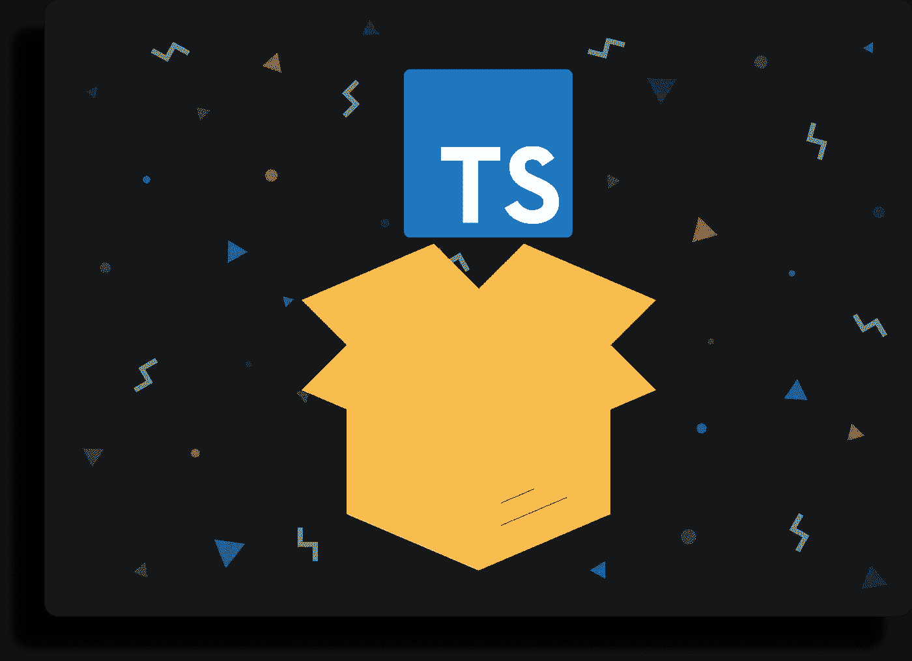
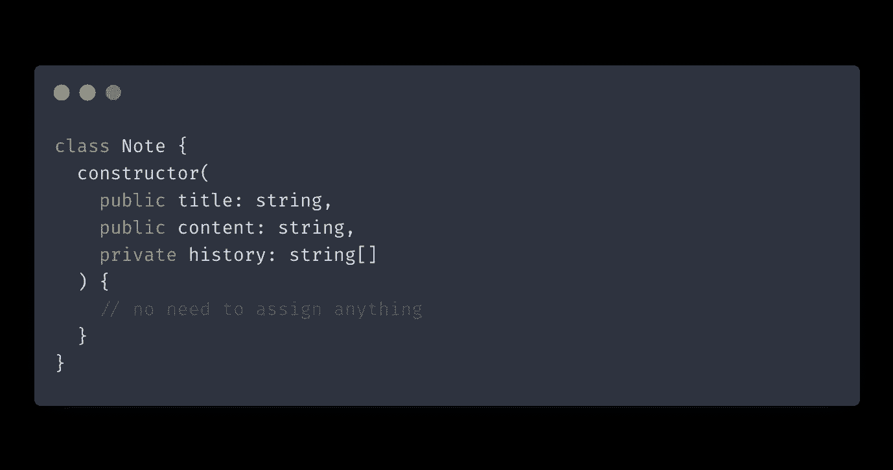
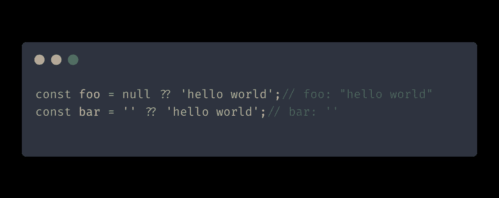
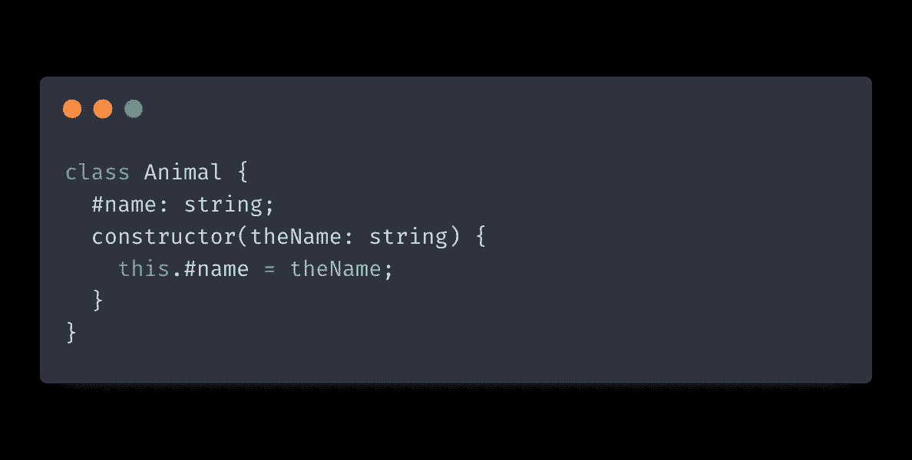
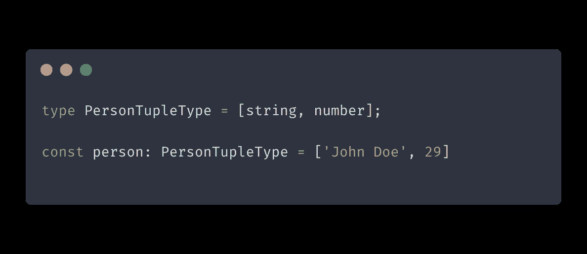
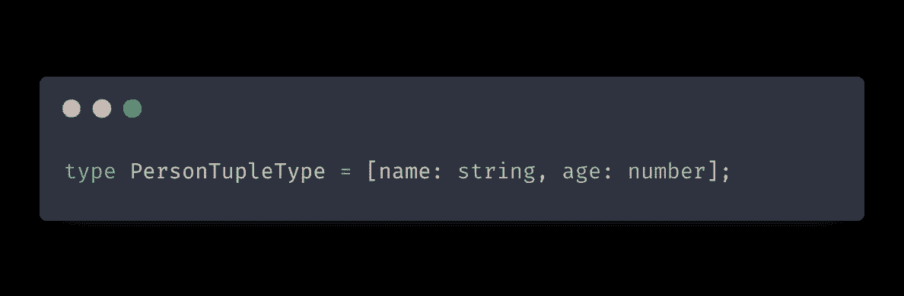
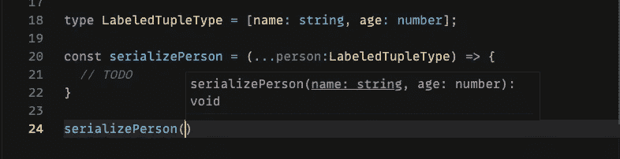
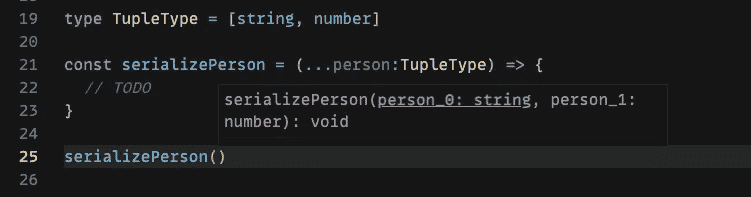
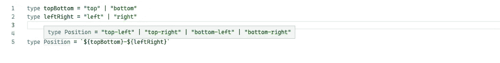

# 6 个用于编写干净代码的新 TypeScript 特性

> 原文：<https://itnext.io/6-new-typescript-features-for-writing-clean-code-ea7810cf5019?source=collection_archive---------0----------------------->

让我们介绍一些较新的 TypeScript 特性和改进。这些是我发现在我的日常工作中对编写精确和干净的代码最有帮助的特性。

# 带有参数属性的构造函数简写

有一种方法可以使用 TypeScript 的[参数属性](https://www.typescriptlang.org/docs/handbook/2/classes.html#parameter-properties)编写更短的类。这种简写允许您使用与类构造函数参数相同的名称来声明类属性。你所需要做的就是在你的参数前加上可见性修饰符。

看一看这个类:

这里，我们手动将构造函数接收到的参数分配给同名的类属性。

下面是我们如何使用参数属性来修改这段代码:

# 无效聚结

[Nullish 合并](https://developer.mozilla.org/en-US/docs/Web/JavaScript/Reference/Operators/Nullish_coalescing_operator)是一个较新的 ECMAScript 特性，TypeScript 最近开始支持它。Nullish 合并运算符允许您为`null`或`undefined`提供回退值。下面是它在代码中的样子:

您可能想知道:“它与逻辑 OR ( `||`)运算符有何不同”？答案是 nullish 合并操作符专门处理`null`和`undefined`值，而 or 操作符将返回任何 falsy 值的右操作数，包括`null`、`undefined`、空字符串和零。

# 私有类字段

这个特性也来自 ECMAScript。[私有类字段](https://github.com/tc39/proposal-class-fields/)是一个第 3 阶段 ECMAScript 提议，在 TypeScript 社区中被越来越多的人采用。要声明私有类字段，可以使用`#`语法:

在关键字`private`上使用私有类字段的区别在于前者有更好的运行时保证。用`private`关键字声明的 TypeScript 字段将成为编译后的 JavaScript 代码中的常规字段。另一方面，私有类字段在编译后的代码中将保持私有。

试图在运行时访问私有类字段将导致语法错误。这也意味着人们不能使用浏览器开发工具检查和窥探你的私有类字段。

有了私有类字段，我们终于在 JavaScript 中获得了真正的隐私。

# 标签元组类型

此功能适用于 TypeScript 及更高版本。带标签的元组类型改善了我们使用元组的体验。

首先，让我们简单介绍一下 TypeScript 中的元组是什么。元组是固定大小的数组类型。元组必须声明它们的类型，尽管这些类型不需要完全相同。下面是一个元组类型声明示例:

使用*标记的*元组类型，我们可以，你猜对了——标记我们的元组包含的类型。它看起来是这样的:

那么为什么要使用带标签的元组类型呢？主要是当使用函数和扩展操作符时，您会获得更好的自动完成体验:

下面是使用常规元组时自动完成的样子:

使用带标签的元组类型，您可以看到函数接受的数据的性质，而无需深入到它的声明。

# 模板类型文字

模板类型文本是 4.1 版及更高版本中提供的较新的 TypeScript 功能。模板类型文本允许您从多个联合类型的组合中创建新的字符串类型。

假设您想为用户提供一组通过组合两种联合类型创建的选项。您可以使用模板类型文本，而不是手动键入每个选项:

注意新的`Position`类型是如何包含了`topBottom`和`leftRight`类型的所有组合的。

模板类型文字有许多应用，但最常见于 UI 库和设计系统中。

# 实用程序类型

TypeScript 为您提供了一组实用工具类型，允许您在现有类型的基础上构造新类型。有许多实用程序类型涵盖了不同的场景，例如选择要复制的类型属性，使它们大写，或者使所有属性可选。

下面是一个使用`Omit`实用程序的例子，该实用程序从原始类型中复制所有的道具，除了您选择不包括的那些:

要了解更多关于 TypeScript 中的实用程序类型的信息，请查看这里的[我的帖子](https://isamatov.com/typescript-utility-types-for-react/)。

这就是这篇文章的全部内容。在这里，我们介绍了一些较新的 TypeScript 特性，您很可能会觉得这些特性很有趣，并会很好地加以利用。感谢您的阅读！

*原载于 2021 年 7 月 30 日 https://isamatov.com**的* [*。*](https://isamatov.com/new-typescript-features/)