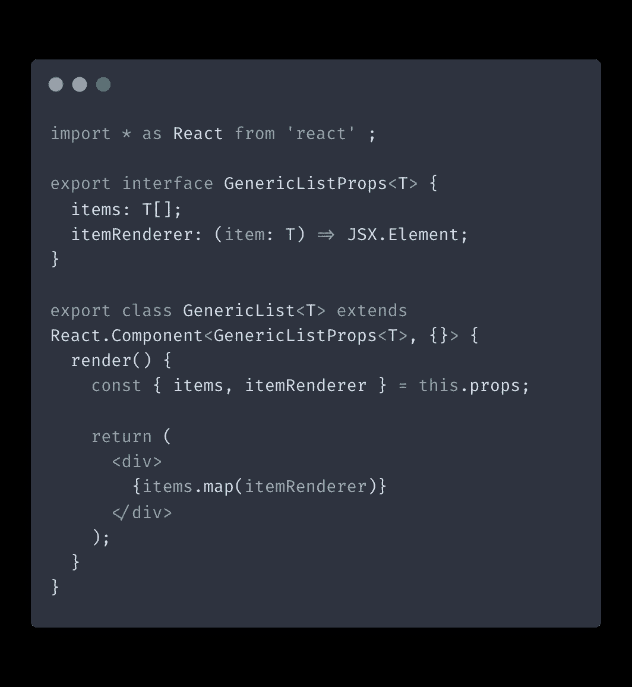
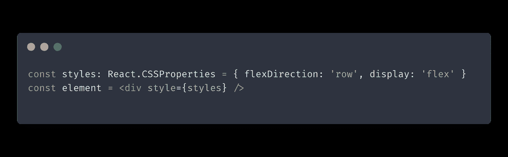
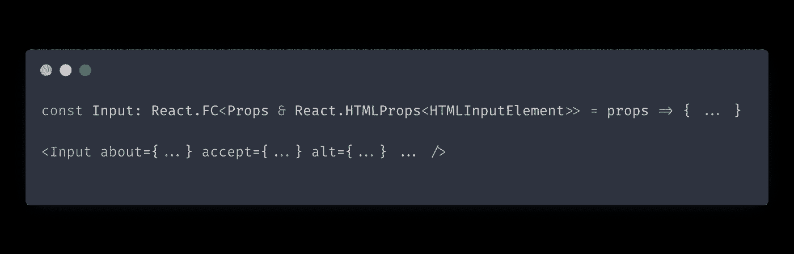
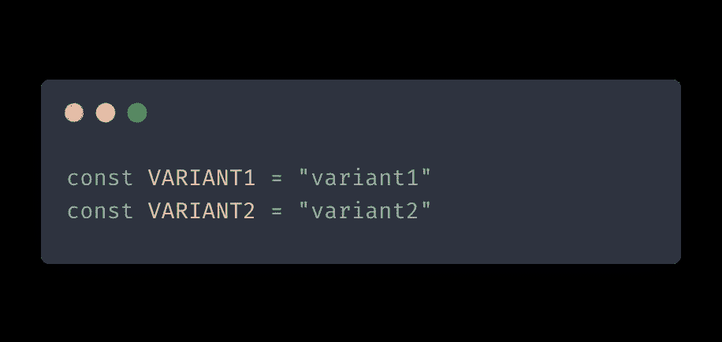
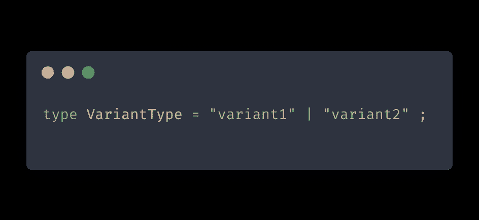
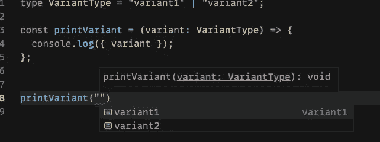

# 使用 React 和 TypeScript 的 6 个简单技巧

> 原文：<https://itnext.io/6-simple-tips-for-working-with-react-and-typescript-1025841fb877?source=collection_archive---------5----------------------->

在本帖中，我们将介绍一些在用 TypeScript 构建 React 应用程序时有用的常见技巧、建议和技术。

# 使用实用程序类型

在使用 TypeScript 时，您经常希望在现有类型的基础上构造新类型。以这种方式创建新类型有几个好处:

*   与干燥原则保持一致。通过重用现有类型来减少代码中的重复。
*   当你的类型改变时保持同步。当您更改任何基础类型时，它的所有子代类型也将采用该更改。

创建新类型的一种方法是使用 TypeScript 实用工具类型。在编写自定义类型时，实用程序类型可以帮助您解决更复杂的边缘情况。我在另一篇文章中写了[实用程序类型的概述](https://isamatov.com/typescript-utility-types-for-react/)，你可能会觉得有用。

# 使用泛型创建可重用的组件

您可以使用`React.Component`类型在 TypeScript 中编写可重用的通用 React 组件。

`React.Component`是一个通用的参数化类型，可以用来创建接受动态输入类型的组件。让我们看看如何用这种类型创建一个通用列表组件:

在上面的例子中，我们创建了一个通用列表组件，它接受动态类型`T`作为输入。这意味着我们的组件可以为它的`items`属性接受任何类型的数据。然后我们使用`map`函数迭代`items`数组中的每一项，并使用`itemRenderer`函数 prop 渲染它。

通过以这种方式创建泛型组件，您可以编写适用于多种类型的代码，并减少代码重复。

# 使用 React。CSS 属性

`React.CSSProperties`是在 React 中为 CSS-in-JS 对象表示样式信息的类型。这种类型对于将`style`属性传递给组件并确保它以 React 支持的方式使用很有用。

# 使用 React 扩展 HTML 元素。HTMLProps

使用 React。HTMLProps，您可以创建自定义元素来扩展本机 HTML 元素的功能。

在上面的代码示例中，我们创建了一个名为`Input`的定制 React 元素，该元素使用`React.HTMLProps`构造其 props 类型。然后我们使用`about`、`accept`和其他 HTML 属性来定义它的行为。

# 对常数使用类型

使用以下语法在项目中创建全局常量是一种常见的做法:

例如，在创建 Redux 动作时，经常使用这样的语法。然而，更好的解决方案是使用类型而不是字符串常量:

这样做有助于我们避免输入错误，并确保没有人使用除我们允许的以外的任何变体类型。

另一个好处是，当使用像 VSCode 这样的 ide 时，我们可以更好地支持 IntelliSense。我们可以自动完成变体，并对代码进行类型检查:

# 使用简写环境模块解决外部类型错误

环境声明用于描述不是用 TypeScript 编写的库的 API 形状。这些通常在 d.ts 文件中定义。

如果您正在寻找第三方模块的类型声明，但似乎找不到，您可以创建自己的类型，或者使用[速记环境模块](https://github.com/Microsoft/TypeScript-Handbook/blob/master/pages/Modules.md#shorthand-ambient-modules) :
`declare module "hot-new-module";`关闭该模块的类型检查

因此，TypeScript 将把`any`类型应用到这个速记模块的所有导入中。

# 结论

我希望这份打字稿提示列表对你有所帮助。如果你正在寻找更多的资源，我推荐你看看这篇关于使用带有 React 和 Redux 的 TypeScript 的综合指南。这篇文章不是一个详细的教程，而是一些常见实践的概述，在使用 React 和 TypeScript 时会有所帮助。编码快乐！

*原载于 2021 年 12 月 12 日 https://isamatov.com**[*。*](https://isamatov.com/react-typescript-tips/)*