# CSS 网格布局的 7 个基本概念

> 原文：<https://itnext.io/7-basic-concepts-of-css-grid-layout-80e827a8e799?source=collection_archive---------1----------------------->

沙欣·卡拉吉在 [Unsplash](https://unsplash.com/s/photos/grid?utm_source=unsplash&utm_medium=referral&utm_content=creditCopyText) 上拍摄的照片

CSS 网格布局是一个 CSS 模块，它定义了一个基于 2D 网格的布局系统，为用户界面设计进行了优化。在预定义的灵活布局网格中，我们可以放置子元素。
如果我们从 [*我能用*](https://caniuse.com/css-grid) 中的数据来看，我们可以看到 CSS 网格布局目前被大多数现代浏览器所支持。

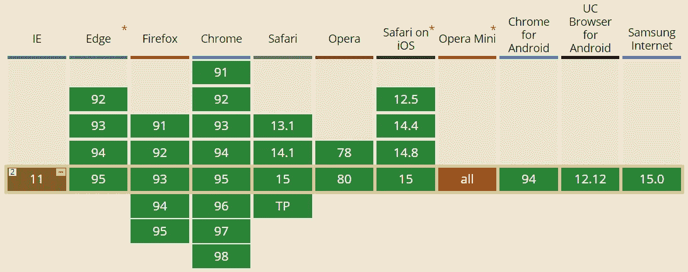

网格布局允许您彻底更改可视布局的结构，而不需要相应的标记更改。通过将媒体查询与 CSS 属性相结合，您可以轻松地为移动设备上的显示添加灵活的布局支持，同时保持 HTML 代码更完美的语义结构。

让我们在一个有六个框的页面上探索 CSS 网格布局。
我们最初的 HTML 代码如下所示:

CSS 代码，为了美观和清晰，我们需要它:

我们的页面将如下所示:

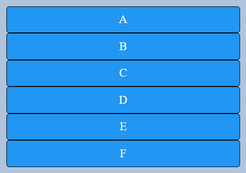

太好了，我们带来了一些美，现在让我们弄清楚网格到底是如何创建的。

# **1。属性“显示:网格”和“显示:内嵌网格”**

创建一个网格，对于一个带有“.类中，我们添加了“display: grid”属性。“显示:内嵌网格”与“显示:网格”的区别与内嵌块到块的区别相同。
那么，我们来写:

从现在开始，这个”。“网格”容器将是一个网格，我们还看不到视觉上的差异，为此我们需要新的属性，我们将进一步考虑。怎样才能了解发生了哪些变化？为此，我们可以使用 chrome 浏览器的开发人员工具，并使用“检查 CSS 网格”，我们可以看到我们的网格是什么。

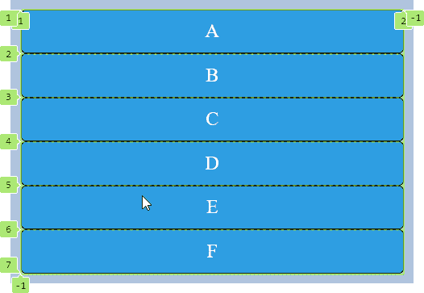

它是一列六行的网格。

# 2.属性“网格间距”、“行间距”和“列间距”

“网格间隙”用于设置网格单元之间的间距。我们给它取 10px 的值吧。

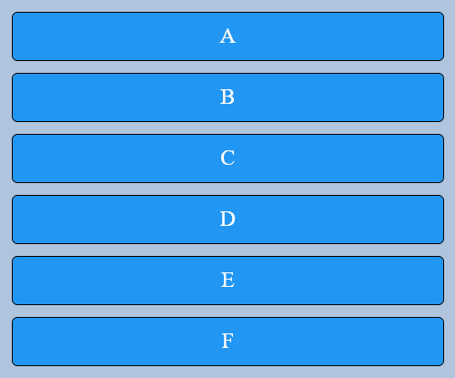

“grid-gap”结合了两个属性:
1)“row-gap”是行与行之间的距离。
2)“列间距”是列之间的距离。

如果使用单独的属性，代码将如下所示。

# 3.属性“网格-模板-列”

现在让我们添加列。

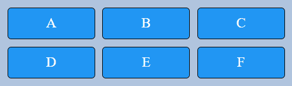

我们可以用任何 CSS 长度单位、百分比和“fr”单位来指定宽度。

“fr”是网格单位的一种新形式，它允许我们添加任意多的列，而不用担心列的具体宽度。自由空间与“fr”的数量成比例地分布在这些列之间。

1fr 1fr 1fr —这个符号意味着我们创建 3 个相同宽度的列。

一点数学知识。网格宽度为 400 像素。如果我们将“grid-template-columns”设置为以下值:1.5fr 2fr 1fr，那么所有列的宽度将为 1.5fr + 2fr + 1fr = 4.5fr.
现在我们来计算每列的宽度。
第一列将为 1.5fr / 4.5fr * 400px 宽。结果是 133 像素。
相应地计算剩余的值。
第二列为 2fr / 4.5fr * 400px = 178px。
第三列 1fr / 4.5fr * 400px = 89px。

我们可以这样定义列:
网格-模板-列:133px 178px 89px
总宽度 400px。
在这种情况下，如果我们想添加另一列，或者相反，删除它，我们将不得不重新计算并手动替换所有的值。有了单位“fr ”,一切都会自动重新计算。

# 4.属性“网格-模板-行”

该属性允许您向网格中添加行。

让我们离题，仔细看看我们的网格是什么，并分析几个新概念。

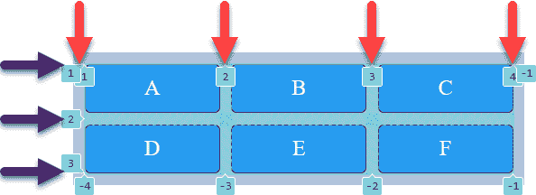

网格容器是包含网格的元素。

网格线是将网格划分为单元的不可见的垂直和水平线条。网格线是有编号的，并且可以命名。
在图像中用红色(竖线)和紫色箭头(横线)标出。

网格轨迹是由一对相邻网格线限定的空间。有纵向的，也有横向的。

网格单元格类似于表格单元格。在图片中，这些是带有字母的蓝色方块，数量为六块。

网格区域是相邻网格单元的矩形。每个网格区域由两对网格线(一对垂直网格线和一对水平网格线)界定。

栅格间隙是相邻栅格条之间的空白空间。

# 5.属性“网格-自动行”、“网格-自动列”和“网格-自动流”

在创建列的例子中，您可能已经注意到我们没有定义列。这是因为可以显式或隐式指定列和行。
如果我们没有指定"网格-模板-行"，这意味着，如果需要，这些行将被自动添加，并且将是隐式的。
隐式网格上的行高必须使用“网格-自动-行”属性设置。
反过来，对于列，有一个属性“grid-auto-columns”设置列的宽度。

“grid-auto-flow”属性允许您指定用于自动放置项目、行或列的内容。默认情况下，其值为“行”。
让我们看一个显示列的隐式加法的例子。为此，我们将“网格-自动流动”设置为“列”。同样，让我们将显式定义的列的数量减少到两个。

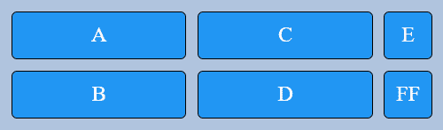

需要注意的一点是，单元格是按列排列的，而不是按行排列的。a 和 B 在第一列，C 和 D 在第二列，依此类推。
如您所见，第三列是自动添加的，其宽度是根据最宽单元格中的内容形成的。让我们为该列设置一个宽度。

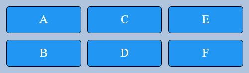

我们得到了已经熟悉的网格。

# 6:函数“重复()”和“最小最大()”

“repeat()”函数允许您在出现重复值时缩短列和行的声明。例如，我们有这样一个代码。

使用 repeat 函数，我们可以如下重写代码。

让我们看一个使用“minmax()”函数的例子。

minmax(120px，1fr)条目意味着最小列大小为 120px，最大列大小为 1fr。
“自动填充”使我们的网格具有响应性，也就是说，当我们调整浏览器窗口大小时，网格中的元素会改变它们的位置。

浏览器窗口宽度 450 像素:

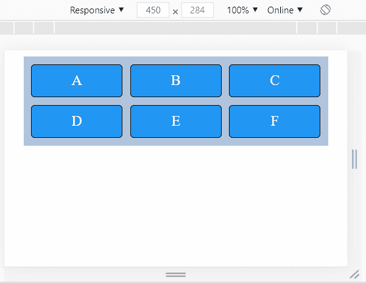

浏览器窗口宽度 300 像素:

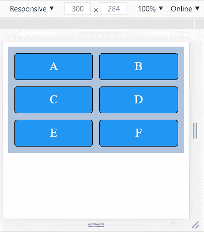

浏览器窗口宽度 200 像素:

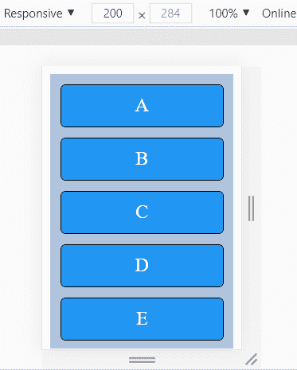

多行网格中的“自动调整”在效果上类似于“自动填充”。
不同之处表现在单线网格上。使用“自动调整”，空轨道被压缩到零，也就是说，它们似乎消失了。
为了显示区别，考虑下面的例子:
使用“自动填充”，我们有三列

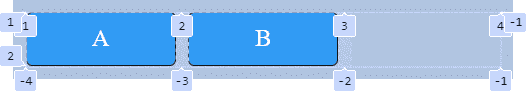

使用“自动调整”时，空列消失

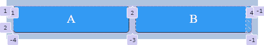

# 7:属性“网格-模板-区域”、“网格-区域”

创建格网单元和格网区域有不同的方法。
一种方式是使用网格线，属性负责这个:“网格-列-开始”、“网格-列-结束”、“网格-行-开始”和“网格-行-结束”。使用这种方法，代码很难阅读，如果布局发生重大变化，就必须重写大量代码。

所以我们将看看第二种方法，这是使用“网格-模板-区域”和“网格-区域”。首先，让我们编辑 html 代码，并在其中使用语义标签。

在“网格区域”的帮助下，我们将为我们的块设置别名。

我们使用“网格-模板-区域”来定义页面模板。

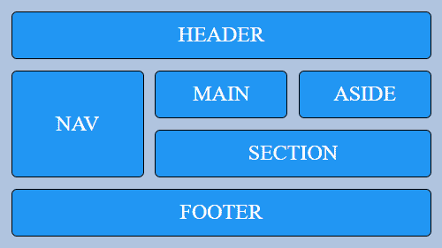

我们现在有一个 3x4 的网格(3 列，4 行)。我们还有 6 个网格区域。
我们可以简单地通过改变“网格-模板-区域”中的网格区域来改变模板。
这可以快速轻松地完成。让我们试试。

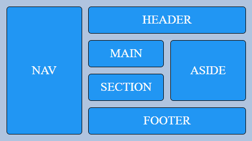

仅此而已，我们在最短的时间内改变了模板！

这就是全部，作为结论，我想说这个教程并不打算涵盖“CSS 网格布局”的所有方面，这个主题是相当广泛的。我们已经介绍了理论和示例的基础知识，以帮助您开始使用网格。