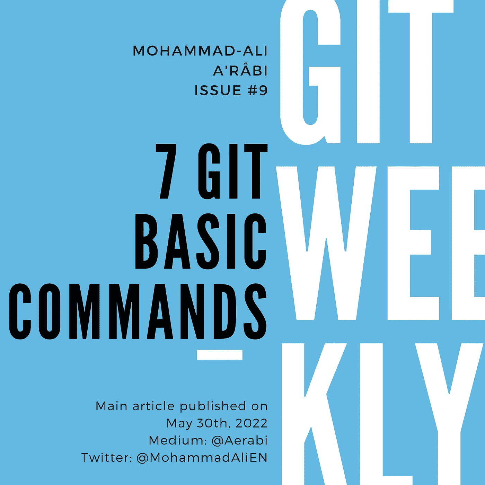

# 7 个 Git 基本命令

> 原文：<https://itnext.io/7-git-basic-commands-8d56dc52e8a4?source=collection_archive---------3----------------------->

在这篇文章中，我们将讨论直接提交到主分支时使用的基本命令。



# 0.设置姓名和电子邮件

这是应该在某人可以提交之前设置的设置:

```
git config --global user.email <email>
git config --global user.name <name>
```

例如，我确实:

```
git config --global user.email "mohammad-ali@aerabi.com"
git config --global user.name "Mohammad-Ali A'râbi"
```

# 1.Git 克隆

假设您已经在 GitHub 或 GitLab 上创建了一个 repo，并用一个`README`文件初始化了它。要在本地制作副本，应该克隆回购协议。

通常有两种方法来克隆 git 仓库:

*   HTTPS
*   嘘

建议使用后者，但需要您将 SSH 密钥保存在 GitLab/GitHub 帐户中。而前者，每次想推送都需要手动输入账号密码。

要使用这两种方法中的任何一种进行克隆，请复制 URL，并使用以下命令:

```
git clone <url>
```

例如，下面是使用 SSH 方法的克隆:

```
git clone [git@github.com](mailto:git@github.com):rxjsx/rxjsx.git
```

这是用 HTTPS 方法克隆同一个回购协议:

```
git clone [https://github.com/rxjsx/rxjsx.git](https://github.com/rxjsx/rxjsx.git)
```

运行此命令将创建一个新目录，并将您的回购文件复制到其中。

# 2.Git 日志

Git log 是显示提交信息的命令:

```
git log
```

输出将类似于以下内容:

```
commit a582046e47cd25e0c20755828a3189b346c1ada7 (**HEAD -> master**, **origin/master**, **origin/HEAD**) 
Author: Mohammad-Ali A'RÂBI <44623032+aerabi@users.noreply.github.com> 
Date:   Tue Apr 26 10:00:41 2022 +0200 

    Docs: Add code quality badge 

commit b848e1ccd6ff6cf57846e50ad5a0bfd5d77136a3 
Author: Mohammad-Ali A'RÂBI <mohammad-ali@aerabi.com> 
Date:   Fri Apr 22 00:30:33 2022 +0200 

    Build: Remove comments from tsconfig.json 

    The main reason is that Snyk cannot import the project currently. 

commit 91bbb10c11178b50e04fc9c8888b80b5ddbc8574 (**tag: v1.0.0**) 
Author: Mohammad-Ali A'RÂBI <mohammad-ali@aerabi.com> 
Date:   Thu Apr 21 16:58:34 2022 +0200 

    1.0.0 

commit a47da95b438adf5ec70daf94cac52e82e1e23e20 
Author: Mohammad-Ali A'RÂBI <44623032+aerabi@users.noreply.github.com> 
Date:   Thu Apr 21 16:56:53 2022 +0200 

    Docs: Add more examples 

    Fixes #4
```

这是关于最后 4 次提交的信息。拿第一个来说:

```
commit a582046e47cd25e0c20755828a3189b346c1ada7 (**HEAD -> master**, **origin/master**, **origin/HEAD**) 
Author: Mohammad-Ali A'RÂBI <44623032+aerabi@users.noreply.github.com> 
Date:   Tue Apr 26 10:00:41 2022 +0200 

    Docs: Add code quality badge
```

它在第一行显示了提交散列，以及“额外标签”:

*   `HEAD -> master`:这基本上意味着我们在本地的分支`master`上，这是该分支上的最后一次提交。
*   `origin/master`:这意味着这个提交也是远程 repo(GitHub 或 GitLab 上的那个)的分支`master`的最后一次提交。因此，本地回购与远程回购是同步的。

第二行显示作者的姓名和电子邮件。此处显示的电子邮件地址是 GitHub 创建的，因此不会暴露原始地址。

第三行是创建提交的日期和时间。在这种情况下，时间是 2022 年 4 月 26 日，德国夏令时上午 10:00:41。

最后是提交消息。

# 3.Git 状态

状态消息主要是关于文件，而不是提交。让我们试一试:

```
git status
```

输出如下所示:

```
On branch aerabi/add-codeql 
Your branch is up to date with 'origin/aerabi/add-codeql'. 

Changes not staged for commit: 
  (use "git add <file>..." to update what will be committed) 
  (use "git restore <file>..." to discard changes in working directory) 
        **modified:   README.md 
        modified:   package-lock.json 
        modified:   package.json** 

Untracked files: 
  (use "git add <file>..." to include in what will be committed) 
        **temp.txt** 

no changes added to commit (use "git add" and/or "git commit -a")
```

它基本上是说`README.md`以及另外两个文件被修改了，但是没有被登台(我们将会谈到这一部分)。同时，`temp.txt`根本不被 git 跟踪。

# 4.Git 添加

如果您想要提交一些更改，您必须首先“准备”它们。这通过以下方式实现:

```
git add <path>
```

在前面的例子中，假设我们想要提交`README`文件:

```
git add README.md
```

然后，通过做一个`git status`，我们会得到:

```
On branch aerabi/add-codeql 
Your branch is up to date with 'origin/aerabi/add-codeql'. 

Changes to be committed: 
  (use "git restore --staged <file>..." to unstage) 
        **modified:   README.md** 

Changes not staged for commit: 
  (use "git add <file>..." to update what will be committed) 
  (use "git restore <file>..." to discard changes in working directory) 
        **modified:   package-lock.json 
        modified:   package.json** 

Untracked files: 
  (use "git add <file>..." to include in what will be committed) 
        **temp.txt**
```

# 5 Git 恢复

restore 命令有两个主要功能:

*   取消暂存更改
*   放弃更改

## 5.1.Git 还原到非登台

这是`git add`命令的逆命令:

```
git restore --staged <path>
```

在前面的例子中，让我们假设我们也意外地暂存了`package.json`文件:

```
On branch aerabi/add-codeql 
Your branch is up to date with 'origin/aerabi/add-codeql'. 

Changes to be committed: 
  (use "git restore --staged <file>..." to unstage) 
        **modified:   README.md 
        modified:   package.json** 

Changes not staged for commit: 
  (use "git add <file>..." to update what will be committed) 
  (use "git restore <file>..." to discard changes in working directory) 
        **modified:   package-lock.json** 

Untracked files: 
  (use "git add <file>..." to include in what will be committed) 
        **temp.txt**
```

但是我们不想在下一次提交中包含这些更改。要取消`package.json`中的更改，请执行以下操作:

```
git restore --staged package.json
```

这将导致`package.json`从提交的变更列表中删除:

```
On branch aerabi/add-codeql 
Your branch is up to date with 'origin/aerabi/add-codeql'. 

Changes to be committed: 
  (use "git restore --staged <file>..." to unstage) 
        **modified:   README.md** 

Changes not staged for commit: 
  (use "git add <file>..." to update what will be committed) 
  (use "git restore <file>..." to discard changes in working directory) 
        **modified:   package-lock.json 
        modified:   package.json** 

Untracked files: 
  (use "git add <file>..." to include in what will be committed) 
        **temp.txt**
```

## 5.2.Git 还原到丢弃

git store 的这个变体完全放弃了文件中的所有更改:

```
git restore <path>
```

在前面的例子中，让我们假设我们想要放弃我们在`package.json`中所做的所有更改:

```
git restore package.json
```

这将导致文件恢复到上次提交时的状态:

```
On branch aerabi/add-codeql 
Your branch is up to date with 'origin/aerabi/add-codeql'. 

Changes to be committed: 
  (use "git restore --staged <file>..." to unstage) 
        **modified:   README.md** 

Changes not staged for commit: 
  (use "git add <file>..." to update what will be committed) 
  (use "git restore <file>..." to discard changes in working directory) 
        **modified:   package-lock.json** 

Untracked files: 
  (use "git add <file>..." to include in what will be committed) 
        **temp.txt**
```

# 6.Git 提交

commit 命令将“提交”本地存储库中的所有暂存更改:

```
git commit -m <commit_message>
```

在前面的例子中，我们可以通过以下方式提交`README.md`中的更改:

```
git commit -m "Add test coverage badge to README.md"
```

尝试总是有一个信息性的提交消息。关于提交消息的更多信息:

*   [Git 提交消息的十诫](/ten-commandments-of-git-commit-messages-94bd6dcf6e0e)

提交命令的输出是:

```
[aerabi/add-codeql 1b3f325] Add test coverage badge to README.md 
 1 file changed, 1 insertion(+)
```

这意味着一行被添加到一个文件中。现在让我们来看看提交:

```
git log
```

输出:

```
commit 1b3f32586edf82a6e51c3a2a71cda0cd05ea8500 (**HEAD -> aerabi/add-codeql**) 
Author: Mohammad-Ali A'râbi <mohammad-ali@aerabi.com> 
Date:   Mon May 30 10:45:35 2022 +0200 

    Add test coverage badge to README.md 

commit a58060cc5263fa66f5b5f61dd395baead10536a9 (**origin/aerabi/add-codeql**) 
Author: Mohammad-Ali A'RÂBI <44623032+aerabi@users.noreply.github.com> 
Date:   Thu Sep 16 13:36:39 2021 +0200 

    Create codeql-analysis.yml
```

如您所见，添加了一个新的提交，并在 5 月 30 日打上了时间戳。标签`HEAD -> aerabi/add-codeql`在最后一次提交上，意味着这是本地回购分支`aerabi/add-codeql`上的最后一次提交。另一个标签`origin/aerabi/add-codeql`在第二次提交时，显示远程分支没有我在本地提交的内容。

要更新远程分支，就得推！

# 7.Git 推送

push 命令将使用本地更改更新远程分支。

```
git push
```

# 摘要

这份基本指南的目标读者是 git 新手，并且希望在没有其他合作者的情况下使用自己回购的主要分支。关于分支和协作的其他帖子将在未来几周发布。

我每周在 git 上写帖子。

*   [订阅](https://medium.com/subscribe/@aerabi)my Medium publishes，以便在新的 Git 周刊发布时获得通知。
*   关注 Twitter 上的[我](https://twitter.com/MohammadAliEN)获取 git 上的每周文章和每日推文。