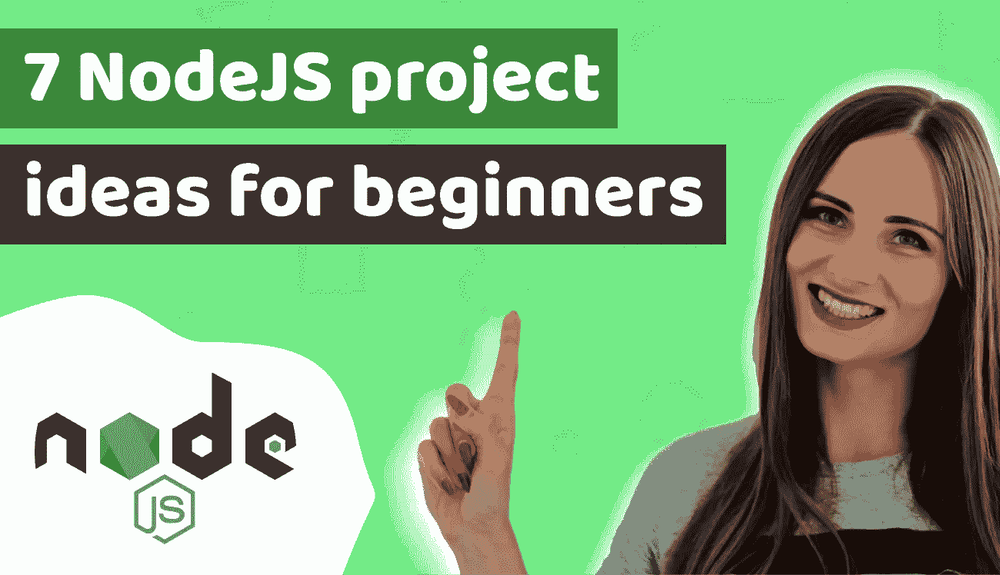

# 7 Node JS 项目思路，适合初学者，去实践，去录用！

> 原文：<https://itnext.io/7-node-js-project-ideas-for-beginners-to-practice-and-get-hired-3e5d69bc0166?source=collection_archive---------4----------------------->

[Duomly —编程在线课程](https://www.blog.duomly.com)

本文原载于[https://www . blog . duomly . com/node-js-project-ideas-for-初学者/](https://www.blog.duomly.com/node-js-project-ideas-for-beginners/)

# 面向初学者的 Node JS 项目理念介绍

在这篇文章中，我想告诉你 7 节点 JS 项目的想法，这将有助于你训练你的技能，建立一个令人印象深刻的投资组合，并获得聘用。

一段时间以来，我发布了一些项目列表，你可以用它们来练习你刚刚学到的编码技能。我主要关注前端技术，但是今天我决定跳到名为 Node JS 的 Javascript 后端框架。

如果你想查看以前的项目想法，这里有链接:

*   [HTML 和 CSS 项目的 11 个想法](https://www.blog.duomly.com/html-project-ideas-for-beginners/)，
*   [初学者 9 个 Javascript 项目思路](https://www.blog.duomly.com/9-javascript-project-ideas-for-beginners-that-help-you-to-build-an-amazing-coding-portfolio/)，
*   [9 React.js 项目思路](https://www.blog.duomly.com/9-react-js-projects-for-beginners-that-will-help-you-to-build-an-amazing-portfolio-and-get-hired/)，
*   [初学者 9 个 VueJS 项目思路](https://www.blog.duomly.com/vue-js-project-ideas-for-beginners/)。

如果您对 NodeJS 感到不舒服，并且您想在指南的指导下多练习一下，请随时查看 youtube 频道，在那里我们正在一步一步地创建 NodeJS 应用程序。

当你开始练习编码和构建你的第一个项目时，记住为你的每个项目创建一个资源库是非常重要的，这样你将能够学习 git 并向你未来的雇主展示代码。如果你不记得怎么做了，下面是关于 [Git 和 Github 的视频。](https://www.youtube.com/watch?v=70e58se9lHk)

和往常一样，我有这篇文章的视频版本，所以，如果你喜欢看，你可以在这里做。

初学者的 7 节点 JS 项目思路

那么，你准备好听听 7 个惊人的 Node JS 项目创意供初学者学习了吗？

# NodeJS 项目创意—附加信息

Node JS 是一个在浏览器之外执行 Javascript 代码的运行时环境，它通常用于使用这种编程语言创建后端。Node JS 经常与 Express 或 Nest.js 等其他框架一起使用。

除了使用 NodeJS 的 Javascript 知识，您还需要了解如何以及为什么在后端使用数据库，以及如何构建 API，无论您是想构建 REST 还是 GraphQL。

有一些额外的框架可以在某些情况下使用，并使 Node JS 中的开发更加容易和快速。如果你能特别注意以下几点就好了:

**Express.js** —是最流行和最常被选择的框架之一。Express.js 以快速、灵活和简约著称。它适合构建 web 和移动应用程序。

**Nest.js** —是另一个非常适合开发渐进式服务器端应用程序的 NodeJS 框架，Nest.js 中的代码是用 Typescript 编写的。

**Sequelize** —这是一个生成器框架，帮助我们处理节点和数据库。它支持 MySQL、PostgreSQL、MariaDB 等等。

Socket.io —这是一种特殊类型的框架，因为它专注于构建像聊天这样的实时应用。

除了框架之外，您还需要一个工具来检查端点。我用的是 Postman，但是还有很多其他的像失眠或者 HTTPie。

我希望我已经提到了 Node JS 上下文中的所有重要内容，这样我们就可以开始我们的项目想法列表了！

# 1.书籍目录

您可以使用 Node.js 和 Express.js 或 Nest.js 创建的最基本的项目是一个简单的 REST API。

为此，我建议您构建一个图书目录，在这里您需要创建端点，使用四个最基本的方法:GET、POST、PUT 和 DELETE。

您可以使用 GET 来获取所有的书或者只获取一本书的 id。使用 POST 方法，您可以向列表中添加一本新书。您需要 PUT 方法来更新现有的图书，很明显，使用 DELETE 方法，您将从列表中删除该图书。

对于这种应用程序，您不必使用数据库，对于第一个应用程序，您可以从作为 JSON 文件收集的数据开始。

# 2.基本用户系统

另一个可以用于培训的应用是基本用户系统。这是一个基本的项目，但是它将帮助你练习非常有用的技能，因为用户是几乎每个应用程序的一部分。

在本例中，您将学习:
—如何设置数据库并进行迁移，
—如何通过注册创建新用户，
—如何构建登录端点，
—如何验证用户，
—如何获取用户数据。

在注册和登录的情况下，您应该为用户生成一个将从 API 返回的 JWT 令牌。

除此之外，在将密码保存到数据库之前，记得对其进行哈希运算。

如果您想了解我在我们的 [NodeJS 课程中是如何进行用户注册、登录和认证的。](https://www.blog.duomly.com/node-js-course-with-building-a-fintech-banking-app-lesson-1-start-the-project/)

# 3.实时聊天应用程序

另一个可以用来练习 Node JS 技能的令人兴奋的项目是实时聊天应用程序。

为此，您可以尝试使用 MongoDB、Express.js 框架和 scoket.io 来处理实时事件。

一开始，创建一个简单的聊天来连接和断开用户，允许他们发送和接收消息是很好的，但在未来，扩展聊天并添加视频流或登录表单可能是一个好主意。

如果您在启动您的第一个实时聊天应用程序时需要一些帮助，请查看 SocketIO 文档。

# 4.协作绘图应用程序

第四个项目想法是一个协作绘图应用程序。它涉及一些前端编码，但如果你懂 Javascript，这应该不是问题。

这个应用程序的主要思想是创建 canvas 元素，用户可以在其中绘图。

让我告诉你这个应用程序需要什么。首先需要设置安装了 Socket.io 的 Node JS 应用程序。

然后，您需要添加一些 HTML 来准备一个带有 canvas 元素的简单界面，供用户绘制，您可以按照自己喜欢的任何方式来设计它。然后，您必须处理将要绘制的鼠标事件。

最后一件事是创建服务器端代码，您可以使用 Socket.io 来检查新用户何时加入以及他们何时开始绘画。

# 5.电子邮件发送者

Node JS 项目的下一个想法是创建一个电子邮件发送器应用程序。在这个项目中，您可以学习如何在 Node JS 中发送电子邮件以及如何安排电子邮件。这对未来非常有用，因为许多应用程序都需要这个特性，例如，当新用户登录时。

要轻松发送电子邮件，您可以使用 Nodemailer 插件，它非常简单并且有很好的文档记录。

有时，你可以添加一个前端，用 HTML 轻松创建电子邮件。

# 6.视频流媒体平台

第六个项目可能相当令人兴奋，也有点挑战性，因为我想建议建立一个视频流平台。

在这个项目中，您必须负责将视频内容划分为块，以免一次将所有内容发送到前端，这就是应该在节点 JS 中发生的事情。

此外，您需要编写一些 HTML5 来创建视频播放器，并在前端编写一些 Javascript 来处理播放器按钮。

这个项目真的很吸引眼球，可以帮你找到工作。

# 7.卷筒纸刮刀

我今天得到的关于 Node JS 的最后一个项目想法是一个 web scraper。如果你想从互联网上收集某些数据，创建自己的网页抓取器可能是个好主意。

对于这个应用程序，一些插件如 Cheerio 或 Puppeteer 可能会有用。

在这种应用程序中，您需要从网站代码中获取感兴趣的信息，然后将其保存到文件或数据库中。

# 结论

在这篇文章中，我提出了 7 个 Node JS 项目想法，你可以这样做来练习你的 Node JS 技能，并建立一个可以向招聘人员或你未来的雇主展示的编码组合。

我希望你会发现他的想法很有用，并开始努力提高你的 Node JS 知识。

如果您仍然需要一些关于构建 Node JS 项目的指导，请随意跳到我们的课程，在这里我们将一步一步地创建 fin-tech 应用程序。

[Duomly —编程在线课程](https://www.duomly.com/?code=lifetime-80)

感谢您的阅读，
来自 Duomly 的安娜