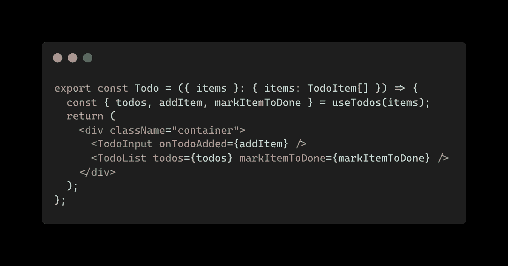
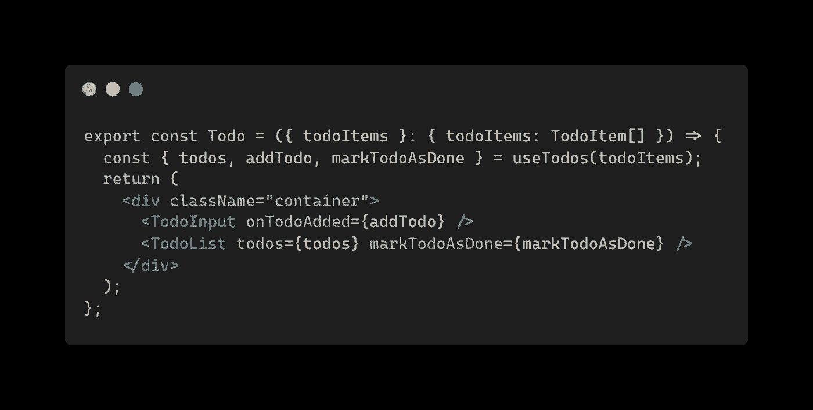
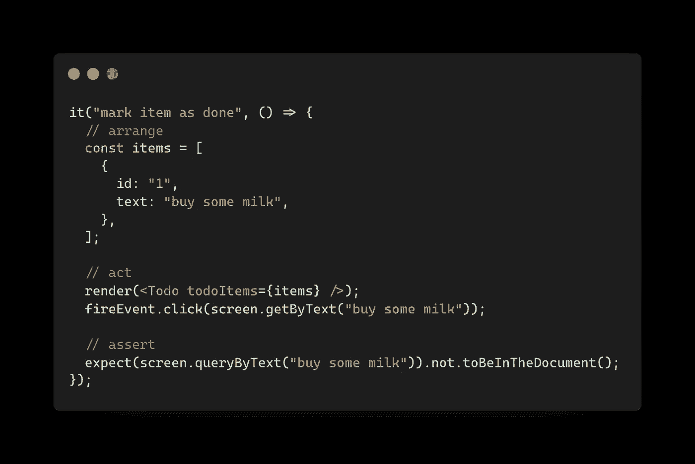
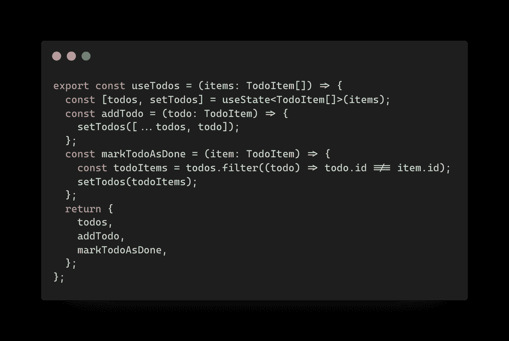
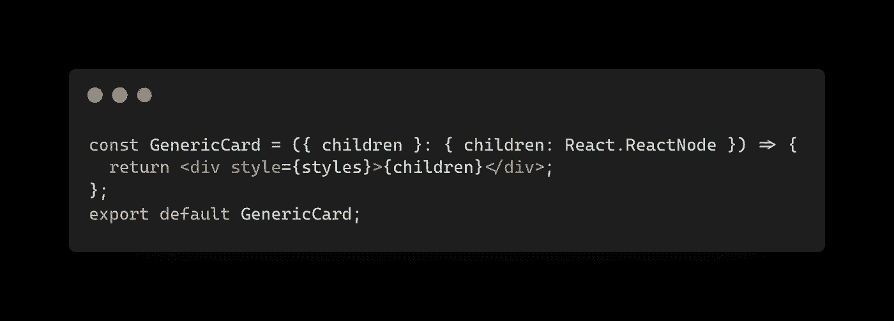

# 你应该知道的 7 个干净代码技巧

> 原文：<https://itnext.io/7-react-clean-code-tips-you-should-know-846b8108fc46?source=collection_archive---------0----------------------->

在本文中，我总结了七个实用技巧，供您编写可维护的 React 代码。


由 [Sebastian Bednarek](https://unsplash.com/@abeso?utm_source=medium&utm_medium=referral) 在 [Unsplash](https://unsplash.com?utm_source=medium&utm_medium=referral) 上拍摄

*更新 2022 年 12 月 28 日，我推出了免费的* [*7 天 React Clean Code Challenge*](https://icodeit.ck.page/7-day-react-clean-code)*。在完成挑战的同时，和我一起学习更多实用的技巧。*

如果你有兴趣深入研究这个主题，我已经创建了一个免费的在线课程，涵盖了这篇文章中讨论的所有主题。本课程旨在互动、吸引人，并包含实用的技巧和技术。课程结束时，你将对这门学科有一个扎实的理解，并能够在日常生活中运用所学。

# 1.有意义的名字

> *计算机科学只有两个硬东西:缓存失效和事物命名。*
> 
> *—菲尔·卡尔顿*

像任何其他编程语言一样，命名总是很难。我们应该尽最大努力给事物命名清楚，不管是函数、变量还是元件。

好的名字应该直截了当，简洁直接。例如:



在一个组件中同时使用 item 和 todo

这里有两个概念，它们可能会引起一些混淆:`Todo`和`Item`。实际上，它们在上下文中是一回事。因此代码可以重构为:



统一到待办事宜以消除混乱

因此，尽量消除名称中的混淆，尤其是那些有消费者的名称(无论是内部的还是外部的)。注意，一旦你的 API 发布了，就不仅仅是你的了，所以要多注意这些公共 API 名(组件名、属性名和类型)。

# 2.可测试的反应代码

传统上，在测试产品代码之前很难建立测试机制。但是有了`jest`和`react-testing-library`，在你的 React 项目中就不再是这样了。

此外，我发现在 React 中应用测试驱动开发非常容易，因为测试设置过程非常容易。

我并不是说你应该用`react-testing-library`来代替`cypress`或者真正的浏览器测试，但是有了它，你就可以很好地模拟用户实际看到的你的代码。



使用反应测试库进行测试

你在测试你的组件的行为，这就是重点。

# 3.使用钩子

所以在 React 16.8 之前，在组件之间重用有状态逻辑不容易。



对可重用的逻辑使用钩子

如果您在该版本之后使用 React，`hooks`应该是可重用逻辑的默认选择。说到逻辑，我指的是任何与用户界面无关的代码，比如数据获取、状态管理和数据操作(你甚至可以将这种逻辑放到它们自己的层中，比如我在这里讨论的 ACL 或数据映射器)。

# 4.使用组合

合成是一项超级强大的技术，就我个人而言，我将它视为专业开发人员和业余开发人员之间的重要分界线，尽管很难定义开发人员在日常工作中掌握合成的能力有多强。

幸运的是，在 React 中，使用复合非常简单。如果你已经使用了`children`或`[render](https://reactjs.org/docs/render-props.html)`或[道具](https://reactjs.org/docs/render-props.html)，你已经在使用构图了。



通用卡组件

您可以使用标题作为子项:

```
<GenericCard>
  <h3>I'm a heading</h3>
</GenericCard>
```

或者更复合的成分:

```
<GenericCard>
  <section>
    <h3>I'm a heading</h3>
    <p>I have some additional description</p>
  </section>
</GenericCard>
```

而`GenericCard`对传进来的`children`一无所知。

# 5.小组件是好组件

这是目前为止我最喜欢的技巧，我认为它与我们这里的大多数技巧都有联系。实际上，如果你在代码中看到数百行，你可能做错了。尽管可能有一些例外，但我发现在大多数情况下，您可以将代码分割成更小的部分来提高质量。

小意味着一次专注于一件事。因此，组件易于测试、修改和理解。请注意，我并不是说您应该实施一些 eslint 规则来限制代码行，但是您应该密切关注它:当文件增长时，您应该检查您是否在其中放入了逻辑(这些可以放入一个钩子中)，或者它做了太多的事情(这些可以分解为子组件)等等。

# 6.关注点分离

在任何 React 应用程序中，我们都可以将代码分为几类。表示传入数据的视图、`service`或`data-provider`获取数据并将其转换为视图使用的格式，以及基础设施代码(设置 JWT 令牌，确保第三方集成等。).

这些模块或者层应该是自然拆分到不同的地方，但更多的时候，我看到人们把它们混在一起。在许多 React 组件中，他们在文件的前半部分做一些数据转换。在其他地方，他们试图从不同的上下文中提取随机的东西，然后进行条件渲染。

抓住诱惑，从创建一个`tsx`文件开始，首先考虑它属于哪个类别，在他们自己的模块中进行数据计算，然后在你的 React 组件中使用它们。

# 7.其他领域的成熟实践

虽然，乍一看，React 就像是 HTML 和 JavaScript(有时甚至是 CSS)在单个文件中的混合。一旦您熟悉了 jsx 语法，您很快就会注意到 React 代码与其他代码没有太大的不同，比如 Java 或 Python。

当然，定义一个变量，调用一个函数甚至缩进的方式都不一样，只是层次更高。你仍然在处理模块和它们的关系，比如，哪个模块执行什么任务，以及其他模块如何依赖它们。

这意味着我们完全可以借鉴其他领域的经验。就像在面向对象的项目中，我们使用一个接口来分离协议和实现，我们也可以在 React 中使用(就像在`render` props 中)。在所有其他编程语言中，我们都有一个单一的责任原则，那么我们为什么不用它来指导我们拆分 React 组件呢？

因此，如果您有其他编程语言背景，请尝试寻找机会在 React 代码中应用这些经过验证的实践。

# 摘要

我[制作了一份关于我们在这里讨论的技巧的小抄](https://icodeit.ck.page/maintainable-react-tips)，如果你喜欢，可以打印出来。我有一本关于可维护的 React 的书，你可以从中了解更多。

**如果你喜欢阅读，请** [**报名参加我的邮件列表**](https://juntao.substack.com/) **。我每周通过** [**博客**](https://juntao-qiu.medium.com/)**[**书籍**](https://leanpub.com/u/juntao) **和** [**视频**](https://www.youtube.com/@icodeit.juntao) **分享干净代码和重构技术。****

**我希望你喜欢读这篇文章。如果你愿意支持我成为一名作家，可以考虑注册[成为一名媒体成员](https://medium.com/@juntao-qiu/membership)。每月只需 5 美元，你就可以无限制地访问我在 Medium 上的所有文章——以及上述作者和其他人的所有文章！**