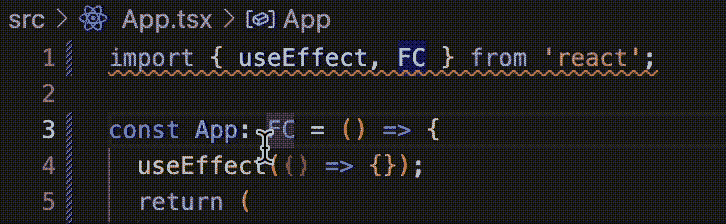
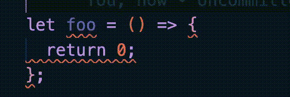
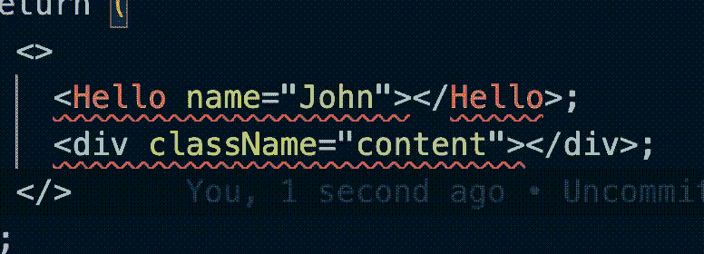
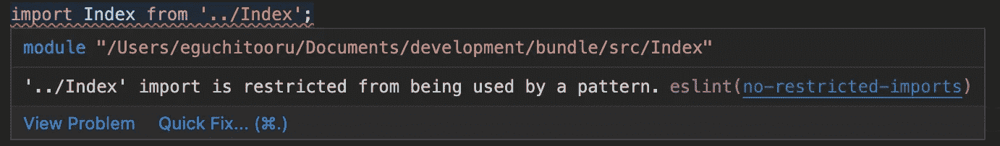
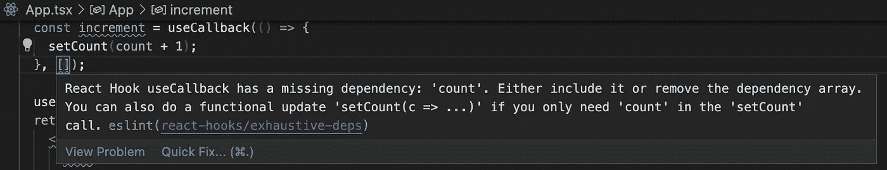

# React TypeScript 项目的推荐 ESLint 规则

> 原文：<https://itnext.io/7-recommended-eslint-rules-for-react-typescript-project-1a22b011b4b5?source=collection_archive---------1----------------------->



gif:仅用于类型导入的自动格式

ESLint 和 beauty 的组合太惊艳了。它不仅大大减少了格式化时间，还节省了你的大脑 CPU。此外，如果你们是团队合作，会减少复习压力。

通常情况下，你可以根据预设设置 ESLint 和 pretty，比如 [Airbnb](https://github.com/airbnb/javascript) 、[谷歌](https://github.com/google/eslint-config-google)和[标准](https://github.com/standard/standard)。但是因为他们的预置不是为你自己的项目定制的，所以还有改进的空间。

因此，本文介绍了 7 个推荐的 ESLint 配置，它们对您的 React TypeScript 项目有很大的影响！

如果你没有设置 ESLint 和更漂亮，请随意参考我以前的文章。

[](/auto-format-with-eslint-and-prettier-for-react-typescript-project-6526a9d44f81) [## React TypeScript 项目的 ESLint 和更漂亮的自动格式

### 自动格式化是 DX 的一大改进。它节省了您的开发时间，并大大提高了您的生产力…

itnext.io](/auto-format-with-eslint-and-prettier-for-react-typescript-project-6526a9d44f81) 

# 1.箭体样式

虽然[箭体样式](https://eslint.org/docs/latest/rules/arrow-body-style)是一个非常简单的规则，但是当你编写代码时，它会产生巨大的影响。它的推荐设置是`"arrow-body-style": ["error", "as-needed"]`，强制您删除不必要的返回，如下所示。

```
// "arrow-body-style": ["error", "as-needed"],// Incorrect
let foo = () => {
    return 0;
};// Correct
let foo = () => 0
```



gif:箭头体样式的自动格式

# 2.反应/自动关闭-comp

[反应/自关闭-压缩](https://github.com/jsx-eslint/eslint-plugin-react/blob/master/docs/rules/self-closing-comp.md)类似于箭体式。虽然它很简单，但它减少了大量的时间，因为有太多的机会来写自我封闭的 JSX。

推荐设置为`react/self-closing-comp: ["error", { "component": true, "html": true }]`

```
// "react/self-closing-comp": [
//   "error", { 
//     "component": true,
//     "html": true
//   }
// ]// Incorrect
<Hello name="John"></Hello>;
<div className="content"></div>;// Correct
<Hello name="John" />
<div className="content" />
```

`"component": true`强迫你写一个带有自结束标签的自定义组件。此外，`"html": true`将普通 html 标签改为自结束标签。



gif:自动关闭排版格式

# 3.自动修复/无未使用变量

这源于 ESLint 的 [no-unused-vars](https://eslint.org/docs/latest/rules/no-unused-vars) 规则。尽管原始的 no-unused-vars 不会自动格式化，我还是推荐使用 [eslint-plugin-autofix](https://github.com/aladdin-add/eslint-plugin/tree/master/packages/autofix) 。它会自动格式化。

```
$ yarn add -D eslint-plugin-autofix
```

之后就可以作为 ESLint 插件添加了。

```
{
  "plugins": ["react", "@typescript-eslint", "autofix"],
  "rules": {
    ...
  }
}
```

现在，你可以使用定义 no-unused-vars 规则，如下所示！

```
// "autofix/no-unused-vars": [
//   "error",
//   {
//     "argsIgnorePattern": "^_",
//     "ignoreRestSiblings": true,
//     "destructuredArrayIgnorePattern": "^_"
//   }
//  ]// Incorrect
function foo(x, y) {
    return x + 1;
}
foo();var { foo, ...coords } = data;const [a, b] = ["a", "b"];
console.log(b);// Correct
function foo(x, _y) {
    return x + 1;
}
foo();var { foo, ...coords } = data;const [_a, b] = ["a", "b"];
console.log(b);
```

如果只是添加`autofix/no-used-vars: "error"`，所有未使用的变量都显示 lint 错误。但是，有时您希望定义未使用的变量来显示一些意图。所以我推荐用`argsIgnorePattern: "^_"`。带有`_`前缀，允许使用。

`ignoreRestSiblings`选项`destructuredArrayIgnorePattern`是 bit case 特有的规则。

有时你可以使用 rest 属性从对象中删除一个键，如下所示。在这种情况下，您可能不再使用已删除的密钥。使用`ignoreRestSiblings`，您可以忽略从移除的键。

```
const obj = { first: "John", last: "Lennon", age: 30 };
const { age, ...name } = obj;  // remove age from obj// => prevent age from ESLint error
```

类似的 ESLint 错误发生在数组析构中。使用数组析构时，可能不会使用第一个析构的元素。使用`destructuredArrayIgnorePattern: "^_"`，可以防止 ESLint 错误。

```
const [_A, B, C] = Promise.all([fetchA, fetchB, fetchC]);console.log(B, C);// => prevent A from ESLint error
```

# 4.@ typescript-eslint/consistent-type-imports

当您导入 TypeScript 类型时，建议使用 [type only import](https://www.typescriptlang.org/docs/handbook/release-notes/typescript-3-8.html#type-only-imports-and-export) 以获得更好的性能。但是正确使用 normal 和 type only import 让我很困扰。

```
import { useEffect } from "react;
import type { FC } from "react;
```

所以是时候使用[@ typescript-eslint/consistent-type-imports](https://github.com/typescript-eslint/typescript-eslint/blob/main/packages/eslint-plugin/docs/rules/consistent-type-imports.md)了。它会自动检测导入的模块是否为类型，并根据需要进行格式化。

```
// "@typescript-eslint/consistent-type-imports": [
//   "error",
//   {
//     "prefer": "type-imports",
//   }   
// ],// Incorrect
import { useEffect, FC } from "react";// Correct
import { useEffect } from "react";
import type { FC } from "react";
```


gif:仅用于类型导入的自动格式

# 5.进口/订购

其实我最喜欢[进口/订单](https://github.com/import-js/eslint-plugin-import/blob/main/docs/rules/order.md)规则。因为有这么多的进口，自己组织进口订单总共浪费了很多时间。所以是时候用自动格式了！

```
// "import/order": [
//   "error",
//   {        
//     "groups": [
//       "builtin",
//       "external",
//       "parent",
//       "sibling",
//       "index",
//       "object",   
//       "type"
//     ],
//     "pathGroups": [
//       {
//         "pattern": "@/**/**",
//         "group": "parent",
//         "position": "before"
//       }
//     ],
//     "alphabetize": { "order": "asc" }
//   }
// ],
```

规则本身有点复杂。`groups`键定义模块类型之间的实际顺序。上面的配置命令在外部包(如`react`)之前在模块(如`path`)中构建节点。如果你想知道每组的详细情况，请查看[正式文件](https://github.com/import-js/eslint-plugin-import/blob/main/docs/rules/order.md#importorder-enforce-a-convention-in-module-import-order)。

`pathGroups`创建自定义群组。我经常为导入别名定义它。

```
// import alias
import foo from "../../src/path/to/foo"; // not readable
import foo from "@/src/path/to/foo";  // using import alias
```

通过`pathGroups`设置，使用导入别名的模块在`parent`之前排序。

`alphabetize`指同一模块的订单。`react`是在`vue`之前点的(当然不会发生)。

# 6.非限制进口

就像我上面说的，导入别名很有帮助。我希望你们已经用过了。一旦引入导入别名，您可能希望禁止使用相对导入。所以是时候设置[非限制进口](https://eslint.org/docs/latest/rules/no-restricted-imports)了。

```
// "no-restricted-imports": [
//   "error",
//   { 
//     "patterns": ["../"] 
//   }
// ],
```

它限制通过相对路径导入父模块。另一方面，它允许通过相对路径导入子模块。这是一种偏好。如果想禁止任何相对路径，只需在`patterns`中添加`./`即可。



实际上，它不会自动格式化，因为 ESLint 不知道您的自定义导入别名。所以应该是手工完成。

# 7.反应-钩子/详尽-deps

React Hook 需要定义依赖关系来检测内部逻辑何时应该运行。但是如果 React Hook 中有复杂的逻辑，就很难精确地写出所有的依赖关系。所以我使用[react-hooks/exhaustive-deps](https://github.com/facebook/react/tree/main/packages/eslint-plugin-react-hooks#eslint-plugin-react-hooks)来检测缺失的依赖项。

要使用 react-hooks ESLint 规则，您需要添加 react-hooks 包作为插件。如果还没做，请设置。

```
// .eslintrcjson
{
  "plugins": [
    "react",
    "@typescript-eslint",
    "autofix",
    "react-hooks"
  ],
}
```

规则本身很简单。就像下面这样加一行。

```
// "react-hooks/exhaustive-deps": "error"
```



图:详尽的 deps 错误

本文解释了为 TypeScript React 项目推荐的 7 个 ESLint 规则。虽然变化很小，但它会加快你未来很长一段时间的发展。

# 参考

*   [ESLint](https://eslint.org/)
*   [Airbnb](https://github.com/airbnb/javascript) 预置
*   [谷歌](https://github.com/google/eslint-config-google)预置
*   [标准](https://github.com/standard/standard)预设
*   [打字稿](https://www.typescriptlang.org/)