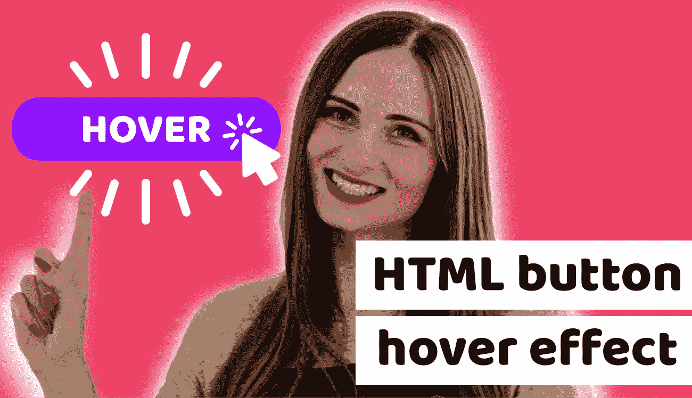

# 8 惊人的 HTML 按钮悬停效果，这将使您的网站出众

> 原文：<https://itnext.io/8-amazing-html-button-hover-effects-that-will-make-your-website-outstanding-932aa4bde724?source=collection_archive---------7----------------------->

8 个惊人的 HTML 按钮悬停效果，让你的网站与众不同

本文最初发表于 https://www.blog.duomly.com/html-button-hover-effects/的

# HTML 按钮悬停效果介绍

按钮是基本的 HTML 元素，经常在每个页面、web 应用程序或移动应用程序中使用。

HTML 按钮在布局中是一个非常重要的元素，因为在很多情况下，它是一个必须被用户注意到的元素，作为一个行动的号召，并说服用户点击它。

前端开发人员和设计人员经常试图以任何好的方式突出按钮，特别是当用户与它们交互时，例如，在悬停或聚焦时。

这就是为什么今天，我决定向你展示 8 个奇妙的 HTML 按钮悬停效果，你可以在你的项目中使用，并给用户和客户带来惊喜。

我希望你会发现这些例子有用，并分享你最喜欢的方法，使你的按钮出类拔萃。

还有一件事，一如既往，我有一个视频教程给你，所以如果你是喜欢看而不是读的人，跳到我们的 Youtube 频道，在那里你可以观看一切。

[HTML 按钮悬停效果](https://www.youtube.com/watch?v=zWagGz7H--I&feature=youtu.be)

你准备好变魔术了吗？

# 发送按钮悬停效果

我对 HTML 按钮悬停效果的第一个想法是发送按钮和普通图标。大多数的发送按钮都很无聊，从来没有惊喜，这就是为什么今天我有一个想法，如何让它值得纪念。

在这种情况下，当用户将鼠标悬停在发送按钮上时，普通图标将会随着消息的发送而被激活。

让我们看看代码示例:

在上面的例子中，你可以看到我们的按钮中有一个图标，每次用户将鼠标悬停在按钮上，这个普通的图标就会从按钮上移开。

我认为这是一个非常酷的按钮效果，它是联系人表单的一部分。

# 霓虹灯按钮悬停效果

我的下一个想法是霓虹灯按钮悬停效果。在这个例子中，我将使用非常霓虹灯的颜色，使它真正突出和难忘。它会给一个黑暗的背景使用很大的影响。

除此之外，霓虹灯按钮肯定不会被用户错过。

让我们看看这个有三种颜色的例子:

在上面的例子中，你可以看到三个按钮有三种霓虹灯颜色，每个按钮都有一个漂亮的霓虹灯背光。

# 绘制边框按钮悬停效果

我的第三个想法是创建一个在鼠标悬停时有绘图效果的 HTML 按钮。

让我给你解释一下我的意思，想象你有一个没有边框和背景颜色的链接。当用户悬停在链接上时，按钮的边框会以动画形式绘制。

让我们看看它在示例中的样子。

在这个例子中，我们使用了前后的伪元素来绘制按钮的边框。我们将它的大小设置为与盒子大小属性相同。

使用绘图效果，您可以创建更令人兴奋的绘图效果。

# 圆形按钮悬停效果

HTML 按钮悬停的第四个想法是圆形效果。我想到的是，我们的按钮有一个某种颜色的圆圈和一个图标。圆形元素与按钮的颜色不同，悬停时，圆形元素的颜色会慢慢加载到整个按钮上。

让我们看看这个例子:

在上面的例子中，你可以看到左边带圆圈箭头的按钮，在悬停时，圆圈颜色慢慢滑入按钮。

# 边框半径按钮悬停效果

HTML 按钮悬停效果的下一个惊人的想法是边框半径效果。在这种情况下，当按钮悬停在边框上时，它会改变对角的半径，所以按钮会像叶子一样变化。

让我们看看它在示例中的样子:

在这个例子中，你可以看到按钮和悬停在右上角和左下角按钮的边界半径变化。

# 冻结按钮悬停效果

第六个想法是冻结按钮效果，它能给你的应用程序带来惊人的效果。

在本例中，我将创建一个具有渐变颜色的按钮，当用户悬停在按钮上时，白色不透明颜色将显示并扩展到整个元素。

让我们看看这个例子。

在上面的例子中，你可以看到冻结的效果。有两个带有渐变的按钮，在悬停时，每个按钮都覆盖有带有不透明度的白色层。

# 闪亮的阴影元素按钮悬停效果

第七个想法是改进我们的 HTML 按钮的设计，并将它们添加到一些奇妙的悬停效果中，这就是元素上闪亮的阴影。

让我给你解释一下我所说的阴影元素是什么意思。假设你有一个简单的按钮，有背景和边框。当用户悬停按钮时，会有一个带有阴影的动画穿过按钮。

让我们看看这个例子。

在这个例子中，你可以看到黑色背景上的按钮，当你按下按钮时，你可以看到闪亮的线条穿过按钮。

# 加载按钮悬停效果

我今天要和大家分享的最后一个例子就是那种加载动画效果。想象你有一个链接，链接看起来不像按钮，只是左边有一条线。当用户将鼠标悬停在链接上时，它会通过改变链接的颜色和加载背景来变成按钮。

让我们看看代码示例。

在上面的例子中，你可以看到我们的按钮是如何在悬停时增长的，从简单的小垂直元素，我们推出了整个按钮。

# 结论

在这篇文章中，我研究了 8 种 HTML 按钮悬停效果，这些效果值得尝试让你的网站或应用程序上的按钮令人难忘。

就我个人而言，我认为你不应该添加太多疯狂的效果，但在网站上标记最重要的按钮总是值得的，用户肯定会好奇当他或她点击按钮时会发生什么，如果悬停后这样的神奇发生。

我希望你会发现这些例子很有用，你会尝试其中的一些。除此之外，我希望你也能分享一些你的想法。

[Duomly —编程在线课程](https://www.duomly.com/?code=lifetime-80)