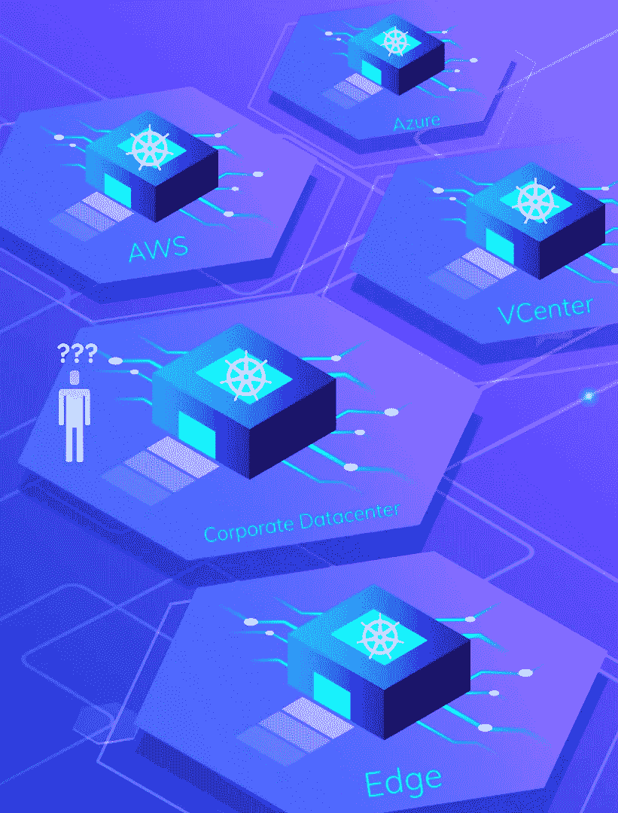
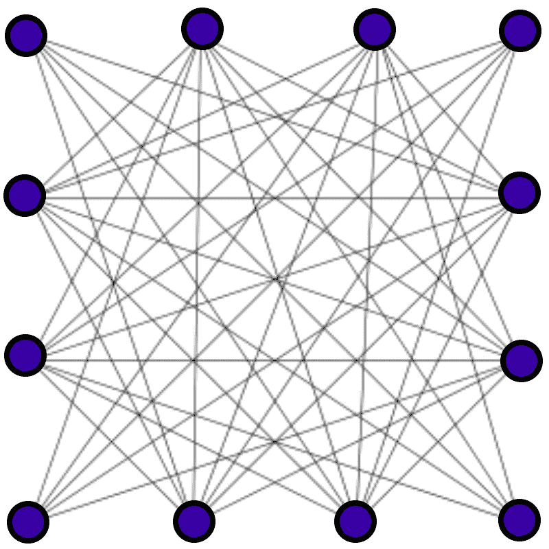
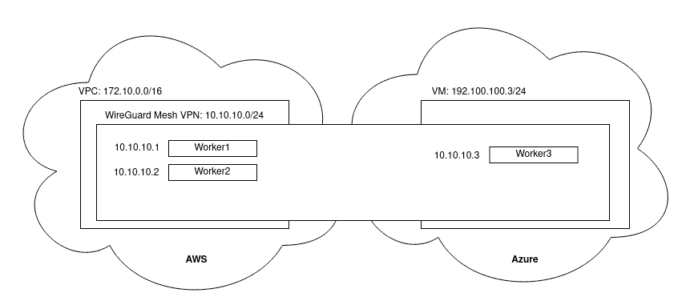
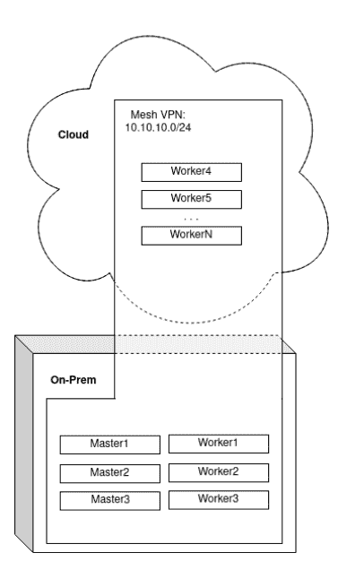
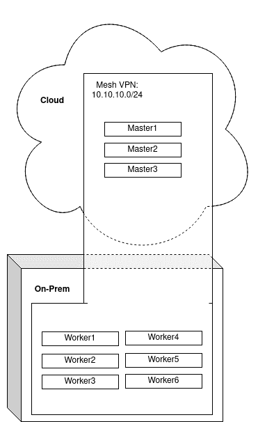
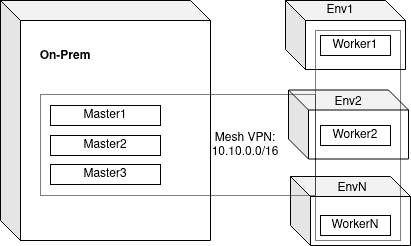
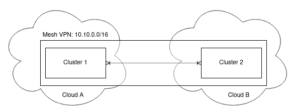
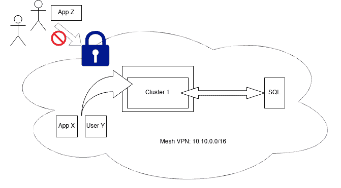

# Kubernetes over VPN 的 8 个用例:释放多云灵活性

> 原文：<https://itnext.io/8-use-cases-for-kubernetes-over-vpn-unlocking-multicloud-flexibility-3958dab2219f?source=collection_archive---------1----------------------->

这是我写的另一个关于如何在多个云中运行 Kubernetes 的故事的更高层次的总结。在解释*如何*之前，我应该先回答*为什么？*那么，我们就从问题开始吧。

# **多云有什么问题？**

Kubernetes 在短时间内成为事实上的云原生计算标准。发布于 2014 年，每个平台都有一个 Kubernetes 发行版，大多数企业都有一个 Kubernetes 战略。

这带来了一系列企业仍在学习解决的问题。这些问题中最主要的是**云间可操作性**，或者说，跨各种环境管理集群和基于集群的应用程序的能力。

典型的解决方案架构侧重于将多个集群部署到各种环境中，然后协调这些环境中基础架构和应用程序的管理。

在许多环境被严格划分的场景中，这样的解决方案是必要的。然而，这些体系结构引入了它们自己的问题。它们需要必须学习和操作的额外的复杂软件。他们需要一个运营团队同时管理多个集群。它们还需要大量的资源开销，因为每个环境至少需要一个完整的集群。

# 我们如何解决这个问题？

企业通常忽略了解决这些问题的另一种方法:网状 VPN。这不要与“服务网格”相混淆，后者是一个不相关的 Kubernetes 概念。网状 VPN 为集群创建了一个“虚拟”云环境，它可能由许多物理环境组成。

借助网状 VPN，企业可以跨**多个环境**管理**单个集群**。这种方法相对简单，有几个主要优点:

*   云突然进入新环境
*   节省资源开销
*   不需要新的技能或工具

除了节省时间和成本之外，网状 VPN 还为 Kubernetes 集群提供了额外的好处:**安全性**。

启用了网状 VPN 的 Kubernetes 集群对所有节点之间的流量进行了加密，并启用了新的模式来安全访问集群。

# 什么是网状 VPN？

网状 VPN 是一种虚拟专用网，其中每台计算机都通过专用 IP 地址与其他计算机直接相连。

在 Kubernetes 的上下文中，它是一个虚拟子网，您可以在其中部署工作节点，这不需要将这些节点部署在同一位置。

这使得平台团队能够将节点放置在任意环境中部署集群。例如，您可以拥有一个内部数据中心，如果需要更多资源，它可以“云爆发”到公共云环境中。从集群的角度来看，它只是一个普通的 Kubernetes 集群。它不知道它的节点被放置在不同的位置。通过节点选择器可以实现简单的管理。

企业可以使用任何一种可用的网状 VPN，包括 Nebula、Tailscale、Twingate、Netmaker 等。然而，使用基于**内核 WireGuard** 的网状 VPN 至关重要。

VPN 在历史上造成了显著的延迟，并可能导致带宽减少 30%或更多。此外，它们通常既复杂又笨重。突破性的 VPN 技术 WireGuard 消除了这些问题。它在速度上与没有 WireGuard 的相同网络接近，并且相对于 OpenVPN 和 IPSec 等旧技术而言，实现非常简单。

只有少数最新的网状 VPN(如 Netmaker)利用内核 WireGuard 来最大限度地提高速度。

# 有哪些局限性？

在进入用例之前，让我们先了解一些限制。这是今天没有广泛使用的模式的原因，尽管它们是由于一些可以解决的误解。

最大的误解是 Kubernetes 不能以高延迟运行:它*可以，*但是 *etcd* 不能。这意味着您的主节点要么必须位于同一位置，要么使用 etcd 以外的数据库。例如，带有 K3S 的 SQL 就没有这样的问题。MicroK8s 还运行 Dqlite，这是 SQL 的一个分布式版本，可以容忍延迟。

此外，运营商已经习惯了使用传统 VPN(如 IPSec 和 OpenVPN)运行的延迟成本。他们可能不知道 WireGuard 有多快。

有三个合理的因素可以阻止一些公司采用这种策略:带宽定价、公司防火墙和应用程序级延迟。

如果您正在使用出口数据费用非常高的云提供商，您可能想要运行这些费用的分析，因为您的节点将在云之间来回发送数据。不过，这一价格可能低于在每个环境中运行复制基础架构的价格。数字海洋的带宽价格可能比运行额外的基础设施低得多。

如果您所在的企业环境在环境之间有严格的防火墙限制，需要多层权限才能在环境之间运行数据，这也可能会给设置此拓扑带来挑战。尽管如此，如果您已经需要运行这样的集成，这可能是值得考虑的。

最后，在许多情况下，您的应用程序不能容忍高延迟。在这些情况下，您可以使用简单的相似性规则和节点选择器来解决问题:在每个位置，给节点一个标签，然后在您的集群上设置相似性规则，以便应用程序中的 pods 将默认调度到一个组或另一个组。

在某些情况下，运行重复的基础架构以避免处理潜在的云间问题更有意义，但这种情况比您想象的要少。尽管如此，考虑潜在的成本和涉及的危险总是很重要的。

# 有哪些用例？

假设一家公司没有受到上述限制的严重影响，网状 VPN 可以实现许多有价值的用例，既可以降低成本和复杂性，又可以实现强大的部署模式。我们在下面讨论这些不同的用例。

**情况 0:常规集群**

如果您计划部署一个集群，那么考虑一个基于内核的 WireGuard 网状 VPN 总是值得的。您将拥有一个正常运行的集群，性能差异可以忽略不计。但是，您可以使您的集群在未来以增强的拓扑运行，并获得加密节点间流量的额外好处。

**案例一:广节点**

在这个场景中，假设一个来自案例 0 的集群，但是现在您想要部署一个与 Azure 服务集成的应用程序。您只需在 Azure 中部署一个虚拟机，将该虚拟机添加到您的网格中，然后安装节点。您现在有了下面的拓扑。在两个云之间迁移应用程序就像更改节点选择器一样简单。

**案例二:云爆**

在这个场景中，一个企业有一个用于 Kubernetes 的本地数据中心。他们在其集群下部署了网状 VPN，这使他们能够从云环境(DigitalOcean、AWS 等)中任意添加节点。).这对于需要快速扩展应用程序但本地资源有限的情况非常有用。

**案例 3:云控制**

在这种情况下，企业拥有大量内部资源，但不想在本地管理控制平面。主节点故障可能是灾难性的，他们宁愿使用云资源。因此，该企业利用基于云的控制平面，但使用本地员工。这可以大幅降低云成本。

这种情况也适用于使用**基于云的存储节点**，这是另一个不允许出现故障的关键组件。

**情况 4:分布式/边缘节点**

在这个场景中，工作节点都被放置在不同的环境中。这个用例也可以应用于边缘环境，其中有一个中央控制平面将应用程序(可能通过 daemonset)推送到所有边缘节点。

**案例 5:分布式集群**

这个场景更复杂，需要更深入的研究，但是使用正确的架构，整个集群可以跨任意云运行，包括主节点。这里的主要限制是 etcd，它不能容忍高延迟。这种模式可能需要一个非 etcd 集群数据库。

**情况 6:连接的集群**

在这种情况下，集群通过网状 VPN 连接，可以直接相互通信，这意味着基于微服务的应用程序可以在两个集群之间拆分。这可以与多集群管理工具结合使用。

**案例 7:安全的私人访问(入站)**

在这种情况下，企业只希望受信任的用户或应用程序访问集群资源。这里，网状 VPN 的作用类似于企业 VPN，用户必须连接到 VPN 才能访问。这也可以在较低的级别上执行，以允许外部访问 Kubernetes 集群中的服务和 pod 网络，这对于开发和运营团队来说是一个有用的特性。

**案例 8:安全的私人访问(出站)**

在这个场景中，基于 Kubernetes 的应用程序需要安全地访问非 Kubernetes 应用程序，比如 SQL 数据库。数据库虚拟机被添加到 VPN，应用程序现在可以安全、即时地访问(见上文)。这种方法可用于将任意非 Kubernetes 应用程序添加到 Kubernetes 网络，并允许 pods 使用该服务。

# **网状 VPN 的选项**

目前，网状 VPN 有几种选择，包括 Tailscale、Netmaker、Kilo、Nebula 等。基于 VPN 的选择，上述一些用例变得不太可行。此外，只有 Netmaker 和 Kilo 提供内核 WireGuard 作为选项，这是最小化延迟的关键考虑因素。

公司也可以直接使用 WireGuard“滚动自己的”网格，但这在大规模管理时变得非常困难，并且需要大量的手动干预。

GRAVITL 设计了 [Netmaker](https://gravitl.com/netmaker) 来处理上述所有用例，同时在很大程度上实现了自动化，并基于内核 WireGuard。此外，由于它是一个通用的网状 VPN，它可以用于集成外部服务。也就是说，每个公司都应该自己决定哪种网络虚拟化工具最适合他们的环境。

# **结论**

我们已经讨论了多云 Kubernetes 集群的当前状态、Kubernetes 内部对网状 VPN 的需求以及它支持的不同用例。

建议平台所有者考虑在其集群下部署网状 VPN，即使他们没有当前状态的使用案例，因为它不会显著影响集群性能，并允许在需要时快速启用上述拓扑。

有关 mesh VPN 或[网络制造商](https://gravitl.com/netmaker)的更多信息，请联系位于 info@gravitl.com[的 GRAVITL，或访问我们位于 https://gravitl.com/book](mailto:info@gravitl.com)[的网站](https://gravitl.com/book)。