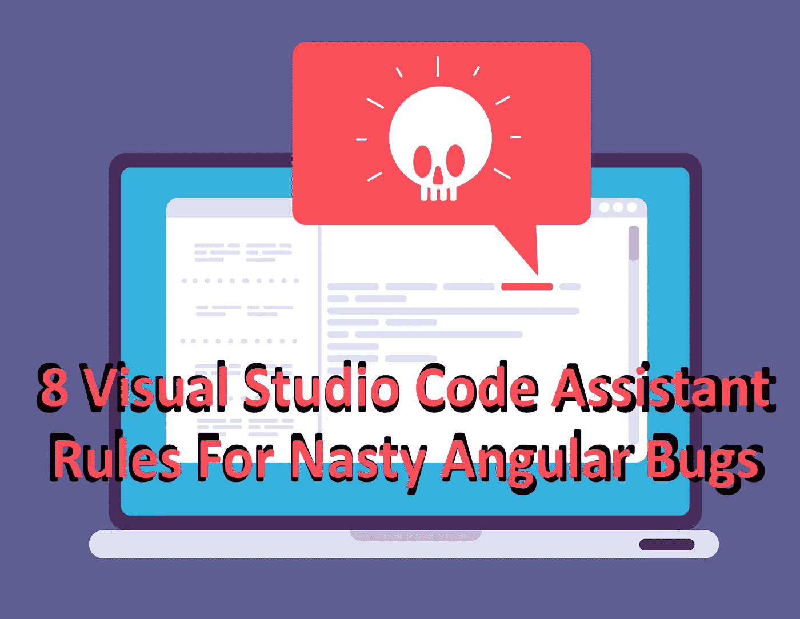
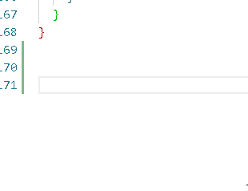
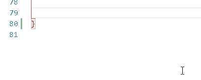
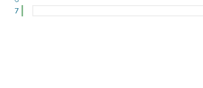
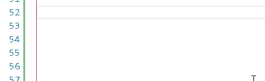
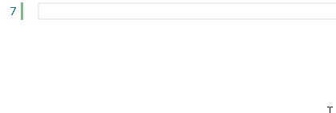
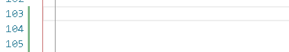
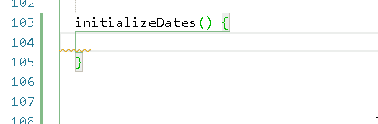
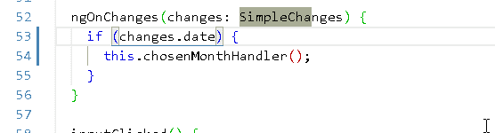

# 8 Visual Studio 代码助手针对讨厌的角度错误的规则

> 原文：<https://itnext.io/8-visual-studio-code-assistant-rules-for-nasty-angular-bugs-9f186277e0ab?source=collection_archive---------3----------------------->



弗里皮克/ [microone](https://www.freepik.com/microone) (有执照)

在用任何语言编程和使用任何框架时，都有你或你的队友会一次又一次犯同样错误的情况。ESLint 不会检测到的。因为这将是林挺规则的完美代码。但是应用程序会崩溃或者表现不佳。最终，当您构建一个项目时，会发现其中的一些错误。因为有些规则只在这一步触发，而不是更早。或者更糟—在服务器上，在生产服务器上。

但是当我们深入研究我们在编程时所犯的错误时，这些错误基本上分为两类:简单错误和核心错误。核心错误是由一个错误的逻辑实现造成的，这里不讨论这些。因为你需要使用领域知识来修复它们。但是简单的错误——您可以自动检测它们。

简单的错误是由使用不正确的名称或语法引起的。如果 ESLint 能检测到，那就太好了。但是如果不是这样——您的代码中可能有一个很难跟踪的问题。每次你犯这个错误都要花一些时间。

在这里，Visual Studio 代码的实时[助手](https://marketplace.visualstudio.com/items?itemName=tomasz-smykowski.assistant)扩展派上了用场。您可以定义正则表达式规则。当被触发时，您可以在代码旁边显示一条消息，其中包含一条错误信息以及如何修复它。

现在，我将向您展示我最喜欢的 Angular(和 TypeScript)助手规则:

# 1.泄露 CSS 样式

```
{
“regex”: “^::ng-deep.*$”,
“message”: “Prepend with :host, so that styles won’t leak”,
“modifiers”: “gm”
}
```



如您所见，该规则在您将要编辑的 SCSS 中搜索以 [::ng-deep](https://angular.io/guide/component-styles) 开头的行。如果你要写一行以::ng-deep 开头的代码，它会显示一条消息“前置:host，这样样式就不会泄漏”。我发现使用这个规则非常有用，因为单独使用::ng-deep 会导致 SCSS 应用于整个应用程序。你不希望这一切发生。

因为 Angular 默认为每个组件提供 CSS 隔离。如果您使用这个命令，CSS 将会泄漏，可能很难跟踪是谁泄漏了 CSS，因为应用程序的某些其他部分的样式可能很糟糕，但是为什么呢？谁知道呢？

这就是为什么我喜欢当助手显示这条消息的时候，我会一个人不小心写::ng-deep。隔离规则的适当形式应该是什么？：

`:host ::ng-deep`

这条规则有例外吗？当然可以！例如，如果您设计对话框或 mat-select 列表项。这些使用覆盖。所以你用 panelClass，than 需要用::ng-deep。nameOfUniqueClass 以防止样式泄漏。但这些都是罕见的例外。该消息仍会出现。因此，在这个案例中添加一个词是很好的。这是给你和你的队友的一个关于 CSS 隔离的信息。但是由于助手消息不会阻止构建过程，所以您可以自由地构建您的应用程序。

# 2.名称错误的生命周期挂钩

```
{
“regex”: “OnAfterViewInit”,
“message”: “it should be ngAfterViewInit”
}
```



我没有理由一次又一次地犯这个错误。OnInit 的生命周期方法是 ngOnInit，对于 AfterViewInit—ngafterviewit。直截了当。也许我犯这个错误是因为我用 PHP 编程了很多，下意识地试图在这里找到一个合适的名字；)不管怎样，我发现有这样的辅助规则很有帮助。

# 3.错误的模板条件

```
{
“regex”: “ ngIf”,
“message”: “It should be *ngIf”
}
```



结构指令正确的拼写是 [*ngIf](https://angular.io/api/common/NgIf) ，而不是 ngIf。但是如果写 ngIf=，会怎么样呢？实际上没什么。林特尔会很好。建筑商会同意的。Browser 会很高兴的。只有你的老板会不高兴。因为没有人会用这个条件。它在那里，在代码中，但是它不会被正确地执行。因此，与其花几个小时寻找这个错别字，不如有一个辅助规则。

# 4.错误的属性类型声明

```
{
“regex”: “@Input\\(\\) .*: false;”,
“message”: “Type of input should be boolean here, not false”
}
```



这是我最好的助手法则。因为这是我最初写助手的原因。当你声明一个“false”或“true”类型的组件属性时，每个人都会很高兴。但是属性的值将是未定义的，并且属性的类型是错误的。一直都是。这种打字错误会导致很多问题，并且很难跟踪。而且，很容易犯这个错误，因为在 JSON 中你用“:”声明值，而在 TypeScript 代码中用=。这似乎是一件容易区分的事情，但有时并非如此。所以我定义了这个很好的规则。

# 5.空*ngIf

```
{
“regex”: “\\*ngIf=\”\””,
“message”: “ngIf can not be empty”
}
```



我曾经偶然发现过这个。但我马上想到，把它加入助理规则会很好。离开*ngIf 会产生意想不到的结果，并且在默认情况下是一个错误。如果使用*ngIf，应该总会有一些条件。

# 6.方括号方法

```
{
“regex”: “\\(\\) \\[“,
“message”: “Function body should be in curly brackets not square ones”
}
```



在这里，您可以清楚地看到如何为 Assistant 编写正则表达式规则。 [Regex 特殊字符](https://stackoverflow.com/a/400316/38940)如“{”需要用“\”转义。我们还需要用另一个“\”对“\”进行转义，因为“\”是 JSON 的特殊字符。这就是为什么我们有两个“\”。

不管怎样？这条规则告诉你什么时候创建一个方括弧内的方法体，而不是花括弧。与前面的相反，当你在 Visual Studio 代码中编写“method() []”时，你会在 problems 选项卡中得到很多错误信息，并且代码的整个部分会被加下划线。

那么为什么我增加了这条规则呢？因为显示的错误并不具体。他们说“方法”的每一行几乎都是错误的。但是他们不会告诉你的是，你用了方括号，需要修改。

因此，我发现这个辅助规则对于了解正在发生的事情非常有用。

# 7.错误创建的 Dayjs 实例

```
{
“regex”: “new Dayjs()”,
“message”: “New Dayjs() is created with dayjs() without new operator”
}
```



这个助手规则非常有趣，因为它展示了如何让使用库变得更容易。Dayjs 是一个极简的日期和时间库。我发现它比 Momentjs 好，因为它在构建应用程序包中占用的空间少得多。

对我来说，作为一个 OOP 开发人员，Dayjs 的一个新实例不是用“new”操作符完成的，而是用调用 dayjs()方法完成的，这很烦人。由于“新”语法对我来说是默认语法，所以我决定提醒自己 dayjs()是不同的，这样每次使用这个库时都可以节省一些宝贵的时间来理解它

# 8.错误变化检测

```
{
“regex”: “if \\(\\!changes\\.”,
“message”: “In ngOnChanges? It does not check if value is not provided for property”
}
```



生命周期钩子 [ngOnChanges](https://angular.io/api/core/OnChanges) 是检查任何 Input()属性是否已经改变的好方法。检查什么属性发生了变化是相当容易的，因为您可以编写:

```
@Input() myProperty: boolean;
@Input() completelyDifferentProperty: boolean;
ngOnChanges(changes: SimpleChanges): void {
 …
 if (changes.myProperty) {
 this.specialMethod()
 }
}
```

代码很简单。但是当你回过头来决定，当 myProperty 为 false 时，你想触发 specialMethod()时，你可以写:“if(！this . changes . my property)……”。这是错误的。因为它将检查检测到的更改是否不包括 myProperty 属性。例如，当 completelyDifferentProperty 值发生更改时，将调用 specialMethod()。你可以看到适当的逻辑是如何从我们手中溜走的。

再说一次——每个人都会对这段代码感到满意，但它会导致非常严重且难以跟踪的问题。这就是为什么当您写“if(！idspnonenote)时，规则会通知您。变化…”

此时，您可能会考虑，为什么这些规则不够精确。因为可以用“如果(！变化)”为完全不同的场景。例如，您将在别处定义一个名为 changes 的变量并对其进行操作。肯定会触发这个规则。但是我喜欢做的，是为初学者写一些简单的规则，然后调整它们。因此，当我或团队成员偶然发现这种情况时，我们中的任何人都可以改进规则。

目前，它包含的信息只适用于 ngOnChanges，因此团队成员知道在其他地方可以忽略它。一个可能的改进是处理 if()中的所有条件，而不仅仅是第一个条件。所以这是你的作业:)

# 结论

Visual Studio 代码助手非常有助于找出代码中的棘手错误。这需要一点过热，因为你需要意识到你犯了什么错误，并为它们编写正则表达式规则。但是一旦你这样做了，编码流程就会好很多。你不需要从一大堆错误中剔除一个错别字，你可以让你和你的团队更轻松，因为小错误不会导致你花费数分钟甚至数小时去发现它们。因此，编码变得更流畅，体验更好。对于 linters 和在构建阶段显示错误来说，这是一个很好的补充解决方案。

***

对于 Angular、TypeScript、React 或者其他任何框架或语言，有什么有趣的助手规则可以分享吗？写下来，让我知道！我很乐意将它添加到 [git](https://github.com/tomaszs/Assistant) 库和它在 Visual Studio 代码扩展[市场](https://github.com/tomaszs/Assistant)的页面上。

如果你为这篇文章鼓掌，我会很高兴。谢谢！