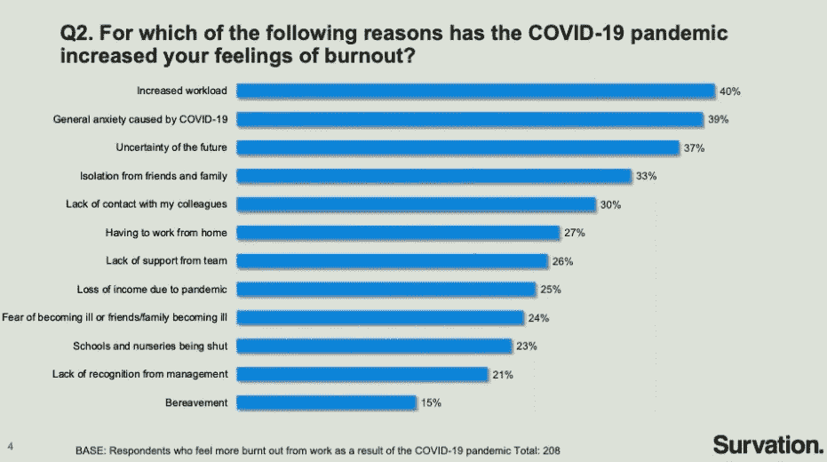

# 83%的开发人员感到精疲力竭，81%的人说在 Covid 期间情况变得更糟

> 原文：<https://itnext.io/83-of-developers-suffer-from-burnout-and-81-said-its-gotten-worse-during-covid-aa83c89bc544?source=collection_archive---------0----------------------->

## 理解开发人员的倦怠以及如何避免它

照片由 [Pexels](https://www.pexels.com/photo/food-wood-person-people-6837561/?utm_content=attributionCopyText&utm_medium=referral&utm_source=pexels) 的 Nataliya Vaitkevich 拍摄

> 倦怠之地不是我想回去的地方。阿里安娜·赫芬顿

一项由 Haystack 进行的关于理解新冠肺炎对软件工程师的影响的 T4 研究发现 81%的开发人员说 COVID 增加了倦怠。

83%的软件工程师报告说感觉精疲力尽，这是五分之四的开发人员，主要原因是

*   40%的人说疲劳是因为高工作量
*   31%的低效流程
*   29%的目标和指标不明确

虽然许多开发人员正在努力应对增加的工作量，但 Covid 意味着他们不得不在没有同事、家人和朋友支持的情况下应对。

草堆[研究](https://haystack-books.s3.amazonaws.com/Study%2Bto%2Bunderstand%2Bthe%2Bimpact%2Bof%2BCOVID-19%2Bon%2BSoftware%2BEngineers%2B-%2BFull%2BReport.pdf)

# **什么是倦怠？**

这篇[文章](https://www.helpguide.org/articles/stress/burnout-prevention-and-recovery.htm)定义了倦怠

> “倦怠是由过度和长期的压力导致的情绪、身体和精神疲惫的状态。当你感到不知所措，情绪枯竭，无法满足持续的需求时，就会出现这种情况。随着压力的持续，你开始失去最初让你承担某个角色的兴趣和动力。”

倦怠不是一种医学状况，而是压力、情绪和身体疲劳的混合物。当你在精神上、身体上和情感上都筋疲力尽时，就会产生倦怠。工作给那些感觉自己无法集中精力或完成所有工作的人带来持续的压力。

倦怠的发生不是因为一件事，而是持续的压力使人疲惫不堪。[压力和一杯水](/STRESS AND THE GLASS OF WATER)。

一杯水本身并不重，我们可以轻松地拿着它，但如果你拿着一杯水一个小时，你的手臂会疼痛。如果你拿着这杯水一天，你会很痛苦。当你放下杯子，疼痛就消失了。

倦怠是持续的压力，就像拿着一杯水，最终会变得太多。

# **为什么开发者会心力交瘁？**

是什么导致开发人员精疲力竭，下面是一些常见的原因。

# **不切实际的项目计划**

开发人员精疲力尽，试图满足不可能的项目计划，工作更长的时间来实现计划。软件项目持续好几个月，你不可能几个月都长时间工作，这就像试图冲刺马拉松一样。

一个开发人员不能拯救你的计划，这是一个项目领导级别的失败——[当软件开发出错时，领导躲在被窝里希望](/when-software-development-goes-wrong-leaders-hide-under-the-covers-and-hope-df5fd887be42)。

# **Covid 和在家工作**

Covid 让每个人都可以在家工作，并且有很多好处，比如不用通勤，可以更多地看到家人，可以穿着裤子工作(可选)。

在家工作会模糊工作和家庭的界限，没有自然的休息时间，延长了你的工作时间。如果开发人员没有意识到关闭它，他们可以一天 24 小时可用。

在家工作会让人难以逃脱，工作感觉就像是社交媒体无休止的滚动。

# 工作的回报是更多的工作

开发人员可能会觉得有义务接受更多交给他们的工作。完成工作的回报是得到更多的工作。

这最终导致你最好的开发人员超载，因为他们可以做更多的工作。当截止日期临近时，短时间内更加努力地工作是可以接受的，但不能持续很长时间，因为这会导致精疲力竭。

个人负担过重是团队不工作的标志，潜在的问题需要解决，而不是个人负担过重。

# **倦怠的影响**

精疲力尽的影响是工作的精疲力竭，对工作的热情逐渐消失。我在一位同事身上发现了疲惫的迹象，因为他们说周末他们唯一的精力就是坐着看电视。

他们没有精力/热情出去，见朋友，读书，做他们喜欢的活动。他们在身体上、精神上和情感上都达到了极限。原因是他们超负荷工作，无法完成白天的工作。

# **身份倦怠**

很难确定我们自己是否已经筋疲力尽，工作并不难，但让我们筋疲力尽的是工作量和永无止境的工作性质。常见的反应是解决它，但这治标不治本。

工作就像一个俄罗斯方块游戏，速度越来越快，直到你最终结束游戏。保持对倦怠的关注是很重要的，因为它会对健康和心理健康产生严重影响。

这可能会导致人们离开某个职位或公司，去寻找压力较小的工作。这可能是一个巨大的损失，因为通常筋疲力尽的人往往是更有才华的开发人员。

# **如何避免倦怠**

倦怠是影响五分之四开发人员的常见问题，下面是一些帮助你避免倦怠的方法。

# **明确你的角色**

了解你的职责和团队中其他人的职责。

不要接受其他角色的任务，因为你最终会做你的角色和他们的角色。你做的工作越多，质量越低。它隐藏了团队成员没有正确履行职责的事实。

通过做他们的角色，没有人承认他们需要改进。你扮演 1.5 个角色，这导致了更多的工作时间和倦怠。

从短期来看，你是在帮助团队，但从长期来看，你不是在帮助自己、他人或团队。从长远来看，你会筋疲力尽。

# **不要让猴子跳到你背上**

精彩文章— [管理时间:谁有猴子？](https://hbr.org/1999/11/management-time-whos-got-the-monkey)指问题如猴。当有人来看你时，他们会试图让他们的问题(猴子)从他们的背上跳到你的背上。你需要意识到他们在做什么，并阻止其发生。

*   不要把问题拿出来解决→建议这个人如何解决问题。
*   不要把信息传递给别人，成为中间人→建议他们应该和谁说话
*   不要给他们答案→问他们开放性的问题，让他们自己想出答案

坚持你自己的工作，让别人解决他们自己的问题。如果你解决了他们的问题，你就是在训练他们下次遇到问题时来找你。相反，教他们自己解决问题(教他们如何钓鱼)，这样他们以后就不需要你的帮助了。

# 给一个 F — —当没轮到你的时候

在《火线》(The Wire)中有一个场景，麦纽提侦探将他的鼻子伸进了什么东西，结果发现了另一具尸体。这提示了他的合作伙伴的报价。

> “你来了，给个 f——当还没轮到你给 f 的时候——””—威廉·莫兰

我们都应该有足够的工作要做，如果我们都专注于自己的工作，那么每个人都做一点，没有人做很多，这个计划应该会完美地运行。专注于你的优先工作，而不是别人的优先工作。

当你做别人的工作时，你是在偷他们做的机会，如果需要的话，你会失败。人们不知道他们必须改进，直到他们失败，这显然是有问题的。你做的别人的工作越多，你做自己工作的时间就越少。

# **停留在现在**

过去是昨天，未来是明天。你不能改变过去，明天准备好了就会到来。如果你把时间花在过去或未来，那是以现在为代价的。

活在当下，融入潮流，专注于你的工作。让经理来管理，让开发人员来写代码。

# **考虑长远**

软件开发项目从 2 个月到 3 年不等。项目需要你付出所有的时间和努力，项目永远不会厌倦，没有经理会抱怨你工作太多。管理你的工作量，设定你的界限，在一天工作结束时关掉你的电脑。

从长远来看，加班对你没有好处，只有在特殊情况下才应该加班。

花在工作上的额外时间本可以用来学习新技能、获取新知识或放松。花在工作上的额外时间有益于公司，花在学习或放松上的额外时间有益于你和你的职业。

# **如果可以就授权**

如果有其他人可以做这项工作，而你有比你能做的更多的工作，那么就把它委派出去。

如果你能授权，你就应该授权。

将工作公平地分配给所有团队成员，每个人贡献一点，没有人做很多。

# **说不**

不要害怕拒绝工作或占用你时间的请求。如果做某事不是你的职责，那么告诉他们，并把他们引向可以帮助他们的人。

珍惜你的时间，因为它是有限的资源。对项目来说，最好的利用是做你被分配的工作。

专注于你优先考虑的工作，而不是别人优先考虑的。

# **累的开发者写累的代码**

[软件开发是一个创造性的过程](https://blog.devgenius.io/software-development-is-a-creative-process-an-original-masterpiece-not-a-paint-by-numbers-1700e05e6d7b)，它需要精力、想法、创新和协作。疲惫的开发人员编写疲惫的代码，你工作的时间越长，工作质量越低。

软件开发不像在工厂里创建小部件，软件开发是创建独特的软件来满足需求。

倦怠就像在跑步机上跑一场你无法战胜的比赛。你需要休息和放松来提高你的能量水平。短时间的高质量工作比长时间的普通工作更有效。

软件开发是关于创建[质量](/software-development-is-misunderstood-quality-is-fastest-way-to-get-code-into-production-f1f5a0792c69)的软件，这是将代码投入生产的最快方法。

保持高强度的工作，让你的生活变得有趣，和你爱的人一起做一些能带给你快乐的活动。

活着是为了工作，而不是工作是为了活着，快乐的工人会有更好的工作和更多的乐趣。

# **公司文化**

公司不应该鼓励经常加班，也不应该提拔加班的人。这不仅仅是发出正确的信息，而且要用行动来支持。

不应该期望开发人员牺牲与家人、朋友和爱好在一起的时间来专注于工作。这是一种短期的心态，从长远来看，它会导致不太快乐的生活和潜在的倦怠。

公司文化是由公司的领导制定的，为了留住你最好的人才，你需要照顾他们。

另请阅读[软件开发人员需要了解倦怠，以便他们能够预防它](https://thehosk.medium.com/stress-leads-to-burnout-and-burnout-leads-to-breakdown-8668671fda4a)