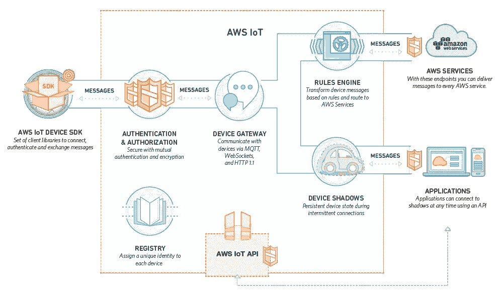
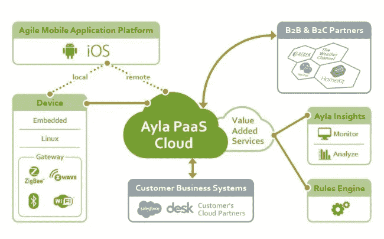
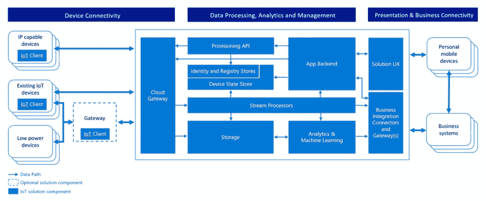
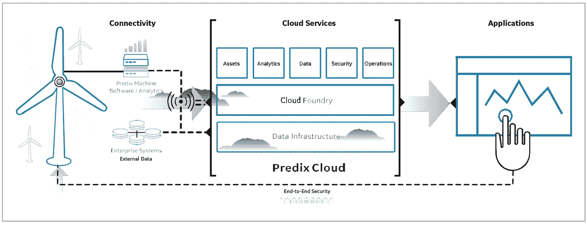

# 彻底改变物联网世界的 9 个平台—第 1 部分

> 原文：<https://itnext.io/9-platforms-that-have-revolutionised-the-world-of-things-connectivity-part-1-2664624d6f65?source=collection_archive---------3----------------------->

我们生活在一个非凡的时代；由连接性定义的时间。我们已经淹没在相互关联的世界中。在这个世界里，每一个“东西”都是一个巨大宇宙网络的数据收集节点。这种不断增长的连接需要强大的基础设施来满足用户的需求。这个基础设施的核心是平台。平台负责所有连接设备的复杂管理和连接。简而言之，平台支持:

*   设备间的安全连接
*   部署管理和监控设备的应用程序
*   设备管理
*   从连接的设备收集和分析数据

平台处理网络、接入点、硬件和应用之间的一切。它们通常分为三种主要类型:

1.  应用支持/开发平台(AEP/ADP)

2.数据/网络/用户管理平台

3.设备管理平台(DMP)

在这些平台中，AEPs 是包含第二和第三平台的最完整的平台。AEP 提供基础服务，包括应用制作和启用、设备管理和通信、安全、数据库、分析和外部接口。

物联网平台格局复杂且不断变化。目前，市场上有几种平台，而且数量还在快速增长。然而，每个平台都与其他平台不同，这使得选择平台变得更加复杂。在两篇文章中，我将介绍构建可扩展物联网应用和服务的 9 个平台。这些平台简化了物联网设备的开发、连接、管理和数据分析流程。

# 1.AWS 物联网

[AWS IoT](https://aws.amazon.com/iot-platform/sdk/) 最初发布于 2015 年，是亚马逊物联网解决方案中的托管云平台。它使连接互联网的设备能够安全地与云应用程序和其他设备交互。AWS 物联网的设计方式是直接与其他 AWS 服务集成，如 [AWS Lambda](https://aws.amazon.com/lambda/) 、[亚马逊 Kinesis](https://aws.amazon.com/kinesis/) 、[亚马逊 DynamoDB](https://aws.amazon.com/dynamodb/) 、[亚马逊 S3](https://aws.amazon.com/s3/) 和[亚马逊 SNS](https://aws.amazon.com/sns/) 。

凭借内置的 [Kibana](https://aws.amazon.com/elasticsearch-service/kibana/) 集成，这一高度可扩展的平台可以轻松构建物联网应用，以收集、处理、分析和处理生成的数据。此外，[即时注册](https://aws.amazon.com/blogs/aws/new-just-in-time-certificate-registration-for-aws-iot/)，自动注册新证书，作为设备和 AWS 物联网之间初始通信的一部分，加快了批量部署。AWS 物联网由设备网关、消息代理、规则引擎、安全和身份服务、事物注册中心、[设备阴影](http://docs.aws.amazon.com/iot/latest/developerguide/iot-thing-shadows.html)和设备阴影服务组成。

AWS 物联网提供了[四个不同的接口来创建和交互事物，包括命令行接口](http://docs.aws.amazon.com/cli/latest/userguide/cli-chap-welcome.html)(用于在 Linux、Windows 和 OS X 上运行命令)、API(用于使用 HTTP 或 HTTPS 请求构建物联网应用)、[AWS SDK](http://docs.aws.amazon.com/iot/latest/developerguide/iot-sdks.html)(用于使用特定语言 API 构建应用)和[设备 SDK](https://aws.amazon.com/iot-platform/sdk/) (用于构建在设备上运行的应用)。

AWS 物联网平台—改编自 [AWS](https://aws.amazon.com/iot-platform/how-it-works/)

AWS 物联网的主要功能包括:

*   安全设备网关
*   用于识别设备的注册表
*   用于存储和检索当前状态信息的事物阴影
*   [规则引擎](http://docs.aws.amazon.com/iot/latest/developerguide/iot-rules.html)用于设备和 AWS 服务之间的交互
*   [认证](http://docs.aws.amazon.com/iot/latest/developerguide/iot-security-identity.html)和授权已证实的交换数据
*   亚马逊拥有云提供商中最全面的服务，这意味着使用 AWS 物联网固有地为您提供其他[好处](https://aws.amazon.com/about-aws/)

# 2.Ayla 敏捷物联网平台

[Ayla 物联网平台](https://www.aylanetworks.com/products/iot-platform)是一个平台即服务(PaaS ),它简化了设备与互联网的连接，并为部署、管理和分析连接的设备提供了所需的工具和服务。其模块化和灵活的端到端架构支持将快速变化应用于几乎任何设备、云和应用环境。Ayla 平台的三个主要组成部分是:

- Ayla 嵌入式代理—将设备连接到 Ayla 云

- Ayla 云服务—用于管理和控制互联部署、智能洞察和自动化运营

- Ayla 应用程序库-包含丰富的 API，用于开发能够安全控制和管理物联网设备的应用程序(iOS、Android)

Ayla 平台架构图—改编自 Ayla Networks

Ayla Networks 最初的目标是家用电器、消防和安全以及 HVAC 系统的物联网设备制造商。Ayla 的生产就绪软件缩短了实施和认证周期，其端到端平台缩短了上市时间。Ayla 平台的主要特点包括:

*   TLS 1.2 加密、根密钥保护和多层身份验证，以确保安全的连接
*   基于 OAuth 的用户认证
*   弹性云计算—因平台架构而动态扩展
*   用于设备和 Ayla 云之间交互的规则引擎
*   无线(OTA)固件升级
*   支持第三方服务集成的开放平台架构
*   用于监控设备性能的 OEM 仪表板
*   内置的报告和可视化工具
*   简单的网络连接，无需用户界面

# 3.Azure 物联网套件

微软 [Azure 物联网套件](https://www.microsoft.com/en-us/internet-of-things/azure-iot-suite)是一套针对[远程监控](https://docs.microsoft.com/en-us/azure/iot-suite/iot-suite-getstarted-preconfigured-solutions)、[预测性维护](https://docs.microsoft.com/en-us/azure/iot-suite/iot-suite-predictive-overview)、[联网工厂](https://docs.microsoft.com/en-us/azure/iot-suite/iot-suite-connected-factory-overview)的预配置解决方案。这些预配置的解决方案采用 Azure 物联网服务的组合来帮助有效地实施物联网解决方案。这些服务包括:

- [Azure IoT Hub](https://azure.microsoft.com/documentation/services/iot-hub/) —一种完全托管的服务，充当云及其他物联网套件服务的网关。它提供了[设备管理](https://docs.microsoft.com/en-us/azure/iot-hub/iot-hub-device-management-overview)，以及物联网设备和解决方案后端之间的安全双向通信。

- [Azure Stream Analytics](https://azure.microsoft.com/documentation/services/stream-analytics/) —用于动态数据分析的实时事件处理引擎。物联网套件使用该服务来处理传入的遥测数据、执行聚合和检测事件。

- [Azure Storage](https://azure.microsoft.com/documentation/services/storage/) 和 [Azure Cosmos DB](https://azure.microsoft.com/documentation/services/documentdb/) —云存储能力； [Blob 存储](https://docs.microsoft.com/en-us/azure/storage/storage-dotnet-how-to-use-blobs)存储遥测数据以备日后分析，Cosmos DB 存储设备元数据并启用设备管理功能

- [Azure Web Apps](https://azure.microsoft.com/documentation/services/app-service/web/) 和 [Microsoft Power BI](https://powerbi.microsoft.com/) —用于构建使用物联网套件数据的交互式仪表盘的数据可视化功能

- [Azure 机器学习](https://docs.microsoft.com/en-us/azure/machine-learning/) —一种云预测分析服务，用于创建和部署预测模型作为分析解决方案

微软 Azure 物联网架构——改编自[微软](http://download.microsoft.com/download/A/4/D/A4DAD253-BC21-41D3-B9D9-87D2AE6F0719/Microsoft_Azure_IoT_Reference_Architecture.pdf)

Azure 物联网套件集成了几个专门的工具和服务，以增加物联网平台的功能。微软还提供了有助于构建和管理物联网设备和应用的 Azure 物联网软件开发套件。

在最新的发展中，微软推出了 [Azure IoT Edge](https://azure.microsoft.com/en-us/campaigns/iot-edge/) ，以帮助公司在其边缘计算解决方案中管理物联网设备。它“使物联网设备能够运行云服务，近乎实时地处理数据，并与传感器和其他连接到它们的设备进行通信，即使是间歇性的云连接。” [GitHub Azure 物联网边缘](https://github.com/Azure/iot-edge)

Azure 物联网套件的主要功能包括:

*   设备阴影
*   规则引擎
*   身份注册
*   信息监控

# 4.Jasper 控制中心—用于物联网

2016 年，思科收购了物联网云平台提供商 Jasper Technologies，以推进其物联网服务解决方案。借助 Jasper，思科融合了连接性、安全性、自动化和实时洞察。Jasper 的核心是[控制中心](https://www.jasper.com/products)，使客户能够自动化连接、控制和管理物联网服务的各个方面。

[Jasper 物联网控制中心](https://www.jasper.com/control-center-for-iot)是一个自动化连接管理平台，用于启动、管理和货币化物联网设备。控制中心还预集成了一些物联网系统，如 Azure 物联网套件、IBM 物联网沃森和 ThingWorks。

为了扩大 Jasper 的覆盖范围，思科最近[增加了对 NB-IoT(窄带-IoT)的支持](https://newsroom.cisco.com/press-release-content?articleId=1824619)，这是低功耗广域网(LPWAN)的 3GPP 标准。这使得控制中心成为首批支持该技术的物联网平台之一。

Jasper 控制中心的主要功能包括:

*   多层安全性—防止安全漏洞
*   成本管理控制—分析和优化运营支出
*   生命周期管理—在产品生命周期的不同阶段自动化服务管理
*   实时远程诊断和异常行为检测
*   可靠的双向数据传输
*   通过网络了解所有已部署设备的使用情况
*   通过强大的 API 完全控制运营
*   近乎实时的成本管理控制

除了物联网设备，Jasper 还拥有面向移动企业的[控制中心](https://www.jasper.com/control-center-for-mobile-enterprise)，用于管理和监控设备连接和数据使用。该平台允许对 SIM 卡进行实时位置监控，并使企业能够更好地预测其电信账单。

# **5。通用电气预测**

[Predix](https://www.predix.com/overview) 最初是为了支持通用电气自己的物联网应用而开发的；然而，在发布后不久，通用电气就将它提供给了其他人。Predix 建立在开源框架 [Cloud Foundry](https://www.cloudfoundry.org/) 之上，是一个提供远程监控、高级预测和边缘分析的平台即服务。

Predix 面向主流行业，如能源、运输、航空和医疗保健。它促进了工业物联网应用的开发，这些应用可以将实时运营数据处理为可操作的见解。它使开发人员能够快速构建、安全部署和有效运行[工业应用](https://www.ge.com/digital/predix/industrial-app-showcase)。其核心组件是:

- Predix Cloud —针对工业工作负载优化的云基础设施

- Predix Machine —一个软件堆栈，负责工业资产和 Predix 云之间的双向连接，并运行本地应用

- Predix 连接—当直接互联网连接不可用时，使机器能够通过虚拟网络与 Predix 云通信

- Predix EdgeManager —用于管理 Predix 机器上运行的边缘设备

- Predix 服务—用于构建、测试和运行工业应用的工业服务

- Predix for Developers —开发人员与服务通信的框架

Predix 架构—改编自 [Predix 技术白皮书](https://www.predix.io/)

Predix 正在为工业物联网创建一个服务和应用生态系统。科技公司有可能创造出适合 Predix 的服务。来自第三方和 GE 的服务可在 [Predix 目录服务](https://www.predix.io/catalog)获得。服务，例如:

- [异常检测](https://www.predix.io/services/service.html?id=1924)，来自阵列

- [键值存储](https://www.predix.io/services/service.html?id=1215)，来自 Redis

- [消息队列](https://www.predix.io/services/service.html?id=1182)，来自 RabbitMQ

- [来自爱立信的区块链数据完整性](https://www.predix.io/services/service.html?id=1881)

Predix 还使客户能够构建和运行 [digital twin](https://www.ge.com/digital/industrial-internet/digital-twin) ，这是一种高保真的物理资产虚拟模型，在部署到现场之前，可以对其进行更改和调整，以了解其性能。“数字双胞胎提供了机器和操作的不断发展的画面，捕捉从组件到功能到整个过程和工厂的一切。它们捕捉资产的整个生命周期，以及整个资产类别，并深入了解过去和现在的表现以及未来的情报。”

Predix 的主要功能包括:

*   数字孪生工具
*   使用 Predix 系统的边缘到云计算—支持收集数据的分析
*   集成的安全性和治理
*   丰富的第三方应用和服务生态系统
*   用户帐户和身份验证，

自 Predix 推出以来，通用电气一直试图通过不同的收购来打造自己的平台。去年 11 月，该公司收购了两家人工智能初创公司[比特炖系统](https://www.geventures.com/portfolio/companies/bit-stew-systems)和 [Wise.io](http://www.wise.io/blog/ge-acquires-wise.io-to-accelerate-machine-learning-efforts) 。Bit Stew 的平台可为互联设备处理复杂的数据集成、数据分析和预测自动化。此外，Wise.io 的重点是机器学习技术。

在下一篇文章中，我将描述另外四个物联网软件平台。