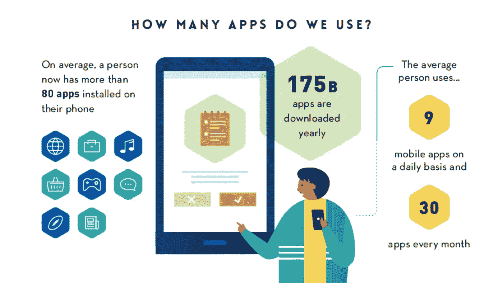

# 如何做一个成功的手机 App？

> 原文：<https://itnext.io/9-things-to-make-mobile-app-successful-85e90d1c77d3?source=collection_archive---------2----------------------->

## 如何创建一个成功的移动应用？

## 制作成功移动应用的终极指南

如今，移动应用无处不在，你能想到的任何东西都有一个应用。每天都有更多的人被创造出来！！在这种情况下，我们如何确保我们的应用程序成功？请和我一起探讨让你的下一个应用成功的 9 件事…

> 到 2020 年底，全球使用的智能手机数量预计将达到 35 亿部。用户将 90%的时间花在应用上。

Google Play 商店中有超过 270 万个应用程序，App Store 中有 220 万个。大多数用户每天使用 9 个应用程序，每月使用 30 个应用程序。

来源。https://techjury.net/blog/app-usage-statistics/

正如你所看到的，市场上有如此多的应用都在竞相吸引用户的注意力，竞争非常激烈。这就是为什么我们需要思考我们的想法，并理解它对我们的用户的用途。因此，我们列出了一些有助于移动应用取得成功的因素。

# 1.试图解决一个基本问题

> 永远把你的应用程序想象成一件简单事情的问题解决者，它做得非常出色。

以优步为例，它实际上为客户做一件事，那就是“请求搭车”。很多时候，我们希望在我们的应用程序中加入许多功能，以为这将有助于我们的用户。但它实际上起了相反的作用，我们让用户处于一种困惑的状态。我们总是需要记住做一件简单的事情，并且异常地去做。之后，当我们更多地了解我们的用户、他们的期望和他们的行为时，我们可以添加更多的功能。

# 2.计划和目标受众

一旦我们研究并弄清楚我们如何以及在哪里脱颖而出，我们需要拿出一个计划。我们需要回答几个问题:

*   我们的目标受众是谁？
*   你将如何接触到目标受众？
*   我们应该免费提供我们的应用程序吗？然后对高级功能收费
*   收取固定价格？奉献一切。

这些决定将有助于我们了解您使用该应用程序的前景。

# 3.简单/直观的导航

> 移动应用中简单/有效的导航与应用的核心功能一样重要。

你的应用程序的工作流程应该非常直观，如果你让一个第一次使用的用户执行一个动作，他们应该确切地知道他们要去哪里，并且应该能够在几次点击之内完成。

重要的是，应用程序的核心功能可以通过最少的点击次数来实现。

照片由[米克·豪普特](https://unsplash.com/@rocinante_11?utm_source=medium&utm_medium=referral)在 [Unsplash](https://unsplash.com?utm_source=medium&utm_medium=referral) 拍摄

# 4 种配色方案

> “第一印象决定一切”→这也适用于我们的移动应用

当用户第一次打开你的应用程序时，应用程序中的颜色组合会产生某种情绪反应。我们对颜色组合的选择确实会影响用户的参与度。因此，我们需要准确地决定我们希望用户在看我们的应用程序时的感受，并以此为基础驱动我们的颜色决策。

斯科特·韦伯在 [Unsplash](https://unsplash.com?utm_source=medium&utm_medium=referral) 上拍摄的照片

# 5.设备方向支持

我们在智能设备上使用如此多的应用程序。有些支持纵向和横向，有些只支持一种。你有没有想过，为什么某些 app 支持横向和纵向模式，而有些不支持？

> 你的应用程序支持的方向可以完全改变用户与它的交互方式。如果执行得好，这可以增强你的用户体验，但如果执行得不好，就会破坏用户体验。

请始终仔细考虑您计划支持的功能，以及哪个方向对这些功能有意义。如果某个方向增强了用户对你的应用的体验，那么就支持多个方向。

# 6.选择正确的技术

说到移动应用，有各种各样的技术选择。我们需要为我们的用例选择正确的技术。基本上有三种选择

## 当地的

原生应用是为特定平台、iOS 或 Android 开发的。这些平台都有用于开发应用程序的编程语言。由于开发是本地完成的，我们可以在更大程度上利用设备硬件和功能。所以这种情况下性能最好。

## 跨平台原生应用

采用这种方法的应用程序使用 SDK(软件开发工具包)，但它们有点像是本地运行的。与本机相比，性能并不好，但如果您预算有限，这可能是一个很好的选择。这种技术的例子是颤振和反应原生。

## 混合物

当你真的想覆盖所有设备和所有平台，并需要成本效益、快速部署和可移植性时，混合应用程序是最佳选择。这是性能最低的选项。这种方法最好的部分是，您只需编写一次代码，就可以在所有平台上使用。在这种方法中，使用了所有的网络技术。Html 用于布局，CSS 用于样式，javascript 用于交互。

# 7.操作系统的最低支持版本

作为一名应用开发者，你总是希望你的应用有尽可能多的用户。当您决定操作系统的最低支持版本时，请始终记住，不是每个用户都升级到最新的操作系统。他们可能有装有旧软件的旧手机。因此，在确定最低操作系统版本支持之前，请进行研究。

# 8.确保你的应用是安全的

在今天的时代，我们从移动应用程序做任何事情，也可以做任何事情。从简单的菜谱应用到通过智能手机进行银行交易。因此，我们需要确保我们的用户数据始终安全。我们需要遵循[标准实践来保护我们的应用](https://www.shashankthakur.dev/2020/09/how-to-make-ios-app-secure.html)。我们的用户将他们的数据托付给我们，我们需要始终保证这些数据的安全。

# 9.添加崩溃和事件跟踪

我们需要了解用户是如何与我们的应用程序交互的。这包括他们看到的崩溃和错误。为了了解我们用户的交互和体验，我们使用崩溃跟踪和事件跟踪。你可以使用 Google Analytics、Firebase Crashlytics 等工具来理解崩溃、错误和用户交互，并采取相应的措施。

# 结论

为了构建一个成功的应用程序，我们需要技术、设计、商业头脑和一个有效的执行计划。正是这些部分之间的同步奠定了成功的移动应用程序的基础。

# 参考

*   https://techjury.net/blog/app-usage-statistics
*   【https://buildfire.com/app-statistics/ 
*   [https://www.lifewire.com/how-many-apps-in-app-store-2000252](https://www.lifewire.com/how-many-apps-in-app-store-2000252)
*   [https://www . statista . com/statistics/266210/number-of-available-applications-in-the-Google-play-store/](https://www.statista.com/statistics/266210/number-of-available-applications-in-the-google-play-store/)
*   [https://www . digitalinformationworld . com/2019/03/amazing-mobile-apps-usage-facts-infograph . html](https://www.digitalinformationworld.com/2019/03/amazing-mobile-apps-usage-facts-infographic.html)