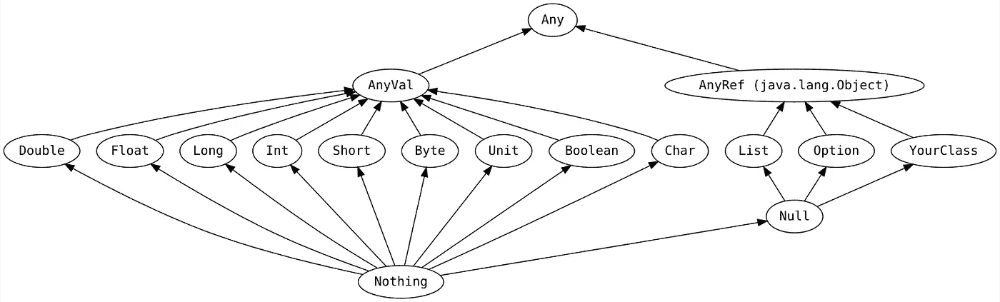

# 10 分钟的 Scala 介绍

> 原文：<https://itnext.io/a-10-minute-introduction-to-scala-d1fed19eb74c?source=collection_archive---------0----------------------->


Scala 是 Martin Odersky 在 2004 年发布的一种编程语言。它提供了对函数式编程的支持，设计简洁，并编译成 Java 字节码，这样 Scala 应用程序就可以在 Java 虚拟机(JVM)上执行。

让我们来看看这种语言的核心特征。

# 你好世界

首先，让我们看看如何在 Scala 中实现 hello world:

我们定义了一个包含一个`main`方法的`HelloWorld`对象。这个方法接受一个数组`String`作为输入。

总的来说，我们调用了方法`println`，它将一个对象作为输入，在控制台中打印一些东西。

同时，`HelloWorld`也是`io.teivah.helloworld`套餐的一部分。

# 价值观念

我们可以使用关键字`val`来命名表达式的结果。在以下示例中，两个表达式都是定义值的有效方式:

类型是可选的。在这个例子中，`v1`和`v2`都是字符串类型。

Scala 编译器无需显式声明就可以推断出值的类型。这就是所谓的类型推断。

Scala 中的一个值是**不可变的**。这意味着，下面的代码将无法编译:

最后但同样重要的是，可以使用关键字`lazy`对一个值进行**延迟**求值:

在这种情况下，`context`将不会在其声明期间进行计算，而是在其第一次调用期间进行计算。

# 变量

变量是一个**可变**值。它是用关键字`var`声明的。

就像值一样，类型是可选的。然而，一个变量不能被懒惰地评估。

此外，Scala 是一种静态类型语言。例如，当我们试图将一个`Int`映射到一个已经定义为`String`的变量时，下面的代码是无效的:

# 阻碍

在 Scala 中，我们可以通过用`{}`包围表达式来组合它们。让我们考虑将一个对象作为输入的`println()`函数。以下两个表达式相似:

注意，对于第二个`println`，最后一个表达式(`i + 2`)是整个程序块的结果。

当我们像`println`一样调用一个只有一个参数的函数时，我们也可以省略括号:

# 基本类型

Scala 被认为是纯粹的面向对象语言，因为每个值都是一个对象。因此，Scala 中没有原语(比如 Java `int`)。

Scala 中有 8 种基本类型:

*   `Byte`
*   `Short`
*   `Int`
*   `Long`
*   `Float`
*   `Double`
*   `Char`
*   `Boolean`



Scala 类型层次结构

每个基本的 Scala 类型都继承自`AnyVal`。另一方面，`AnyRef`是`java.lang.Object`的别名。最后，`AnyVal`和`AnyRef`都继承自`Any`。

# 字符串插值

Scala 提供了一种优雅的方式将变量/值引用直接嵌入到处理过的字符串中。举一个具体的例子:

这是通过引号前的`s` **插入符**实现的。否则，它会打印`Hello $name!`。

Scala 提供的插值器很少，但它是一种可定制的机制。例如，我们可以创建自己的插值器来处理 JSON 转换，如下所示:`println(json"{name: $name}")`。

# 数组和列表

Scala 也将数组作为一个对象来处理:

这里要强调两件事。

首先，设置元素的方式。我们使用语法`a(0)`，而不是像在许多语言中那样使用`a[0]`。这是一个语法上的好处，如果一个对象是一个函数，我们可以像调用**一样调用它。在幕后，编译器正在调用一个默认的方法`apply()`，它接受一个输入(在我们的例子中是一个`Int`)使之成为可能。**

其次，尽管在这个例子中被声明为`val`，但是`Array`对象是可变的，所以我们可以改变索引 0 和 1 的值。`val`只是强制不变异**引用**，而不是对应的对象。

数组也可以这样初始化:

这个表达和上面类似。而且，因为是用 5 和 2 初始化的，编译器推断`a`为`Array[Int]`。

要管理多维数组:

这段代码创建了一个二维数组，并将第一个元素初始化为 5。

Scala 标准库由许多不同的数据结构组成。其中之一就是**不可变**T0:

与`Array`相比，在初始化`List`后修改索引会导致编译错误。

# 地图

地图可以这样初始化:

注意`->`操作符将一个颜色键与其对应的十六进制值相关联。

`Map`是一种**不可变的**数据结构。添加一个元素意味着创建另一个`Map`:

同时，元素不能被修改。在我们需要可变结构的情况下，我们可以使用`scala.collection.mutable.Map`:

在这个例子中，我们变异了 *AK* 键。

# 方法/功能:基础

我们必须区分方法和函数。一个方法是一个函数，它是一个类、特征或对象的成员。

让我们看一个基本的方法示例:

这里我们用关键字`def`定义了一个`add`方法。它将两个`Int`作为输入，并返回一个`Int`。两个输入都是**不可变的**(就像它们被声明为`val`一样被管理)。

`return`关键字是可选的。该方法将自动返回最后一个表达式。而且值得一提的是，在 Scala 中(相比 Java)，`return`退出的是**当前方法**，而不是当前块。

最后要补充的是，**返回类型是可选的**。Scala 编译器也能够推断出它。然而，为了代码的可维护性，显式设置它可能是一个好的选择。

此外，没有输出的方法可以写成两种方式:

我们也可以像这样返回多个输出:

这使我们不必将一组输出包装在一个特定的对象中。

另一个要提到的句法糖。让我们考虑一个没有参数的`bar`方法。我们可以用两种方式调用这个方法:

最佳实践是仅当`bar`引入副作用时才保留括号。否则，我们像第二个表达式那样调用`bar`。

同样，Scala 允许我们指出一个方法参数可以重复**。就像在 Java 中一样，这个可重复的参数必须是最后一个参数:**

**这里，我们迭代每个`args`元素，并返回一个聚合和。**

**最后但同样重要的是，我们还可以定义默认参数值:**

**在没有为`x`提供值的情况下调用`default`有两种方式。**

**首先，使用`_`操作符:**

**或者，使用如下命名参数:**

# **方法/功能:高级**

## **嵌套方法**

**在 Scala 中，我们可以**嵌套方法定义**。让我们考虑下面的例子:**

**在这种情况下，`mergesort2`方法仅由`mergesort1`使用。为了限制它的访问，我们可以决定设置它`private`(稍后我们将看到不同的可见性级别)。**

**然而，在 Scala 中，我们也可以像这样将第二个方法嵌套到第一个方法中:**

**`mergesort2`仅在`mergesort1`范围内可用。**

## **高阶函数**

**高阶函数**将一个函数作为参数，或者返回一个函数作为结果**。作为将函数作为参数的方法的示例:**

**`f`是一个将`Int`作为输入并返回`Int`的函数。在我们的例子中，`foo`通过将`i`传递给`f`来将执行委托给它。**

## **函数文字**

**Scala 被认为是一种函数式语言，因为每个函数都是一个值。这意味着我们可以用这样的函数字面语法来表达一个函数:**

**`increment`是一个类型为`Int => Int`的函数(Scala 编译器可能已经推断出来了)。对于每个整数`x`，它返回`x + 1`。**

**如果我们再看一次前面的例子，我们可以将`increment`传递给`foo`:**

**我们还可以管理所谓的匿名函数:**

**第二个参数是一个没有名字的函数。**

## **关闭**

**函数文字中的闭包，其中**依赖于**在此函数外声明的一个或多个变量/值的值。**

**一个简单的例子:**

**这里，`foo`依赖于`foo`之外声明的`Pi`。**

## **部分功能**

**让我们考虑下面的方法来计算距离和时间的速度:**

**Scala 允许我们通过使用强制输入的子集调用**来部分应用** `speed`:**

**注意，在这个例子中，`speed`的参数都没有默认值。所以为了调用它，我们需要填充所有的参数。**

**在这个例子中，`partialSpeed`是一个类型为`Float => Float`的函数。**

**然后，和我们调用`increment`一样，我们可以这样调用`partialSpeed`:**

## **Currying**

**一个方法可以定义多个参数列表:**

**这种方法的作用与以下方法完全相同:**

**然而，调用`multiply`的方式不同:**

**像方法签名所要求的那样，我们用两个参数列表来调用它。那么，如果我们只用一个参数列表调用`multiply`会怎么样？**

**在这种情况下，我们部分地应用了`multiply`，作为回报，它给了我们一个`Int => Int`函数。**

**有哪些**好处**？让我们考虑一个在特定上下文中发送消息的函数:**

**如你所见，我们努力使这个函数变得纯粹。我们让它作为`send`函数的一个参数，而不是依赖于外部上下文。**

**然而，在每次调用`send`时都必须传递这个上下文，这可能有点乏味。或者一个函数不需要知道上下文。**

**一种解决方案可能是部分应用具有预定义上下文的`send`并管理`Array[Byte] => Unit`功能。**

**另一个解决方案是将`send`做成`context`参数`implicit`这样:**

**这种情况下怎么调用`send`？我们可以在调用`send`之前定义一个`implicit`上下文:**

**关键字`implicit`意味着对于每个管理隐式`Context`参数的函数，我们甚至不需要传递它。Scala 编译器会自动映射它。**

**在我们的例子中，`send`将`Context`对象作为潜在的隐式对象进行管理(我们也可以决定显式传递它)。所以，我们可以简单地用第一个参数列表调用`send`。**

# **班级**

**Scala 中的类与 Java 中的类似:**

**由于语法行 1，`Point`暴露了一个默认的`(Int, Int)`构造函数。同时，`x`和`y`是班上的两个成员。**

**一个类也可以包含一组方法，就像前面例子中的`move`。**

**我们可以用关键字`new`实例化`Point`:**

**一个类可以是抽象的，这意味着它不能被实例化。**

# **案例类别**

**案例类是一种特殊的类。如果你熟悉 DDD(域驱动设计)，case 类就是一个**值对象**。**

**默认情况下，case 类是**不可变的**:**

**`x`和`y`的值不能改变。**

**case 类必须在没有`new`的情况下实例化:**

**案例类(与常规类相比)通过值(而不是引用)进行比较:**

# **目标**

**Scala 中的一个对象是一个**单例**:**

**对象是用`object`关键字(👏).**

# **特征**

**特征在某种程度上类似于 Java 接口。它们用于**共享类之间的接口以及字段**。举个例子:**

**trait 方法也可以有一个默认的实现。**

**特征不能被实例化，但是它们可以被类和对象扩展。**

# **能见度**

**在 Scala 中，默认情况下，类/对象/特征的每个成员都是公共的。还有另外两个访问修饰符:**

*   **`protected`:成员只能从子类中访问**
*   **`private`:成员只能从当前类/对象中访问**

**此外，我们还可以通过指定应用限制的包，以更细粒度的方式来限制访问。**

**让我们考虑一个`bar`包中的`Foo`类。如果我们想让一个方法只在`bar`之外私有，我们可以这样做:**

# **无商标消费品**

**泛型也是 Scala 提供的一个特性:**

**要实例化泛型类:**

# **如果-否则**

**Scala 中的 If-else 语法与其他几种语言相似:**

**然而，在 Scala 中，if-else 语句也是一个表达式。这意味着我们可以，比如，像这样定义方法:**

# **环**

**一个基本循环可以这样实现:**

**`to`表示包含 0 到 10，而`until`表示不包含 0 到 10。**

**我们还可以循环两个元素:**

**在本例中，我们遍历了所有可能的元组组合:**

```
a=0, b=0
a=0, b=1
a=0, b=2
a=1, b=0
a=1, b=1
a=1, b=2
```

**我们也可以在 for 中包含条件。让我们考虑以下元素列表:**

**如果我们需要迭代`list`的每个元素，并且只考虑偶数，我们可以这样做:**

**此外，Scala 为理解提供了所谓的**来创建形式为`for() yield element`的元素序列。举个例子:****

**在这个例子中，我们通过迭代每个元素创建了一个偶数整数的集合，如果它是偶数，那么*产生*。结果，`sub`将被推断为一个整数序列(一个`Seq`对象，`List`的父对象)。**

**与 if-else 语句一样，for 也是一个表达式。所以我们也可以这样定义方法:**

# **模式匹配**

**模式匹配是一种根据给定模式检查值的机制。它是 Java `switch`语句的增强版本。**

**让我们考虑一个简单的将整数转换成字符串的函数:**

**Scala 增加了一点语法上的好处，以这种方式实现了一个等价的东西:**

**首先，我们删除了`return`语句。然后，`matchB`函数变成了一个模式匹配器，因为我们删除了函数定义后的 block 语句。**

**除了一些糖还有别的吗？模式匹配是对 case 类的一个很好的补充。让我们考虑一个取自 [Scala 文档](https://docs.scala-lang.org/tour/pattern-matching.html)的例子。**

**我们希望根据通知类型返回一个`String`。我们定义了一个抽象类`Notification`和两个案例类`Email`和`SMS`:**

**在 Scala 中，最优雅的方式是在通知上使用**模式匹配**:**

**这种机制允许我们对给定的`notification`进行**造型**并自动解析我们感兴趣的参数。例如，在电子邮件的情况下，也许我们对显示`body`不感兴趣，所以我们简单地用`_`关键字省略它。**

# **例外**

**让我们考虑一个具体的用例，我们需要从一个给定的文件中打印出字节数。为了执行 I/O 操作，我们将使用`java.io.FileReader`，它可能会抛出异常。**

**如果您是 Java 开发人员，最常用的方法是使用 try/catch 语句:**

**第二种实现方式有点类似于 Java `Optional`。提醒一下，`Optional`是 Java 8 中为可选值引入的容器。**

**在 Scala 中，`Try`是成功或失败的容器。这是一个抽象类，由两个案例类`Success`和`Failure`扩展。**

**我们首先在一个`Try`调用中包装一个新`FileReader`的创建。我们通过调用`read`方法，使用映射将最终的`FileReader`转换为`Int`。结果，我们得到一个`Try[Int]`。**

**然后，我们可以使用模式匹配来确定`tried`的类型。**

# **隐式转换**

**让我们分析下面的例子:**

**我们定义了两个案例类`Foo`和`Bar`。**

**同时，一个对象`Consumer`公开了一个带参数`Foo`的`consume`方法。**

**在`Test`中，我们调用`Consumer.consume()`但是**不是按照方法签名的要求带** `Foo`而是带`Bar`。这怎么可能？**

**在 Scala 中，我们可以定义两个类之间的隐式转换。在最后一个例子中，我们只需要描述如何将一个`Bar`转换成一个`Foo`:**

**如果这个方法`barToFoo`被导入，Scala 编译器将确保我们可以用**调用`consumer`或者**一个`Foo`或者一个`Bar`。**

# **并发**

**为了处理并发，Scala 最初基于 [**角色模型**](https://en.wikipedia.org/wiki/Actor_model) 。Scala 提供了`scala.actors`库。然而，从 Scala 2.10 开始，这个库就被弃用，取而代之的是 [**Akka actors**](https://doc.akka.io/docs/akka/current/index-actors.html?language=scala) 。**

**Akka 是一组用于实现并发和分布式应用程序的库。尽管如此，我们也只能在单个过程的规模上使用 Akka。**

**主要思想是将 actors 作为并发计算的**原语来管理。一个参与者可以向其他参与者发送消息，接收消息并对消息做出反应，还可以产生新的参与者。****

****

**行动者系统内通信示例**

**就像 CSP(Communicating Sequential Processes)等其他并发计算模型一样，关键是通过消息进行**的通信，而不是在不同线程之间共享内存。****

****

**学分:baloocartoons.com**

**Scala 是一种非常优雅的语言。然而，与其他语言如 Go 相比，学习曲线并不小。作为初学者，阅读现有的 Scala 代码可能有些困难。但是一旦你开始掌握它，开发一个应用程序可以以一种非常有效的方式完成。**

# **进一步阅读**

 **[## 文档| Scala 文档

### 在电脑上安装 Scala，开始写一些 Scala 代码吧！

docs.scala-lang.org](https://docs.scala-lang.org/)** ********

**在推特上关注我[@泰瓦](https://twitter.com/teivah)**