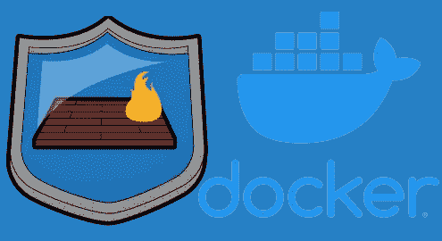

# docker 和 iptables 冲突的 bash 解决方案

> 原文：<https://itnext.io/a-bash-solution-for-docker-and-iptables-conflict-498d5209fb0c?source=collection_archive---------3----------------------->



如果您曾经试图在运行 docker 守护进程的同一台机器上设置防火墙规则，您可能已经注意到 docker(默认情况下)操纵您的 iptables 链。如果你想完全控制你的 iptables 规则，这可能是一个问题。

# Docker 和 iptables

Docker 使用 iptables“NAT”来解析进出其容器的数据包，并使用“filter”进行隔离，默认情况下，docker 会在 iptables 设置中创建一些链:

```
sudo iptables -L

Chain INPUT (policy ACCEPT)
target     prot opt source               destination         

Chain FORWARD (policy DROP)
target     prot opt source               destination         
DOCKER-USER  all  --  anywhere             anywhere            
DOCKER-ISOLATION-STAGE-1  all  --  anywhere             anywhere            
ACCEPT     all  --  anywhere             anywhere             ctstate RELATED,ESTABLISHED
DOCKER     all  --  anywhere             anywhere            
ACCEPT     all  --  anywhere             anywhere            
ACCEPT     all  --  anywhere             anywhere            

Chain OUTPUT (policy ACCEPT)
target     prot opt source               destination         

Chain DOCKER (1 references)
target     prot opt source               destination         

Chain DOCKER-INGRESS (0 references)
target     prot opt source               destination         

Chain DOCKER-ISOLATION-STAGE-1 (1 references)
target     prot opt source               destination         
DOCKER-ISOLATION-STAGE-2  all  --  anywhere             anywhere            
RETURN     all  --  anywhere             anywhere            

Chain DOCKER-ISOLATION-STAGE-2 (1 references)
target     prot opt source               destination         
DROP       all  --  anywhere             anywhere            
RETURN     all  --  anywhere             anywhere            

Chain DOCKER-USER (1 references)
target     prot opt source               destination         
RETURN     all  --  anywhere             anywhere
```

例如，现在我们需要向外界公开我们的 nginx 容器:

```
docker run --name some-nginx -d -p 8080:80 nginx:latest
47a12adff13aa7609020a1aa0863b0dff192fbcf29507788a594e8b098ffe47a

docker ps
CONTAINER ID   IMAGE          COMMAND                  CREATED          STATUS          PORTS                                   NAMES
47a12adff13a   nginx:latest   "/docker-entrypoint.…"   27 seconds ago   Up 24 seconds   0.0.0.0:8080->80/tcp, :::8080->80/tcp   some-nginx
```

现在我们可以进入 nginx 的默认页面:

```
curl -v http://192.168.25.200:8080

*   Trying 192.168.25.200:8080...
* TCP_NODELAY set
* Connected to 192.168.25.200 (192.168.25.200) port 8080 (#0)
> GET / HTTP/1.1
> Host: 192.168.25.200:8080
> User-Agent: curl/7.68.0
> Accept: */*
> 
* Mark bundle as not supporting multiuse
< HTTP/1.1 200 OK
< Server: nginx/1.21.1
< Date: Thu, 14 Oct 2021 10:31:38 GMT
< Content-Type: text/html
< Content-Length: 612
< Last-Modified: Tue, 06 Jul 2021 14:59:17 GMT
< Connection: keep-alive
< ETag: "60e46fc5-264"
< Accept-Ranges: bytes
< 
<!DOCTYPE html>
<html>
<head>
<title>Welcome to nginx!</title>
<style>
    body {
        width: 35em;
        margin: 0 auto;
        font-family: Tahoma, Verdana, Arial, sans-serif;
    }
...
* Connection #0 to host 192.168.25.200 left intact
```

**注意**使用外部机器进行连接测试，而不是运行 docker 容器的同一台机器。

添加的“神奇”iptables 规则也允许我们的容器到达外部世界:

```
docker run --rm nginx curl ipinfo.io/ip
  % Total    % Received % Xferd  Average Speed   Time    Time     Time  Current
                                 Dload  Upload   Total   Spent    Left  Speed
100    15  100    15    0     0     94      0 --:--:-- --:--:-- --:--:--    94

1.2.3.4
```

现在看看我们的 iptables 规则发生了什么变化:

```
iptables -L

...
Chain DOCKER (1 references)
target     prot opt source               destination         
ACCEPT     tcp  --  anywhere             172.17.0.2           tcp dpt:http
...
```

一条新的规则出现了，但不是唯一加到我们锁链上的规则。

为了更详细地查看我们的 iptables 链，我们可以使用 *iptables-save* 来转储完整的 iptables 规则:

```
# Generated by iptables-save v1.8.4 on Thu Oct 14 12:32:46 2021
*mangle
:PREROUTING ACCEPT [33102:3022248]
:INPUT ACCEPT [33102:3022248]
:FORWARD ACCEPT [0:0]
:OUTPUT ACCEPT [32349:12119113]
:POSTROUTING ACCEPT [32357:12120329]
COMMIT
# Completed on Thu Oct 14 12:32:46 2021
# Generated by iptables-save v1.8.4 on Thu Oct 14 12:32:46 2021
*nat
:PREROUTING ACCEPT [1:78]
:INPUT ACCEPT [1:78]
:OUTPUT ACCEPT [13:1118]
:POSTROUTING ACCEPT [13:1118]
:DOCKER - [0:0]
:DOCKER-INGRESS - [0:0]
-A PREROUTING -m addrtype --dst-type LOCAL -j DOCKER
-A OUTPUT ! -d 127.0.0.0/8 -m addrtype --dst-type LOCAL -j DOCKER
-A POSTROUTING -s 172.17.0.0/16 ! -o docker0 -j MASQUERADE
-A POSTROUTING -s 172.17.0.2/32 -d 172.17.0.2/32 -p tcp -m tcp --dport 80 -j MASQUERADE
-A DOCKER -i docker0 -j RETURN
-A DOCKER ! -i docker0 -p tcp -m tcp --dport 8080 -j DNAT --to-destination 172.17.0.2:80
COMMIT
# Completed on Thu Oct 14 12:32:46 2021
# Generated by iptables-save v1.8.4 on Thu Oct 14 12:32:46 2021
*filter
:INPUT ACCEPT [4758:361293]
:FORWARD DROP [0:0]
:OUTPUT ACCEPT [4622:357552]
:DOCKER - [0:0]
:DOCKER-INGRESS - [0:0]
:DOCKER-ISOLATION-STAGE-1 - [0:0]
:DOCKER-ISOLATION-STAGE-2 - [0:0]
:DOCKER-USER - [0:0]
-A FORWARD -j DOCKER-USER
-A FORWARD -j DOCKER-ISOLATION-STAGE-1
-A FORWARD -o docker0 -m conntrack --ctstate RELATED,ESTABLISHED -j ACCEPT
-A FORWARD -o docker0 -j DOCKER
-A FORWARD -i docker0 ! -o docker0 -j ACCEPT
-A FORWARD -i docker0 -o docker0 -j ACCEPT
-A DOCKER -d 172.17.0.2/32 ! -i docker0 -o docker0 -p tcp -m tcp --dport 80 -j ACCEPT
-A DOCKER-ISOLATION-STAGE-1 -i docker0 ! -o docker0 -j DOCKER-ISOLATION-STAGE-2
-A DOCKER-ISOLATION-STAGE-1 -j RETURN
-A DOCKER-ISOLATION-STAGE-2 -o docker0 -j DROP
-A DOCKER-ISOLATION-STAGE-2 -j RETURN
-A DOCKER-USER -j RETURN
COMMIT
# Completed on Thu Oct 14 12:32:46 2021
```

在我们的转储中，我们可以看到 docker 添加的一些其他规则:

**DOCKER-INGRESS (nat 表)**

```
-A POSTROUTING -s 172.17.0.0/16 ! -o docker0 -j MASQUERADE
-A POSTROUTING -s 172.17.0.2/32 -d 172.17.0.2/32 -p tcp -m tcp --dport 80 -j MASQUERADE
-A DOCKER -i docker0 -j RETURN
-A DOCKER ! -i docker0 -p tcp -m tcp --dport 8080 -j DNAT --to-destination 172.17.0.2:80
```

**DOCKER-USER(过滤表)**

```
-A POSTROUTING -s 172.17.0.0/16 ! -o docker0 -j MASQUERADE
-A POSTROUTING -s 172.17.0.2/32 -d 172.17.0.2/32 -p tcp -m tcp --dport 80 -j MASQUERADE
-A DOCKER -i docker0 -j RETURN
-A DOCKER ! -i docker0 -p tcp -m tcp --dport 8080 -j DNAT --to-destination 172.17.0.2:80
```

要详细了解 iptables 和 docker 的工作原理:

*   Docker [docs](https://docs.docker.com/network/iptables/)
*   Docker 论坛[问题](https://forums.docker.com/t/understanding-iptables-rules-added-by-docker/77210)
*   来自 x-yuri 的[要点](https://gist.github.com/x-yuri/abf90a18895c62f8d4c9e4c0f7a5c188)
*   argus-sec.com[岗位](https://argus-sec.com/docker-networking-behind-the-scenes/)

# 问题是

但是如果我们停止并重启防火墙会发生什么呢？

```
systemctl stop ufw|firewalld # <- the service (ufw or firewalld) may change from distro to distro
systemctl stop ufw|firewalld

curl -v http://192.168.25.200:8080
*   Trying 192.168.25.200:8080...
* TCP_NODELAY set

docker run --rm nginx curl ipinfo.io/ip
  % Total    % Received % Xferd  Average Speed   Time    Time     Time  Current
                                 Dload  Upload   Total   Spent    Left  Speed
  0     0    0     0    0     0      0      0 --:--:--  0:00:06 --:--:--     0
```

我们可以看到:

*   我们的容器从外部世界是无法到达的
*   我们的容器无法访问互联网

# 解决方案

这个问题的[解决方案](https://github.com/garutilorenzo/iptables-docker)是一个简单的 bash 脚本(结合 awk 脚本)来管理我们的 iptables 规则。简而言之，该脚本解析 *iptables-save* 命令的输出，并保留一组链。保存下来的链条有:

对于表格 nat:

*   邮政路由
*   预路由
*   码头工人
*   码头入口
*   输出

对于表格过滤器:

*   向前
*   对接-隔离-第一阶段
*   对接-隔离-第二阶段
*   码头工人
*   码头入口
*   码头工人-用户

# 安装 iptables-docker

第一步是克隆[这个](https://github.com/garutilorenzo/iptables-docker)库

## 本地安装(sh)

**注意**这种安装使用静态文件(src/iptables-docker.sh)。默认情况下**只允许** ssh 访问本地机器。要允许特定的流量，您必须使用自己的规则手动编辑该文件:

```
# Other firewall rules
# insert here your firewall rules
$IPT -A INPUT -p tcp --dport 1234 -m state --state NEW -s 0.0.0.0/0 -j ACCEPT
```

**注 2** 如果您使用群集群，取消注释*群模式下的行——取消注释以启用群访问(调整源局域网)*并调整您的局域网子网

要在本地机器上安装 iptables-docker，克隆这个存储库并运行 *sudo sh install.sh*

```
sudo sh install.sh 

Set iptables to iptables-legacy
Disable ufw,firewalld
Synchronizing state of ufw.service with SysV service script with /lib/systemd/systemd-sysv-install.
Executing: /lib/systemd/systemd-sysv-install disable ufw
Failed to stop firewalld.service: Unit firewalld.service not loaded.
Failed to disable unit: Unit file firewalld.service does not exist.
Install iptables-docker.sh
Create systemd unit
Enable iptables-docker.service
Created symlink /etc/systemd/system/multi-user.target.wants/iptables-docker.service → /etc/systemd/system/iptables-docker.service.
start iptables-docker.service
```

## 自动安装(ansible)

还可以使用 ansible 在任何地方部署 iptables-docker。为此，请调整 group_vars/main.yml 下的设置。

这些设置是:

*   docker_preserve:默认，是。保留 docker iptables 规则
*   swarm_enabled:默认值，no。告诉 ansible 为 swarm 集群打开所需的端口。
*   enable_icmp_messages:默认值，是。启用对 ping 请求的响应
*   swarm_cidr:默认值，192.168.1.0/24。本地码头群子网
*   ssh_allow_cidr:默认值为 0.0.0.0/0。SSH 允许的子网(各处默认)
*   iptables_allow_rules:默认值，[]。动态打开端口的字典列表。每个字典都有以下键:desc、proto、from、port。有关示例，请参见 group_vars/all.yml
*   iptables_docker_uninstall:默认，否。卸载 iptables-docker

现在创建清单(hosts.ini 文件)或使用内联清单并运行行动手册:

```
ansible-playbook -i hosts.ini site.yml
```

# 使用

要启动该服务，请使用:

```
sudo systemctl start iptables-docker

or 

sudo iptables-docker.sh start
```

要停止服务，请使用:

```
sudo systemctl stop iptables-docker

or 

sudo iptables-docker.sh stop
```

# 测试 iptables-docker

现在，如果您使用*sudo system CTL stop iptables-docker*关闭防火墙，并且检查 iptable-save 输出，您会看到 docker 规则仍然存在:

```
sudo iptables-save

# Generated by iptables-save v1.8.4 on Thu Oct 14 15:52:30 2021
*mangle
:PREROUTING ACCEPT [346:23349]
:INPUT ACCEPT [346:23349]
:FORWARD ACCEPT [0:0]
:OUTPUT ACCEPT [340:24333]
:POSTROUTING ACCEPT [340:24333]
COMMIT
# Completed on Thu Oct 14 15:52:30 2021
# Generated by iptables-save v1.8.4 on Thu Oct 14 15:52:30 2021
*nat
:PREROUTING ACCEPT [0:0]
:INPUT ACCEPT [0:0]
:OUTPUT ACCEPT [0:0]
:POSTROUTING ACCEPT [0:0]
:DOCKER - [0:0]
:DOCKER-INGRESS - [0:0]
-A PREROUTING -m addrtype --dst-type LOCAL -j DOCKER
-A OUTPUT ! -d 127.0.0.0/8 -m addrtype --dst-type LOCAL -j DOCKER
-A POSTROUTING -s 172.17.0.0/16 ! -o docker0 -j MASQUERADE
-A POSTROUTING -s 172.17.0.2/32 -d 172.17.0.2/32 -p tcp -m tcp --dport 80 -j MASQUERADE
-A DOCKER -i docker0 -j RETURN
-A DOCKER ! -i docker0 -p tcp -m tcp --dport 8080 -j DNAT --to-destination 172.17.0.2:80
COMMIT
# Completed on Thu Oct 14 15:52:30 2021
# Generated by iptables-save v1.8.4 on Thu Oct 14 15:52:30 2021
*filter
:INPUT ACCEPT [357:24327]
:FORWARD DROP [0:0]
:OUTPUT ACCEPT [355:26075]
:DOCKER - [0:0]
:DOCKER-INGRESS - [0:0]
:DOCKER-ISOLATION-STAGE-1 - [0:0]
:DOCKER-ISOLATION-STAGE-2 - [0:0]
:DOCKER-USER - [0:0]
-A FORWARD -j DOCKER-USER
-A FORWARD -j DOCKER-ISOLATION-STAGE-1
-A FORWARD -o docker0 -m conntrack --ctstate RELATED,ESTABLISHED -j ACCEPT
-A FORWARD -o docker0 -j DOCKER
-A FORWARD -i docker0 ! -o docker0 -j ACCEPT
-A FORWARD -i docker0 -o docker0 -j ACCEPT
-A DOCKER -d 172.17.0.2/32 ! -i docker0 -o docker0 -p tcp -m tcp --dport 80 -j ACCEPT
-A DOCKER-ISOLATION-STAGE-1 -i docker0 ! -o docker0 -j DOCKER-ISOLATION-STAGE-2
-A DOCKER-ISOLATION-STAGE-1 -j RETURN
-A DOCKER-ISOLATION-STAGE-2 -o docker0 -j DROP
-A DOCKER-ISOLATION-STAGE-2 -j RETURN
-A DOCKER-USER -j RETURN
COMMIT
# Completed on Thu Oct 14 15:52:30 2021
```

我们的容器仍然可以从外面进入:

```
curl -v http://192.168.25.200:8080
*   Trying 192.168.25.200:8080...
* TCP_NODELAY set
* Connected to 192.168.25.200 (192.168.25.200) port 8080 (#0)
> GET / HTTP/1.1
> Host: 192.168.25.200:8080
> User-Agent: curl/7.68.0
> Accept: */*
> 
* Mark bundle as not supporting multiuse
< HTTP/1.1 200 OK
< Server: nginx/1.21.1
< Date: Thu, 14 Oct 2021 13:53:33 GMT
< Content-Type: text/html
< Content-Length: 612
< Last-Modified: Tue, 06 Jul 2021 14:59:17 GMT
< Connection: keep-alive
< ETag: "60e46fc5-264"
< Accept-Ranges: bytes
```

我们的集装箱可以上网:

```
docker run --rm nginx curl ipinfo.io/ip
  % Total    % Received % Xferd  Average Speed   Time    Time     Time  Current
                                 Dload  Upload   Total   Spent    Left  Speed
100    15  100    15    0     0     94      0 --:--:-- --:--:-- --:--:--    94
my-public-ip-address
```

# 重要注意事项

在安装 iptables-docker 之前，请阅读以下说明:

*   本地安装和 ansible 安装都将您的系统配置为使用 **iptables-legacy**
*   默认情况下**只允许**端口 22
*   ufw 和防火墙将被永久禁用
*   **禁用所有 docker 接口上的过滤**

**Docker 接口包括:**

*   **vethXXXXXX 接口**
*   **br-XXXXXXXXXXX 接口**
*   **docker0 接口**
*   **docker_gwbridge 接口**

# **扩展 iptables-docker**

**您可以通过编辑来扩展或修改 iptables-docker:**

*   **本地安装的 src/iptables-docker . sh(sh)**
*   **用于自动安装的 roles/iptables-docker/templates/iptables-docker . sh . J2 模板文件(ansible)**

# **从计算机上卸载**

## **本地安装(sh)**

**运行 uninstall.sh**

## **自动安装(ansible)**

**将 group_vars/all.yml 中的变量“iptables_docker_uninstall”设置为“yes ”,然后运行剧本。**

***原载于 2021 年 10 月 14 日*[*https://garutilorenzo . github . io*](https://garutilorenzo.github.io/a-bash-solution-for-docker-and-iptables-conflict/)*。***