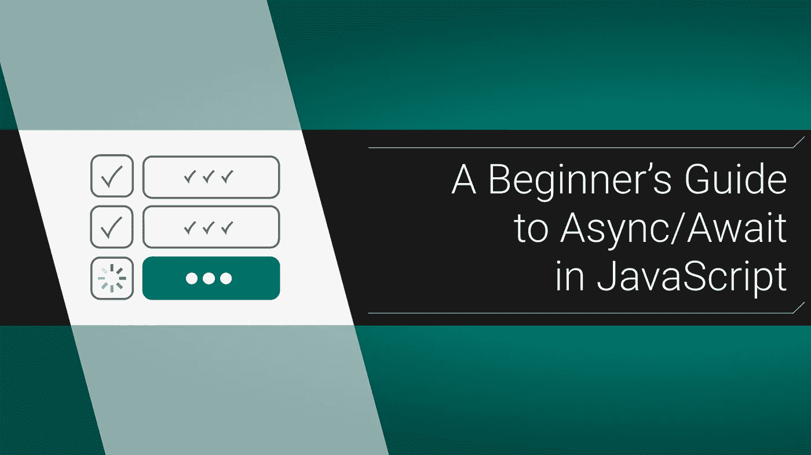

# JavaScript 中的 Async/Await 初学者指南

> 原文：<https://itnext.io/a-beginners-guide-to-async-await-in-javascript-97750bd09ffa?source=collection_archive---------1----------------------->

## 异步 JavaScript 从未如此友好



你会爱上 Async/Await。虽然链是缩进式的，令人困惑，但 Async/Await 是简单的。对于本教程，我假设你已经知道[承诺](https://medium.com/@mikecronin92/promises-promises-understanding-the-basics-of-js-promise-objects-dd5c656f2db4)和[获取](/that-data-looks-so-fetching-on-you-understanding-the-js-fetch-api-880eae0c8d25)是如何工作的，所以如果你对概念有点模糊，请阅读那些文章。此外，Async/Await 可以在现代浏览器中工作，但如果代码片段不工作，请尝试切换到 Chrome 或 Brave。

# 旧与新

让我们使用`.then`编写一个简单的查询。您可以通过将这段代码复制到浏览器的控制台来运行它。如果 CORS 给你带来麻烦，试着去 [jsonplaceholder](https://jsonplaceholder.typicode.com) 本身并在那里运行它。

```
const **getFirstUser** = () => {
  const url = '*https://jsonplaceholder.typicode.com/users/1*';
  fetch(**url**)
    .then(**response** => **response**.json())
    .then(**json** => **console**.log(**json**));
}
```

这是老方法，但是用 Async/Await 会是什么样子呢？老实说，非常相似:

```
const **getSecondUser** = ***async*** () => {
  const **url** = *'https://jsonplaceholder.typicode.com/users/2'*;
  const **response** = *await* fetch(**url**);
  **console**.log(*await* **response**.json());
}
```

我真的想让你看到 Async/Await 并不疯狂，它只是一个改进。最直接的好处是我们不再需要担心筑巢。没有更多的缩进疯狂每次你想打一个新的电话链内的`.then`！

# 分解它

最需要注意的是函数开头的`async`关键字。这很重要，你只能在一个`async`函数( *除非*你在一个支持顶级`await`的环境中)中使用`await`关键字。你可以*在任何你喜欢的地方调用*这个函数，但是我们稍后会详细讨论。当在一个`async`函数中时，任何用`.then`关键字链接的承诺现在都在`await`后面。那个`await`将等待它旁边的承诺解决，然后再继续这个程序。它基本上使异步动作同步。你可以把它赋给一个变量，但是你不需要这么做。如果您不介意以后使用解析的值，就没有必要分配它。：

```
const **response** = *await* fetch(**url**);
// also valid: 
*await* fetch(**url**);
```

# 异步返回值

让我们尝试一下那些有趣的辅导实验，虽然这显然行不通，但我还是让你去做，因为烦恼可以塑造性格。告诉我，如果我们尝试在函数的之外记录最终结果*，会发生什么？*

```
const **getThirdUser** = ***async*** () => {
  const **url** = '*https://jsonplaceholder.typicode.com/users/3*';
  const **response** = await fetch(**url**);
  const **json** = await **response**.json();
  return **json**;
}console.log(**getThirdUser**());
```

剧透预警，它给你这个垃圾:`Promise { <pending> }`。怎么回事？之前，我误导性地说你可以在任何地方调用这个函数，但是看起来这个函数并不真的工作。这是因为当你可以在任何地方调用异步函数时，它总是会返回一个承诺。让我重复一遍:**异步函数总是将其返回值包装在** `**Promise.resolve**` ***中。***

实际上，这并不意味着什么。承诺通常存在于独立的函数中，如事件处理程序或挂载函数。现在唯一的区别是你给他们`async`关键词:

```
const **handleSubmit** = (**event**) => {
  **event**.preventDefault();
  **UserAdapter**.checkUser(user)
    .then(**validUser** => setCurrentUser(**validUser**));
};// is now:
const **handleSubmit** = ***async*** (**event**) => {
  **event**.preventDefault();
  const **validUser** = *await* **UserAdapter**.checkUser(**user**);
  setCurrentUser(**validUser**);    
};
```

我提到这一点是因为我认为错误调用`async`函数会在你开始时造成很多混乱。您将尝试像使用常规函数一样使用它们，当它表现不同时会感到沮丧。

# 异步函数仍然是。然后表格

由于每个函数都返回一个承诺，这意味着异步函数的返回值仍然是可链接的。这对于使用一个 liners 或者如果您想在非异步范围内使用异步函数的返回值是很方便的。为了准确地从上面的示例中注销我们的响应，应该是:

```
**getThirdUser**().then(**console**.log);
```

记住，你仍然可以在一个`async`函数中使用`.then`，只是要确保`await`它:

```
const **contrivedExample** = ***async*** () => {
  *await* **getThirdUser**().then(**console**.log);
  // more function stuff
}
```

# 无用的等待

让我们再看一下上面的一些代码:

```
const **getThirdUser** = ***async*** () => {
  const **url** = '*https://jsonplaceholder.typicode.com/users/3*';
  const **response** = await fetch(**url**);
  const **json** = await **response**.json();
  return **json**;
}
```

你看到最后的`await`了吗？没必要。所有的`await`真正做的是等待一个承诺来解决。然而，我们的主异步函数将把我们的返回值包装在一个承诺中。因此，如果返回值只是要返回一个承诺，我们应该避免额外的延迟，返回一个承诺:

```
const **getThirdUser** = ***async*** () => {
  const **url** = '*https://jsonplaceholder.typicode.com/users/3*';
  const **response** = await fetch(**url**);
  return **response**.json();
}
```

有趣的是，棉绒会警告你这种情况。

## 最后一个陷阱:遗忘等待和处理错误

毫无疑问，这个新语法最常见的错误是在需要的时候忘记输入一个`await`。在我们上面的简单例子中，如果你忘记了，一些东西会坏掉，但并不总是这样。如果你正在使用一个`async`函数，事情开始变得奇怪，确保每个异步动作都在一个`await`之后。此外，捕捉错误也恢复正常。你可以再次使用普通的`try/catch`积木，而不是使用特殊的`.catch`:

```
const **getFourthUser** = ***async*** () => {
  try {
    const **url** = '*https://jsonplaceholder.typicode.com/users/4*';
    const **response** = await fetch(**url**);
    return **response**.json();
  } catch (e) {
    // handle error
  }
}
```

# 你在等什么？

这就是异步/等待的基础！我们几乎完成了我们的异步旅程，但这趟列车还有一站。所以，一旦你熟悉了你在这里学到的东西，就深入到 Promise.all，学习如何优化多个承诺。

大家编码快乐，

麦克风