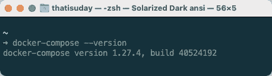
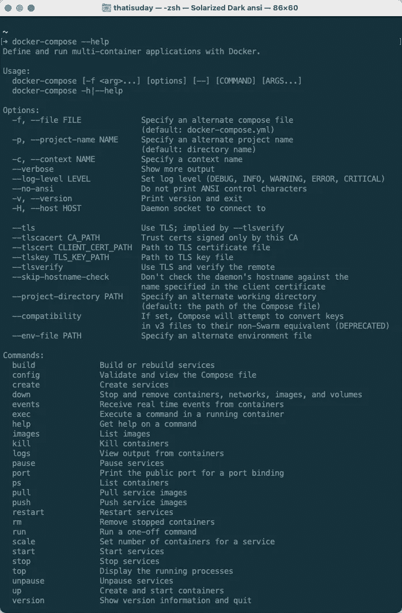
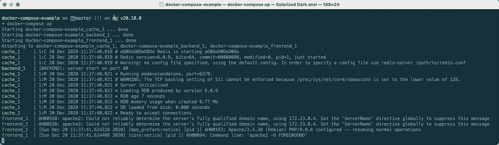
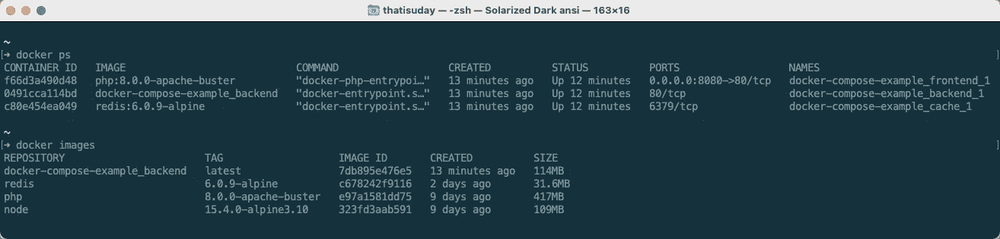
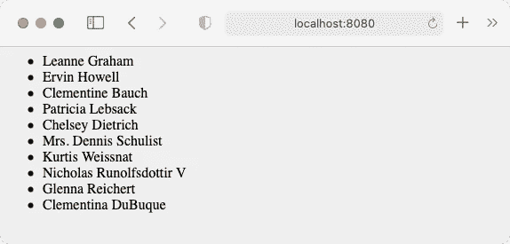
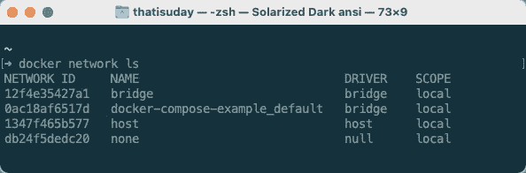
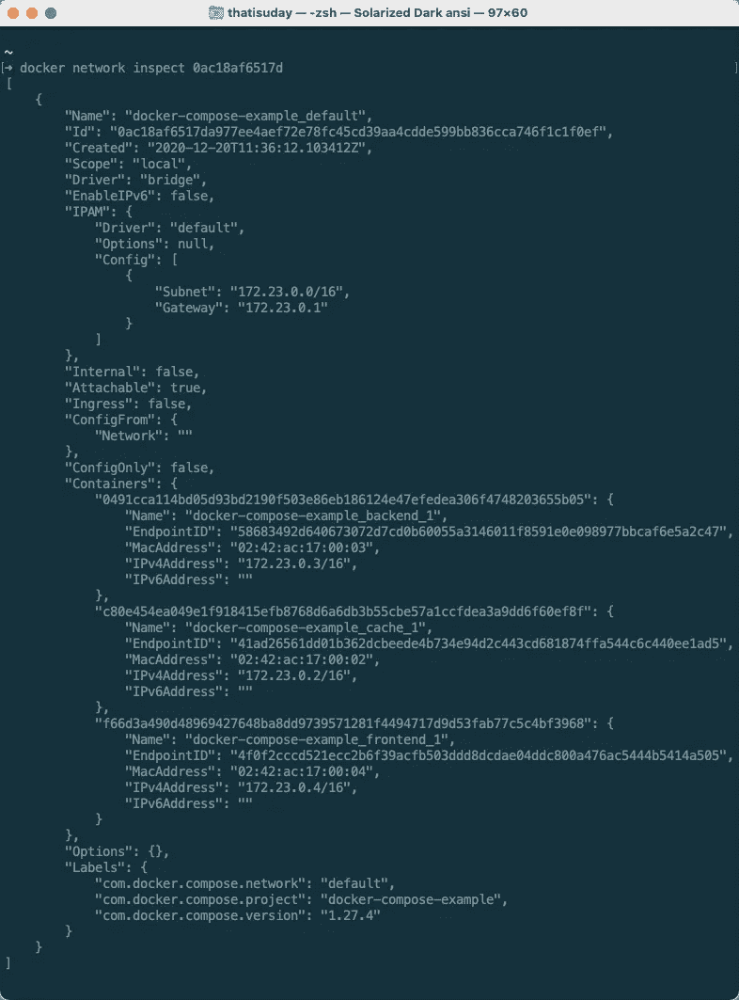
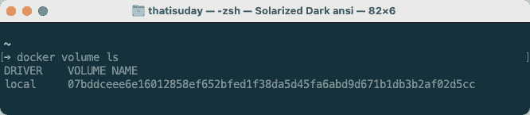
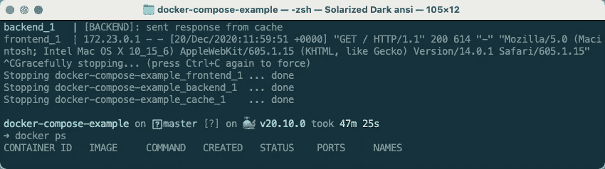
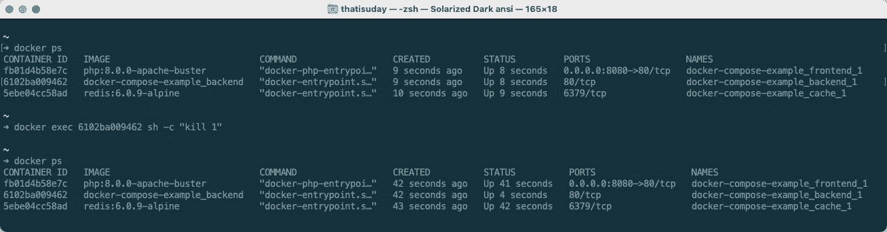

# 使用 Docker Compose 将 Docker 应用程序部署到生产环境的初学者指南

> 原文：<https://itnext.io/a-beginners-guide-to-deploying-a-docker-application-to-production-using-docker-compose-de1feccd2893?source=collection_archive---------0----------------------->

## Docker: Docker 撰写

## 在这一课中，我们将学习 Docker Compose 如何工作，以及如何在生产环境中使用它来部署和管理多个容器。


(来源:[**unsplash.com**](https://unsplash.com/photos/Z-HBjM62f6M))

在 [**之前的课程**](https://medium.com/sysf/docker/home) 中，我们讨论了 Docker 的基础知识。我们学习了 Docker 容器的构造，Docker 文件的结构，如何创建图像，如何管理容器，等等。这只是我们操作 Docker 需要知道的基本信息。

如果我们的应用程序像 HTTP 服务器一样简单，我们可以在一个 Docker 容器中运行它。您可以创建一个定制的 Docker 映像，将应用程序代码复制到映像中，并从中运行一个容器。您可以安装一个用于永久数据存储的卷，并将主机上的一个端口绑定到容器上的端口，以公开您的服务。就是这样。之后，我们需要手动监控容器，以防它关闭。

然而，实际上，我们的应用程序是由不同的服务组成的。例如，我们可能有一个为 web 应用程序服务的前端服务，一个为前端提供 REST API 的后端服务，以及一个存储用户数据的数据库服务。

这些服务可以相互依赖。例如，前端服务依赖于后端服务，后端服务依赖于数据库服务。除非我们启动并运行所有的服务，否则我们的应用程序将无法正常运行。它们可能需要以正确的顺序启动，才能顺利进行。

手动操作很麻烦。不是团队中的每个人都知道整个应用程序的上下文。这是一个很大的元数据，你不能把事情搞砸。你需要某种**编排工具**来自动管理你的服务。您希望这个工具配置您的服务、管理启动和关闭以及处理故障。这就是 **Docker Compose** 的用武之地。

# Docker 撰写

Docker Compose 是一个管理多容器应用程序的工具，比如我们上面讨论的 web 应用程序。每个**容器充当一个服务**，为应用程序的整个功能提供贡献。这个模型被称为 [**CaaS**](https://blog.back4app.com/caas-container-as-a-service/) (容器即服务)。

> *💡*如果您使用 Docker for Desktop，例如 macOS 和 Windows 操作系统，那么您已经安装了 Docker Compose，否则您可以从 [**此**](https://docs.docker.com/compose/install/) 页面手动下载。

Docker Compose 不是 Docker Engine 的一部分，因此必须单独安装。像 Docker Engine 一样，Docker Compose 为我们提供了一个命令行界面(CLI)来与之交互。您可以通过运行`$ docker-compose --version`命令来验证它的安装。



$ docker-撰写-版本

那么 Docker 是如何作曲的呢？Docker Compose 只是一个编排工具，仅此而已。作为一个人，您会做些什么来构建映像、启动、停止和监控容器、对运行中的容器进行健康检查、处理故障等。，Docker Compose 会为您做到这一点。



$ docker-撰写-帮助

在构建 Docker 映像时，`$ docker build`命令查看`Dockerfile`并逐层构建映像。类似地，`$ docker-compose`子命令查看`docker-compose.yml`文件并运行指令。这些指令配置要运行的服务(*容器*)。

`docker-compose.yml`文件被称为**合成文件**，因为它使用 Docker Compose 来合成服务。与 Dockerfile 不同，该文件遵循 [**YAML**](https://en.wikipedia.org/wiki/YAML) 语法，这就是为什么您也可以对该文件使用`.yaml`扩展名。

> *💡*当我们运行`$ docker-compose`命令时，Docker Compose 默认在当前目录中查找名为`docker-compose.yml/.yaml`的文件，但是，您可以使用`-f`或`--file`标志覆盖文件路径。也可以使用 JSON 文件(。json)，因为 YAML 是 JSON 的超集。

合成文件包含服务列表。服务包含要运行的容器的配置。该配置可以指定哪个 Docker 映像用于容器、安装什么卷、暴露什么端口等。Docker Compose 还可以在启动服务时动态构建 Docker 映像(*来自 Dockerfile* )。

合成文件还可以创建服务可以使用的卷。它还可以配置服务可能加入的网络。我们还可以定义每个服务必须启动和关闭的启动顺序。Docker Compose 是一个非常强大的工具，它将我们从手动管理容器的负担中解放出来。所以让我们开始吧。

# 撰写文件

合成文件是一个 YAML 文件，它提供服务以及网络、卷、环境变量等的配置。由服务使用(*它们的容器*)。这个文件通常被命名为`docker-compose.yml`，放在项目目录中。当我们从项目目录中运行`$ docker-compose [options] <subcommand> [suboptions]`命令时，Docker Compose 将读取这个文件来分析服务，以便它可以启动、停止服务或对它们做其他事情。

> *💡*与 Dockerfile 不同，Compose file 提供了大量选项，这就是为什么很难在一篇文章中描述每一件小事。我会尽力报道重要的话题。要了解更多信息，您可以随时按照 [**本**](https://docs.docker.com/compose/compose-file) 官方文档进行撰写文件参考。

(来源:[**gist.github.com**](https://gist.github.com/thatisuday/e68b4003629da23bb317c009cb34ba14))

一个典型的`docker-compose.yml`文件看起来如上。`version`键指定要使用的合成文件的版本。目前最新版本是`[3.9](https://docs.docker.com/compose/compose-file/)`(*2020 年 12 月*)。特定的合成文件版本与特定的 Docker 引擎版本兼容， [**这里的**](https://docs.docker.com/compose/compose-file/compose-versioning/) 是兼容性矩阵。

> *💡*典型的合成文件版本是以`<major>:<minor>`发布的形式。如果我们省略了`:<minor>`部分，Docker Compose 会自动假定为`0`次要版本，这就是为什么我们应该明确提到次要版本。

使用`services`字段，我们定义 Docker 编写应该启动的容器(*服务*)。在上面的组合文件中，我们有三个服务，即`database`、`frontend`和`backend`。Docker Compose 将使用这些服务名来命名将要创建的映像、容器或卷。

`database`服务(*容器*)使用了`mysql:latest`图像。我们使用服务的`[image](https://docs.docker.com/compose/compose-file/compose-file-v3/#image)`字段定义应该从哪个图像创建容器。Docker 从 Docker Hub 下载这个映像并创建一个容器。默认情况下，该容器将公开`3306`端口，并按照其 [Dockerfile](https://github.com/docker-library/mysql/blob/ee33a2144a0effe9459abf02f20a6202ae645e94/8.0/Dockerfile.debian) 的指定运行 MySQL 服务器。这是合成文件中服务的最低配置。

`backend`服务使用来自 Docker Hub 的`node:latest`图像。然而，我们为容器启动做了一些额外的配置。首先，我们使用`[working_dir](https://docs.docker.com/compose/compose-file/compose-file-v3/#domainname-hostname-ipc-mac_address-privileged-read_only-shm_size-stdin_open-tty-user-working_dir)`字段将`/app`设置为容器的工作目录。然后，我们使用`[volumes](https://docs.docker.com/compose/compose-file/compose-file-v3/#volumes)`字段将主机的`./backend`目录挂载到容器的`/app`目录。然后我们使用`[command](https://docs.docker.com/compose/compose-file/compose-file-v3/#command)`字段执行`node ./server.js`命令，这将启动一个 HTTP 服务器，而`[expose](https://docs.docker.com/compose/compose-file/compose-file-v3/#expose)`字段指定要公开的容器端口。

> *💡*合成文件中使用的所有(主机的)相对路径将相对于`docker-compose.yml`文件。`[entrypoint](https://docs.docker.com/compose/compose-file/compose-file-v3/#entrypoint)`、`[working_dir](https://docs.docker.com/compose/compose-file/compose-file-v3/#domainname-hostname-ipc-mac_address-privileged-read_only-shm_size-stdin_open-tty-user-working_dir)`、`[command](https://docs.docker.com/compose/compose-file/compose-file-v3/#command)`和`[expose](https://docs.docker.com/compose/compose-file/compose-file-v3/#expose)`字段值会覆盖从其创建容器的映像的`ENTRYPOINT`、`WORKDIR`、`CMD`和`EXPOSE`指令。

服务不使用公共图像。我们不使用`image`字段，而是使用`[build](https://docs.docker.com/compose/compose-file/compose-file-v3/#build)`字段指定上下文目录的路径。Docker Compose 将为该服务的容器动态创建一个图像。您还可以使用对象配置指定自定义 Dockerfile 路径和上下文目录，如这里的[所述](https://docs.docker.com/compose/compose-file/compose-file-v3/#build)。

`[ports](https://docs.docker.com/compose/compose-file/compose-file-v3/#ports)`字段将主机端口与暴露的容器端口绑定在一起。该字段提供了更多配置选项，如本文中[所述。](https://docs.docker.com/compose/compose-file/compose-file-v3/#ports)`[depends_on](https://docs.docker.com/compose/compose-file/compose-file-v3/#depends_on)`字段控制服务如何启动。在上面的例子中，由于`frontend`服务依赖于`database`和`backend`服务，所以它们被首先启动。一旦这些服务(*容器*)被启动，`frontend`服务(*容器*)将被创建。

## 覆盖合成文件

通常，我们的应用程序会经历多种环境。首先，我们在本地机器上开发应用程序，然后我们将它放在 QA 的试运行环境中，然后放在 CI 服务器上进行测试，最后它进入生产环境。

在这些环境中运行应用程序服务的配置不会总是相同的。例如，您可能希望在开发环境中公开服务的不同端口，如`8080`，而在生产环境中，您的理想选择是`80`。

我们可以使用构建参数或环境变量来控制这些值(下一个中讨论的*，但是有时你需要一个配置变更，而使用这些变量是无法实现的。所以理想的选择是每个环境有多个合成文件，并使用`--file`或`-f`标志来决定使用哪个配置文件。*

然而，如果您的配置文件很大，并且您需要在多个环境中部署您的应用程序，那么管理多个配置文件就成了一项单调乏味的任务。有更好的出路。使用`-f`标志，我们可以指定多个合成文件。Docker Compose 将从右到左合并这些文件，并准备最终的合成配置。

```
$ docker-compose -f compose.yml -f compose.dev.yml ...
```

`$ docker-compose`命令可以接受多个合成文件。然后，它将从右到左合并配置。在上述情况下，`compose.dev.yml`文件会覆盖`compose.yml`文件的配置。

> *💡*我们可以有多个覆盖文件。只需在`$ docker-compose`命令中使用`-f`标志指定额外的覆盖文件，结果配置将通过从右到左合并文件来创建。

如果没有提供`-f`标志，Docker Compose 将在当前目录中查找`docker-compose.yml`文件。它还会在当前目录中查找`docker-compose.override.yml`文件，如果存在，它会覆盖`docker-compose.yml`文件。

在覆盖文件中，配置的结构应该与它所覆盖的文件几乎一致。例如，如果我们想要覆盖一个服务的几个字段，那么`services > service_name`字段应该在那里。如果我们在覆盖文件中引入一个新服务，它将被添加到最终配置中。让我们看看覆盖是如何工作的。

(来源:[gist.github.comT21](https://gist.github.com/thatisuday/b0dca85227a2a0ca4a4bfb6950597c9d))

要验证并打印结果配置，您应该使用`$ docker-compose [options] [config](https://docs.docker.com/compose/reference/config/)`命令。最终配置( `*result.yml*`指示的*)由下面的命令生成。*

```
$ docker-compose -f docker-compose.yml -f docker-compose.prod.yml config
```

我们来分析一下结果。服务保持原样，因为我们没有覆盖它。`cache`服务进入最终配置，因为它是在覆盖文件中定义的。`backend`服务中的`image`字段被替换，因为它是单值字段。

`frontend`服务配置最有趣。新的`command`属性被添加到覆盖的最终配置中。多值字段不会被覆盖。相反，它们的值将被合并，如您在`depends_on`和`ports`字段中所见。但是，在`volumes`的情况下，如果容器目录相同，则只能存在一个挂载点。

> *💡*要了解更多关于覆盖的信息，请阅读本 文档。

## 使用环境变量

环境变量可以用来替换`docker-compose.yml`文件中的变量。这在针对特定于环境的配置更改时非常有用。我们来看一个小例子。

(来源:[**gist.github.com**](https://gist.github.com/thatisuday/17f261dcc2cbc46e8c87247f182277ff))

在上面的`docker-compose.yml`文件中，`${NGINX_VERSION}`、`${NGINX_WWW_DIR}`和`$NGINX_PORT`的值将被同名的环境变量提供的值所替代。

> *💡*如果`NGINX_VERSION`环境变量不存在或为空，您可以使用`${NGINX_VERSION:-latest}`语法回退到`latest`值。要了解更多关于此类语法的信息，请阅读本 文档。

运行`$ docker-compose`命令时，将从 shell 环境中获取这些变量的值。如果 shell 环境中不存在某个环境变量，那么 Docker 会在合成文件的目录中查找该环境变量在`.env`文件中的值(如果存在，则查找*)。*

```
# .env file
NGINX_WWW_DIR=./www
NAME_WITH_QUOTES="John Doe"
```

该文件包含合成文件的默认环境变量。这是一个简单的文本文件，包含多对环境变量。因为 shell 不处理这个文件，所以双引号或单引号将被用作值的一部分，例如上面示例中的`"John Doe"`。

> *💡*你可以使用`--env-file`标志和`$ docker-compose`命令指定自定义`.env`文件的路径(*如* `*.prod.env*`)。要了解更多`.env`文件格式，请阅读 [**本**](https://docs.docker.com/compose/env-file/) 文档。

`docker-compose.yml`中的环境变量对于服务的容器不是自动可用的。因此，如果您想要传递在执行`$ docker-compose`命令期间出现的环境变量，您需要使用服务的`[environment](https://docs.docker.com/compose/compose-file/compose-file-v3/#environment)`配置将它们手动传递给容器。

(来源:[**gist.github.com**](https://gist.github.com/thatisuday/4d16688aa1461a58817a0e85cdf12736))

在上面的`docker-compose.yml`文件中，`environment`字段向容器提供环境变量值。由于`LOG_DIRECTORY`的值是固定的，所以不会改变。`LOG_PREFIX`的值取自合成文件可用的环境变量。如果我们没有为环境变量提供值，比如`LOG_LEVEL`，那么它的值也将从合成文件可用的环境变量中获取。

您还可以使用服务配置的`[env_file](https://docs.docker.com/compose/compose-file/compose-file-v3/#env_file)`字段来提供服务级别的`.env`文件。正如您所看到的，有多种方法可以为正在运行的服务提供环境变量(*容器*)。当同一个环境变量的值在多个上下文中可用时，Docker Compose 决定使用哪个值。

```
1\. Value from the compose file (*environment*)
2\. Value from the shell environment (*of container*)
3\. Environment (.env) file (*env_file*)
4\. Dockerfile (*ENV instruction*)
5\. Value is not defined
```

> *💡*要了解 Docker compose 中的环境变量，请阅读 [**本**](https://docs.docker.com/compose/environment-variables/) 文档。

如果服务的映像是使用`build`字段而不是`image`字段动态构建的，那么通过`environment`字段提供的环境变量在构建期间不可用。这意味着如果 Dockerfile 正在进行一些变量替换，变量值将为空。为此，我们使用**构建参数**。

## 使用生成参数

构建参数是构建时环境变量。这些仅在从 Dockerfile 文件构建映像时可用。我们在 Dockerfile 文件中使用`[ARG](https://docs.docker.com/engine/reference/builder/#arg)`指令指定一个构建参数。

```
*# Dockerfile*
ARG tag=latest
FROM node:**$tag**ARG working_directory
WORKDIR **$working_directory**
```

这些可以用 docker 文件中的缺省值`ARG=VAL`来定义，或者只用名称来定义。在构建映像时，我们使用带有`$ docker build`命令的`--build-arg <key>=<val>`标志来覆盖或提供这些变量的值。在`docker-compose.yml`中，我们使用`build`对象的`[args](https://docs.docker.com/compose/compose-file/compose-file-v3/#args)`字段来提供这些值。您可以为构建参数提供一个固定值，也可以从环境变量中替换它的值。

(来源:[**gist.github.com**](https://gist.github.com/thatisuday/6973d29dfa2c9e8e181539e1b7ac1a79))

在上面的例子中，我们为`tag`构建参数提供了一个固定的`12.10.0`值，然而，`working_directory`的值取自`FRONTEND_WORDIR`环境变量的值。如果我们没有为一个构建参数(比如`log_level`)提供一个值，那么它的值也将从环境变量中获取。

> *💡*如果覆盖的合成文件在`environment`或`args`中有一个变量，该变量也存在于它所覆盖的合成文件中，那么它的值将被替换，而不是复制环境变量或构建参数。

# 运行 Docker 撰写

到目前为止，我们已经讨论了合成文件的结构和语法。现在是时候看看 Docker Compose 在现实生活中是如何工作的了。为此，我们将创建一个由三个服务组成的示例 web 应用程序。使用 **PHP-Apache** 服务器为浏览器中的 web 应用程序提供服务的`frontend`服务，使用 **ExpressJS** HTTP 服务器为 REST API 提供服务的`backend`服务，以及使用 **Redis** 服务器缓存 API 响应的`cache`服务。

```
**docker-compose-example/**
├── .gitignore
├── backend/
|  ├── .dockerignore
|  ├── Dockerfile
|  ├── package-lock.json
|  ├── package.json
|  └── server.js
├── docker-compose.yml
└── www/
   └── index.php
```

> *💡*你可以在 [**这个**](https://github.com/course-one/docker-compose-example) GitHub 资源库中找到本文用到的上述文件和例子。

`docker-compose.yml`文件为我们的应用程序定义了服务。因为我们使用默认文件名，所以我们不需要在`$ docker-compose`命令中使用`-f`标志。为了使事情看起来简单，我们没有用其他合成文件覆盖这个文件。

(docker-compose.yml /来源:[**gist.github.com**](https://gist.github.com/thatisuday/2abf8c5a4a49fcc11c12adfc66b84641))

`www/`目录包含网站的文件，我们将在其中显示用户列表。`index.php`是使用`<ul><li>` HTML 标签呈现这个列表的页面。对于这个服务，我们将使用`[php:8.0.0-apache-buster](https://hub.docker.com/_/php)`映像创建一个`frontend`服务。默认情况下，该图像公开端口`80`，并提供来自`/var/www/html`目录的 web 内容。因此，我们将项目的`./www`目录(*主机目录*)挂载到容器的`/var/www/html`目录中。

(index.php/来源:[**gist.github.com**](https://gist.github.com/thatisuday/fbdce0a853d1615459f4a321f64b4313))

`frontend`服务中的`index.php`文件通过向`/users`端点上的`backend`服务发出 GET 请求来请求`users`。`backend`服务通过运行在 Node 上的 Express 服务器提供 REST API。为此，我们将从`backend/`目录构建一个自定义映像。该自定义图像的父图像是`[node:15.4.0-alpine3.10](https://hub.docker.com/_/node)`。

(docker file/source:[**gist.github.com**](https://gist.github.com/thatisuday/6f35f28fa5c4b6c1c7f4d7bd23d3ad5d))

当`backend`服务在`/users`端点上收到 GET 请求时，它从`[jsonplaceholder.typicode.com/users](https://jsonplaceholder.typicode.com/users)`公共 URL 获取用户列表，并请求`cache`服务存储它。下次它收到相同的请求时，它将使用缓存，而不是发出外部 HTTP 请求。

`cache`服务使用`[redis:6.0.9-alpine](https://hub.docker.com/_/redis)`图像为其服务创建一个容器。默认情况下，该图像显示端口`6379`。因此，我们启动 HTTP 服务器的`server.js`脚本如下所示。

(server . js/source:[**gist.github.com**](https://gist.github.com/thatisuday/c286d1f52437c53d64639330f2c6f791)

让我们看看上面的`server.js`文件。首先，我们在 URL `redis://cache:6379`处连接一个 Redis 服务器(在节点上使用 `[*node-redis*](https://github.com/NodeRedis/node-redis)` *客户端的*)。好好看看网址。通常，Redis 连接 URL 具有`redis://<host>:<port>`方案，其中`host`是 Redis 服务器的 IP 地址或`domain.name`，而`port`是 Redis 服务器监听传入请求的端口。**

在“[**Docker**](https://medium.com/sysf/a-beginners-guide-to-networking-in-docker-ca5b822fb935)”课程中，我们学习了 Docker 网络以及 Docker 如何使用主机名解析其他容器的 IP 地址。我们还使用了带有`$ docker run`的`--net-alias=<alias>`标志来为 IP 地址的解析提供一个定制的网络别名。

当 Docker Compose 启动服务时，它将使用网络别名为每个服务创建一个容器。在这种情况下，网络别名将与服务名相同。因此，我们可以使用`redis://cache:6379` URL 和`cache`，因为`host`将被解析为`cache`服务容器的 IP 地址。

> *💡*同样的逻辑也适用于`frontend`服务中的`index.php`文件，我们从解析为`http://<backend-container-ip>/users`的`[http://backend/users](http://backend/users)`端点提取来自`backend`服务的用户列表。

在`backend`服务中，我们已经将`[init](https://docs.docker.com/compose/compose-file/compose-file-v3/#init)`字段设置为`true`。它将使用`--init`标志启动一个服务容器。我们已经在 [**这节**](https://medium.com/sysf/creating-your-first-docker-application-b0ce40ac67d1) 课中讨论了这个标志。它应该在运行 Node.js 应用程序时使用。

我们来讨论一下`depends_on`字段。`frontend`服务依赖于`backend`和`cache`服务，而`backend`服务依赖于`cache`服务。服务中的`depends_on`字段将帮助 Docker 构建一个**启动订单**。在我们的例子中，首先会启动`cache`服务，然后是`backend`服务，最后是`frontend`服务。

> *💡*一个**启动命令**不是必须的，而是一个好的实践。例如，如果`backend`服务没有启动，那么`frontend`服务向`backend`服务发出的请求将会失败，这可能会导致`frontend`服务容器崩溃。

从上面的`docker-compose.yml`文件中，我们只将主机的端口`8080`绑定到`frontend`服务的端口`80`。这意味着我们将能够从浏览器中的`http://localhost:8080` URL 访问`frontend`服务的 Apache web 服务器。

## 启动服务

为了从`docker-compose.yml`文件启动服务，我们使用`$ docker-compose [up](https://docs.docker.com/compose/reference/up/)`命令。该命令读取当前目录下`docker-compose.yml`文件的内容，并按照正确的启动顺序启动服务。您还可以使用`-f`标志来提供一个定制的`docker-compose.yml`文件及其覆盖。

该命令首先从 Docker Hub 获取`redis`和`php`图像，并为`backend`服务构建一个定制图像。然后，它为每个服务创建一个容器，并将终端连接到每个容器的运行进程，以打印日志输出。



$ docker-撰写

默认情况下，Docker Compose 在前台模式启动服务，就像`$ docker run`命令一样。要在后台启动服务，我们可以使用带有`$ docker-compose [up](https://docs.docker.com/compose/reference/up/)`命令的`--detach`或`-d`标志。

> *💡*使用`$ docker-compose [doptions] up [roptions]`时，`doptions`是`[docker-compose](https://docs.docker.com/compose/reference/overview/)`命令的命令行选项，`roptions`是`[up](https://docs.docker.com/compose/reference/up/)`命令的命令行选项。

我们可以看到 Docker 使用`$ docker ps`命令创建的容器。我们还可以看到 Docker Compose 使用`$ docker images`命令提取或构建的图像。



$ docker ps / $ docker 图像

Docker Compose 使用**项目目录**名称和服务名称来命名它已经启动的 Docker 容器。它使用相同的方案来命名可能为服务构建的自定义 Docker 映像。

> *💡*默认情况下，Docker Compose 使用**项目目录名**作为项目名。为了提供定制的项目名称，我们可以在`$ docker-compose`命令中使用`--project-name`或`-p`标志。您也可以使用`COMPOSE_PROJECT_NAME`环境变量来做同样的事情( [ref](https://docs.docker.com/compose/faq/#how-do-i-run-multiple-copies-of-a-compose-file-on-the-same-host) )。

让我们打开浏览器并访问`http://localhost:8080` URL 来访问`frontend`服务的 Apache HTTP 服务器。



( [http://localhost:8080](http://localhost:8080) )

最初，页面不会响应 5 秒钟，因为我们在`server.js`文件中添加了一个有意的延迟(*来模拟网络延迟*)。但是在连续的页面重新加载中，它会快速响应，因为我们从`cache`服务中提供用户列表，而不是从外部 API 中获取。



$ docker 网络 ls

与`$ docker run`命令不同，Docker Compose 启动的容器不加入默认的`bridge`网络( [*more info*](https://medium.com/sysf/a-beginners-guide-to-networking-in-docker-ca5b822fb935) )。Docker Compose 为每个项目创建一个新桥接网络，该项目的所有容器都加入这个网络。该网络的名称也使用项目名称。



$ docker 网络检查

如果我们检查 id 为`0ac18af6517d`或名称为`docker-compose-example_default`的网络，我们应该能够看到连接到该网络的容器。从上面的日志中，我们可以看到三个容器加入了这个网络，它们是我们的服务容器。你也可以看到他们的 IP 地址。



$ docker 卷 ls

Docker Compose 还为服务容器安装卷。在我们的`docker-compose.yml`文件中，我们没有任何 Docker 管理的卷( [*更多信息*](https://medium.com/sysf/docker-container-as-an-executable-to-process-images-using-go-golang-5233f9bd3bf7) )，但是`redis`映像的`[Dockerfile](https://github.com/docker-library/redis/blob/7ccc22760cc9b659916678a52654be8f43757551/6.0/alpine/Dockerfile)`有一个`VOLUME`指令，创建一个匿名卷。这个卷由`redis`映像用于持久存储和缓存的可重用性。

## 关闭服务

当`$ docker-compse up`命令在没有`-d`或`--detach`标志的情况下运行时，它在前台运行，我们的终端被阻塞。在这种模式下，所有容器都连接到我们的终端，为了杀死它们，我们使用中断信号。因此，我们可以使用`CTRL+C`杀死所有的容器并停止所有的服务。



$ docker ps

从上面的结果中可以看出，Docker Compose 以反向启动顺序停止了正在运行的容器，从而优雅地关闭了服务。如果我们现在使用`$ docker ps`列出容器，将不会有任何正在运行的容器(*除非你在这个项目之外有其他正在运行的容器*)。

如果服务是使用`-d`或`--detach`标志在后台启动的，那么我们就不能再使用`CTRL+C`了。要停止运行容器，我们需要从项目目录运行`$ docker-compose [down](https://docs.docker.com/compose/reference/down/)`命令，在那里可以找到启动服务的`docker-compose.yml`文件。

> *💡*如果您在使用`up`子命令时使用了带有`$ docker-compose`命令的`-p`或`--project-name`标志，那么您需要在使用`down`子命令关闭服务时使用相同的标志。

## 配置`docker-compose up`命令

关闭服务后，如果我们使用与上一次相同的配置再次运行`$ docker-compose up`命令，那么 Docker Compose 将尝试利用上一次运行的资源。

首先，如果`docker-compose.yml`中的服务配置没有改变，那么它将重用先前启动的容器，而不是重新创建它们。这就像对服务的每个容器使用`$ docker start`命令。为了在服务的配置没有改变的情况下为其强制创建容器，我们需要使用带有`$ docker-compose up`的`[--force-recreate](https://docs.docker.com/compose/reference/up/)`标志。

Docker Compose 不会为服务构建映像(*带有* `*build*` *字段*)，如果它们的映像已经存在(*见* `*$ docker images*` *日志*)，即使上下文目录的内容已经更改。为了强制构建图像，我们使用带有`$ docker-compose up`的`[--build](https://docs.docker.com/compose/reference/up/)`标志。

Docker Compose 将以前的容器创建的匿名卷重新用于新容器。这样，新的`cache`容器可以重用旧容器中的缓存。为了强制 Docker Compose 为新容器更新匿名卷，我们使用了带有`$ docker-compose up`的`[--renew-anon-volumes](https://docs.docker.com/compose/reference/up/)`或`[-V](https://docs.docker.com/compose/reference/up/)`标志。

```
$ docker-compose up --build --force-recreate -V
```

# 增强 Docker 合成

Docker Compose 让我们能够配置正在运行的服务及其容器的各个方面。例如，我们可以为服务配置网络，而不是使用默认网络。让我们对当前的项目做一些改进。

## 配置网络

我们可以手动创建一个或多个服务容器可以加入的网络，而不是要求 Docker Compose 为服务容器创建一个默认网络。使用合成文件中的顶级`[networks](https://docs.docker.com/compose/compose-file/compose-file-v3/#network-configuration-reference)`字段，我们定义了网络及其配置。在服务配置中，我们使用`[networks](https://docs.docker.com/compose/compose-file/compose-file-v3/#networks)`字段来提供容器将加入的网络，如下所示。

(来源:gist.github.com)

服务级别`networks`字段可以是一个简单的字符串列表，也可以是一个具有单个网络配置的对象。在上面的合成文件中，我们为`cache`容器提供了一个网络别名。因此，`backend`容器也可以使用`redis://redis-server:6379` URL 访问`cache`容器的 Redis 服务器。

您可以配置 Docker Compose 创建的默认网络，而不是定义新网络。如果你使用`default`网络名，Docker Compose 会认为你是在要求配置它已经启动的那个。这样，您可以添加网络别名，而无需定义新网络。

> *💡*您还可以使用服务级别和顶级`networks`字段为容器提供自定义 IP 地址。欲了解更多信息，请阅读 [**本**](https://docs.docker.com/compose/compose-file/compose-file-v3/#networks) 文档。

与顶级`networks`字段类似，我们也可以指定一个顶级`volumes`字段来创建自定义卷，并使用服务级别`volumes`字段来附加这些卷。欲了解更多信息，请阅读本 文档。

## 处理故障

默认情况下，如果服务容器因为失败而停止，它将永远不会再次启动。为了启用服务的自动重启(*容器*)，我们需要提供一个**重启策略**。我们使用带有`$ docker run`命令的`--restart`标志来提供重启策略。 [**这里的**](https://docs.docker.com/config/containers/start-containers-automatically/#use-a-restart-policy) 都是重启策略。

(来源:[**gist.github.com**](https://gist.github.com/thatisuday/b6c9bfc0430e46950782e0f499cd1425))

默认情况下，重启策略是`no`。如果提供了`on-failure`重启策略，如果容器( *PID 1 进程在其中*)由于容器中的非零退出代码错误而停止，服务将重启。如果提供了`always`重启策略，它将总是重启，除非手动停止，在这种情况下，它将在 Docker 守护程序重启时重启。如果提供了`unless-stopped`重启策略，如果容器没有被手动停止，它将重启。

> *💡*如果使用`$ docker [stop](https://docs.docker.com/engine/reference/commandline/stop/)`或`$ docker [kill](https://docs.docker.com/engine/reference/commandline/kill/)`命令停止正在运行的容器，则被视为手动停止。

在`docker-compose.yml`文件中，我们使用服务级别`[restart](https://docs.docker.com/compose/compose-file/compose-file-v3/#restart)`字段提供重启策略，其中包含一个重启策略。

(docker-compse.yml /来源:[**gist.github.com**](https://gist.github.com/thatisuday/f5eb8cd277a40166fb3b3ea4f61e8755))

在上面的合成文件中，`backend`服务有一个重启策略`always`。这意味着如果没有手动停止，`backend`服务(*容器*)将一直启动。由于我们不能使用`$ docker [stop](https://docs.docker.com/engine/reference/commandline/stop/)`和`$ docker [kill](https://docs.docker.com/engine/reference/commandline/kill/)`命令来查看它是否重启，所以我们必须进入正在运行的容器，自己杀死正在运行的进程( *PID 1* )。



$ docker ps

在上面的例子中，使用`$ docker [exec](https://docs.docker.com/engine/reference/commandline/exec/)`命令，我们在运行的`backend`容器中执行了`[kill](https://man7.org/linux/man-pages/man1/kill.1.html) 1` shell 命令。Docker 会将此视为失败，并再次重启容器。您可以从现在显示为`Up 4 seconds`的`STATUS`栏中验证这一点。

> *💡您还应该考虑为容器添加一个`[healthcheck](https://docs.docker.com/compose/compose-file/compose-file-v3/#healthcheck)`配置，用于服务的定期健康检查。*

## 完美的启动顺序

通过在服务配置中添加`depends_on`字段，我们定义了服务的启动和关闭顺序。这样，我们可以确保首先启动父服务。然而，有一个警告。

当启动一个容器时，Docker Compose 只等到容器正在运行并且应用程序进程已经启动。它不会等到我们的应用程序准备就绪。例如，如果我们的`server.js`中有一个`setTimeout(start_server, 5000)`，那么 Docker Compose 就不会等待，之后使用`backend`服务( *HTTP 服务器*)就安全了。

为了解决这个问题，我们可以在启动应用程序的命令上使用一个包装器脚本。要了解更多信息，请遵循 [**本**](https://docs.docker.com/compose/startup-order/) 文档。

## 资源

1.  Docker 合成文件提供了许多其他选项，与我们在本课中探索的选项不同。你可以从这个[(*v3*)的 Compose 文件中探索其他可用的选项。](https://docs.docker.com/compose/compose-file/compose-file-v3/#healthcheck)
2.  要获得 Docker Compose 的概述，请遵循本 文档的 [**。**](https://docs.docker.com/compose/)
3.  Docker Compose CLI 提供了其他命令，如从合成文件启动单个服务的`$ docker-compose [run](https://docs.docker.com/compose/reference/run/)`，从合成文件列出正在运行的容器的`$ docker-compose [ps](https://docs.docker.com/compose/reference/ps/)`，以及许多其他重要命令。要了解更多信息，请遵循 [**本**](https://docs.docker.com/compose/reference/overview/) 文档。
4.  为了在 VSCode 中获得更好的开发体验，可以考虑安装 [**Docker 扩展**](https://github.com/microsoft/vscode-docker) 和 [**YAML 扩展**](https://github.com/redhat-developer/vscode-yaml) 。


([**thatisuday.com**](http://thatisuday.com)/[/**GitHub**](https://github.com/thatisuday)/[/**Twitter**/](https://twitter.com/thatisuday)[/**stack overflow**](https://stackoverflow.com/users/2790983/uday-hiwarale)**/[**insta gram**](https://www.instagram.com/thatisuday/))**

****