# Docker 网络初学者指南

> 原文：<https://itnext.io/a-beginners-guide-to-networking-in-docker-ca5b822fb935?source=collection_archive---------0----------------------->

## 网络 101

## 在本课中，我们将了解主机到容器和容器到容器的通信是如何发生的。由于这不是一个高级指南，我们将只探索 Docker 中网络的表面。


(来源:[**unsplash.com**](https://unsplash.com/photos/Zuxxq0iHkN4))

在之前的 [**课程**](https://medium.com/sysf/docker/home) 中，我们学习了大量关于 Docker、Docker 文件、Docker 图像和 Docker 容器的知识。我们了解了 Docker 容器的隔离性质，以及如何使用`-p` ( *或* `*--publish*`)标志将主机端口映射到容器端口以进行网络访问，或者使用`-v` ( *或* `*--volume*`)标志从主机访问容器的文件，从而与运行中的容器连接。

在这一课中，我们将谈论集装箱化过程的网络方面。我们将探讨 Docker 为我们提供了哪些不同的选项来控制 Docker 容器的网络，以及如何根据我们的需要来使用它们。

Docker 网络是一种媒介，通过它 Docker 容器可以与它的主机、主机上的其他容器或者主机网络内外的任何其他机器进行对话。为了配置网络，我们使用`$ docker [network](https://docs.docker.com/engine/reference/commandline/network/)`命令，它提供了子命令，如`ls`、`create`、`attach`来配置网络和容器与它们的关系。

当你第一次安装 Docker 时，我们会得到三种开箱即用的网络。你可以使用`$ docker network [ls](https://docs.docker.com/engine/reference/commandline/network_ls/)`命令来查看它们。

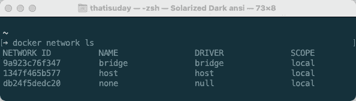

$ docker 网络 ls

该命令显示 Docker 提供的内置网络，它们是不可移除的，因此您不能使用`$ docker network rm <network>`命令(*其中* `*network*` *是* `*NETWORK ID*` *或* `*NAME*`)移除它们。

> *💡*我将使用我们在“[创建您的第一个 Docker 应用程序](https://medium.com/sysf/creating-your-first-docker-application-b0ce40ac67d1)”课程中开发的`thatisuday/express-example`图像来演示一些网络示例。默认情况下，这个映像公开端口`8000`，并运行`node server.js`命令(*使用* `*CMD*` *指令*)来启动一个 express HTTP 服务器，但是，我们可以通过使用`$ docker run <image> <params>`命令提供参数来覆盖这个命令。

# 桥接网络

名为**网桥**的网络是默认情况下容器所连接的**默认网络**。它是由**桥**驱动程序创建的。驱动程序就像网络的模板，具有特定的行为和功能。网桥驱动程序在通常以 IP 地址`172.X.X.X`开始的主机上创建私有 IP 地址的隔离池(*私有* [***子网***](https://en.wikipedia.org/wiki/Subnetwork) )。

我们可以使用`$ docker inspect`或更好的`$ docker network [inspect](https://docs.docker.com/engine/reference/commandline/network_inspect/) <network>`命令来检查网络。我们来看看网络`bridge`网络的配置。

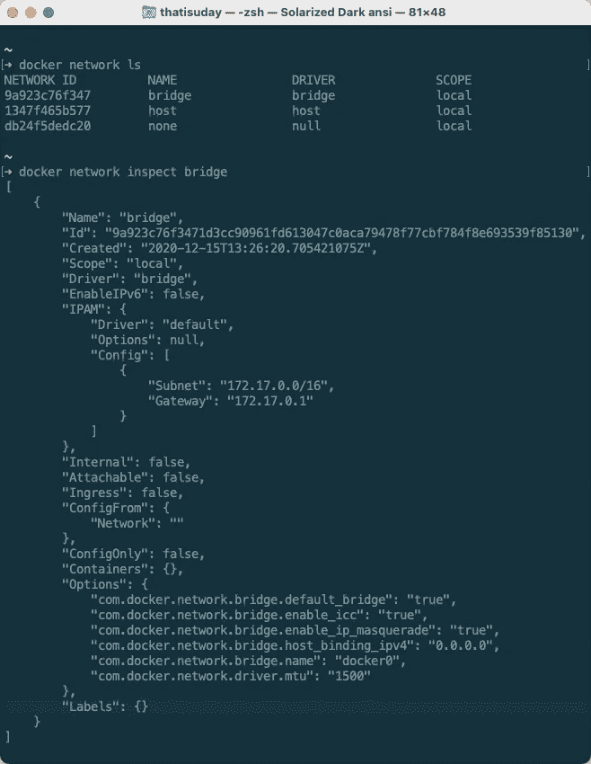

$ docker 网络检查

`$ docker network inspect bridge`命令显示名为`bridge`的网络配置。显示网络名称为`bridge` ( `*Name*` *字段*)，由`bridge`驱动(`*Driver*` *字段*)创建，其`ID`为`9a923c76f347` ( `*Id*` *字段*)。

让我们把注意力集中在上面 JSON 的`IPAM` ( *IP 地址管理*)部分。它显示了`Subnet`和`Gateway`的 IP 地址。`Subnet`字段指定 IP 地址池，在这种情况下，除了作为默认网关的`172.17.0.1`之外，该地址池将从`172.17.X.X`开始。任何将连接到该网络的容器将从该地址池接收一个 IP 地址，并将使用`172.17.0.1`地址作为默认网关。

> *💡*连接到该网络的容器将获得从`172.17.X.X`开始的 IP 地址的原因是，在 [**CIDR**](https://en.wikipedia.org/wiki/Classless_Inter-Domain_Routing#CIDR_notation) 符号中的子网掩码是由`172.17.0.0/16`值表示的`16`。这意味着`172.17.0.0`的前`16`位是固定的，而其他`16`位将用于子网的 IP 池。要了解更多关于子网划分的信息，请观看 [**这段**](https://www.youtube.com/watch?v=ecCuyq-Wprc) 视频。

如果我们看一下`Containers`属性，它似乎是空的。这是因为我们没有连接到这个网络的运行容器。正如我们所了解的，当我们创建一个容器时，默认情况下容器将使用这个网络**。**

**因此，让我们从`thatisuday/express-example`图像创建一个容器。我们将以非分离模式运行这个容器，并用`sh`命令覆盖默认的`node server.js`命令(由 Dockerfile 的 `*CMD*` *指令定义的*)来启动一个 shell。****

```
$ docker run -it --init thatisuday/express-example sh
```

**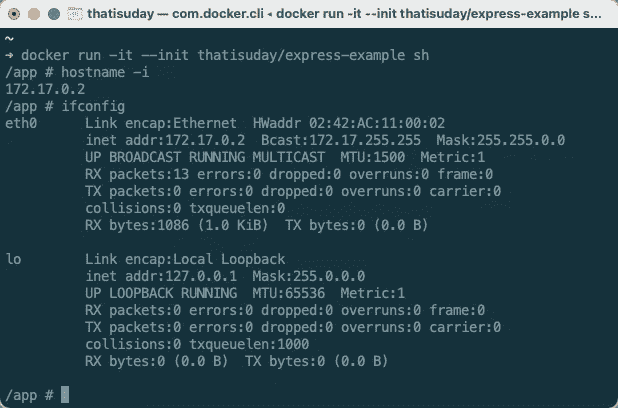**

**$ docker 运行**

**当我们运行容器时，它会将我们放入容器的外壳中，在那里我们可以访问各种 Linux 命令。`$ hostname -i`显示机器的 IP 地址(*容器*)，即`172.17.0.2`。我们可以使用`$ ifconfig`命令查看容器的其他网络配置。**

**从容器的`eth0`网络接口，我们还可以读取 IP 地址和子网掩码。作为子网掩码的`255.255.0.0` IP 地址被翻译成`/16` CIDR 符号。因此，我们可以确认该容器正在使用属于名为`bridge`的网络的`172.17.0.2/16`池中的 IP 地址。**

**让我们使用`$ docker inspect`或者更好的是使用`$ docker container inspect <container>`命令来检查正在运行的容器，以查看容器的网络配置细节。**

**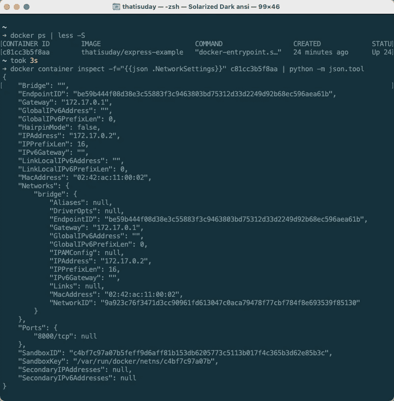**

**我们可以使用`$ docker ps`命令列出正在运行的容器，我们的运行容器 ID 是`c81cc3b5f8aa`。然后使用`$ docker container inspect`命令，我们可以看到`.NetworkSettings`值。好好看看`Networks`房产。它不仅显示`IPAddress`，还显示它所连接的网络，在本例中是 ID 为`9a923c76f347`的`bridge`。**

**现在我们有了一个连接到桥接网络的运行容器，我们应该能够在由`$ docker network inspect`命令返回的 JSON 的`Containers`字段中看到这个容器。**

**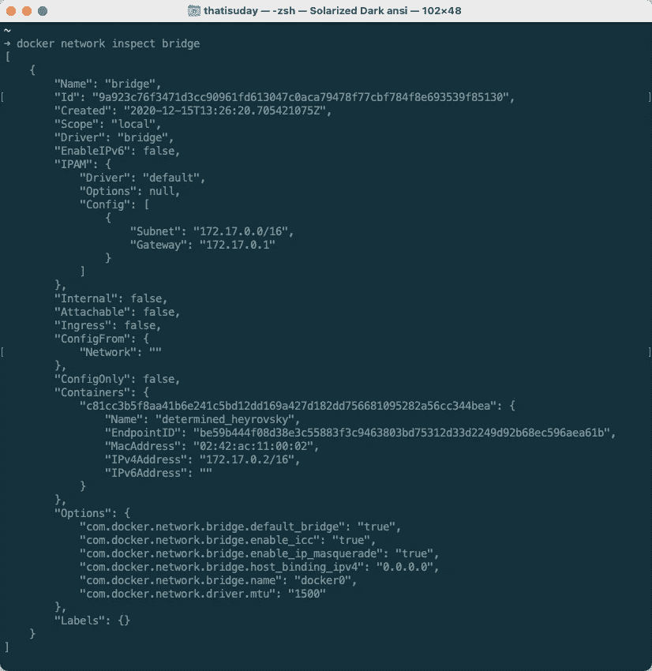**

**$ docker 网络检查**

**一旦我们退出容器，它将不再连接到网络，并且`Container`字段将再次为空。让我们运行另一个容器，但这一次，我们将手动将其连接到网络。所以让我们创建一个桥接网络(*使用桥接驱动*)。**

**我们使用`$ docker network [create](https://docs.docker.com/engine/reference/commandline/network_create/)`命令创建一个网络。`--driver`或`-d`标志设置要使用的驱动程序，如果未提供，默认为`bridge`。我们还可以使用`--subnet`来控制子网( *IP 池*),否则 Docker 会自动配置它。**

```
$ docker network create -d bridge mybridge
```

**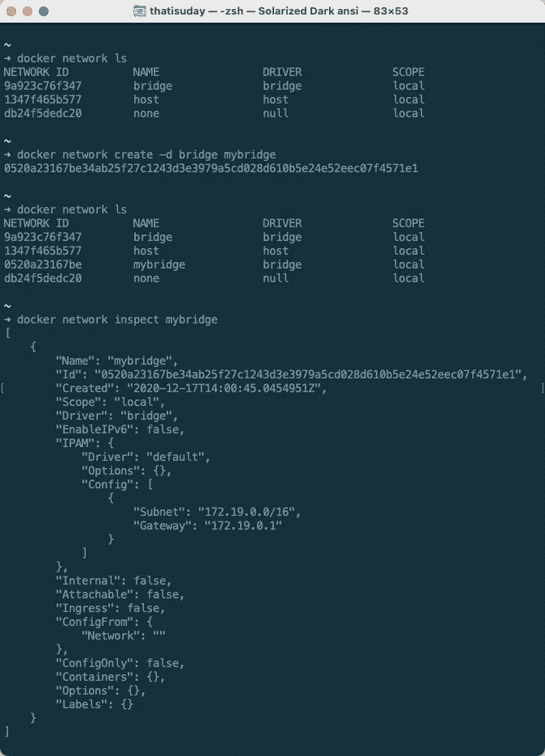**

**$ docker 网络创建**

**在上面的例子中，我们有一个来自`bridge`驱动程序的名为`mybridge`的网络。通过检查，我们可以看到该网络的子网是`172.19.0.0/16`，这意味着任何连接到该网络的容器都将获得一个以`172.19.X.X`开头的 IP 地址。**

**现在让我们从`thatisuday/express-example`图像创建另一个容器，但是这一次，让我们使用带有`$ docker run`的`--network <network>`或`--net <network>`标志手动指定一个网络。**

**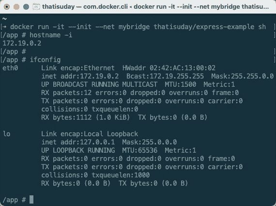**

**$ docker 运行**

**在上面的例子中，我们已经要求 Docker 守护进程将`mybridge`网络连接到我们正在创建的容器，因此 Docker 已经将`172.19.0.2` IP 地址从`mybridge` IP 池分配给容器。**

**您可以使用`$ docker network [connect](https://docs.docker.com/engine/reference/commandline/network_connect/) <network> <container>`命令手动将容器连接到网络。一个容器可以加入多个网络，因此每个网络有多个公共 IP 地址。这样，一个容器可以与不同网络上的多个容器对话，从而使用多种服务。**

**类似地，您可以使用`[disconnect](https://docs.docker.com/engine/reference/commandline/network_disconnect/)`子命令来执行相反的操作。只要没有运行的容器连接到网络，就可以使用`$ docker network [rm](https://docs.docker.com/engine/reference/commandline/network_rm/) <network>`命令删除用户定义的网络。**

## **利益**

**那么拥有一个桥接网络有什么好处呢？桥接网络创建容器可以加入的私有本地网络，并且它与连接到另一桥接网络的容器隔离。**

**桥接网络中的容器就像一台孤立的机器，有自己的公共 IP 地址，可以被同一个网络中的其他容器**和主机使用进行通信。容器的所有端口对主机保持隐藏，主机需要使用`http://<container-ip>:<port>` URL 进行 HTTP 通信。然而，主机可以使用`--publish`或`-p`标志将本地端口与容器的一个端口绑定在一起，使事情变得简单。****

> ***💡*我在 macOS 上使用 Docker，它在虚拟机中运行 Docker 引擎。这确实让事情变得有点复杂，但是我已经在 [**这篇**](https://medium.com/sysf/docker-container-as-an-executable-to-process-images-using-go-golang-5233f9bd3bf7) 文章中解释了如何访问这个虚拟机的外壳。所以每当我说主机时，我指的是这个虚拟机。**

**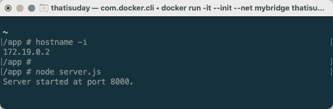**

**(码头集装箱)**

**让我们在之前启动的容器中运行`node server.js`命令，在端口`8000`上启动一个 HTTP 服务器。由于这个容器的 IP 地址是`172.19.0.2`，我们应该能够使用`http://172.19.0.2:8080` URL 从主机访问这个服务器。**

**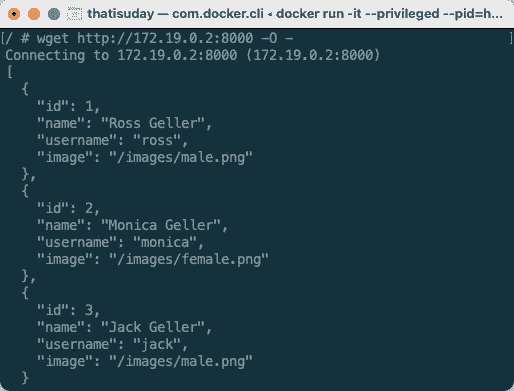**

**(Docker 主机)**

**如您所见，我们从运行在端口`8000`上的 IP 地址为`172.19.0.2`的容器的 HTTP 服务器获得了响应。然而，我们不能使用`http://127.0.0.1:8000`或`http://localhost:8000` URL，因为我们还没有将主机的本地端口映射到容器的端口`8000`。然而，如果我们在`$ docker run`命令中使用`-p 8000:8000`标志，我们应该能够做到这一点。**

****

**(Docker 主机)**

**正如我们所讨论的，桥接网络中的容器不能与另一个桥接网络中的容器通信。为了能够通信，它们应该在同一个网络上。我们可以使用`$ docker network connect`命令将正在运行的容器与网络连接起来。**

**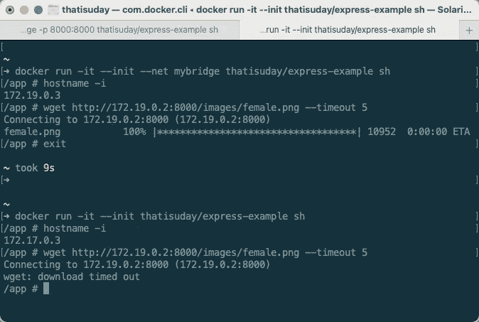**

**在上面的例子中，第一个容器能够从`http://172.19.0.2:8080` URL 下载图像，因为它与服务于 HTTP 端点的容器在同一个网络( *mybridge* )上。然而，第二个容器不能使用这个端点，因为它在默认网络上(*桥*)。**

**桥接网络构建自己的 DNS(域名系统)。默认情况下，每个容器的主机名都映射到其 IP 地址，因此您可以使用`http://<hostname>:<port>`与同一个桥接网络中的容器进行通信。您还可以使用带有`$ docker run`命令的`--net-alias=<alias>`标志在 DNS 中添加一个条目来解析容器的 IP 地址，这样`http://<alias>:<port>`就可以工作了。**

**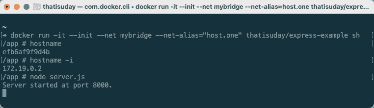**

**(码头集装箱一)**

**在上面的例子中，我们创建了一个使用`mybridge`网络的容器，并为其设置了`host.one`网络别名。让我们创建另一个容器(*有或没有别名*)并使用各种可用选项访问第一个容器的服务。**

**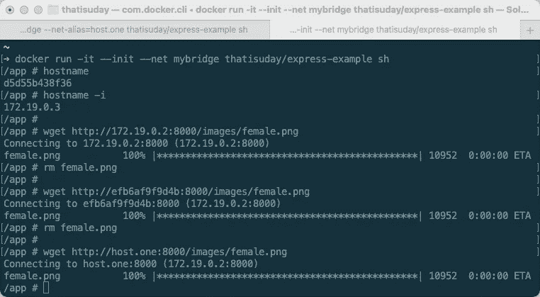**

**(码头集装箱二)**

**从上面的结果可以看出，您可以使用 IP 地址、主机名或网络别名来访问连接到同一个桥接网络的容器。这样，您就不必依赖于容器的 IP 地址或主机名，并且可以自由地使用网络别名。**

> ***💡*要了解更多关于桥网的信息，请关注[](https://docs.docker.com/network/bridge/)**文档。****

# ****主机网络****

****与桥接网络相比，**主机网络**使用主机的网络，因此容器不再被隔离在专用网络中，并且它们不接收公共 IP 地址。它们实际上是主机网络上产生的服务，这就是它们消耗主机端口的原因。****

****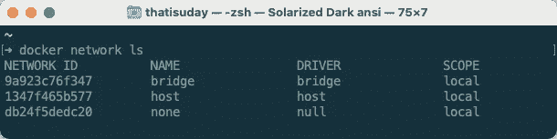****

****$ docker 网络 ls****

****主机网络使用`host`驱动程序，主机上只能有一个主机网络实例。因此，我们不能使用`$ docker network create -d host`命令创建 host 类型的网络，因为 Docker 已经为我们创建了一个主机网络。****

****让我们从`thatisuday/express-example`图像创建一个容器，但是带有`--net=host`标志。因为容器将使用主机的端口，所以`--publish`或`-p`标志没有意义，因此被丢弃并发出警告。****

****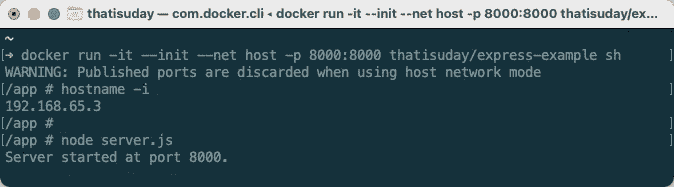****

****(码头集装箱)****

****在上面的例子中，我们已经将`host`网络连接到容器。如果我们检查容器的 ID 地址，它不再以`172.X.X.X`开头，因为我们正在使用主机的网络，并且主机的 IP 地址是`192.168.65.3`。因为我们已经在容器的端口`8000`上启动了一个 HTTP 服务器，它将使用主机的端口`8000`。****

****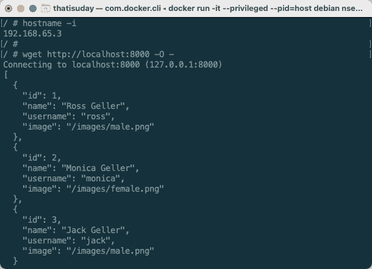****

****(Docker 主机)****

****如您所见，我们能够访问主机上的`http://localhost:8000` URL，就好像我们已经在主机上启动了 HTTP 服务器一样。虽然这看起来很优雅，但你将无法从 macOS 上访问相同的 URL(*比如浏览器*)。要解决这个问题，请遵循 [**这篇**](https://medium.com/@lailadahi/getting-around-dockers-host-network-limitation-on-mac-9e4e6bfee44b) 文章。****

# ****无网络****

****一个**无网络**不向容器提供任何联网能力，这意味着容器对于主机来说就像一个黑盒。主机或任何其他容器将无法与该容器通信。****

********

****$ docker 网络 ls****

****与主机网络类似，不能创建 none 网络。因此，让我们从`thatisuday/express-example`图像创建一个带有`--net=none`标志的容器。这样，容器就不会获得任何公共 IP 地址。它拥有的唯一 IP 地址是它的环回 IP 地址( *localhost* )。****

****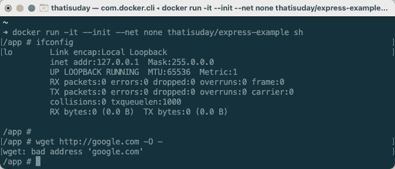****

****(码头集装箱)****

****黑盒容器的用例不多，但它可以用来将自己与主机和其他容器隔离开来。它最适合运行非网络任务，同时避免与外部工作的任何通信。****

****还有其他类型的网络驱动可用，如**覆盖**、 **MACVLAN** 等。这比默认桥接网络提供了更多的功能。想了解更多关于他们的信息，请阅读这篇博文。****

********

****([**thatisuday.com**](http://thatisuday.com)/[/**GitHub**](https://github.com/thatisuday)/[**Twitter**](https://twitter.com/thatisuday)/**stack overflow****/[**insta gram**](https://www.instagram.com/thatisuday/))******

************