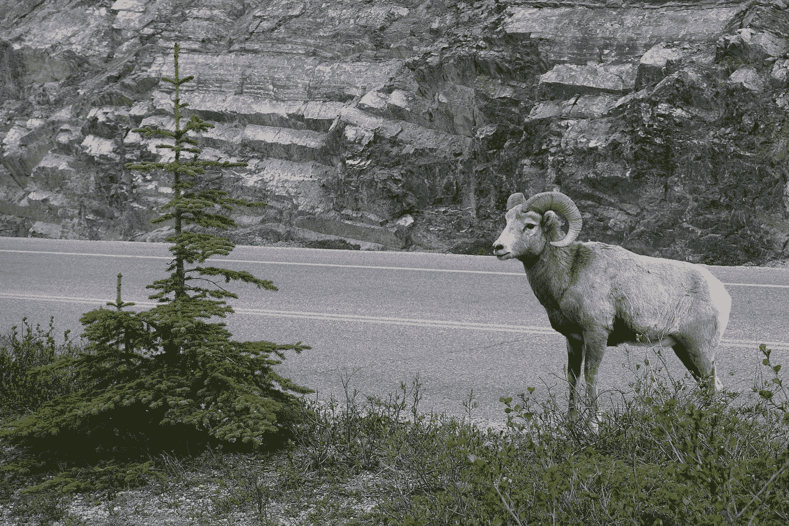

# Ramda 入门指南(第二部分)——镜头

> 原文：<https://itnext.io/a-beginners-guide-to-ramda-part-2-lenses-62bdd3993598?source=collection_archive---------3----------------------->



照片由 [Kazden Cattapan](https://unsplash.com/@kazdenc?utm_source=medium&utm_medium=referral) 在 [Unsplash](https://unsplash.com?utm_source=medium&utm_medium=referral) 上拍摄

如果你错过了本指南的第 1 部分，我们讨论了使用 Ramda 的自动绘制和函数组合。在第二部分中，我们将仔细研究透镜。

# 什么是镜头？

镜头允许你“聚焦”一个对象的嵌套属性，并对其执行操作，同时保持原始对象的上下文。

# 为什么要用镜片？

> 透镜的真正美妙之处在于，我们可以更新物体的属性，而无需改变原始物体。

在 Ramda 中，我们可以用镜头对一个对象执行 3 种类型的操作。

*   获得财产
*   设置属性
*   调用属性上的函数

由于在 javascript 中从对象获取属性是一个简单的操作，因此 lenses 的大部分功能将来自于设置和转换属性。

透镜的真正美妙之处在于，我们可以更新物体的属性，而无需改变原始物体。然而，不是克隆整个结构，而是进行相关目标的浅层克隆，并且新结构将保留指向未接触的数据结构的指针。更明显的是，在较大的对象中，这将给我们带来更好的性能，降低时间和空间的复杂性。

让我们更深入地看看我们可以使用镜头执行的一些操作。

# 获取属性

下面，我们将创建一个`game`对象。要从这个对象获得一个属性，我们需要创建一个镜头，然后将镜头和对象传递给`view`。我们可以使用`lensProp`、`lensPath`、`lensIndex`来创建一个镜头。

```
const game = {
  name: 'Keep Talking and Nobody Explodes',
  genres: ['Puzzle', 'VR'],
  publisher: {
    name: 'Steel Crate Games',
    location: 'Ottawa, Canada'
  }
}const name = R.lensProp('name')
R.view(name, game)
> 'Keep Talking and Nobody Explodes'const first = R.lensIndex(0)
R.view(first, game.genres)
> 'Puzzle'const publisherName = R.lensPath(['publisher', 'name'])
R.view(publisherName, game)
> 'Steel Crate Games'// You can also reference indexes with lensPath
const firstGenre = R.lensPath(['genre', 0])
R.view(firstGenre, game)
> 'Puzzle'
```

还有一个叫做`lens`的方法，需要你传递一个 getter 和一个 setter 函数给它。在大多数情况下，你应该能够实现你所需要的其他三个镜头功能之一。下面我们有一个它的用法的例子。

```
const name = R.lens(R.prop('name'), R.assoc('name'));// achieves the same thing
const alsoName = R.lensProp('name')
```

# 设置属性

这就是镜头真正强大的地方。我们使用一个名为`set`的函数，它接受一个镜头、一个值和要操作的对象。下面的例子:

```
const game = {
  name: 'Overcooked',
  platforms: ['PS4', 'XB1', 'NS', 'PC'],
  publisher: {
    name: 'Team 17',
    location: 'Wakefield, England'
  }
}const firstPlatform = R.lensPath(['platforms', 0])const newGame = R.set(firstPlatform, 'PS5', game)
> {
    name: 'Overcooked',
    platforms: ['PS5', 'XB1', 'NS', 'PC'],
    publisher: {
      name: 'Team 17',
      location: 'Wakefield, England'
    }
  }
```

`set`返回了一个新对象，第一个平台从`"PS4"`更新到了`"PS5"`。注意`platforms`已经被浅克隆，而`publisher`仍然是对同一个对象的引用。

```
game.platforms === newGame.platforms
> falsegame.publisher === newGame.publisher
> true
```

# 对属性调用函数

使用`over`方法，我们可以使用一个函数来转换我们的数据。`over`方法采用一个镜头、一个函数和一个数据结构。

```
const person = {
  name: 'Bev',
  gender: 'female'
}const addMs = (name) => `Ms. ${name}`
const nameLens = R.lensProp('name')R.over(nameLens, addMs, person)
> {
    name: 'Ms. Bev',
    gender: 'female'
  }
```

简单，但功能强大。同样，我们最初的`person`数据结构保持不变。

现在让我们将镜头和一些 Ramdas 的其他函数组合在一起，以实现更复杂的变换。

```
const people = [{
  name: 'Terry',
  cats: ['Korin', 'Sweep', 'Caterina']
}, {
  name: 'Trevor',
  cats: ['Jazz']
}]const cats = R.lensProp('cats')
const uppercaseCats = R.map(R.over(cats, R.map(R.toUpper)))uppercaseCats(people)
> [{
    name: 'Terry',
    cats: ['KORIN', 'SWEEP', 'CATERINA']
  }, {
    name: 'Trevor',
    cats: ['JAZZ']
  }]
```

现在让我们把每只猫变成一个有名字和年龄的物体。我们想让每只猫的年龄翻倍。我们如何解决这个问题？

```
const person = {
  name: 'Terry',
  cats: [{
    name: 'Korin',
    age: 4
  }, {
    name: 'Sweep',
    age: 3
  }, {
    name: 'Catarina',
    age: 2
  }]
}const double = (x) => x * 2
const cats = R.lensProp('cats')
const age = R.lensProp('age')
const doubleCatsAge = R.over(
  cats, 
  R.map(R.over(age, double))
)doubleCatsAge(person)
> {
    name: 'Terry',
    cats: [{
      name: 'Korin',
      age: 8
    }, {
      name: 'Sweep',
      age: 6
    }, {
      name: 'Catarina',
      age: 4
    }]
  }
```

首先，我们聚焦于`cats`数组，然后我们使用`map`来操作数组中的每一项，然后我们再次聚焦于`age`，然后对其进行转换。

# 合成镜头

镜头的一个奇妙之处在于它们是可组合的。这意味着每个镜头都是一个组合单元，可以重复使用。让我们再来看看我们的`game`例子，但是这次是用 API 封装的。我们可以将透镜组合在一起，用于封装和非封装数据结构。

```
const game = {
  name: 'Keep Talking and Nobody Explodes',
  genres: ['Puzzle', 'VR'],
  publisher: {
    name: 'Steel Crate Games',
    location: 'Ottawa'
  }
}// We wrap the game in an "envelope" response from an API
const response = {
  statusCode: 200,
  body: game
}const publisherName = R.lensPath(['publisher', 'name']);
const body = R.lensProp('body')// Compose the 2 lenses together
const bodyPublisherName = R.compose(body, publisherName)const a = R.view(publisherName, game)
> 'Steel Crate Games'const b = R.view(bodyPublisherName, response)
> 'Steel Crate Games'
```

我们将两个镜头`publisherName`和`body`组合在一起，创造出第三个镜头，称为`bodyPublisherName`。我们可以在内部和外部使用`publisherName`。`body`将有助于与信封内的任何数据结构组合在一起。真是太贴心了。

# 构成修改

这是我从看 [EvilSoft](https://www.youtube.com/channel/UCc8LoGpIa8tRNosGGJroS2Q) 的这个超赞的[视频](https://www.youtube.com/watch?v=tvHghZBMVJU)中学到的一招。基本上，我们可以创建一个修改数组，并将它们组合在一起，对数据结构进行一系列修改。

```
const game = {
  name: 'Dead Nation',
  genres: ['Twin Stick Shooter', 'Shoot em up'],
  publisher: {
    name: 'Sony Interactive',
    location: 'California, USA'
  }
}const reverse = R.pipe(R.split(''), R.reverse, R.join(''))
const name = R.lensProp('name')
const publisherName = R.lensPath(['publisher', 'name']);
const genres = R.lensProp('genres')const mods = [
  R.set(name, 'Alienation'),
  R.over(publisherName, R.toUpper),
  R.over(genres, R.map(reverse))
]R.compose(...mods)(game)
> {
    name: 'Alienation',
    genres: ['retoohS kcitS niwT', 'pu me toohS'],
    publisher: {
      name: 'SONY INTERACTIVE',
      location: 'California, USA'
    }
  }
```

# 总结

希望 lenses 能帮助你写出可组合的、无副作用的代码。如果你喜欢这篇文章，别忘了给点掌声:)