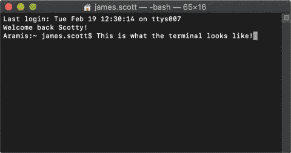

# Twitter API 初学者指南

> 原文：<https://itnext.io/a-beginners-guide-to-using-the-twitter-api-839c8d611b8c?source=collection_archive---------1----------------------->


您可以使用 Twitter API 来更新您的状态，或者向其他用户发送推文和媒体，而无需实际登录 Twitter。你也可以从你所在的地理位置的其他用户那里获取一个关于特定标签的最新推文列表。

这听起来可能很复杂，但是你真的不需要成为一名开发人员来玩这个 API，并亲自尝试其中的一些东西。

# 🤔什么是 Twitter API？

API 是[应用程序编程接口](https://en.wikipedia.org/wiki/Application_programming_interface)的缩写，基本上是两个软件应用程序相互通信的方法列表。主要方法有:

*   **获取**:方法给**检索**一些数据。
*   **POST** :方法**创建**一些数据。
*   **放**:方法为**更新**一些数据。
*   **删除**:删除部分数据**的方法。**

人们用来定义 API 的一个最流行的类比是把它想象成一份餐馆菜单。它提供了客户(另一个软件)可以从厨房(一个软件)订购的项目列表。

Twitter API 允许您在不打开 Twitter 应用程序的情况下访问数据和发送数据，如消息和媒体。相反，你可以使用命令行工具来发送它们，如 [cURL](https://en.wikipedia.org/wiki/CURL) 或 [Twurl](https://github.com/twitter/twurl) ，这是一种授权特定用户访问 Twitter API 的工具。

# 💻如何打开终端

在你开始安装东西之前，你应该熟悉如何打开终端。这是您用来发送 Twitter API 调用的命令行界面(CLI ):



如果你使用的是 Mac，你可以通过进入**Finder**>**Applications**>**Utilities**>**Terminal**打开终端。或者可以按 **CMD** + **空格键**打开聚光灯，搜索‘终端’。

如果你使用的是 Windows 10 机器，选择**启动**并搜索“cmd”打开**命令提示符**。对于 Windows 7 及以上版本，选择**开始** > **所有程序** > **附件** > **命令行提示**。

# 🎬开始之前

开始之前，您必须满足以下要求:

*   创建一个 Twitter 开发者账户。你可以在这里做这个[。](http://href="https://developer.twitter.com/en/apply/user")
*   在此打开应用管理页面[并创建一个应用。你只需要给它一个名字，输入任何网站的网址和 100 字的描述。](https://developer.twitter.com/en/apps)
*   安装 Ruby。你需要这个来运行 Twurl。参见此处的安装选项。
*   安装 Twurl。点击查看 Twitter 安装文档[。](https://developer.twitter.com/en/docs/tutorials/using-twurl.html)

你可以选择安装 JQ，一个命令行 JSON 处理器。这使得 API 调用返回的 JSON 响应更容易阅读。

```
**NOTE**: Do not use JQ if you intend to use the output (e.g. a media ID) in a subsequent call. Integers longer than 53-bits break in JavaScript (mentioned in the JQ FAQ [here](https://github.com/stedolan/jq/wiki/FAQ#numbers)) so the numeric ID displayed will be incorrect. Thanks for the warning [Andy Piper](https://medium.com/u/da72a673691c?source=post_page-----839c8d611b8c--------------------------------)!
```

您可以通过在每个请求的末尾键入`| jq` 来使用这个工具。参见此处的安装选项。

# 🔑获取您的 API 和密钥

要向 Twitter 发送 API 调用，您需要一组对您的开发人员帐户唯一的访问键。要取回您的钥匙:

1.  登录您的 Twitter 开发者账户。
2.  进入你的[应用程序管理界面](https://developer.twitter.com/en/apps)，点击你的应用程序的**详细信息**。
3.  点击**密钥和令牌**选项卡，生成一个新的 API 密钥。
4.  复制或记下消费者 API 和密钥。
5.  通过在您的终端上运行以下命令来授权您的 Twitter 应用程序和帐户(用您唯一的密钥替换`<key>`和`<secret>`):

```
twurl authorize -consumer-key <key> -consumer-secret <secret>
```

6.Twurl 返回一个 url。将其复制并粘贴到浏览器中以接收 PIN。

7.将 PIN 复制并粘贴到您的终端中，然后按 Enter。

现在，你可以走了！更多信息见 Twitter 关于[认证](https://developer.twitter.com/en/docs/basics/authentication/guides/securing-keys-and-tokens)的文档。

# 🌪️如何使用 Twurl

Twurl 基本上是专门为 Twitter API 修改的 cURL。它授予您一个访问令牌，并用该访问令牌对您发送的所有后续请求进行签名。

关于基本用法的指南，您可以在终端中运行`twurl -h` help 命令。最有用的选项是:

```
**-d, --data [data]  **              
Sends the specified data in a POST request to the HTTP server.**-A, --header [header] **           
Adds the specified header to the request to the HTTP server.**-H, --host [host] **               
Specify host to make requests to (default: api.twitter.com)**-X, --request-method [method]  **  
Request method (default: GET)**-f, --file [path_to_file] **       
Specify the path to the file to upload**-F, --file-field [field_name]  **  
Specify the POST parameter name for the file upload data (default: media)
```

关于它如何工作的基本教程运行:`twurl -T`或`twurl --tutorial`。

# 📮更新您的 Twitter 状态

您可以使用`statuses/update` POST 端点更新您的 Twitter 状态。正如[文档](https://developer.twitter.com/en/docs/tweets/post-and-engage/api-reference/post-statuses-update)所说，这“更新了认证用户的当前状态”(也称为发送 Tweet)。

为了将我的 Twitter 状态更新为“测试 Twitter API…”我发送了以下请求:

```
twurl -d 'status=Testing out the Twitter API...' /1.1/statuses/update.json | jq
```

我用 Twurl 发的推文是这样的:

# 📀将媒体上传到 Twitter

您也可以使用 Twurl 将以下媒体上传到 Twitter:

*   最大 5MB 的图像。
*   最大 15MB 的 GIF 文件。
*   最大 15MB 的视频。

要从您的计算机上传文件，您可以使用`media/upload`端点:

```
twurl -X POST -H upload.twitter.com "/1.1/media/upload.json" -f <file_location> -F <file_type>
```

例如，要从我的桌面上传 GIF，我运行以下命令:

```
twurl -X POST -H upload.twitter.com "/1.1/media/upload.json" -f ~/Desktop/itworked.gif -F media
```

响应包含您发布到 Twitter 所需的媒体 ID:

```
{
  "media_id": 1097859492425973760,
  "media_id_string": "1097859492425973760",
  "size": 469653,
  "expires_after_secs": 86400,
  "image": {
  "image_type": "image/gif",
  "w": 500,
  "h": 271
  }
}
```

你可以在这里阅读更多关于上传媒体到 Twitter [的信息。](https://developer.twitter.com/en/docs/media/upload-media/overview)

# 📟回复推文

您可以再次使用`statuses/update`发布端点上传帖子来回复之前的推文。

为了用包含我上传的 GIF 的回复更新我之前的推文，我发送了以下请求:

```
twurl -X POST -H api.twitter.com "/1.1/statuses/update.json?status=@scottydocs It worked&in_reply_to_status_id=1097511310961639427&media_ids=1097859492425973760" | jq
```

推特上的回应如下:

# 🚀检索带有特定标签的推文

您可以使用`search/tweets` GET 端点检索带有特定标签的所有 Tweets。默认情况下，这只检索过去七天内发送的推文。

例如，如果您想要检索所有使用#starwars 标签的 Tweets，您可以运行:

```
twurl "/1.1/search/tweets.json?q=#starwars"
```

或者，要检索带有#starwars 标签的最受欢迎的推文，您可以运行:

```
twurl "/1.1/search/tweets.json?q=#starwars&result_type=popular"
```

# 📈寻找你当地的趋势

要了解您所在位置的趋势，您可以使用`trends/place`获取端点。您需要提供的唯一必填字段是 Yahoo！你的位置在地球上的什么地方。我用这个网站找到了我的。

例如，如果我想了解伦敦 Twitter 上的最新动态(WOEID 44418):

```
twurl "/1.1/trends/place.json?id=44418" | jq
```

响应如下所示:

# 🤖你还能做什么？

这些只是您可以使用 Twitter API 和 Twurl 调用的一些基本函数。如果你想更进一步，你可以使用这些端点和其他端点来创建 Twitter 机器人。以下是一些可能有用的资源:

*   [推特机器人教程](https://digitalinspiration.com/docs/twitter-bots)。
*   如何制作一个 Twitter 机器人:初学者完全指南。
*   [如何在一小时内制作一个推特机器人](https://medium.com/science-friday-footnotes/how-to-make-a-twitter-bot-in-under-an-hour-259597558acf)。

您可以构建的机器人的一些潜在用例包括:

*   转发和分享带有特定标签的内容。
*   显示关于某个主题或标签的实时更新。
*   提醒您自己或您的关注者特定的事件。

希望本指南中的一些内容对您有所帮助。祝你好运，用 Twitter API 发送你的第一条推文，或者甚至可能创建更酷的东西！