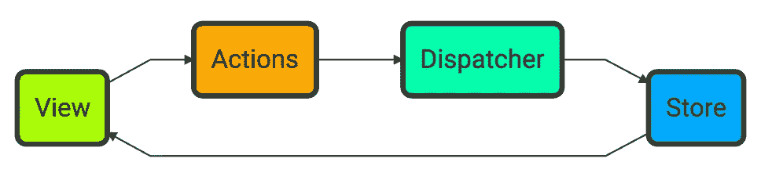

# 测试 Redux 代码的更好方法

> 原文：<https://itnext.io/a-better-approach-for-testing-your-redux-code-62b46ddb9e3c?source=collection_archive---------4----------------------->


贝娄的文章之前已经发表在我的博客上:

[](https://blog.henriquebarcelos.dev/a-better-approach-for-testing-your-redux-code-ck3dnpqnu00uro4s178b8aw3e) [## 测试 Redux 代码的更好方法

### TL；当测试 Redux 时，这里有一些准则:Vanilla Redux Redux 中最小的独立单元是整个…

henriquebarcelos.dev](https://blog.henriquebarcelos.dev/a-better-approach-for-testing-your-redux-code-ck3dnpqnu00uro4s178b8aw3e) 

我最终会把我所有的内容都转移到 Medium 那里，所以如果你喜欢你在这里读到的东西，就跟着我去那里吧。我可能也会更经常地发帖。

# TL；速度三角形定位法(dead reckoning)

在测试 Redux 时，这里有一些指导原则:

# 香草冰淇淋

*   Redux 中最小的独立单元是整个状态片。单元测试应该作为一个整体与之交互。
*   孤立地测试还原器、动作创建器和选择器是没有意义的。由于它们彼此紧密耦合，隔离给我们带来的价值微乎其微。
*   测试应该以与应用程序相同的方式与 Redux slice 交互。创建者和选择器，而不必单独编写针对他们的测试。
*   避免像针对状态对象的`toEqual` / `toDeepEqual`这样的断言，因为它们会在测试和状态结构之间产生耦合。
*   使用选择器为您提供了运行简单断言所需的粒度。
*   选择器和动作创建器应该很无聊，所以不会需要测试。
*   您的切片在某种程度上相当于一个纯函数，这意味着您不需要任何模拟工具来测试它。

# Redux + `redux-thunk`

*   调度 thunks 没有任何直接效果。只有在 thunk 被调用之后，我们才会有使我们的应用程序工作所需的副作用。
*   在这里，你可以使用存根，间谍，有时模仿(但[不要滥用模仿](https://medium.com/javascript-scene/mocking-is-a-code-smell-944a70c90a6a))。
*   由于 thunks 的构造方式，测试它们的唯一方法是测试它们的实现细节。
*   测试 thunk 的策略是设置存储，调度 thunk，然后断言它是否按照您期望的顺序调度了您期望的操作。

我创建了一个[回购](https://github.com/hbarcelos/better-redux-tests)来实现上面的想法。

# 介绍

作为一名软件工程师，我总是想方设法提高自己的技能。这并不容易。一点也不。编码已经够难了。编写好的代码更难。

然后还有测试。我想每次我开始一个新项目时——无论是专业的还是仅仅为了好玩——我应该如何测试我的代码变化的想法。每一个。单身。时间。这不一定是一件坏事，因为不同的问题需要不同的解决方案，但这仍然让我有点好奇。

# 测试的问题是

作为一名 TDD 实践者，我了解到我们编写测试的主要原因不是为了断言代码的正确性——这只是一个很酷的副作用。首先编写测试的最大好处是，它可以指导您设计接下来要编写的代码。如果有些东西很难测试，可能有更好的方法来实现它。

然而，如果你已经这样做了一段时间，你会意识到写好的测试和写产品代码一样难。有时甚至更难。编写测试需要时间。额外的时间是你的客户或你公司的商务人员不会轻易给你的。


没人有时间做那个！(图片由 Unsplash 上的 Aron Visuals 提供)

而且越来越糟。即使您能够编写适当的测试，在您正在工作的产品/项目的整个生命周期中，需求将会改变，新的场景将会出现。编写太多的测试，使它们非常复杂，应用程序中的任何微小变化都需要花费很大的努力才能使所有的测试再次通过。古怪的测试是另一个问题。当它失败时，你不知道要开始修复它。您可能只需要重新运行测试套件，如果它通过了，您就可以开始了。


薛定谔的测试:有时候他们失败了，有时候他们通过了，但是你不能确定(图片由齐杰在 Flickr 上提供)

但是您如何知道您是否正在编写好的测试呢？到底什么才是好的测试？

# 测试学校

在被称为伦敦学派和底特律测试学派的两种不同思潮之间存在着长期的争论。

总结他们的差异，底特律认为软件应该自下而上构建，强调设计模式，而[测试应该尽可能少地了解实现](https://en.wikipedia.org/wiki/Black-box_testing)，几乎没有或根本没有存根/模仿，伦敦主张设计应该自上而下，使用外部约束作为起点，通过大量使用存根/模仿来确保测试套件之间的最大隔离，这有一个副作用[必须知道测试主题是如何实现的](https://en.wikipedia.org/wiki/White-box_testing)。

这是一个非常简短的总结——甚至冒着因为简洁而出错的风险——但是你可以找到更多关于这个二十年前的难题的好参考资料[这里](https://github.com/testdouble/contributing-tests/wiki/Detroit-school-TDD)，这里[这里](https://github.com/testdouble/contributing-tests/wiki/London-school-TDD)和[这里](https://medium.com/@adrianbooth/test-driven-development-wars-detroit-vs-london-classicist-vs-mockist-9956c78ae95f)。

# 真实世界中的测试

那么伦敦人和德特罗提人谁是对的呢？[他们俩和他们俩都不同时](https://blog.ncrunch.net/post/london-tdd-vs-detroit-tdd.aspx)。在我成为专业软件工程师的近 5 年时间里，我了解到，教条主义不会让你在现实世界中走得太远，在现实世界中，项目应该交付，产品预期应该匹配，你有账单要付。

你真正需要的是能够两全其美地利用[和](https://blog.ncrunch.net/post/london-tdd-vs-detroit-tdd.aspx)。明智地使用它。

我们生活在一个似乎每个人都痴迷于~近乎~完美的代码覆盖的世界，而[冗余覆盖](https://github.com/testdouble/contributing-tests/wiki/Redundant-Coverage)的问题却很少被提及——很难找到讨论这个问题的在线参考资料。如果你滥用测试，当你的需求突然改变的时候，你可能会很难过。

最后，我们不是靠写测试赚钱的，我们是靠通过代码解决别人的问题赚钱的。编写测试是昂贵的，并且不会给客户/用户增加**可感知的**价值。有人可能会说测试增加了价值，但以我的个人经验，很难让非技术人员相信这一点。

作为软件工程师，我们应该努力编写最少数量的测试，对代码质量和正确性产生足够的信心——“足够”是[高度依赖于上下文](https://medium.com/javascript-scene/why-cutting-costs-is-expensive-how-9-hour-software-engineers-cost-boeing-billions-b76dbe571957)。

# 根据文件重复测试

众所周知，Redux 有非常好的文档。事实上这是真的。这里不仅有 API 文档和一些快速示例，还有一些有价值的最佳实践建议，甚至还有一些链接，指向关于 Redux 及其生态系统的更深入的讨论。

然而，我认为[“编写测试”](https://redux.js.org/recipes/writing-tests)部分还有待改进。

# 测试动作创建者

文档中的这一部分从动作创建者开始。

```
export function addTodo(text) {
  return {
    type: 'ADD_TODO',
    text
  }
}
```

然后我们可以这样测试它:

```
import * as actions from '../../actions/TodoActions'
import * as types from '../../constants/ActionTypes'describe('actions', () => {
  it('should create an action to add a todo', () => {
    const text = 'Finish docs'
    const expectedAction = {
      type: types.ADD_TODO,
      text
    }
    expect(actions.addTodo(text)).toEqual(expectedAction)
  })
})
```

虽然测试是正确的并且顺利通过，但是这里的根本问题是**它没有增加多少价值**。你的常规动作创建者应该是**非常无聊的**，几乎是声明性代码。你不需要为此做测试。

此外，如果你使用像`[redux-act](https://github.com/pauldijou/redux-act)`或 Redux 自己的`[@reduxjs/toolkit](https://github.com/reduxjs/redux-toolkit)`这样的助手库——你**应该**——那么完全没有理由为它们编写测试，因为你的测试将测试助手库本身，它们已经被测试过了，更重要的是，它们甚至不属于你。

由于动作创作者在真实的应用程序中可能非常多产，他们需要的测试量是巨大的。

> 但是我们怎么能确定我们简单的动作创作者没有包含像打字错误这样的愚蠢错误呢？

请原谅我。稍后会详细介绍。

# 测试减速器

在 Redux 中，reducers 是一个给定状态和动作的函数，应该产生一个全新的状态，而不改变原来的状态。减速器是纯函数。纯功能对测试人员来说就像天堂。这应该很简单，对吧？

文件给我们举了以下例子:

```
import { ADD_TODO } from '../constants/ActionTypes'const initialState = [
  {
    text: 'Use Redux',
    completed: false,
    id: 0
  }
]export default function todos(state = initialState, action) {
  switch (action.type) {
    case ADD_TODO:
      return [
        {
          id: state.reduce((maxId, todo) => Math.max(todo.id, maxId), -1) + 1,
          completed: false,
          text: action.text
        },
        ...state
      ] default:
      return state
  }
}
```

然后是测试:

```
describe('todos reducer', () => {
  it('should return the initial state', () => {
    expect(reducer(undefined, {})).toEqual([
      {
        text: 'Use Redux',
        completed: false,
        id: 0
      }
    ])
  }) it('should handle ADD_TODO', () => {
    expect(
      reducer([], {
        type: types.ADD_TODO,
        text: 'Run the tests'
      })
    ).toEqual([
      {
        text: 'Run the tests',
        completed: false,
        id: 0
      }
    ]) expect(
      reducer(
        [
          {
            text: 'Use Redux',
            completed: false,
            id: 0
          }
        ],
        {
          type: types.ADD_TODO,
          text: 'Run the tests'
        }
      )
    ).toEqual([
      {
        text: 'Run the tests',
        completed: false,
        id: 1
      },
      {
        text: 'Use Redux',
        completed: false,
        id: 0
      }
    ])
  })
})
```

让我们忽略这样一个事实，即建议的测试用例*“应该处理 ADD _ TODO”*实际上是两个捆绑在一起的测试——这可能会让一些测试狂热者抓狂。即使在这种情况下，我认为最好有不同的测试用例——一个用于空列表，另一个用于有初始值的列表——有时这也很好。

这些测试的真正问题是**它们与减速器**的内部结构紧密耦合。更准确地说，上面的测试通过那些`.toEqual()`断言耦合到状态对象结构。

虽然这个例子相当简单，但是 Redux 中给定片的状态随着时间的推移而改变是很常见的，因为新的需求到来，并且需要发生一些不可预见的交互。如果我们像上面那样编写测试，它们将很快成为维护的噩梦。状态结构的任何微小变化都需要更新几个测试用例。

> 那么我们到底应该如何编写这些测试呢？

# 以正确的方式测试 Redux

**免责声明:**我并不是说这是测试您的 Redux 应用程序的最佳或唯一方式，但是我最近得出结论，按照我下面建议的方式进行会产生我所知道的最佳成本效益。如果你碰巧知道更好的方法，请通过评论、Twitter、电子邮件或吸烟标志联系我。

下面是 Redux 应用程序的一个流行的文件夹结构，它与许多教程甚至官方文档中的文件夹结构非常相似:

```
src
└── store
    ├── auth
    │   ├── actions.js
    │   ├── actionTypes.js
    │   └── reducer.js
    └── documents
        ├── actions.js
        ├── actionTypes.js
        └── reducer.js
```

如果您像我一样，喜欢将测试文件与源代码放在一起，这种结构鼓励您拥有以下内容:

```
src
└── store
    ├── auth
    │   ├── actions.js
    │   ├── actions.test.js
    │   ├── actionTypes.js
    │   ├── reducer.js
    │   └── reducer.test.js
    └── documents
        ├── actions.js
        ├── actions.test.js
        ├── actionTypes.js
        ├── reducer.js
        └── reducer.test.js
```

我已经省略了`actionTypes`测试，因为这些文件完全是声明性的。然而，我已经解释了为什么动作创建者应该是纯声明性的，因此也不应该被测试。这让我们测试唯一的减速器本身，但这似乎不太正确。

这里的问题是我们所理解的 Redux 中的*“单位”*。大多数人倾向于把上面的每一个单独的文件看作一个单元。我相信这是一种误解。动作、动作类型和减速器**必须**紧密耦合才能正常工作。对我来说，孤立地测试这些“组件”没有意义。它们都需要组合在一起形成一个片(例如:上面的`auth`和`documents`，我认为这是 Redux 架构中最小的独立片。

出于这个原因，我发现了[鸭子](https://github.com/erikras/ducks-modular-redux)的模式，尽管[有一些警告](https://twitter.com/dan_abramov/status/738405796770353152)。Ducks 的作者主张关于单个切片(他们称之为*“duck”*)的所有东西都应该放在一个文件中，并遵循定义良好的导出结构。

我通常有一个更像这样的结构:

```
src
└── modules
    ├── auth
    │   ├── authSlice.js
    │   └── authSlice.test.js
    └── documents
        ├── documentsSlice.js
        └── documentsSlice.test.js
```

现在的想法是尽可能编写最少的测试，同时对某个特定部分按预期工作有很大的信心。Redux 首先存在的原因是为了帮助我们操纵状态，为我们的应用程序状态提供一个单一的位置。

换句话说，Redux 为我们提供的价值是从一个集中的位置(称为存储)读写状态的能力。由于 Redux 基于[通量架构](https://facebook.github.io/flux/)，其常规流程大致如下:



媒介上的流动建筑

# 冗余测试策略

在一天结束时，我们想要测试的是我们是否正确地通过调度操作写入和从存储中读取。我们这样做的方法是给定一个初始状态，我们分派一些动作给存储，让 reducer 工作，然后我们检查状态，看看是否进行了我们期望的更改。

然而，我们如何做到这一点，同时避免将测试与状态对象结构相结合的陷阱呢？简单。[始终使用选择器](https://medium.com/javascript-scene/10-tips-for-better-redux-architecture-69250425af44#975e)。甚至那些看起来很蠢的。

选择器是你用来读取数据的公共 API。它们可以封装您的状态内部结构，并以应用程序需要的粒度只公开应用程序需要的数据。[您也可以通过记忆](https://github.com/reduxjs/reselect)获得计算数据并优化它。同样，action creators 是它写数据的公共 API。

还在迷茫？让我们使用`[@reduxjs/toolkit.](https://redux-toolkit.js.org/)`来尝试一些代码

以下是我的验证片段:

```
import { createSlice, createSelector } from '@reduxjs/toolkit';export const initialState = {
  userName: '',
  token: '',
};const authSlice = createSlice({
  name: 'auth',
  initialState,
  reducers: {
    signIn(state, action) {
      const { token, userName } = action.payload; state.token = token;
      state.userName = userName;
    },
  },
});export const { signIn } = authSlice.actions;export default authSlice.reducer;export const selectToken = state => state.auth.token;
export const selectUserName = state => state.auth.userName;
export const selectIsAuthenticated = createSelector([selectToken], token => token !== '');
```

这个文件没有什么特别的。我使用的是`createSlice`助手，它为我节省了很多样板代码。导出结构或多或少遵循了 Ducks 模式，主要区别在于我没有显式导出动作类型，因为它们是在动作创建者的`type`属性中定义的(例如:`signIn.type`返回`'auth/signIn'`)。

现在使用`[jest](https://jestjs.io/)`实现测试套件:

```
import reducer, { initialState, signIn, selectToken, selectName, selectIsAuthenticated } from './authSlice';describe('auth slice', () => {
  describe('reducer, actions and selectors', () => {
    it('should return the initial state on first run', () => {
      // Arrange
      const nextState = initialState; // Act
      const result = reducer(undefined, {}); // Assert
      expect(result).toEqual(nextState);
    }); it('should properly set the state when sign in is made', () => {
      // Arrange
      const data = {
        userName: 'John Doe',
        token: 'This is a valid token. Trust me!',
      }; // Act
      const nextState = reducer(initialState, signIn(data)); // Assert
      const rootState = { auth: nextState };
      expect(selectIsAuthenticated(rootState)).toEqual(true);
      expect(selectUserName(rootState)).toEqual(data.userName);
      expect(selectToken(rootState)).toEqual(data.token);
    });
  });
});
```

第一个测试用例(`'should return the initial state on first run'`)只是为了确保切片文件的定义没有问题。注意，我使用了我说过不应该使用的`.toEqual()`断言。然而，在这种情况下，由于断言是针对常数`initialState`的，并且没有突变，所以每当状态形状改变时，`initialState`一起改变，因此该测试将自动被“固定”。

第二个测试用例是我们感兴趣的。从初始状态开始，我们用预期的有效负载“分派”一个`signIn`动作。然后我们检查产生的状态是否是我们所期望的。然而，我们只使用选择器。这样，我们的测试与实现更加分离

如果您的切片变得更大，通过在测试状态转换时使用选择器，您还可以获得另一个优势:您可以只使用那些受您调度的动作影响的选择器，而可以忽略其他任何东西。如果您针对完整的切片状态树进行断言，您仍然需要在断言中声明那些不相关的状态属性。

观察力敏锐的读者可能已经注意到，这种测试方式更像源自底特律学校的那种。没有嘲笑，存根，间谍或任何东西。由于 reducers 只是简单的纯函数，使用它们是没有意义的。

然而，这个切片太简单了。认证通常与一些后端服务联系在一起，这意味着我们必须管理后端服务和我们的应用程序之间的通信，也就是说，我们必须处理副作用和加载状态。事情开始变得更加复杂。

# 测试更真实的切片

第一步是将我们的`signIn`行动拆分成三个新的:`signInStart`、`signInSuccess`和`signInFailure`。名称应该是不言自明的。之后，我们的状态需要处理加载状态和最终的错误。

以下是进行了这些更改的一些代码:

```
import { createSlice, createSelector } from '@reduxjs/toolkit';export const initialState = {
  isLoading: false,
  user: {
    userName: '',
    token: '',
  },
  error: null,
};const authSlice = createSlice({
  name: 'auth',
  initialState,
  reducers: {
    signInStart(state, action) {
      state.isLoading = true;
      state.error = null;
    },
    signInSuccess(state, action) {
      const { token, userName } = action.payload; state.user = { token, userName };
      state.isLoading = false;
      state.error = null;
    },
    signInFailure(state, action) {
      const { error } = action.payload; state.error = error;
      state.user = {
        userName: '',
        token: '',
      };
      state.isLoading = false;
    },
  },
});export const { signInStart, signInSuccess, signInFailure } = authSlice.actions;export default authSlice.reducer;export const selectToken = state => state.auth.user.token;
export const selectUserName = state => state.auth.user.userName;
export const selectError = state => state.auth.error;
export const selectIsLoading = state => state.auth.isLoading;
export const selectIsAuthenticated = createSelector([selectToken], token => token !== '');
```

你可能注意到的第一件事是我们的状态形状改变了。我们将`userName`和`token`嵌套在一个`user`属性中。如果我们没有创建选择器，这会破坏所有依赖于这个切片的测试和代码。然而，因为我们有选择器，我们需要做的唯一改变是在`selectToken`和`selectUserName`中。

请注意，我们的测试套件现在完全崩溃了，但这是因为我们从根本上改变了切片。不过，修复它并不难:

```
describe('auth slice', () => {
  describe('reducer, actions and selectors', () => {
    it('should return the initial state on first run', () => {
      // Arrange
      const nextState = initialState; // Act
      const result = reducer(undefined, {}); // Assert
      expect(result).toEqual(nextState);
    }); it('should properly set loading and error state when a sign in request is made', () => {
      // Arrange // Act
      const nextState = reducer(initialState, signInStart()); // Assert
      const rootState = { auth: nextState };
      expect(selectIsAuthenticated(rootState)).toEqual(false);
      expect(selectIsLoading(rootState)).toEqual(true);
      expect(selectError(rootState)).toEqual(null);
    }); it('should properly set loading, error and user information when a sign in request succeeds', () => {
      // Arrange
      const payload = { token: 'this is a token', userName: 'John Doe' }; // Act
      const nextState = reducer(initialState, signInSuccess(payload)); // Assert
      const rootState = { auth: nextState };
      expect(selectIsAuthenticated(rootState)).toEqual(true);
      expect(selectToken(rootState)).toEqual(payload.token);
      expect(selectUserName(rootState)).toEqual(payload.userName);
      expect(selectIsLoading(rootState)).toEqual(false);
      expect(selectError(rootState)).toEqual(null);
    }); it('should properly set loading, error and remove user information when sign in request fails', () => {
      // Arrange
      const error = new Error('Incorrect password'); // Act
      const nextState = reducer(initialState, signInFailure({ error: error.message })); // Assert
      const rootState = { auth: nextState };
      expect(selectIsAuthenticated(rootState)).toEqual(false);
      expect(selectToken(rootState)).toEqual('');
      expect(selectUserName(rootState)).toEqual('');
      expect(selectIsLoading(rootState)).toEqual(false);
      expect(selectError(rootState)).toEqual(error.message);
    });
  });
});
```

请注意，`signInStart`对新状态的断言较少，因为当前的`userName`和`token`对它无关紧要。到目前为止，其他一切都与我们所讨论的一致。

还有另一个可能被忽视的微妙之处。尽管测试的主要焦点是缩减器，但是它们最终也测试了动作创建者。那些愚蠢的错误，比如打字错误，会在这里被发现，所以我们不需要写一套单独的测试来防止它们发生。

选择器也是如此。简单的选择器是纯粹的声明性代码。用`createSelector`从[重选](https://github.com/reduxjs/reselect)创建的派生数据的记忆选择器也不应被测试。在减速器测试中会发现错误。

例如，如果我们在重构状态形状后忘记更改`selectUserName`和`selectToken`，并让它们保持如下状态:

```
// should be state.auth.user.token
export const selectToken = state => state.auth.token;// should be state.auth.user.userName
export const selectUserName = state => state.auth.userName;
```

在这种情况下，上述所有测试用例都将失败。

# 测试副作用

我们正在努力，但我们的部分还没有完成。它缺少编排登录流和与后端服务 API 通信的部分。

Redux 本身故意不处理副作用。为了能够做到这一点，您需要一个 Redux 中间件来为您处理。虽然你可以[选择你自己的毒药](https://redux.js.org/introduction/ecosystem#side-effects)，`@reduxjs/toolkit`已经和`redux-thunk`一起发货了，所以这就是我们将要使用的。

在这种情况下，Redux docs 实际上有一个[非常好的例子](https://redux.js.org/recipes/writing-tests#async-action-creators)，所以我基本上采用了它并适应了我们的用例。

在我们的`authSlice.js`中，我们简单地加上:

```
// ...
import api from '../../api';// ...
export const signIn = ({ email, password }) => async dispatch => {
  try {
    dispatch(signInStart());
    const { token, userName } = await api.signIn({
      email,
      password,
    });
    dispatch(signInSuccess({ token, userName }));
  } catch (error) {
    dispatch(signInFailure({ error }));
  }
};
```

请注意，`signIn`函数几乎就像一个动作创建器，然而，它不是返回动作对象，而是返回一个接收调度函数作为参数的函数。这是当用户在我们的应用程序中单击“登录”按钮时触发的“动作”。

这意味着像`signIn`这样的函数对应用程序非常重要，因此，应该对它们进行测试。然而，我们如何在与`api`模块隔离的情况下进行测试呢？输入模拟和存根。

由于这基本上是一个编排组件，我们对它的可见效果不感兴趣。相反，我们感兴趣的是根据 API 的响应从 thunk 内部分派的操作。

所以我们可以像这样修改测试文件:

```
import configureMockStore from 'redux-mock-store';
import thunk from 'redux-thunk';
// ...
import api from '../../api';jest.mock('../../api');const mockStore = configureMockStore([thunk]);describe('thunks', () => {
    it('creates both signInStart and signInSuccess when sign in succeeds', async () => {
      // Arrange
      const requestPayload = {
        email: 'john.doe@example.com',
        password: 'very secret',
      };
      const responsePayload = {
        token: 'this is a token',
        userName: 'John Doe',
      };
      const store = mockStore(initialState);
      api.signIn.mockResolvedValueOnce(responsePayload); // Act
      await store.dispatch(signIn(requestPayload)); // Assert
      const expectedActions = [signInStart(), signInSuccess(responsePayload)];
      expect(store.getActions()).toEqual(expectedActions);
    }); it('creates both signInStart and signInFailure when sign in fails', async () => {
      // Arrange
      const requestPayload = {
        email: 'john.doe@example.com',
        password: 'wrong passoword',
      };
      const responseError = new Error('Invalid credentials');
      const store = mockStore(initialState);
      api.signIn.mockRejectedValueOnce(responseError); // Act
      await store.dispatch(signIn(requestPayload)); // Assert
      const expectedActions = [signInStart(), signInFailure({ error: responseError })];
      expect(store.getActions()).toEqual(expectedActions);
    });
  });
```

因此，与更容易用底特律学派的方法来测试的 reducers 不同，我们利用伦敦学派的风格来测试我们的思维，因为这是有意义的。

因为我们正在测试实现细节，所以无论何时代码发生变化，我们的测试都必须反映出来。在真实的应用程序中，成功登录后，您可能希望将用户重定向到某个地方。如果我们使用类似于 [connected-react-router](https://github.com/supasate/connected-react-router) 的东西，我们会得到这样的代码:

```
+import { push } from 'connected-react-router';
 // ...
 import api from '../../api'; // ...
     const { token, userName } = await api.signIn({
       email,
       password,
     });
     dispatch(signInSuccess({ token, userName }));
+    dispatch(push('/'));
   } catch (error) {
     dispatch(signInFailure({ error }));
   }
 // ...
```

然后，我们更新测试用例的断言部分:

```
+import { push } from 'connected-react-router';
 // ... // Assert
 const expectedActions = [
   signInStart(),
   signInSuccess(responsePayload),
+  push('/')
 ];
 expect(store.getActions()).toEqual(expectedActions);
 // ...
```

这通常是对`redux-thunk`的批评，但是如果你决定使用它，这是一个你必须处理的权衡。

# 结论

当涉及到现实世界时，没有单一的编写测试的最佳方法。我们可以也应该利用底特律和伦敦的风格来有效地测试你的应用程序。

对于行为像纯函数的组件，即给定一些输入，产生一些确定性的输出，底特律风格大放异彩。我们的测试可以更粗一点，因为拥有完美的隔离并不会给它们增加多少价值。我们应该在哪里划清界限？像大多数好问题一样，答案是“视情况而定”。

在 Redux 中，我得出的结论是片是存在的最小独立单元。为它们的子组件编写独立的测试毫无意义，比如 reducers、action creators 和 selectors。我们一起测试它们。如果它们中的任何一个坏了，测试会告诉我们，并且很容易找出是哪一个。

另一方面，当我们的组件仅仅是为了编排的目的而存在时，那么伦敦风格的测试就是一种方法。由于我们正在测试实现细节，测试应该尽可能地细粒度，利用模拟、存根、间谍和我们需要的任何东西。然而，这带来了更难维护的负担。

当使用`redux-thunk`时，我们应该测试的是我们的 thunk 以我们期望的相同顺序分派适当的动作。像`[redux-mock-store](https://github.com/dmitry-zaets/redux-mock-store)`这样的助手简化了我们的任务，因为它比 Redux 本地存储暴露了更多的存储内部状态。

那是所有的人！