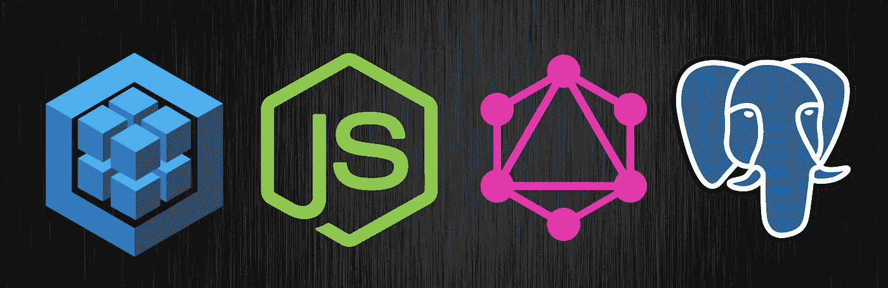
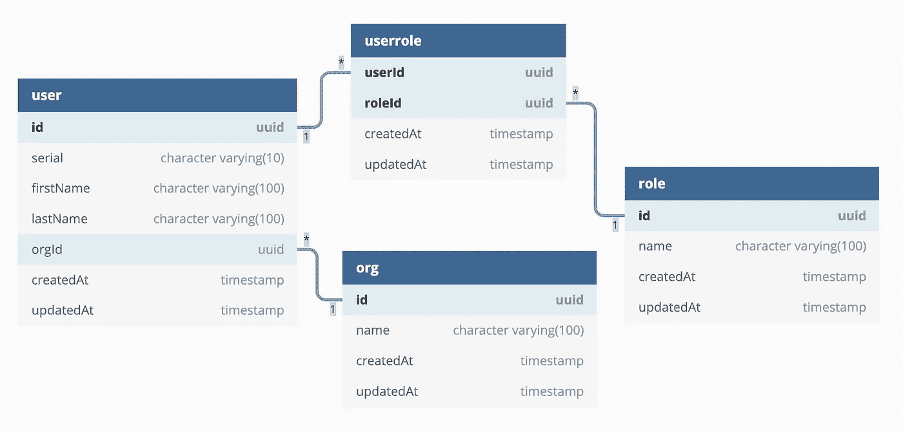
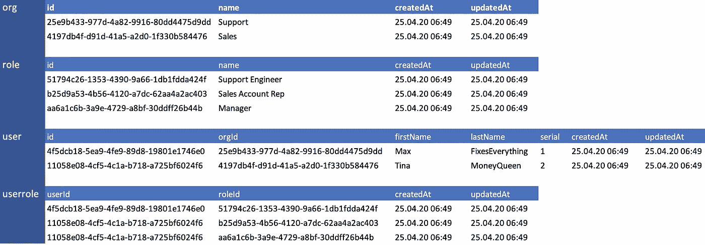
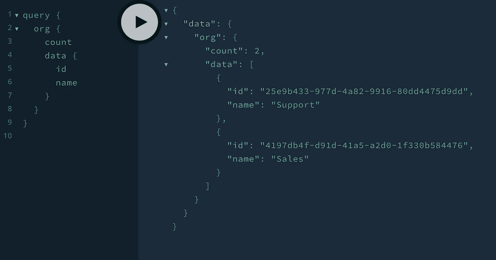
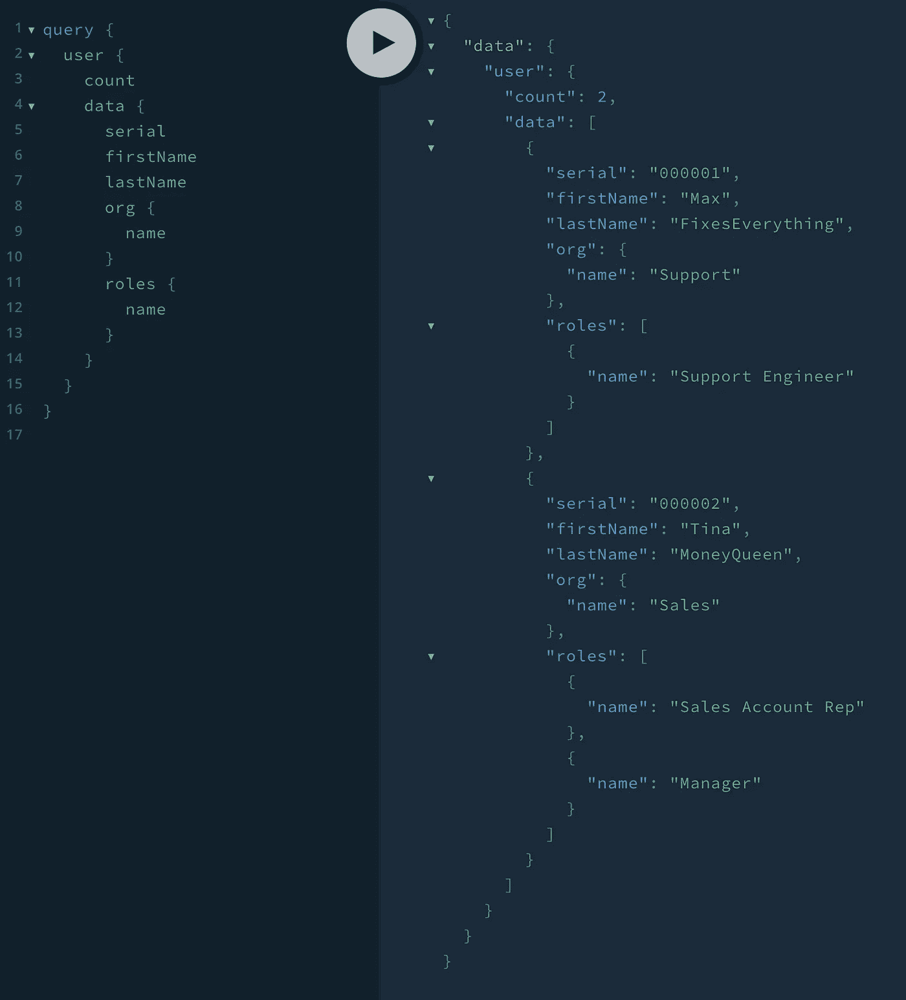

# 用于 GraphQL、Sequelize 和 PostgreSQL 的 NodeJS 样板文件

> 原文：<https://itnext.io/a-boilerplate-for-graphql-sequilize-postgresql-on-node-4eb68c9596bc?source=collection_archive---------2----------------------->

## 将关系数据公开为文档的一种令人信服的方式

在这篇文章中，您将看到一个 NodeJS 应用程序，它集成了连接到 PostgreSQL 的 GraphQL 和 Sequelize，以将规范化的关系数据(以 1-n、m-n 基数表示)连接到基于文档的数据表示。我将提供 GraphQL 只读查询的例子，并展示如何通过对象关系映射器 [Sequelize](https://sequelize.org/) 将它们转换成有效的 SQL 语句。

为了快速入门，本文提供了一个关于此 [GH repo](https://github.com/thomasreinecke/graphql-sequelize-pg) 的工作示例。



# 项目设置

[](https://github.com/thomasreinecke/graphql-sequelize-pg) [## 托马斯雷内克/graphql-sequelize-pg

### 用于 GraphQL、Sequelize & PostgreSQL-thomasreincke/graph QL-Sequelize-pg 的 NodeJS 样板文件

github.com](https://github.com/thomasreinecke/graphql-sequelize-pg) 

*   克隆`**graphql-sequelize-pg**`项目:
    `**git clone** [**https://github.com/thomasreinecke/graphql-sequelize-pg.git**](https://github.com/thomasreinecke/graphql-sequilize-pg.git)`——该项目将被克隆到您的`**ROJECT_HOME**`目录中
*   在`**PROJECT_HOME**`上运行`yarn`来安装节点依赖项
*   安装一个 PostgreSQL 数据库服务器，确保它正在运行并且可以访问(本教程不涉及这个主题，但是你可以在网上找到大量的资源)
*   在`**PROJECT_HOME**`上编辑`**.env**` 文件并应用您的数据库设置

```
NODE_ENV=development
PORT=9000
DB_HOST=127.0.0.1
DB_PORT=5432
DB_DATABASE=its-my-database
DB_USERNAME=its-me
DB_PASSWORD=its-my-password
DB_SCHEMA=its-my-schema
DB_DIALECT=postgres
```

*   创建数据库模式`**yarn cleandb**`，您应该看到数据库模型和一些正在创建的示例数据
*   现在是启动服务器的时候了`**yarn dev**`

```
🚀 Sequelize ORM connected to postgres @ 127.0.0.1:5432
🚀 Server ready at [http://localhost:4000/](http://localhost:4000/)
🚀 Subscriptions ready at ws://localhost:4000/graphql
```

如果您看到这个，那么恭喜您——您已经将 Sequelize ORM 连接到了 PostgreSQL 服务器，并且在您的本地机器上暴露了一个 GraphQL 端点。

# 对象模型

该模型提供了只属于一个**组织**的**用户**(一对多关系)，可以有多个**角色**(多对多关系)



从 **GraphQL** 的角度来看，模式描述如下。您将意识到每个 GraphQL 模式文件都包含对象定义本身、两个输入定义(一个创建新记录`**<Object>Input**`，另一个查询对象`**<Object>RecordInput**`的一个记录)和一个输出对象，该输出对象能够传递一个或多个对象记录和附加元数据。稍后我们将在 GraphQL 操场上使用这些定义。

## GraphQL 对象:组织

一个非常简单的组织表示，多个用户可以关联到该组织。

## GraphQL 对象:角色

另一个简单的对象，用于保存可以关联到多个用户的角色。

## GraphQL 对象:用户

用户对象包含几个描述用户的基本字段，并引用组织以及与用户相关联的多个潜在角色。

我们还必须描述**序列化**的对象模型。我们将使用这个模型来管理 PostgreSQL 中的模式，例如，最初我们通过这个模型创建我们需要的数据库表，并且我们将把数据的关系表示匹配到 JSON 中。好吧，想象一下，这一切都是顺序化的，为我们做的。有关 Sequelize 的更多信息:

[](https://sequelize.org/master/manual/getting-started.html) [## 序列

### 在本教程中，你将学习制作一个简单的序列设置。Sequelize 可通过 npm(或 yarn)获得。

sequelize.org](https://sequelize.org/master/manual/getting-started.html) 

## 顺序化对象:组织

我们将创建一个表 org，其中一个`**id**`字段作为 UUID 字段，一个`**name**`字段作为唯一字符串(100) +一个额外的名称索引，以便通过基于名称的查询更有效地访问数据。

## 顺序化对象:角色

这个对象看起来非常相似，我们将在这里为`**name**`创建一个额外的索引。

## Sequelize 对象:用户

您将意识到，用户对象通过字段 orgId 和通过 Sequelize 创建的外键约束来保存对 Org 表的引用。这代表了用户和组织之间的一对多关系。同样，我们将在`**serial**`字段上创建一个额外的索引，以便针对这个唯一的字段进行更有效的查询。


马库斯·斯皮斯克在 [Unsplash](https://unsplash.com/s/photos/data?utm_source=unsplash&utm_medium=referral&utm_content=creditCopyText) 上拍摄的照片

# 数据管理

让我们快速浏览一下 PostgreSQL 上刚刚创建的数据库表:



等等……我们还没有描述`**userrole**`表的数据模型，对吗？幸运的是，我们不必这样做，因为 Sequelize 很好地处理了这些关系…

```
*// from src/db/model/index.js:
// define the relationships between the entities*db.user.belongsTo(db.org);
db.user.belongsToMany(db.role, { through: 'userrole' });
db.role.belongsToMany(db.user, { through: 'userrole' });
```

我们明确地告诉 sequelize，`**org**`与`**user**`有一对多的关系，并且`**user**` 和`**role**`通过表`**userrole**`处于多对多的关系。这就是 sequelize 处理数据规范化所需的全部工作，这意味着将交叉引用存储在`**userrole**`表中。

# 获取数据

该项目提供了 GraphQL playground，可以在 [http://localhost:4000](http://localhost:4000/) 访问。在这里，我们现在可以利用 GraphQL 的能力从我们之前创建的表中请求非常具体的数据。

## 查询数据自:组织

要显示所有已知的**组织**，请使用以下 graphQL 查询:

```
query {
  org {
    count
    data {
      id
      name
    }
  }
}
```

我们得到了一个很好的数据回复(组织数组)和一个计数:



本例中对 PostgreSQL 的查询如下所示:

```
SELECT “id”, “name” FROM “public”.”org” AS “org” WHERE 1=1;
```

## 查询数据来源:角色

让我们对**角色做同样的事情，**但是这里我们跳过检索数据的计数和 id:

```
query {
  role {
    data {
      name
    }
  }
}
```

我们在数据阵列中获得了一组非常具体的角色名称:


本例中对 PostgreSQL 的查询如下:

```
SELECT "name" FROM "public"."role" AS "role" WHERE 1=1;
```

相当整洁，但还没有太花哨。让我们看一下**用户**，这里我们与**组织**和**角色**的 1-n 和 n-m 关系汇集在一起:

## 查询数据来源:用户

以下查询将请求用户的详细信息，包括组织名称和用户拥有的角色列表:

```
query {
  user {
    count
    data {
      serial
      firstName
      lastName
      org {
        name
      }
      roles {
        name
      }
    }
  }
}
```

我们现在看到， **org** 和 **roles** 作为嵌套对象嵌入到用户记录中，然而 **org** 由一个 JSON 对象表示，因为**用户**只能与一个组织相关联，而 **roles** 作为一个 JSON 对象数组出现，因为一个用户可以有多个角色(就像 Tina 一样):



本例中对 PostgreSQL 的查询如下:

# 摘要

我们已经看到了如何管理一个非常简单的关系数据模型，并通过 Sequelize 将它从 PostgreSQL 映射到 JSON。为了方便用户，JSON 数据通过 GraphQL 传递给用户。

在本文中，重点是只读操作。我计划提供另一篇关于完整 CRUD 操作的文章。敬请关注…

如果你喜欢这个故事，并想在 medium 上阅读成千上万个这样的故事，你可以成为 medium 会员，每月仅需 5 美元。如果你愿意支持我的写作，请使用我下面的推荐链接，我将免费获得你的一部分会员资格。

[**https://medium.com/@thomas.reinecke/membership**](https://medium.com/@thomas.reinecke/membership)