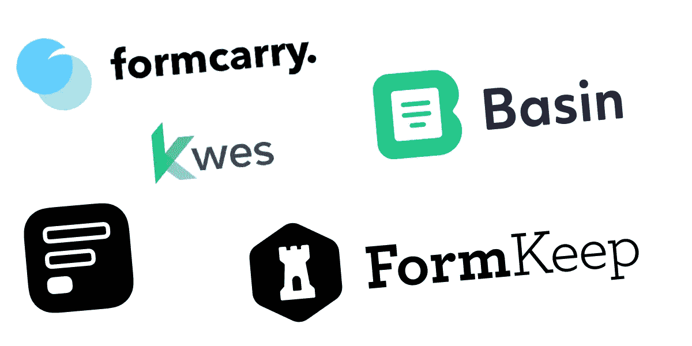
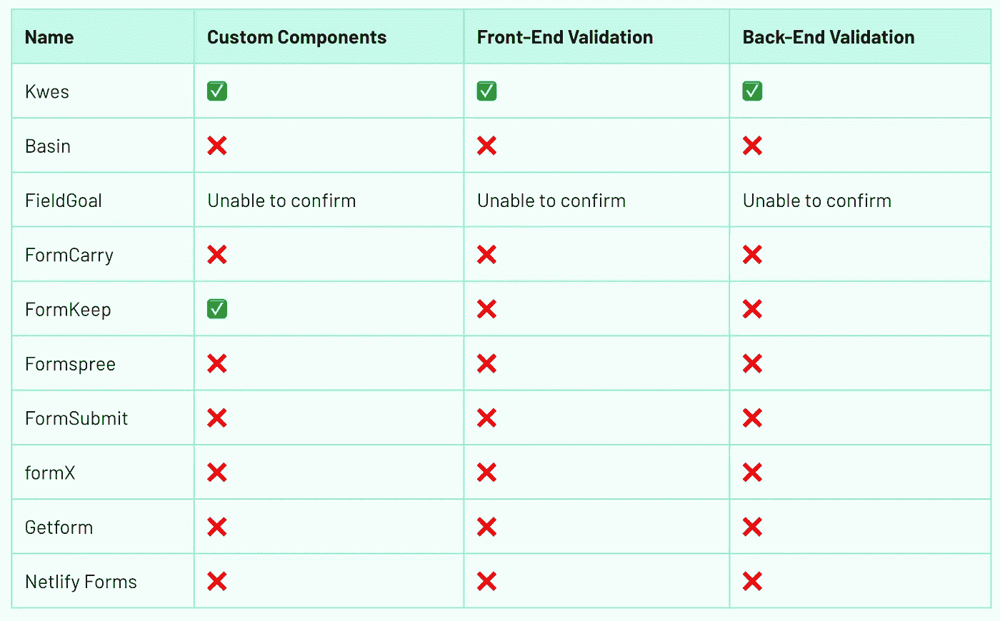
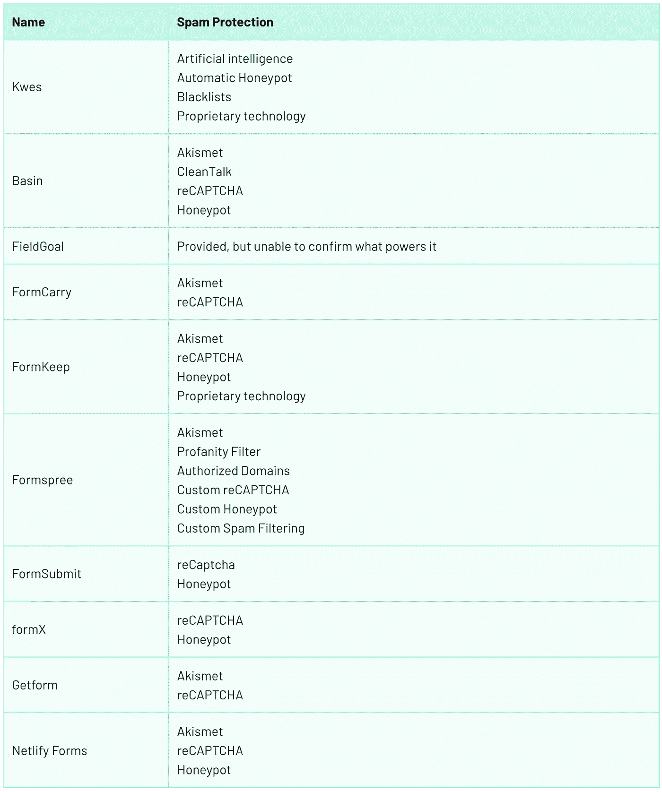
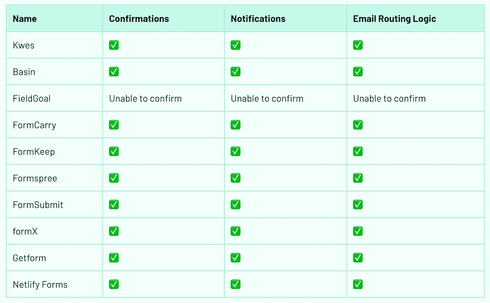
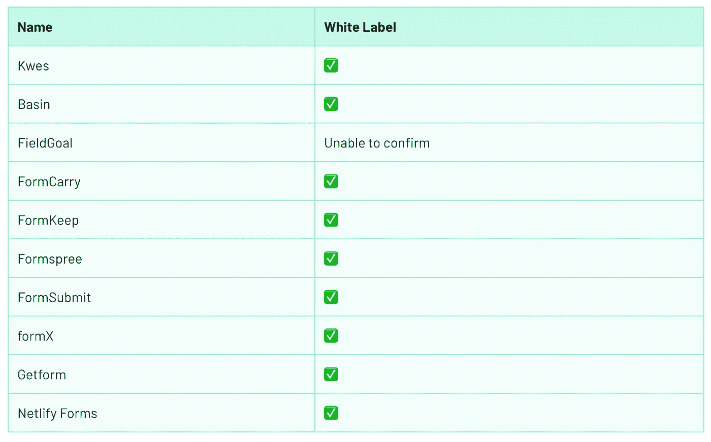
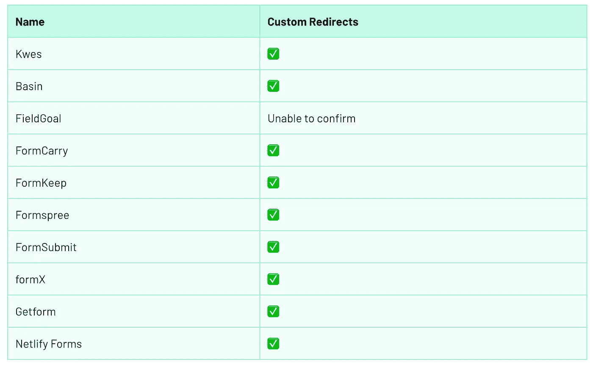
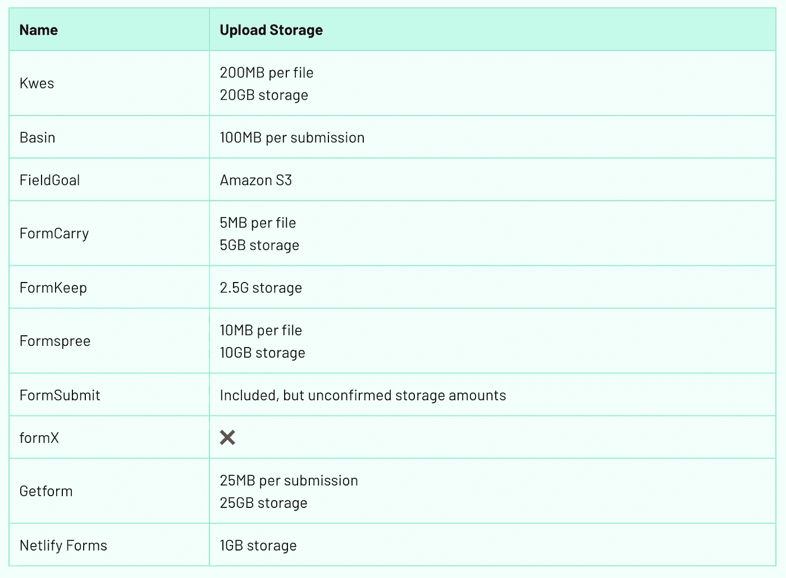
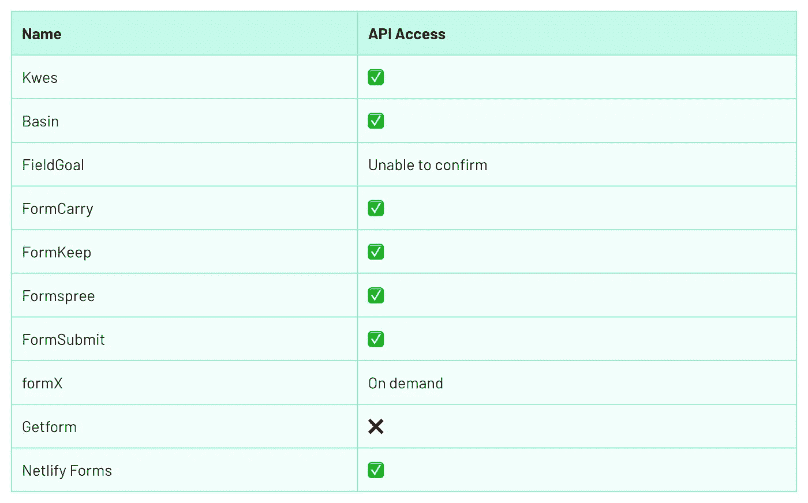
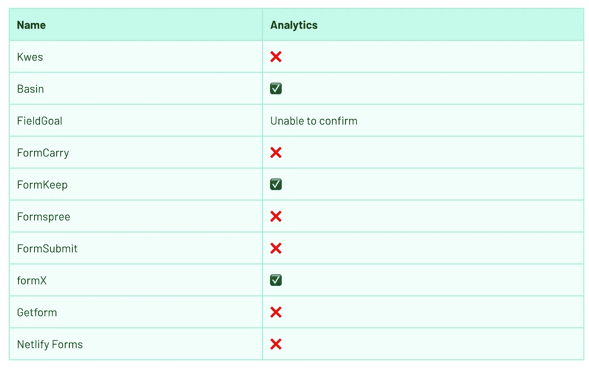
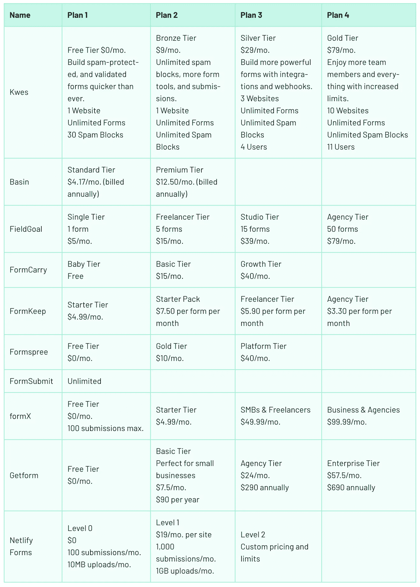

# 静态表单提供者的比较

> 原文：<https://itnext.io/a-comparison-of-static-form-providers-2adc51c87053?source=collection_archive---------2----------------------->

## 无服务器

## 哪个静态表单提供程序适合您？

让我们尝试创造一个术语:“静态表单提供者”你带着你的 HTML `<form>`，但是不用担心让它工作的后端处理。[有很多这样的服务！](https://serverless.css-tricks.com/services/forms)

静态表单提供者完成所有任务，如验证、存储、发送通知以及与其他 API 集成。当你能像这样委派大的责任时，这是很可爱的。成本？除了少数提供商和有限的计划外，通常是按月或按年订阅。其成本通常低于帮助您构建表单本身并对其进行处理的“T4”表单构建器。

在本文中，我们将回顾一些最流行的静态表单提供者:

在继续之前，需要注意的是，这些比较的信息来自访问每个产品的网站并了解其中包含的功能。一旦我得到了所有的信息，我就给每个提供商发了一封电子邮件来确认功能列表。有些人证实了，有些人没有。特别感谢 Kwes、FormKeep、Formspree、FormSubmit、formX 和 Netlify 表单团队的确认。

# 表单构建组件和验证

构建表单的组件是 HTML 输入元素，如文本输入、文本区域、复选框和单选按钮。当使用静态表单时，大多数提供者需要添加定制的 HTML 属性。通过在 form `action`属性中提供自定义 URL，表单在提供者端被提交并存储。

如果您正在寻找一个表单生成器，FormKeep 有一个表单设计器功能。这意味着您在页面中嵌入定制的 HTML 和 JavaScript 文件，并得到一个样式化的表单。否则，您必须自己设计表单的样式。

如果您需要定制组件，比如日期选择器或卡片输入，Kwes 和 FormKeep 是唯一提供这一特性的提供商。如果您想在浏览器中验证输入字段，您可以使用第三方库或编写您的代码，这意味着向站点添加额外的 JavaScript 代码。Kwes 是唯一支持基于您在每个输入组件中设置的规则的前端验证的提供者。要启用这个特性，您应该包括额外 JavaScript 文件，尽管如此，您还是可以这样做。其他静态表单提供者只依赖 HTML5 验证。

Kwes 也是唯一具有后端验证的提供商。你在前端设置的规则传递到后端端。万一前端验证失败，你是安全的，后端验证将工作。其他提供商没有此功能；他们只依赖垃圾邮件防护。

# 垃圾邮件防护

Kwes 宣称垃圾邮件拦截成功率高达 99.6%，无需任何设置。

一旦您的表单准备好提交，您可能会发现很难处理垃圾邮件。这就是为什么垃圾邮件保护是必不可少的，尤其是如果你想保持你的理智和平静。所有提供商都以这种或那种方式提供垃圾邮件防护。有些依靠谷歌 reCAPTCHA 或 T2 akis met，有些依靠蜜罐技术，有些利用人工智能来完成工作。值得注意的是，在表单中添加一个额外的步骤，比如添加 reCAPTCHA，可能会影响表单提交的转化率。

# 电子邮件通知

如果你想快速回复你的用户，电子邮件确认是必不可少的。例如，对于联系人表单，您希望收到每一个新提交的邮件。这样，您就能够快速有效地回复提交的内容。

除 FieldGoal 之外，所有提供者都具有确认、通知和电子邮件路由逻辑功能。您可以设置一个电子邮件表单元素，用于自动向用户发送电子邮件，确认提交。

除了电子邮件之外，一些提供商还有其他类型的通知，比如推送通知或闲置消息，这可能会很方便。

# 白色标签

当通过电子邮件通知与客户沟通时，您可能希望使用您的品牌和风格。它创造了更好的认知，也让你的客户熟悉你的产品。除了 FieldGoal 之外，所有提供商都提供这一功能，我无法确认这一点(尽管它可能属于付费计划)。

# 自定义重定向

一旦你获得了用户的回应，你可能想让用户继续使用你的网站。此外，您可能希望告知用户提交已收到。这个特性被称为“自定义重定向”，每个提供者都有这个特性(FieldGoal 是另一个例外，因为我无法确认)。请注意，此功能在免费计划中可能不可用，需要付费或升级帐户。

# 上传存储

并非每个静态表单提供程序都提供文件存储。比如 formX 根本不提供。在大多数情况下，此功能在付费计划下可用。你可能需要投入额外的时间来找出哪个提供商为你提供最好的服务。请务必特别注意单个文件大小*和*表单提交大小限制。

# 数据导出

如果您想将数据导出用于分析或导入第三方软件，那么它是一个重要的功能。大多数提供商提供 CSV 和 JSON 导出，这是最常用的。

# API 访问

如果您希望通过构建自定义应用程序或脚本来控制数据提交，那么拥有 API 访问权限可能会让您受益匪浅。大多数提供者都有这个特性，除了 Getform。formX 提供它，但只是按需提供。

# Webhooks/Zapier

当构建定制应用程序或脚本超出预算时，您可能希望使用 webhooks 将数据提交与第三方软件集成在一起。Zapier 是最常用的服务之一，只有 FormSubmit 不支持它(尽管它支持 webhooks)。

# 分析学

静态表单的分析是一个很好的特性，可以提供对表单执行情况的有益洞察。它可以帮助您理解用户是如何与之交互的，并且您可能会发现改进表单提交体验的方法。此功能是所有其他功能中最不受支持的。只有 Basin、FormKeep 和 formX 提供它。

# 计划比较

静态表单提供者有不同的计划，从完全免费的计划和试验，到满足每个业务需求的企业计划。根据不同的计划，您可能会启用不同的功能。例如，FormSubmit 是唯一一个免费提供所有特性的提供商，尽管它并不支持我们在这里介绍的所有特性。你需要花一些时间来了解哪些功能对你和你的产品或业务来说是最重要的。然后决定哪家提供商最适合您的需求。

# 包扎

对于许多网站来说，拥有任何形式的表单都是必不可少的。当您使用静态站点生成器时，您可能会发现静态表单提供程序使得向站点添加表单变得非常简单。通过遵循一些启用静态表单的规则，您可以从垃圾邮件防护和电子邮件通知等基本功能中受益。

我使用 Kwes 已经有一段时间了，我可以诚实地告诉你，这是一个很好的产品，满足了我的所有需求。它有智能垃圾邮件防护，易于使用的仪表板，以及令人印象深刻的前端和后端验证。

在选择您的静态表单提供商之前，请确保将所有要求写在纸上，然后找到您的最佳提供商。

*原载于 2019 年 9 月 18 日*[*【https://css-tricks.com】*](https://css-tricks.com/a-comparison-of-static-form-providers/)*。*