# gRPC-Web 带角度和角度的完全指南。网

> 原文：<https://itnext.io/a-complete-guide-to-grpc-web-with-angular-and-net-c4ae2500bd24?source=collection_archive---------0----------------------->

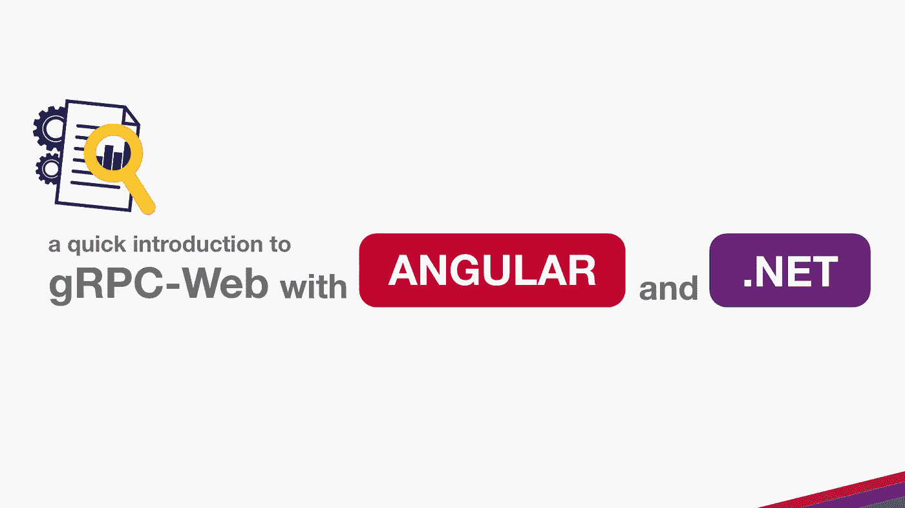

在本帖中，我们将创建一个 gRPC 演示，其中包含一个使用网关的服务器和两个客户端。净，有角)。我们还将讨论在构建 gRPC 服务器和客户机时可能会遇到的一些常见问题。

## **什么是 gRPC？**

如果您正在寻找一种提高应用程序性能的方法，您可能会考虑使用 gRPC。gRPC 是一个高性能、开源的通用 RPC 框架，可以在任何环境中运行。gRPC 基于远程过程调用(RPC)的概念。RPC 是两个系统之间允许它们交换信息的一种通信方法。它也是语言不可知的，因此您可以将它用于任何编程语言，并使构建连接系统变得容易。

GRPC 使用 HTTP/2 作为它的传输层，与传统的 HTTP/1.1 相比，它有几个优点。HTTP/2 是一种二进制协议，它通过单个连接多路传输请求和响应，并使用报头压缩来减少开销。这使得它比 HTTP/1.1 更有效，并允许更低的延迟和更高的吞吐量。

另外，GRPC 使用 [**协议缓冲区**](https://developers.google.com/protocol-buffers) 作为其接口描述语言。这允许进行强类型检查和高效的数据序列化。它还使得 API 随着时间的推移而发展变得容易，而不会破坏向后兼容性。

使用 Grpc 有许多好处，但其中一些最显著的好处包括:

> **轻量级消息。**根据调用的类型，特定于 gRPC 的消息在大小上比 JSON 消息小 30%[](https://auth0.com/blog/beating-json-performance-with-protobuf/#:~:text=JSON%20messages%20are%20exchanged%20in,define%20and%20exchange%20these%20messages.)**。**
> 
> ****高性能**。通过不同的评测，gRPC 比 REST+JSON 通信快 [5](https://dzone.com/articles/is-protobuf-5x-faster-than-json) 、 [7](https://medium.com/@EmperorRXF/evaluating-performance-of-rest-vs-grpc-1b8bdf0b22da) ，甚至 [8](https://docs.microsoft.com/en-us/dotnet/architecture/cloud-native/grpc) 倍。**
> 
> ****内置代码生成**。gRPC 拥有不同编程语言的自动化代码生成，包括 [Java](https://www.altexsoft.com/blog/engineering/pros-and-cons-of-java-programming/) ，C++，Python，Go， [Dart](https://www.altexsoft.com/blog/engineering/pros-and-cons-of-flutter-app-development/) ， [Objective-C](https://www.altexsoft.com/blog/engineering/swift-vs-objective-c-out-with-the-old-in-with-the-new/) ，Ruby 等等。"**
> 
> ****更多连接选项**。REST 关注于请求-响应架构，而 gRPC 通过事件驱动的架构为[数据流](https://www.altexsoft.com/blog/real-time-analytics/)提供支持:服务器端流、客户端流和双向流**

**来源:[https://www.altexsoft.com/blog/what-is-grpc/](https://www.altexsoft.com/blog/what-is-grpc/)**

**我们将构建一个 gRPC 服务器。NET 和两个客户端(Angular，。NET)在本文中。**

**因为许多浏览器的客户端不支持 gRPC，我们将为 gRPC-web 配置我们的服务器和客户端，这与 gRPC 不同。它只存在于浏览器中，在浏览器中充当 gRPC 和您的应用程序之间的转换层。gRPC-web 中的“Web”客户机通过 HTTP 1.1 或 HTTP/2 接收请求，然后通过代理发送请求。你可以在[这篇](https://blog.getambassador.io/understanding-grpc-and-grpc-web-8a4d43f58480)帖子中找到更多细节。**

## ****用构建 gRPC 服务器。网络****

**首先，让我们创建一个新的。NET 应用程序，代码写在下面。**

```
dotnet new web -o gRPC.Web.Server
```

**然后，我们需要安装 Grpc。AspNetCore 和 Grpc。AspNetCore 打包到我们的项目中，以便能够使用 Grpc 特性。**

```
dotnet add gRPC.Web.Server.csproj package Grpc.AspNetCore
dotnet add gRPC.Web.Server.csproj package Grpc.AspNetCore.Web
```

## ****创建原型文件****

**众所周知，gRPC 使用。proto 文件，所以我们需要定义我们的 protobuf 文件，供客户端和服务器端使用。让我们创建一个名为“Protos”的目录，并在那里创建一个名为“stream.proto”的简单 protobuf 文件，如下所示:**

```
syntax = "proto3";

service StreamService {
  rpc FetchResponse (Request) returns (stream Response) {}
}

message Request {
  int32 id = 1;
}

message Response {
  string result = 1;
}
```

**如果你想了解更多关于 proto 文件的信息，你可以访问这个资源。**

**创建原型文件后，我们需要将其定义到我们的。csproj 文件将能够使用自动生成的代码，我们可以继承和覆盖。**

```
<ItemGroup> <Protobuf Include="Protos\stream.proto" GrpcServices="Server" /></ItemGroup>
```

> **注意:默认情况下，`<Protobuf>`引用生成一个具体的客户端和一个服务基类。引用元素的`GrpcServices`属性可以用来限制 C#资产的生成。有效的`GrpcServices`选项有:两者(不存在时默认)、服务器、客户端和无。**

**在执行了 **dotnet build** 命令后，我们应该会看到 obj/Debug/net*文件夹下生成的类，如下所示。**

**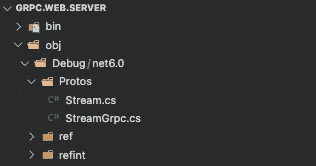**

## **实现生成的类**

**让我们创建实现我们的服务方法的`StreamImplService`。`FetchResponse`是一个服务器端的流 RPC，所以我们需要向我们的客户端发回多个`Response`协议缓冲区。**

```
using Grpc.Core;

public class StreamImplService: StreamService.StreamServiceBase {

    private readonly List<string> _messages = new List<string>()
    {
      "Hello",
      "World",
      "!"
    };

    public override async Task FetchResponse(
        Request request, 
        IServerStreamWriter<Response> responseStream, 
        ServerCallContext context)
    {
        while (!context.CancellationToken.IsCancellationRequested)
        {
            foreach (var message in _messages)
            {
                await responseStream.WriteAsync(new Response()
                {
                    Result = message
                });

                Thread.Sleep(750);
            }
        }
    }
}
```

**如您所见，我们没有返回简单的响应，而是使用异步方法`WriteAsync`将响应写入异步流`IServerStreamWriter`，同时不请求取消令牌。我们的请求模型包含一个 Id 属性，但是此时我不会对这个值做任何事情。**

**我们需要如下配置 Program.cs(以前版本为 Startup.cs)。**

```
var builder = WebApplication.CreateBuilder(args);

builder.Services.AddGrpc();var app = builder.Build();app.UseGrpcWeb();

app.MapGrpcService<StreamImplService>().EnableGrpcWeb();

app.Run();
```

> **对于以前的版本:**

```
services.AddGrpc();app.UseGrpcWeb();app.UseEndpoints(endpoints =>
            { endpoints.MapGrpcService<StreamImplService>().EnableGrpcWeb(); });
```

> **[根据微软](https://docs.microsoft.com/en-Us/aspnet/core/grpc/troubleshoot?view=aspnetcore-6.0#unable-to-start-aspnet-core-grpc-app-on-macos) gRPC 模板默认使用 TLS，而 Kestrel 在 macOS 系统上不支持带 TLS 的 HTTP/2，因此我们可以说 macOS 不支持带 TLS 的 ASP.NET 核心 gRPC，需要额外的配置才能使用 HTTP2。**注意:如果你想使用 gRPC-web，这个配置只适用于 gRPC，因为在这篇文章中没有必要这样做。****

```
using Microsoft.AspNetCore.Server.Kestrel.Core;

var builder = WebApplication.CreateBuilder(args);

builder.Services.AddGrpc();

builder.WebHost.ConfigureKestrel(options =>
{
    *// Setup a HTTP/2 endpoint without TLS.* options.ListenLocalhost(7264, o => o.Protocols =  HttpProtocols.**Http2**);
});

var app = builder.Build();

app.UseGrpcWeb();

app.MapGrpcService<StreamImplService>().EnableGrpcWeb();

app.Run();
```

> **💡生产中不要这样！这仅用于本地开发目的。**

**我们还需要配置 SSL 信任:**

```
dotnet dev-certs https --trust
```

**最后，我们准备好接受请求。**

## ****用 Kreya 调用 gRPC API****

**因为我们不能用 Postman 或其他传统的方法向 gRPC APIs 发送请求，所以你可能在寻找一个像 Postman 一样可以帮助你测试/调试的工具，在这种情况下，Kreya 可能是一个不错的选择。**

**首先你需要从下面写的网址下载 Kreya。
[https://kreya.app/downloads/](https://kreya.app/downloads/)**

**安装后，点击创建项目按钮**

**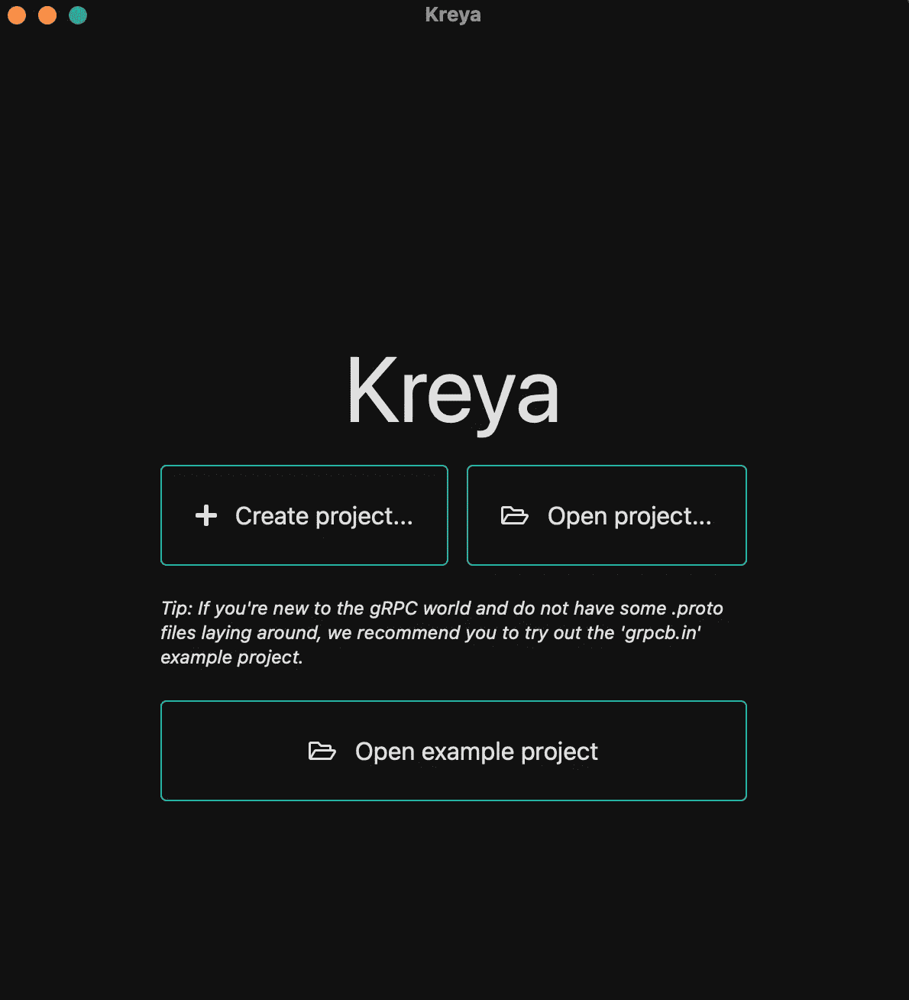**

**然后为项目文件选择一个位置，并根据需要填写其他输入。**

****

**单击项目/进口商设置类型为 gRPC proto 文件，并在。NET 项目作为原型目录。**

**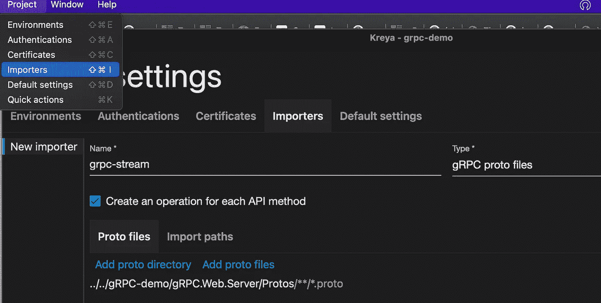**

**您可以从目录设置部分设置端点。如果你想使用 **gRPC** 你应该设置 HTTP 端口配置为 HTTP2 支持，如果你想使用 **gRPC-Web** 你可以在 Mac 设备上设置 HTTP 和 HTTPS 端口，否则你应该设置项目的 HTTPS 端口。**

**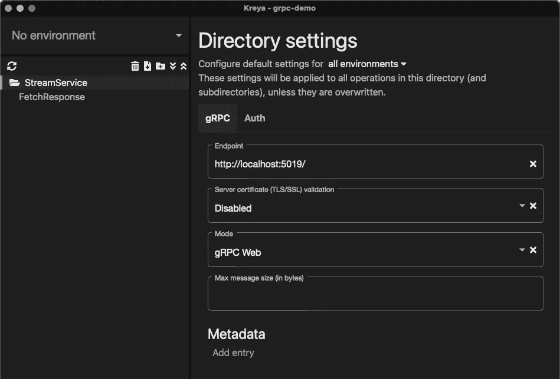**

**对于 gRPC-网络模式 MAC**

**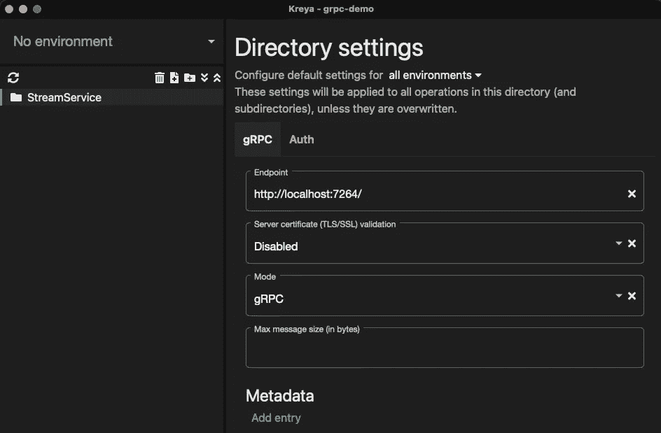**

**对于 gRPC 模式 MAC**

**然后，您可以通过单击 FetchReponse 标签发送请求，该标签来自我们的原型文件，并且可能会因您的原型文件而异。**

**如您所见，回复会一直持续到取消。**

**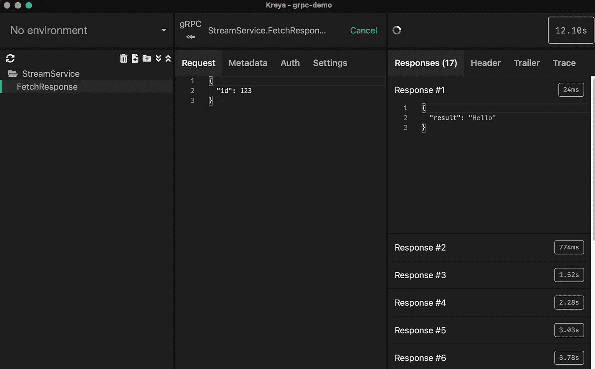**

**如果不喜欢 Kreya，可以看看 [gRPCurl](https://github.com/fullstorydev/grpcurl) 。**

## ****用 YARP 构建 gRPC-Web 网关****

**我们将面临的另一个挑战是，如果你想将 gRPC-Web 与网关一起使用，或者如果你想在已经使用网关的项目中使用 gRPC，你应该知道 Ocelot 目前不支持 gRPC。使用微软开发的 [YARP](https://microsoft.github.io/reverse-proxy/) 会是一个不错的选择。**

**让我们从创建一个新项目并安装 Yarp 开始。使用下面的命令反转 Proxy。**

```
dotnet new web -o gRPC.Web.Gateway
dotnet add gRPC.Web.Gateway.csproj package Yarp.ReverseProxy
```

**YARP 是作为一个. NET 组件实现的，所以大部分示例代码都在 Program.cs 中(以前版本是 Startup.cs)。**

```
var builder = WebApplication.CreateBuilder(args);// Add the reverse proxy to capability to the server
var proxyBuilder = builder.Services.AddReverseProxy();// Initialize the reverse proxy from the "ReverseProxy" section of configuration
proxyBuilder.LoadFromConfig(builder.Configuration.GetSection("ReverseProxy"));var app = builder.Build();// Enable endpoint routing, required for the reverse proxy
app.UseRouting();// Register the reverse proxy routes
app.MapReverseProxy();app.Run();
```

**然后，appsettings.json 文件应该如下所示。**

```
{
  "Logging": {
    "LogLevel": {
      "Default": "Information",
      "Microsoft.AspNetCore": "Warning"
    }
  },
  "ReverseProxy": {
    "routes": {
      "grpc-web-service": {
        "clusterId": "grpc-web-service",
        "match": {
          "path": "grpc/grpc-web-service/{**catch-all}"
        },
        "transforms": [
          {
            "pathPattern": "{**catch-all}"
          },
          { "RequestHeadersCopy": "true" },
          { "RequestHeaderOriginalHost": "true" }
        ]
      }
    },
    "clusters": {
      "grpc-web-service": {
        "destinations": {
          "destination1": {
            "address": "[http://localhost:](http://localhost:5019)5019"
          }
        }
      }
    }
  }
}
```

**如果你想深入了解 YARP，学习高级/详细的用法，你可以访问这篇文章。**

**如果您想查看带有 HTTP2 的 gRPC 配置示例，请访问这篇文章。**

**在这个阶段，您应该能够通过网关端点向我们的 gRPC 服务发送请求。**

**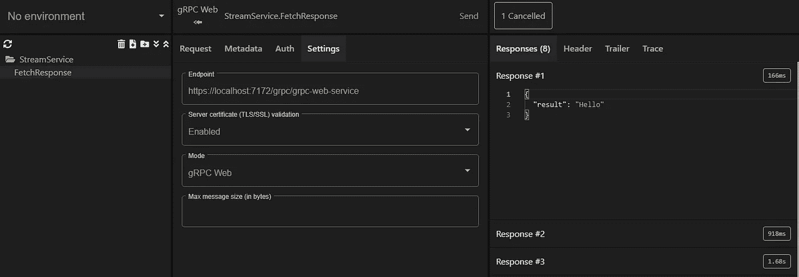**

## ****建筑。NET gRPC-Web 客户端****

**让我们使用下面编写的命令创建另一个项目作为 gRPC 客户机。**

```
dotnet new console -o gRPC.Console.Client
```

**然后，我们应该创建一个包含我们的原型文件的文件夹，并将原型文件移动到其中。**

**我们依赖谷歌。Protobuf，Grpc。Net 客户端。Net.Client.Web 和 Grpc。用. NET 构建客户端的工具包**

```
dotnet add gRPC.Console.Client.csproj package Google.Protobuf
dotnet add gRPC.Console.Client.csproj package Grpc.Tools 
dotnet add gRPC.Console.Client.csproj package Grpc.Net.Client
dotnet add gRPC.Console.Client.csproj package Grpc.Net.Client.Web
```

**安装完这些包之后，我们需要在我们的。csproj 文件将能够使用自动生成的代码。这个配置与我们的服务器几乎相同，但是我们这次将“GrpcServices”值设置为“Client”而不是“server”。**

```
<ItemGroup>
 <Protobuf Include="Protos\stream.proto" GrpcServices="Client" />
</ItemGroup>
```

> **进行 gRPC 调用时，会忽略 gRPC 通道地址的路径部分。例如，`GrpcChannel.ForAddress("https://localhost:5001/ignored_path")`在为服务路由 gRPC 呼叫时不会使用`ignored_path`。**
> 
> **地址路径被忽略，因为 gRPC 有一个标准化的、规定的地址结构。gRPC 地址结合了包、服务和方法名:`[https://localhost:5001/PackageName.ServiceName/MethodName](https://localhost:5001/PackageName.ServiceName/MethodName.)` [。](https://localhost:5001/PackageName.ServiceName/MethodName.)**
> 
> **在某些情况下，应用程序需要包含 gRPC 调用的路径。例如，当 ASP.NET 核心 gRPC 应用程序托管在 IIS 目录中，并且该目录需要包含在请求中时。当需要一个路径时，可以使用自定义的`SubdirectoryHandler`将它添加到 gRPC 调用中**

**来源:[https://docs . Microsoft . com/en-us/aspnet/core/grpc/troubleshoot？view = aspnetcore-6.0 # calling-grpc-services-hosted-in-a-sub-directory](https://docs.microsoft.com/en-us/aspnet/core/grpc/troubleshoot?view=aspnetcore-6.0#calling-grpc-services-hosted-in-a-sub-directory)**

**根据微软的说法，如果您想为 gRPC 调用使用网关或其他前缀，我们需要创建一个子目录 Handler，如下所示。**

```
namespace gRPC.Console.Client.Handlers
{/// <summary>
    /// A delegating handler that adds a subdirectory to the URI of gRPC requests.
    /// </summary>
    public class SubdirectoryHandler : DelegatingHandler
    {
        private readonly string _subdirectory;public SubdirectoryHandler(HttpMessageHandler innerHandler, string subdirectory)
            : base(innerHandler)
        {
            _subdirectory = subdirectory;
        }protected override Task<HttpResponseMessage> SendAsync(
            HttpRequestMessage request, CancellationToken cancellationToken)
        {
            var old = request.RequestUri;var url = $"{old.Scheme}://{old.Host}:{old.Port}";
            url += $"{_subdirectory}{request.RequestUri.AbsolutePath}";
            request.RequestUri = new Uri(url, UriKind.Absolute);return base.SendAsync(request, cancellationToken);
        }
    }
}
```

**最终的结构应该如下所示。**

**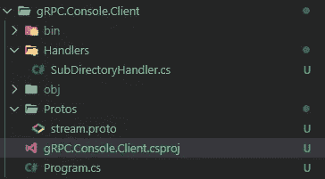**

**最后一步，我们应该将我们的逻辑编写到 Program.cs 中，如下所示。**

**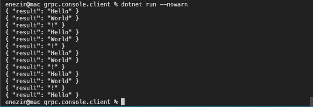**

## ****构建 Angular gRPC-Web 客户端****

**我们必须安装 protocol，它是一个协议编译器，可以帮助我们从。作为第一步的原型文件。**

> ****本文是用 protobuf 的** [**v3.19.4 编写的。**](https://github.com/protocolbuffers/protobuf/releases/tag/v3.19.4)**

**按照以下 URL 中的说明在 **Windows** 设备上安装。
[https://www . geeks forgeeks . org/how-to-install-protocol-buffers-on-windows/](https://www.geeksforgeeks.org/how-to-install-protocol-buffers-on-windows/)**

> ****不要选择 Javascript 版本，因为我们会使用 TypeScript。****

**对于 **Mac** 设备:**

```
brew install protobuf
```

**让我们用下面的命令创建一个角度项目。**

```
ng new gRPC.Angular.Client --routing=false --style=scss
```

**因为 protocol 不支持 TypeScript，我们需要将 ts-protocol-gen 插件添加到我们的项目中。**

```
npm install --save ts-protoc-gen
```

**我们还需要安装[不可能的 gRPC-web](https://github.com/improbable-eng/grpc-web) 库和 [google-protobuf](https://www.npmjs.com/package/google-protobuf) 包(+its types[@ types/Google-proto buf](https://www.npmjs.com/package/@types/google-protobuf)):**

```
npm install --save google-protobufnpm install --save-dev @types/google-protobufnpm install --save @improbable-eng/grpc-web
```

**然后，我们应该创建一个包含我们的原型文件的目录。我创建了一个名为“protos”的目录，并将 stream.proto 文件复制到那里。**

**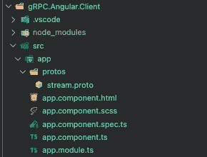**

**让我们将目录更改为“protos”文件夹，并创建自动生成的文件，如带有协议的服务和客户端。**

```
protoc --plugin=protoc-gen-ts="../../../node_modules/.bin/protoc-gen-ts" --js_out="import_style=commonjs,binary:../generated" --ts_out="service=grpc-web:../generated" stream.proto
```

> ****对于 Windows** 设备，protocol-gen-ts 路径应该是绝对路径，而不是 protocol-gen-ts，您应该使用 protocol-gen-ts . cmd。**

```
protoc --plugin=protoc-gen-ts="{ABSOLUTEPATH}\node_modules\.bin\protoc-gen-ts.cmd" --js_out="import_style=commonjs,binary:{OUTPUTPATH}" --ts_out="service=grpc-web:{OUTPUTPATH}" {PROTO_FILE_PATH]
```

**在执行上面的命令后，我们应该会看到 4 个生成的文件。**

**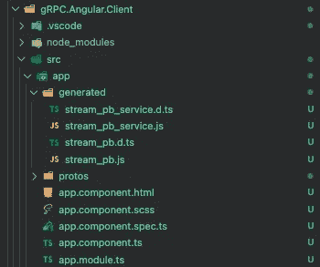**

**现在，让我们将 grpc-web 实现到 app.component.ts 中。**

> ****不要忘记添加一个允许 gRPC 使用 4200 端口的 cors 策略。Web.Server 项目。****

**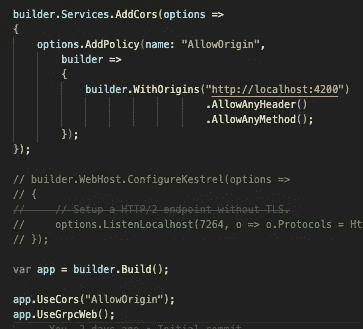******

## ****为服务器和客户端添加 JWT 认证****

**您可能需要在 grpc 应用程序中使用 JWT 认证，这很容易实现。您只需要在服务器端添加[Authorize]属性。**

**然后，您可以从 Kreya 的元数据部分添加您的令牌。**

**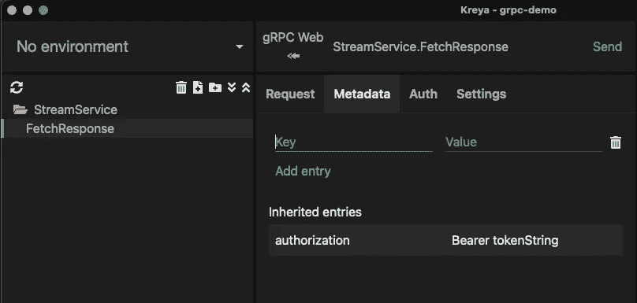**

**将令牌添加到元数据部分对于 Angular 来说就足够了。**

**。网络客户端:**

**GitHub 网址:[https://github.com/edisnezir/grpc-demo](https://github.com/edisnezir/grpc-demo)**