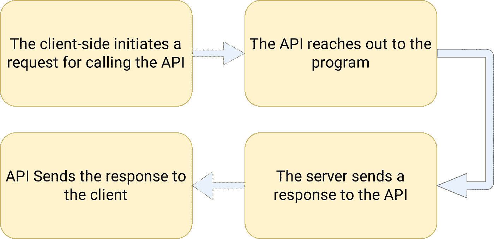
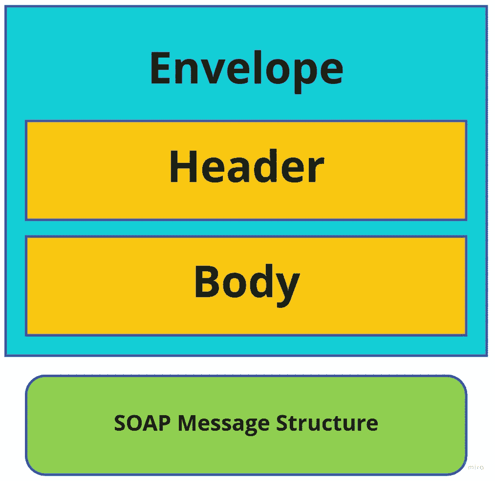
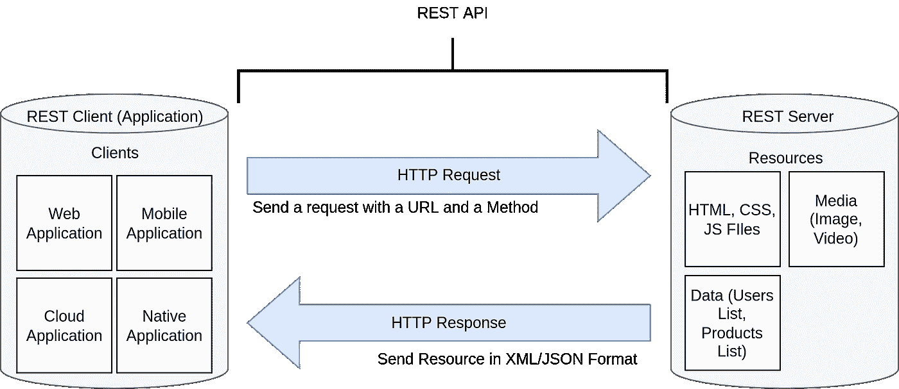
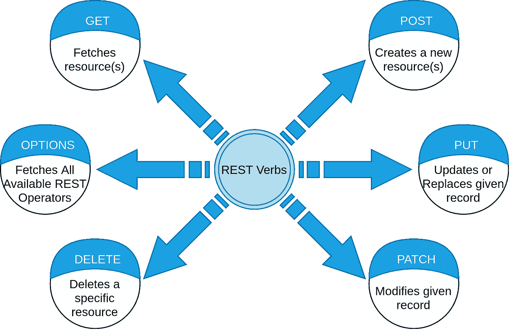
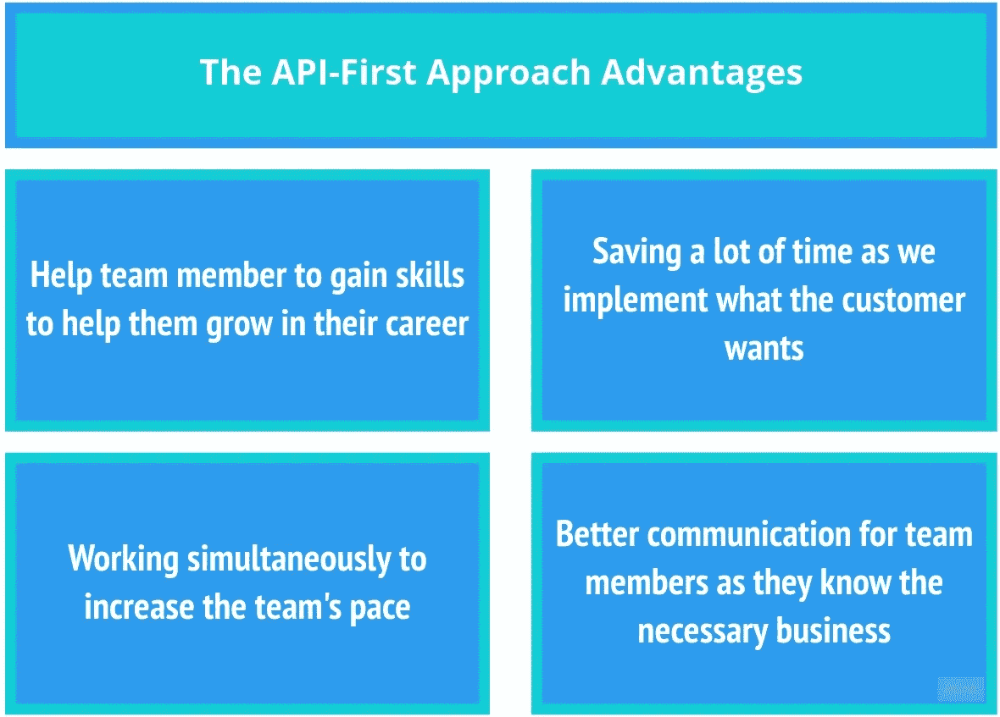

# API-优先方法完全指南

> 原文：<https://itnext.io/a-complete-guide-to-the-api-first-approach-ecd796dd0f10?source=collection_archive---------1----------------------->

在您的软件开发生涯中，开发应用程序可能采用的许多方法之一是 **API 优先方法**。在本文中，我们将深入研究它的核心概念，并了解更多关于这种方法的信息。我们还熟悉了在整个方法中您可能需要的一些工具。

由[马文·迈耶](https://unsplash.com/@marvelous?utm_source=medium&utm_medium=referral)在 [Unsplash](https://unsplash.com?utm_source=medium&utm_medium=referral) 上拍摄的照片

# 背景

从一个产品的想法突然出现在一个人的脑海中，到产品完成并推出，需要采取数百(如果不是数千)个步骤；结果，尽管有很好的想法和商业计划，许多团队还是无法构建应用程序。因此，如果有一个设计、开发、发布和营销产品的指导方针，对所有这些团队来说将是一个巨大的帮助。此外，团队可以从扩大他们的应用程序和加快他们完成产品的步伐中获益。许多引入的方法之一是 **API 优先**方法。然而，在我们深入研究 API 优先的方法之前，让我们先构建一些关于先决条件概念的基础知识。

# 回顾什么是 API

你们可能都听说过 API 和服务员的相似之处，但是这次让我们从技术上更深入地研究 API。首先，让我们一起回顾一些核心概念，然后我们将开发 API 有用的原因。

**API** 是**应用编程接口的缩写，**是两台机器甚至两个程序之间的连接。因此，您可以将 API 想象为两个端点之间的中间件，用于传输数据，并在给定时间使用给定数据调用某些功能。出于安全原因，API 也至关重要。由于几乎每个应用程序都有需要存储在数据库中的数据，让用户直接连接到数据库来手动获取、*更新*、*创建*、*删除*他们的数据是不安全的。这里，API 从应用程序接收必要的信息，并将其发送给服务器，一旦服务器向 API 提供响应，API 就会将响应返回给客户端。概括一下，API 是如何工作的:

*   客户端发起调用 API 的请求。请求中必须包含一些东西:请求 REST 动词、URI (Uniform Resource Identifier，统一资源标识符)、请求头，如果动词需要主体，那么请求主体也是必要的。
*   API 会延伸到程序。收到请求后，API 会到达服务器并与之连接。然后，服务器开始处理数据，并可能进行一些计算，为 API 准备适当的响应。
*   **服务器向 API 发送响应。**在处理并最终确定请求后，一旦服务器准备好数据，它就将数据传输给 API(我们称之为**响应**)。
*   **API 向客户端发送响应。**一旦 API 从服务器收集到响应，它将准备好使用 **HTTP** 协议将响应发送给应用程序。

API 功能的四个步骤

虽然我们开发人员为我们的应用程序实现了一个友好的用户界面来有效地工作，但是这些 API 并不意味着被人类直接使用；它们是为计算机设计的。因此，为了拥有出色的工作 API，我们应该始终考虑性能优化和机器限制。此外，我们需要以某种方式实现它们，以便我们可以在未来扩大我们的产品，在开发产品的整个过程中对我们有很大帮助的重要一点是编写可预测的代码，正如 Andrei Neagoie 在他的一门课程中所说:

> 我们应该编写可预测的代码，不仅对人类，对机器也是如此。你的代码越可预测，就越好，因为它没有意外"
> 
> 安德烈·尼戈瓦

我们需要注意的另一个重要问题是 ***安全*** 问题。例如，用户可以在我们的应用程序上输入他们的重要信息(例如，他们的银行账户信息)，我们需要使用我们的 API 将这些数据传输到我们的服务器。此外，我们的 API 应该防止黑客从我们的 API 中嗅探数据。最后，数据应该在每个端点进行**加密**和**解密**以防止黑客在发生数据泄露时接触到数据。

美国宇航局在 [Unsplash](https://unsplash.com?utm_source=medium&utm_medium=referral) 上拍摄的照片

## 不同类型的 API

Web APIs 是由 HTTP 协议支持的。您可以在 web APIs 中找到像存储(例如，本地存储和会话存储)这样的服务，或者您可能希望控制浏览器的通知。Web APIs 通常使用 JavaScript，尽管这不是必须的。如果你曾经做过前端开发人员，当你想找到当前页面的 URL ( **窗口**)或者当你想设置一个定时器来做以后的事情( **setTimeout** )等等的时候，你肯定会碰到它们。最常用的 API 是**web API**，它包括四种主要类型。

*   开放(公共)API: 每个人都可以使用它们。它可能需要注册，但它们是公开的，面向外部用户。例如，你可以在这里查看 Google API[的完整列表](https://developers.google.com/apis-explorer)。
*   **内部 API:** 如果您有只想在公司(或业务合作伙伴)内部发布的敏感信息，内部 API 就是您要查看的内容。
*   **合作伙伴 API:** 它们与**开放 API**非常相似，但是你可以使用 **API 网关**来限制你的 API 对特定用户的访问。在软件开发中，这种方法普遍用于控制对付费 API 和带有敏感信息的 API 的访问。
*   **复合 API:** 如果你需要在一次调用中发送多个请求，你可以使用这种 API。这些 API 的好处之一是你可以使用一个 API 的输出作为另一个 API 的输入。

## **不同类型的 API 协议**

虽然 API 的主要职责是在两个端点(机器或程序)之间建立安全可靠的连接，但这只是它的一般概念。我们需要实现我们的 API 来解决我们的问题并优化我们产品的性能。因此程序员们在过去的几年里引入了不同类型的 API，并且每一种都有一些优势。此外，还引入了不同的 API 架构和协议来指定我们想要建立的数据类型和规则。API 有三个主要的协议: **REST** 、 **SOAP** 和 **RPC** 。我们将学习它们中每一个的基础知识，然后我们将深入研究 **REST** ，因为我们想使用 REST 概念学习 **API 优先方法**。

## 远程过程调用

该协议使用客户机-服务器模型在不知道网络细节的情况下在两个程序之间建立通信。RPC 的整个思想是我们想要从另一台计算机或机器调用我们的服务器中的一个函数。例如，假设我们有两个服务器(服务器 A 和服务器 B)，我们想从服务器 B 调用服务器 A 上的一个函数，当然，有可能这些服务器不使用相同的编程语言，所以我们需要实现一些甚至可以用不同语言调用的东西，这就是 **RPC** 派上用场的地方。

您可以在 **XML** 或 **JSON 之间选择数据类型格式。**RPC 最流行的框架是 **GRPC** ( **G** 代表 *Google！您可以在 JSON、Protobuf、Thrift 或 XML 之间选择您的数据类型。*

## 简单对象访问协议

*SOAP* 是一种基于 **XML** 的无平台应用通信协议，用于在 21 世纪初广泛使用的发送和接收消息。它是一个 XML 文档，具有以下结构:

*   **SOAP 信封:** 它是每个 SOAP 消息的包装器，由两个子元素组成:Header 和 Body。这一部分负责指出 XML 文档是一个 SOAP。
*   **SOAP header** SOAP header 是 SOAP envelope 的子代之一。与正文不同，标头不是强制性的，它包含消息的元数据和与应用程序相关的信息。它用于两个端点之间更好的通信。它允许您向 SOAP 消息添加功能，而无需通信方之间的事先同意。
*   每个 SOAP 消息的重要部分是它的主体(这是强制性的)。它包含请求和响应信息。
*   在失败的情况下，SOAP 为我们提供了一种特殊的机构来报告和处理错误，这是 SOAP fault 的责任。

SOAP 消息结构

## REST(代表性状态转移)

[**Roy T. Fielding 的**博士论文](https://www.ics.uci.edu/~fielding/pubs/dissertation/rest_arch_style.htm)引入了 **REST** 概念，导致大量使用 API 在应用程序(客户端)和服务器之间建立可靠的连接。此外， **REST** 易于实现，易于理解，在各种语言和框架中被广泛接受。考虑到我们的大量系统都是基于客户端-服务器的，REST 的表示类似于下图:

基于 REST 环境的模式。为了简单起见，我们没有考虑数据库。

我们有一台服务器，上面有我们的应用程序所需的所有必要的**资源**(例如加载页面、媒体和应用程序正常运行所需的数据的所有文件)。我们在应用程序(客户端)中使用 **REST API** 访问资源。我们用来在客户机和服务器之间建立连接的协议是 **HTTP。**

## REST API 请求和响应

我们可以在 REST 环境中做四个动作:创建、读取、更新、删除(又名 **CRUD** )，我们为每个动作分配了一个或多个 REST 动词(GET、POST、PUT、Delete 等等)。为了操作服务器中的资源，我们可以使用这些动词，但是首先，我们需要为它们每个实现一个 API。

REST 动词及其动作列表

既然我们已经对 API 有了一个坚实的理解，那么就让我们直接进入 **API 优先的方法**吧。

# 什么是 API 优先的方法？

每个应用程序最关键的部分是它的业务逻辑。业务逻辑是将所有其他组件聚集在一起的东西，因此您可以拥有一个有意义的应用程序。API 优先的方法将所有的 API 都视为一等公民，以类似于业务逻辑的方式使用它们。在这种方法中，在项目的文档和业务模型准备好之后，我们可以开始设计 API。通过这种方式，我们可以防止因与利益相关者沟通不畅而出现的问题。

与 API 优先相反的是**代码优先**方法，一旦定义了项目，开发人员就开始编写代码。在项目初始化之初实现服务、组件和资源，在开始时听起来很有希望，因为您正在取得进展，但事实并非如此！因为重点是实现和编写代码，而不是为项目设计和建立一个可靠的结构和架构，所以项目可能不是客户想要的。这将导致在实现过程中重构和重写您的代码库，这是任何团队都不希望的。

# **API 第一**方法**好处**

开发软件或应用程序几乎总是一项团队活动。你需要有团队精神才能成功。为了保证应用程序的开发过程顺利进行，领导者应该关注团队成员，并确保他们适当地一起工作。API 优先的方法是团队领导可以考虑用来维护项目的方法之一。

因为我们首先设计 API，所以我们通过从一开始就实现它们的方式来降低重新实现应用程序的成本。这可以防止不必要的会议，这些会议会消耗团队的大量时间和精力。

另一方面，每个团队成员都参与到项目的设计和架构中。这很重要，因为这有助于他们获得宝贵的经验，并帮助他们在职业生涯中成长。

另一件重要的事情是并行工作的能力。假设我们想要实现一个 web 应用程序。一旦 API 的结构准备就绪，前端开发人员就可以开始实现应用程序的客户端，另一方面，后端团队正在完成其他 API 的实现。与此同时，整个团队合作以获得他们能够实现的实现其他 API 结构的最佳解决方案。

由于后端团队和前端团队同时工作，他们可以在实现过程中互相通知可能出现的问题，从而节省大量时间。

API 优先方法的优势

# API 优先方法的必要性是什么？

既然我们已经有了 API-First 是什么以及它的好处是什么的工作知识，我们需要弄清楚我们的团队是否有资格开始实现它。如今，许多大公司都在转向 API 优先的方法。随着公司规模的扩大，我们面临更多的麻烦，正如一句古老的****谚语*** 所说:*

> *更大的屋顶吸收更多的雪！*

*我们需要担心的第一件事不是实现 API-First 的技术细节，而是为团队成员和经理建立一种文化，让他们很好地理解这种方法。让每个人都在同一页上是这种方法的基本要求之一。建立这种文化不仅仅是项目经理的职责，团队的每个成员都应该参与其中。*

*下一步是为我们的通信和文档实现一个基础设施。一开始我们可能会面临很多会议，如果我们没有一个合适的会议媒介，事情会很快失控，以至于我们一开始都没有意识到。收集所有必要的信息并记录下来以备将来使用需要一个适当的程序和协议。你无法想象在一个设计糟糕的系统中，事情会变得多糟糕。*

**

*照片由[布雷特·乔丹](https://unsplash.com/@brett_jordan?utm_source=medium&utm_medium=referral)在 [Unsplash](https://unsplash.com?utm_source=medium&utm_medium=referral) 上拍摄*

# *首先开始实现 API*

*好吧！现在一切都已经准备好了，我们可以开始在我们的项目中实现 API 优先的方法了。*

## *初次会议*

*尽管 API 优先的方法减少了你花在会议上的时间，它仍然需要团队聚集在一起进行头脑风暴，尤其是在项目的开始。所有的团队成员都需要知道涉众的确切需求和他们的期望。记住，记录所有的会议是至关重要的(也许在每个人允许的情况下记录下来)。*

## *团队成员介绍*

*如果您的团队中有新成员，或者团队成员不认识利益相关者，那么所有团队成员都有必要相互认识。拥有健康的关系会提升你的团队的表现。这一步骤的另一个重要好处是，每个人都将知道每个人的确切职责，并将减少官僚主义。*

## *建立设计和开发文化*

*正如我们前面所讨论的，建立文化是 API 优先方法的先决条件之一。这也是实施的关键部分。团队需要有一套关于开发方法、项目架构和设计、编码风格指南等的坚实的规则。作为项目经理，你有责任确保你的每个团队成员都了解这些规则。*

## *标准化 API*

*有许多工具可以用来标准化 API。但是在后端和前端团队之间有一种共同的语言是很重要的。请不要把这误认为是文档，因为我们在这里谈论的是技术团队之间的共同语言。*

> *虽然这可能有助于医生在实验室报告中写评论，但他们都可以从报告中收集必要的信息。开发商也应该如此。它们之间应该有一种技术和通用语言，以便与一种技术语言直接交互。*

## *自动化、测试和部署*

*应该有关于项目如何以及何时发布新版本的具体规则。有很多工具可以用于[语义版本化](https://semver.org/)。测试现在是你需要仔细考虑的任何应用程序不可分割的一部分。*

**

*照片由[杰森·古德曼](https://unsplash.com/@jasongoodman_youxventures?utm_source=medium&utm_medium=referral)在 [Unsplash](https://unsplash.com?utm_source=medium&utm_medium=referral) 上拍摄*

# *还有两件事…*

*像许多软件开发方法一样，您需要了解两条重要的规则:*

1.  *没有一种方法适用于所有人。每个公司都应该从一种方法中获得灵感，并对其进行定制，以更好地满足他们的需求。关键的一点是，他们不应该对方法定制得太多，以至于结果与基本方法一点也不一样。*
2.  *项目就像一个婴儿。它需要不断的照料才能成长。有时候看起来好像有一段时间没有进展了，但是还好。这也是像[敏捷](https://agilemanifesto.org/)这样的方法论可以派上用场的地方。*

# *分享给你的朋友！拍手声👏最多 50 次。*

*请不要犹豫与我分享你的想法和主意。你可以通过[推特](https://twitter.com/Hossein13M)联系我，或者你可以通过访问我的作品集找到另一种方式。*

* [## 侯赛因穆萨维-软件开发人员

### 你好。👋🏻发现侯赛因穆萨维的空间，找出我的作品。请随时与我联系，还有更多！

www.hmousavi.dev](https://www.hmousavi.dev/) 

> **阅读更多来自我:**

 [## 角形多拦截器

### Angular 提供的一个令人惊奇的特性是拦截器，但是拦截器能做什么，我们能不能…

medium.com](https://medium.com/codex/multiple-interceptors-in-angular-e0880b2f7d91)  [## 用于 JavaScript 项目的 husky 6 Lint(appellite+eslint)和 commitlint

### 编程是一项团队工作，所以我们必须确保我们的代码库是干净的，对团队中的每个人都是可用的…

medium.com](https://medium.com/angular-in-depth/husky-6-lint-prettier-eslint-and-commitlint-for-javascript-project-d7174d44735a)  [## 角形(反应式)包括角形材料和自定义验证器

### 表单是每个角度项目的主要部分，在这篇文章中，我们想实现一个反应式的角度表单，带有一个…

medium.com](https://medium.com/angular-in-depth/angular-forms-reactive-form-including-angular-material-and-custom-validator-9ef324cc3b08)  [## 好好看看 JavaScript 中的过滤、映射和归约

### 在 JavaScript 中，我们将这三个方法作为 Array.prototype 方法的一部分，但是它们之间有什么区别呢

hossein13m.medium.com](https://hossein13m.medium.com/take-a-good-look-at-filter-map-and-reduce-in-javascript-18d72f483ada)  [## 如何使用上下文挂钩在 Next.js 应用程序中实现暗/亮主题

### 初始化一个 Next.js 应用程序，然后使用上下文钩子和 TailwindCSS 实现暗/亮主题切换

javascript.plainenglish.io](https://javascript.plainenglish.io/how-to-implement-dark-light-themes-in-a-next-js-app-using-context-hook-tailwindcss-336558dd4579)*