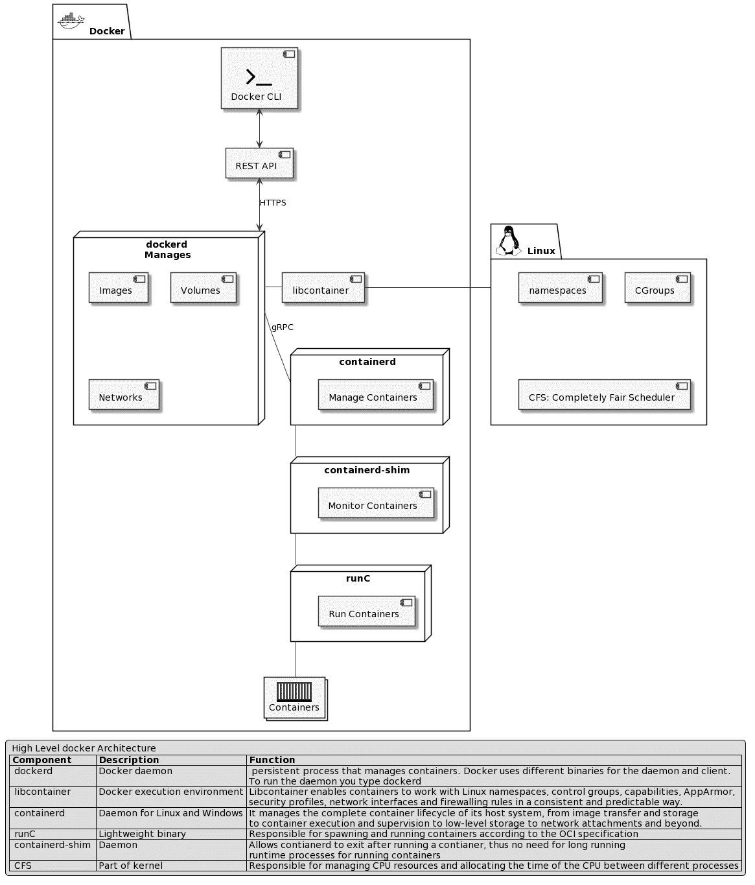
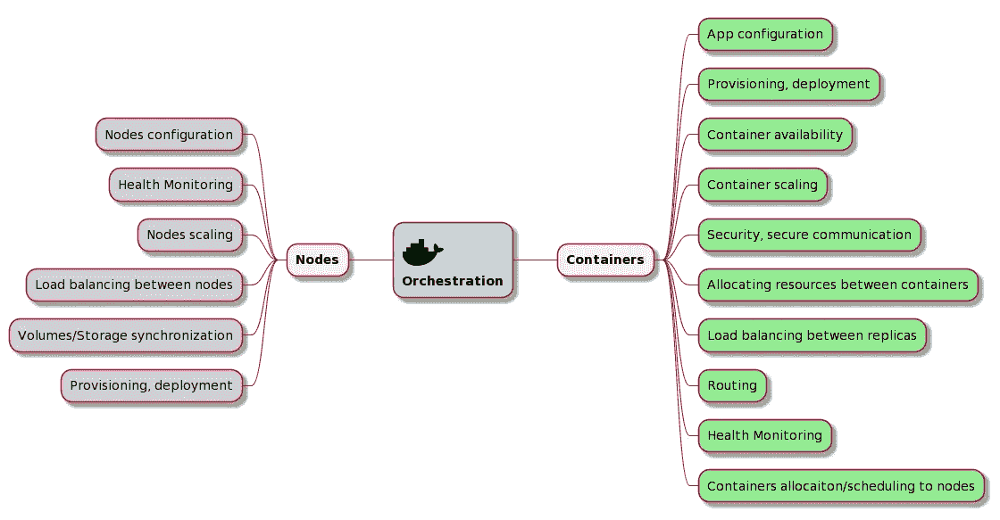
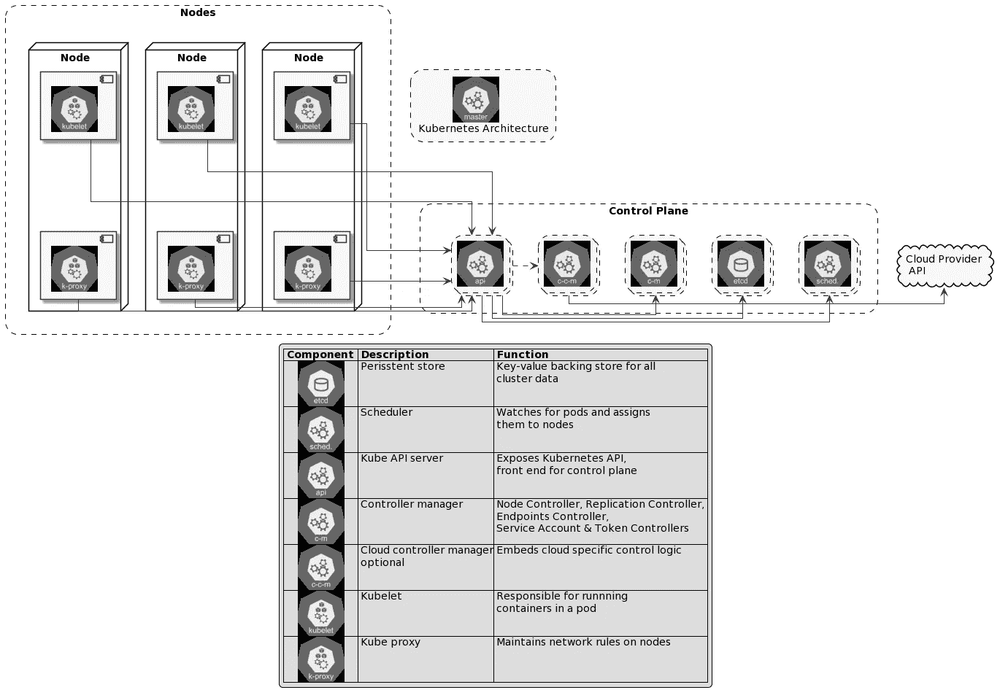
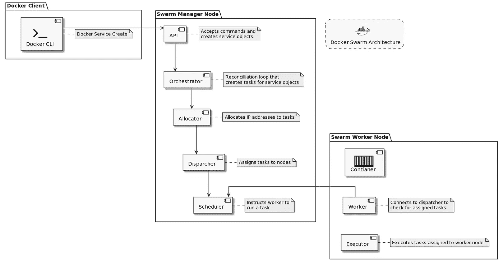
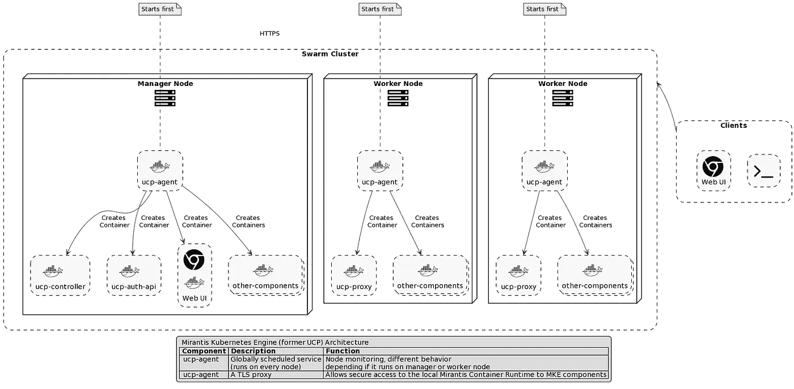
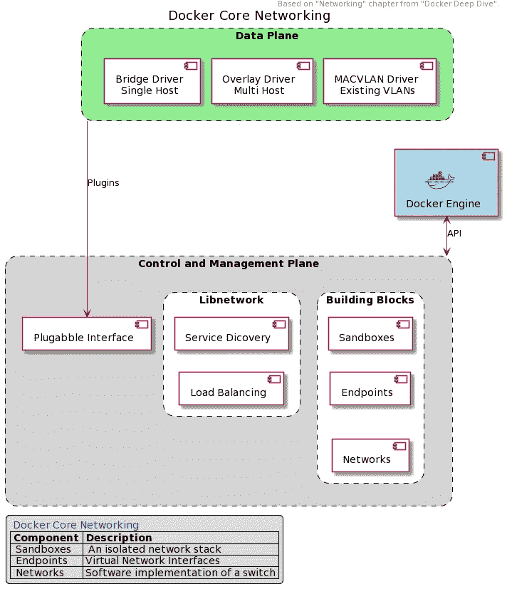
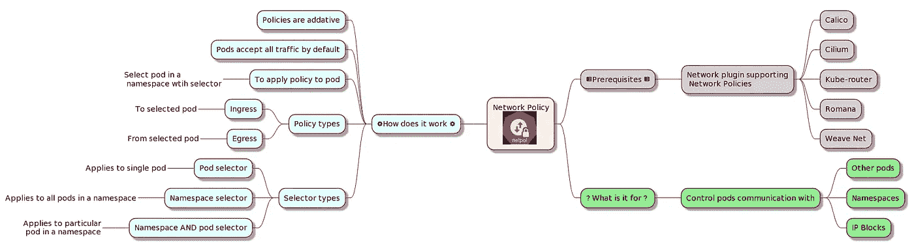
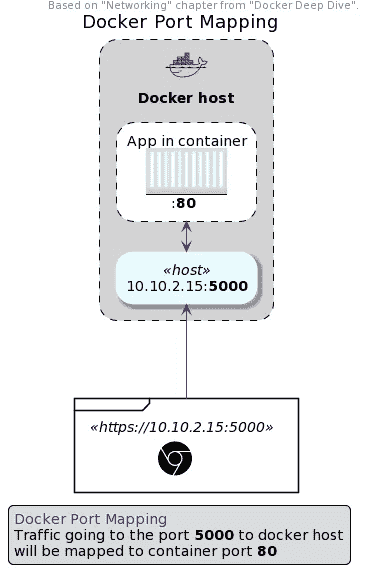
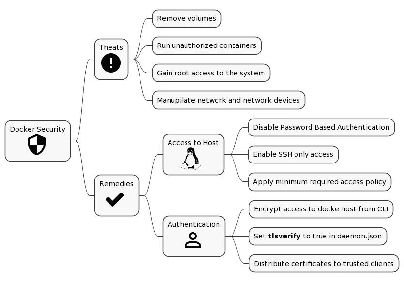
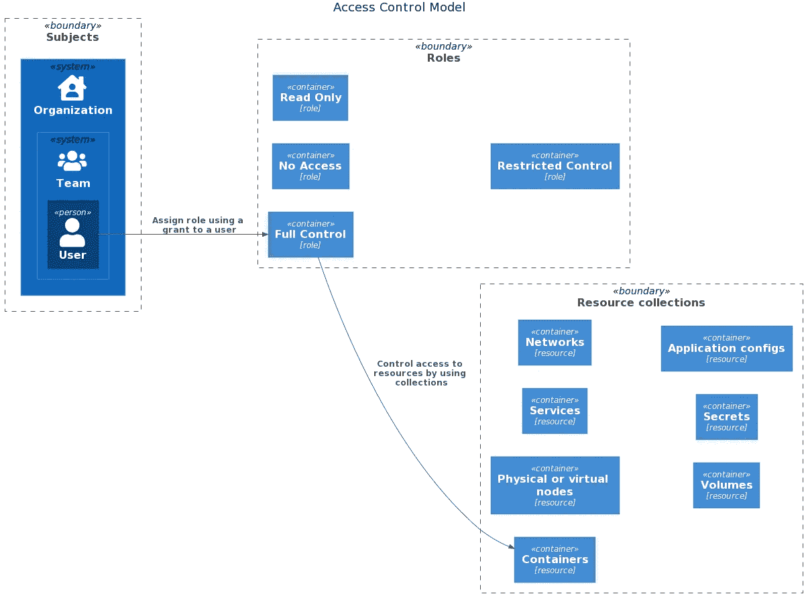

# Docker 认证助理综合指南

> 原文：<https://itnext.io/a-comprehensive-guide-to-docker-certified-associate-exam-d7f25b6374ca?source=collection_archive---------1----------------------->


码头注册助理(DCA)

## DCA (Docker 认证助理)考试备考笔记。

# 介绍

这篇文章和附带的 [Github Repo](https://github.com/Piotr1215/dca-prep-kit) 是我对 Docker 认证助理的学习方式，做笔记，同时回馈伟大的开源社区。自己尝试一下，只要几个降价文件，你就会有一本有用的学习和参考手册。

下面的部分包含我的笔记和图表，以及 docker 命令和提示和技巧。从定义上来说，这是一本自以为是的学习材料，但是我希望你在学习和通过 Docker Certified Associate 考试的过程中会发现它很有用。

如果你发现了错误，请在评论中告诉我，如果你想为回购做出贡献，请随时提交 PR。

每个部分对应考试题目。在 Docker、Docker Swarm 和 Kubernetes 中，图表(组件、顺序、小地图)有助于可视化和更好地理解架构概念。所有的图表都可以在附带的库的[图表](https://github.com/Piotr1215/dca-prep-kit/blob/master/diagrams)文件夹中找到。

> 本博客的网页版可以在[*https://dcaguide.net 下找到。*](https://dcaguide.net.) *请尝试使用网页版，直接从我的储存库中的 markdown 文件生成，随着时间的推移会比本博客更新。它还具有搜索功能，可以更容易地找到和过滤信息。*
> 
> *如果你是 Docker 新手，请查看我关于* [*Docker 基础知识*](https://medium.com/faun/a-gentle-introduction-to-docker-and-containers-2e67b1832918) 的帖子

# 证书

*   有关认证和考试[的更多详情，请访问米兰蒂斯网站](https://training.mirantis.com/dca-certification-exam/)。
*   [米兰蒂斯于 2019 年 11 月收购 Docker Enterprise](https://techcrunch.com/2019/11/13/mirantis-acquires-docker-enterprise/?guccounter=1&guce_referrer=aHR0cHM6Ly93d3cuZ29vZ2xlLmNvbS8&guce_referrer_sig=AQAAAChqDhj765aUpAQfg-rkCWE0kB-4eAJn0VdTGsf35u6hGrL6scvqoLar-_xYPJazylmp15VqXquNq69HWpYx3cepSnXSSUTirYLSMJEbPuBhQOfS4blsGLwsULwWzxK8iaH3zb2KplXRwnpdfMu9iz5Azc2czZr9T5bFwq0AIeN3)

# 考试

> 与 CKA 或 CKAD 不同，该考试没有免费重考，随后的每一次重考都必须单独付费，所以请务必做好准备。请记住，您可以随时重新安排考试。
> 
> 考试相当具有挑战性。问题非常详细，通常围绕特定主题的模糊细节。我的考试有很多关于 PVs、PVC、存储类以及 DTR 和 UCP 的详细配置的问题。请记住，您的考试可能会有所不同，因为问题经常会发生变化。
> 
> *本指南基于官方* [*Docker 学习指南*](https://docker.cdn.prismic.io/docker/4a619747-6889-48cd-8420-60f24a6a13ac_DCA_study+Guide_v1.3.pdf) *v 1.3，2020 年 5 月*

# 考试主题

1.  编排— 25%
2.  映像创建、管理和注册— 20%
3.  安装和配置— 15%
4.  网络— 15%
5.  安全性— 15%
6.  存储和容量— 10%

# 考试信息

*   考试可以远程进行
*   90 分钟回答 55 个问题
*   所有问题都是选择题
*   第十三题是*普通*选择题
*   52 个问题是*离散选项多项选择(DOMC)* 其中选项是随机出现的，一次一个。对于每一个出现的选项，考生选择是或否来表示选项是否正确。

# 学习计划

没有适当的计划，学习可能会很困难，这里有 5 个简单的步骤，让你的学习体验最优化和高效。

# 1.找到好的培训材料

作为主要的在线培训学习资源，我使用了 Kodekloud 的 [Docker 认证助理考试课程](https://kodekloud.com/p/docker-certified-associate-exam-course)。

总的来说，作为一个主要的学习资源，我怎么推荐都不为过 **Nigel Poulton 的“DOCKER DEEP DIVE”**。你可以在亚马逊上以不到 10 欧元的价格买到这本书的 kindle 版本。

你可以查看奈杰尔的个人主页了解更多信息。

我已经通过了，并在博客上写了关于 [CKA](https://medium.com/faun/preparation-and-resources-for-cka-exam-ca868fc678c9) 和 [CKAD](https://piotrzan.medium.com/preparation-and-resources-for-ckad-exam-ea1b2e8888e3) 的内容，它们与 Kubernetes 的编排部分和容器基础有很大的重叠。

哥文达·菲希特纳有一个很棒的报告，里面有按学习主题组织的 docker 文档的链接。可以在这里找到回购:[devo PS-Academy 的 DCA 备考指南](https://github.com/DevOps-Academy-Org/dca-prep-guide)。

# 2.浏览模拟问题和考试

既然考试是以题型的形式，那就要尽可能的多锻炼，多去思考题和模拟考试。我之前提到的 Kodekloud 课程内置了很多问题，但也有免费的模拟考试和问题。我觉得 medium 的一个非常好:[Medium blog——DCA 考试的 250 道练习题](https://medium.com/bb-tutorials-and-thoughts/250-practice-questions-for-the-dca-exam-84f3b9e8f5ce)。

# 3.与码头工人一起练习

在这次考试中，实践练习不像 CKA 和 CKAD 那样重要，但我仍然发现在理论课之后进行实践复习是有价值的。

那里有一项免费服务，你可以启动几个虚拟机(其中一些已经预装了 docker swarm ),无需在你的机器上安装任何东西就可以运行！

[互动在线 docker 环境点播:docker](https://labs.play-with-docker.com/)

还有一个类似的使用 Kubernetes 进行锻炼的服务，对于 Kubernetes 编排部分非常有用。

[交互式在线码头环境点播:kubernetes](https://labs.play-with-k8s.com/)

> *只是一个小提示，一旦你引导了 Kubernetes，你就可以在 docker 镜像 *中使用我的* [便携 kubectl，用诊断工具和别名运行 kubectl。](/portable-kubernetes-management-with-kubectl-in-docker-cb861a2c3c02)*

以下是运行容器的简单步骤:

```
# Run container on same network as host
docker run -d --network=host --name=kubectl-host --rm -it piotrzan/kubectl-comp:zsh# Copy over Kubernetes config file
kubectl config view --raw > config
docker cp ./config kubectl-host:./root/.kube# Attach shell to running container
docker attach kubectl-host
```

# 4.熟悉 Docker/Mirantis 文档

有很多很棒的学习资源库，考试主题直接链接到 Docker/Mirantis 文档。一个好的也是最新的是 [Evalle/DCA](https://github.com/Evalle/DCA) 。

这样的资源对于以后的学习和参考来说是很好的捷径，但是我喜欢把我所有的链接都放在书签栏里。

如果你想有相同的书签，请使用我下面的要点，保存为 html 文件，并导入到您的浏览器。书签排列在与考试主题相对应的子文件夹中:

# 5.记笔记

做笔记很容易，做好笔记有点难。为了充分利用学习笔记，我遵循以下 5 个步骤:

## 一级

笔记类型:普通笔记

如何:通常是复制粘贴或直接链接

何时使用:用于不太重要/容易记住的主题

## 第二级

注释类型:带格式突出显示

如何:使用突出显示或其他格式技巧

何时使用:用于大量材料的主题，以突出重要部分

## 第三级

笔记类型:视觉表现

如何:创建主题的图表、思维导图和其他可视化表示

何时使用:用于复杂的主题，通常是架构和高层设计

## 四级

注释类型:带有摘要的可视化表示

如何:用你自己的话创建图表、思维导图和主题的其他可视化表示

何时使用:用于需要深入理解的复杂主题

## 第 5 级

笔记类型:为教学而设计

如何:使用以上所有的技巧，但总是问自己一个问题，我怎样才能以最好的方式把这个话题教给任何人？通常你会创建博客、YouTube 视频或直接参与社区活动

何时使用:用于非常复杂的主题或你希望成为专家的主题。到目前为止，以一种旨在教别人的方式做笔记和内容是最好的学习方式

# 基本概念

现在所有的工具都准备好了，学习计划也准备好了，是时候学习 Docker、Kubernetes、Swarm 等等背后的架构概念了。

# Docker CLI 语法

Docker CLI 具有以下语法:

语法:`docker <docker-object> <sub-command> <-options> <arguments/commands>`

示例:`docker container run -it ubuntu`

# Docker 组件



来源:[https://docs . docker . com/get-started/overview/# docker-architecture](https://docs.docker.com/get-started/overview/#docker-architecture)

*其他来源*:

*   [docker](https://docs.docker.com/engine/reference/commandline/dockerd/)
*   [集装箱](https://containerd.io/)
*   [runc](https://github.com/opencontainers/runc)
*   [libcontainer](http://jancorg.github.io/blog/2015/01/03/libcontainer-overview/)
*   [集装箱垫片](https://medium.com/faun/docker-containerd-standalone-runtimes-heres-what-you-should-know-b834ef155426)

# 容器层

默认情况下，所有 docker 图像层都是不可变的(只读)。当使用`docker run`命令创建容器时，会创建一个额外的可变(读写)层。这一层只在容器生命周期内存在，一旦容器退出就会被删除。当修改正在运行的容器中的任何文件时，docker 会创建文件的副本，并在保存更改之前将其移动到容器层(写入时复制)。作为图像一部分的原始文件永远不会改变。

# 从 CLI 访问远程 Docker 主机

在您想要访问 docker 主机的机器表单上，设置变量:

```
export DOCKER_HOST="tcp://<docker-host-ip>:2375"
```

> *Docker 默认端口:*

*   2375 —未加密的流量
*   2376 —加密流量。

重要提示:此设置仅用于测试/游戏目的。它将使 docker 主机在网络上可用，默认情况下没有认证。

# 以非超级用户身份使用 docker CLI

1.  创建码头工人组:`sudo groupadd docker`
2.  创建一个您想使用 docker 的非根用户:`sudo useradd -G docker <user-name>`
3.  更改此用户主要组:`sudo usermod -aG docker <non-root user>`
4.  使用 docker 用户注销和登录。
5.  可选—重新启动 docker 服务:`sudo systemctl restart docker`

# 编排 25%

# 编排区域



市场上有一些解决方案可以帮助容器和节点编排。目前最广泛采用的是 Kubernetes，其次是 Docker Swarm。在考试中，两者都会有问题。

我已经详细介绍了我的 CKA 和 CKAD 认证的学习路径。因此，如果你想了解更多，请查看我的[中型简介](https://piotrzan.medium.com/)。

# 库伯内特建筑



*来源*:[https://kubernetes.io/docs/concepts/overview/components/](https://kubernetes.io/docs/concepts/overview/components/)。

# Docker 群体系结构



来源:[https://docs . docker . com/engine/swarm/images/service-life cycle . png](https://docs.docker.com/engine/swarm/images/service-lifecycle.png)。

## [什么是 docker 栈](http://localhost:3000/#/?id=what-is-docker-stack)

Docker stack 与 docker compose 非常相似，主要区别在于 docker composer 定义容器，而 docker stack 定义服务。Swarm 还提供了直接使用堆栈的命令。

有用的堆栈命令:

*   `docker stack deploy -c <compose file>` -部署新堆栈或更新
*   `docker stack services` -列出堆栈中的服务
*   `docker stack ps` -列出堆栈中的任务
*   `docker stack rm` -移除堆叠
*   `docker stack ls` -列表堆栈

docker stack ls 和 docker stack ps 的区别

*   `docker stack ls` -列出所有堆栈
*   `docker stack services` -列出堆栈创建的服务
*   `docker stack ps <stack-name>` -列出堆栈中运行的所有服务

## [码头工人群体网络](http://localhost:3000/#/?id=docker-swarm-networks)

*   **覆盖网络**:管理参与群的 Docker 守护进程之间的通信。您也可以将服务附加到一个或多个现有的覆盖网络，以实现服务对服务的通信。
*   **入口网络**:是一种特殊的覆盖网络，有助于服务节点之间的负载平衡。当任何群节点在公布的端口上收到请求时，它会将该请求传递给一个名为 IPVS 的模块。IPVS 跟踪参与该服务的所有 IP 地址，选择其中一个，并通过入口网络将请求路由到它。
*   **docker_gwbridge** :是一个桥接网络，将覆盖网络(包括入口网络)连接到单个 docker 守护进程的物理网络。

# Raft 共识和法定人数

实现 [Raft 一致性算法](http://thesecretlivesofdata.com/raft/)确保分布式系统中的所有管理器节点存储相同的一致状态。

## 法定人数

要计算达到*法定人数*(或简单多数)所需的最小主节点数，请使用 N = N+1/2，并将结果四舍五入为整数。

因此有 5 个主节点，法定人数是 3。

## 容错

知道了主节点的数量，我们就可以预测容错性，容错性是一个描述在集群进入不一致状态之前有多少主节点可以失败的数字。

使用 N = N-1/2 计算集群的*容错度*

例如，有 7 个主节点，我们的定额是 7+1/2 = 4，容错能力是 7–1/2 = 3

# 映像创建、管理和注册 20%

# 创建 docker 图像

Docker 映像是一个不可变的蓝图，基于它创建容器。

# CMD 和 ENTRYPOINT 之间的区别

`Dockerfile`的 *CMD* 和 *ENTRYPOINT* 部分用于指示码头工人一旦集装箱启动后该做什么。

煤矿管理局

本节定义了一旦容器启动，将执行什么命令。例如:

*   在一个`Dockerfile`构建 httpd 服务器中定义`CMD ["httpd"]`将基于所使用的映像启动 httpd Apache 服务器
*   使用命令覆盖`docker run httpd printenv`运行 httpd 图像将使用`printenv`命令覆盖默认的`CMD`，该命令将环境变量输出到终端
*   命令可以指定为常规命令:`CMD httpd`或 json 数组语法中的 json 数组`CMD ["sleep", "5"] (`。数组的第一个元素是命令本身，所有后续元素都是参数/选项)

入口点

这个部分定义了一旦容器启动将执行什么命令，默认情况下不能覆盖(需要使用`--entrypoint`标志来强制覆盖)。通过 docker run 传递的所有参数将被附加到`ENTRYPOINT`中定义的命令

*   `CMD`和`ENTRYPOINT`配合得很好，其中`ENTRYPOINT`定义了一旦容器启动就要执行的“固定”命令，而`CMD`提供了默认但可重写的参数来以不同的方式运行容器。(需要在 json 数组格式中指定`CMD`和`ENTRYPOINT`以使覆盖生效)

# 如何控制容器的资源利用

## 中央处理器

每个容器的默认 CPU 份额是 1024

选项 1:如果主机有多个 CPU，可以为每个容器分配一个特定的 CPU。

选项 2:如果主机有多个 CPU，可以限制容器可以使用多少 CPU。

值得注意的是，容器编排器(如 Kubernetes)提供了声明性方法来限制每个运行时单元的资源使用(在 Kubernetes 的情况下是 pod)。

## 记忆

选项 1:运行带有`--memory=limit`标志的容器来限制内存的使用。如果一个容器试图消耗比它的限制更多的内存，系统将杀死它，并以内存不足异常(OOM)退出进程。默认情况下，容器将被允许消耗与内存限制相同的交换空间，实际上是内存限制的两倍。当然前提是交换空间在主机上没有被禁用。

# 端口映射

> *提示:在生产中运行容器时，最好使用带有静态端口的“-p”选项。*

# 如何复制文件

复制文件非常容易，cp 命令后的第一个参数是源，第二个是目的地。

1.  将文件从主机复制到 continuer: `docker container cp /tmp/file.txt container_name:/tmp/file.txt`
2.  从容器 tp 主机复制文件:`docker container cp container_name:/tmp/file.txt /tmp/file.txt`

# 检查日志以排除 docker 服务的故障

*   检查系统日志:`journalctl -u docker.service`
*   检查主机上的可用空间:`df -h`，使用`docker container prune`或`docker image prune`清除过时的容器/图像

# 图像是从哪里提取的？

默认情况下，docker 会从已配置的图像库(默认情况下是 Docker Hub)中提取图像，但是也可以指定`build`指令，而不是带有`Dockerfile`路径的`image`

# 安装和配置 15%

# MKE 建筑



来源:[https://docs . mirantis . com/docker-enterprise/v 3.0/dockeree-products/mke/mke-architecture . html](https://docs.mirantis.com/docker-enterprise/v3.0/dockeree-products/mke/mke-architecture.html)

请注意，在 Docker 被 Mirantis 收购后，会有一些命名和产品变更，因此以下内容适用:

*   Docker Trusted Registry (DRT) **现为** Mirantis Secure Registry (MSR)
*   通用控制平面**现在是**米兰蒂斯·库伯内特发动机(MKE)
*   Docker 企业版(DEE) **现在是** Mirantis 容器运行时(MCR)

## UCP/MKE 备份

使用 **docker/ucp** 容器对 UCP/MKE 进行备份

## DTR/MSR 备份

要执行 MSR 节点的备份，请运行 **mirantis/dtr** backup 命令

## Docker 群集备份(简化版)

要使用任何管理器备份群集，请遵循以下步骤。

1.  如果群组启用了自动锁定，您需要解锁密钥来从备份中恢复群组。
2.  在备份数据之前停止管理器上的 Docker，以便在备份过程中不会更改任何数据。**确保维持群体经理的法定人数**
3.  备份整个/var/lib/docker/swarm 目录。
4.  重新启动管理器。

*来源*:[https://docs . docker . com/engine/swarm/admin _ guide/# back-up-the-swarm](https://docs.docker.com/engine/swarm/admin_guide/#back-up-the-swarm)

## Kubernetes 配置地图

为了在 pod 中配置 **configMapKeyRef** 以使用配置映射中定义的环境变量，使用容器路径子集**spec . containers . env . value from**

# 更改 docker 守护程序主机配置

配置文件位于`/etc/docker/daemon.json`，默认为`json`格式。默认情况下，该文件不存在。

# 登录 docker

docker 的默认日志驱动器是 json-file。要将日志记录驱动程序更改为例如 splunk，请更新 deamon.json，如下所示:

`echo ‘{“log-driver”: “splunk”}’ > /etc/docker/daemon.json`

# 网络 15%

## Docker 核心网络



## Kubernetes 网络政策



## Kubernetes 服务资源

Kubernetes 使用服务来实现 pod 和其他资源以及外部端点之间的通信。服务可以声明 3 种类型的端口:

*   **端口** —在集群中的指定端口上公开 Kubernetes 服务。群集中的其他 pod 可以在指定的端口上与此服务器通信。
*   **目标端口** —是服务将向其发送请求的端口，您的 pod 将监听该端口。容器中的应用程序也需要监听这个端口。
*   **节点端口** —通过目标节点 IP 地址和节点端口向集群外部公开服务。如果未指定端口字段，则 NodePort 是默认设置。

> 默认情况下，Kubernetes 中的节点端口范围是**30000–32767**

## Docker 端口映射



## Docker 网络


*重要:容器只能在用户定义的桥/主机网络上通信*

# Docker 守护程序停止行为

默认情况下，一旦 docker 守护进程停止或崩溃，所有容器也将停止。

要更改此行为，请在`/etc/docker/deamon.json`配置文件中设置`"live-restore: true"`。

# 安全性 15%

## 安全层



## MKE 的出入控制



*来源:*[http://docs . docker . oeynet . com/data center/UCP/2.2/guides/access-control/](http://docs.docker.oeynet.com/datacenter/ucp/2.2/guides/access-control/)

授权实际上是访问控制列表(ACL ),当组织在一起时，它为整个组织提供全面的访问策略。，授权定义了哪些用户可以以什么方式访问什么资源。一个授权由一个主题、一个角色和一个资源集组成。

为了控制用户访问，集群资源被分组到 Docker Swarm 集合或 Kubernetes 名称空间中。集合和命名空间一起被命名为资源集。

# 存储和容量 10%

# 所有的东西都存放在哪里

安装完成后，docker 会在`/var/lib/docker/`下创建一个文件夹，所有的容器、映像、卷和配置都存储在这里。

Kubernetes 和 Docker Swarm 将集群状态和相关信息存储在 [etcd](https://etcd.io/) 中。默认情况下，etcd 在端口`2380`上监听客户端连接。

## 在 k8s 中为应用程序配置存储类

步骤:

1.  使用置备程序创建存储类
2.  使用存储类创建 PVC
3.  使用 pod 定义文件中 volumes 部分的 PVC

# 装入卷语法

常见存储驱动因素列表:

*   AUFS — Ubuntu 默认
*   ZFS
*   BTRFS
*   设备映射器
*   覆盖物
*   重叠 2

## 卷安装

模板旧语法:`docker run -v volume_name:<path to store in container> container_name`

模板新语法:`docker run --mount source=volume_name,target=<path to store in container> container_name`

旧语法示例:`docker run -v data_vol:/var/lib/nginx_data nginx`

## 绑定安装

模板旧语法:`docker run -v <full path to folder in docker host>:<full path to folder in container> container_name`

模板新语法:`docker run --mount type=bind,source=<full path to folder in docker host>,target=<path to store in container> container_name`

旧语法示例:`docker run -v /data/nginx_data:/var/lib/nginx_data nginx`

# 有用的命令

本节描述了有用的 docker CLI 命令，格式如下:

> *命令:— docker 命令语法*
> 
> *什么时候有用:—应该使用命令的常见情况*
> 
> *结果:—预期行为或*是什么

## 检查码头状态

> *命令:*
> 
> *什么时候有用:快速查看有多少容器在运行，主机操作系统的状态如何*
> 
> *结果:关于 docker 主机环境和容器的信息*

## 移除所有未使用的 docker 工件

> *命令:* `*docker system prune --all*`
> 
> *命令变异:*
> 
> *什么时候有用:在学习或实验 docker 的时候，清除不用的工件而不重置整个环境是很有用的。带有* `*--volumes*` *标志的命令变体也将删除卷。*
> 
> *结果:以下内容将被删除:*

*   所有停止的集装箱
*   至少一个容器未使用的所有网络
*   至少没有一个容器与之关联的所有图像
*   所有生成缓存
*   卷(如果使用了`--volumes`标志)

## 停止所有运行的容器

> *命令:*
> 
> *什么时候有用:立刻快速停止所有正在运行的容器。*
> 
> *结果:所有容器停止。*

## 设置容器主机名

> *命令:*
> 
> *什么时候有用:默认主机名是容器 id，设置可识别的主机名有助于日志记录等。*
> 
> *结果:容器主机名被设置为自定义主机名。*

## 退出时自动移除容器

> *命令:*
> 
> *什么时候有用:运行一个容器，一旦停止就自动移除。这在运行 CI/CD 容器时非常有用。*
> 
> *结果:容器启动并在停止后移除。*

## 为运行容器的用户添加或删除功能

> *命令:* `*docker run --cap-add/--cap-drop KILL nginx*` *或* `*docker run --privileged nginx*`
> 
> *何时有用:这个命令在提升或降低运行容器的用户的权限时很有用。默认情况下，容器以有限的 root 权限运行。第二个命令以完全用户权限运行容器。*
> 
> *结果:容器以预期的权限运行。*

## 使用—过滤标志过滤结果

> *命令:* `*docker search --filter=stars=3 --no-trunc busybox*`
> 
> *什么时候有用:几乎每个 docker 命令的结果都可以用* `*--filter key=value*` *标志过滤。参考 docker 文档，查看给定命令支持哪些过滤器选项。*
> 
> *结果:根据过滤标志过滤的命令输出。*

# 链接和资源

1.  [Docker 认证助理学习指南](https://docker.cdn.prismic.io/docker/4a619747-6889-48cd-8420-60f24a6a13ac_DCA_study+Guide_v1.3.pdf)
2.  [devo PS-Academy 的 DCA 备考指南](https://github.com/DevOps-Academy-Org/dca-prep-guide)
3.  [交互式在线码头环境点播](https://labs.play-with-docker.com/)
4.  [交互式在线 kubernetes 环境点播](https://labs.play-with-k8s.com/)
5.  [中型博客 DCA 考试的 250 道练习题](https://medium.com/bb-tutorials-and-thoughts/250-practice-questions-for-the-dca-exam-84f3b9e8f5ce)
6.  [Kubernetes 官方文档](https://kubernetes.io/)
7.  [Docker 文档](https://docs.docker.com/)
8.  [米兰蒂斯文件](https://docs.mirantis.com/welcome/)
9.  [作为代码的 PlantUML 图](https://plantuml.com/)
10.  [K8s 服务解释](https://www.bmc.com/blogs/kubernetes-port-targetport-nodeport/)

# 摘要

开放学习是与开源社区互动的最有益的体验和方式之一，请亲自尝试。我希望这篇文章对你有用，并祝你在获得 Docker Certified Associate 认证时好运:)