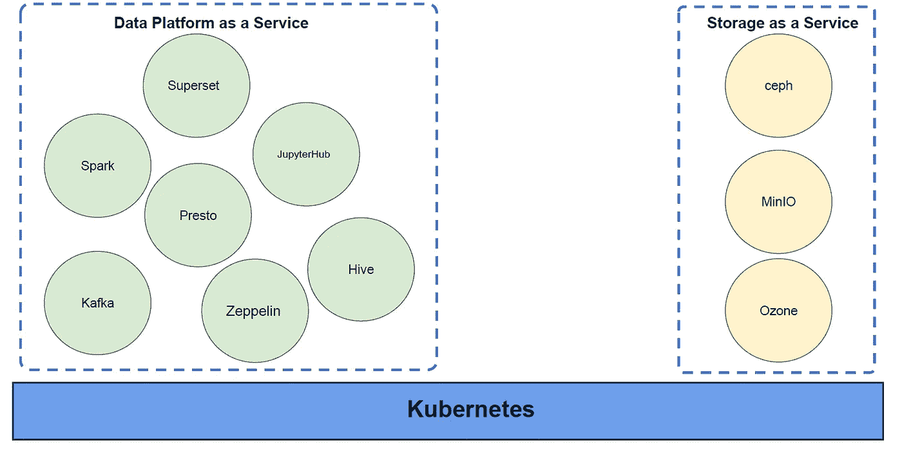
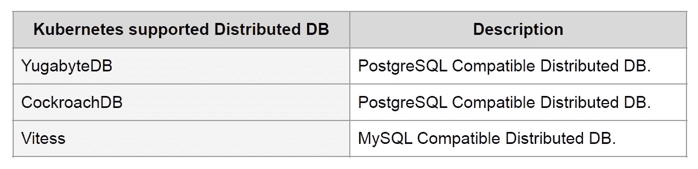
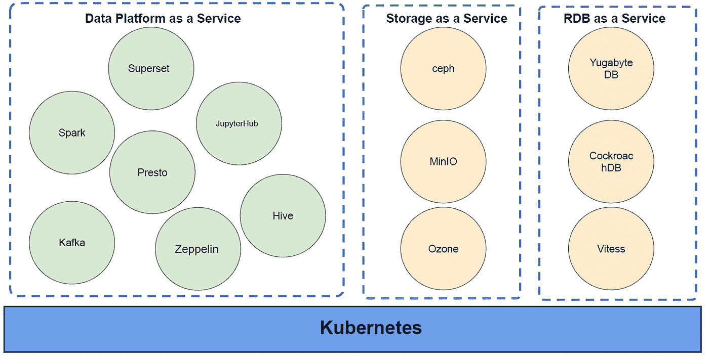
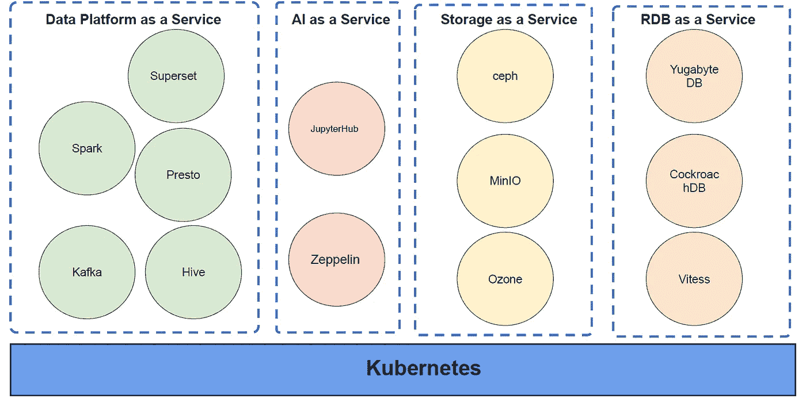
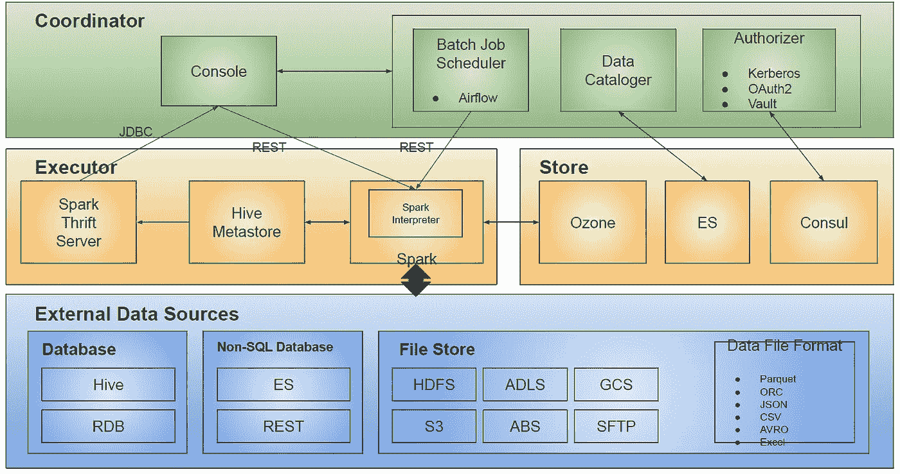
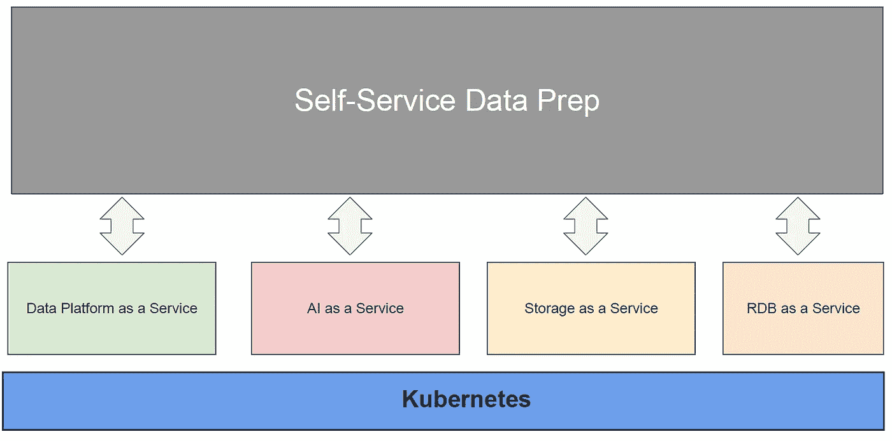
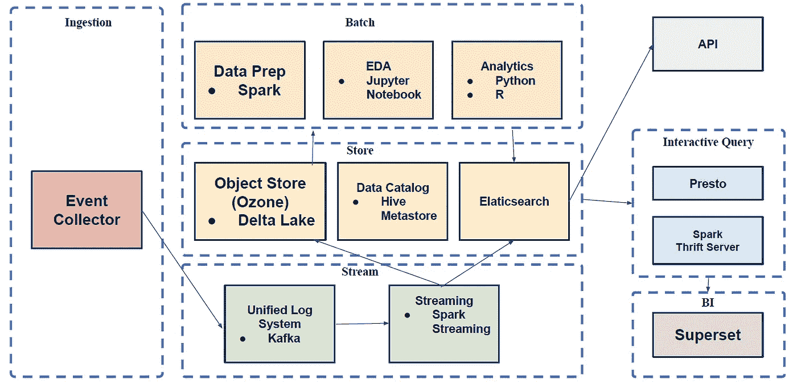
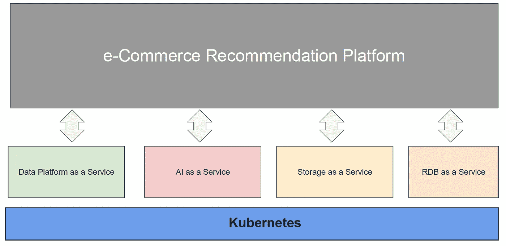

# 一个概念:基于 Kubernetes 的私有云平台

> 原文：<https://itnext.io/a-concept-kubernetes-based-private-cloud-platform-6ba9641c7e01?source=collection_archive---------0----------------------->

照片由 [Unsplash](https://unsplash.com?utm_source=medium&utm_medium=referral) 上的 [Daria Besedina](https://unsplash.com/@dariabesedina?utm_source=medium&utm_medium=referral) 拍摄

我在之前的博文[中已经介绍过一个不安装 hadoop 的云原生数据平台的概念 https://medium . com/@ myki dong/cloud-native-data-platform-without-Hadoop-installation-6254 A8 ea 3473](https://medium.com/@mykidong/cloud-native-data-platform-without-hadoop-installation-6254a8ea3473)。

通过这篇文章，我们了解了如何在 Kubernetes 上构建一个没有 hadoop 的数据平台。Hadoop 的主要组件可以替换为替代品，例如，HDFS 可以替换为可在 Kubernetes 上运行的 Ceph、MinIO 和 Ozone 等 S3 兼容对象存储，如果 Spark 是主要的计算执行引擎，YARN 可以替换为 Kubernetes。所有其他数据平台组件，如 presto、hive on spark、kafka 等都可以在 Kubernetes 上运行。

在这里，我将扩展这个概念，谈谈基于 Kubernetes 构建私有云平台。

# 基于 Kubernetes 的服务

首先，我们可以开始公开服务，如数据平台即服务和存储即服务的各个组件。

现在，让我们将 RDB 视为一项服务。有一些分布式数据库可以在 Kubernetes 上运行:

我们可以将 RDB 作为服务添加到我们的私有云平台，如下所示:

现在，我们为我们的私有云平台提供了一些服务。关于 AI / EDA，我们可以从数据平台服务中检索一些组件，如 Zeppelin 和 JupyterHub，我们可以将它们以 AI as a Service 的名称添加到服务中:

我们的私有云平台看起来相当不错。我们可以为用户提供一些合理的服务，例如，如果用户想要创建一个数据平台来开发一个数据湖，用户只需选择我们的私有云平台提供的服务就可以轻松实现。如果用户只是想得到一个 EDA 环境，一个 JupyterHub 将很容易为他创建。例如，为了从 S3 兼容的对象存储中获取 blucket，将创建 MinIO bucket。

# 在我们的私有云平台上部署一些场景

我们现在有了一个新的私有云平台。让我们尝试在我们的私有云平台上部署一些类似自助数据准备和电子商务推荐平台的场景。

## 自助数据准备

自助式数据准备是指无需数据工程师即可获取可用于执行 AI/ML/DL 算法的数据集的数据准备。

我的自助式数据准备架构如下所示:

这个数据准备的主要组件是作为计算引擎的 Spark 和作为存储的 Ozone，并且 Spark 上的 Hive 可以暴露给 BI。

我们可以在我们的平台上部署这种自助式数据准备:

## 电子商务推荐平台

来看看我的电商推荐平台:

我的电商推荐平台通过分析用户行为事件来推荐商品。

事件收集器将收集用户行为事件，如项目视图、购物车和订单。事件将被转发到 Kafka 之类的统一日志系统，Spark Streaming 可以从该系统消费事件，在该系统中将执行流处理，并且处理后的流事件将被保存为 delta lake to Ozone 或 Elasticsearch。在批处理层，将使用 Spark 完成数据准备过程，以构建将用于运行推荐算法的数据集。推荐数据的结果将被保存到 Elaticsearch。通过对 Elasticsearch 的查询，API 服务可以向用户提供推荐。

这个推荐平台的组件有 Spark，Kafka，Hive on Spark，Presto，Ozone，Elasticsearch 也可以在 Kubernetes 上运行。

如果这个推荐平台部署在我们的私有云平台上，看起来是这样的:

# 结论

目前，我已经谈论了基于 Kubernetes 构建私有云平台。借助这一概念，您可以向组织中的用户提供服务，还可以消除对公共云提供商服务的依赖。上面提到的所有复杂的“即服务”事物，如数据平台组件、对象存储、EDA、RDB，都可以由 Kubernetes 以标准的方式进行管理。

# 参考

*   [https://github.com/cloudcheflabs/dataroaster](https://github.com/cloudcheflabs/dataroaster)
*   下面的演示展示了如何使用[数据烘烤器](https://github.com/cloudcheflabs/dataroaster)轻松创建一个数据平台，该平台由运行在 Kubernetes 上的 hive metastore、spark thrift server、trino、redash 和 jupyterhub 等组成。参见数据烘烤器演示:【https://youtu.be/AeqkkQDwPqY 