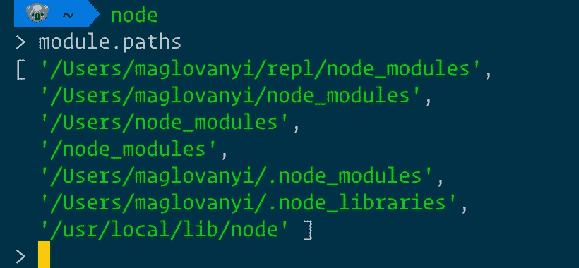
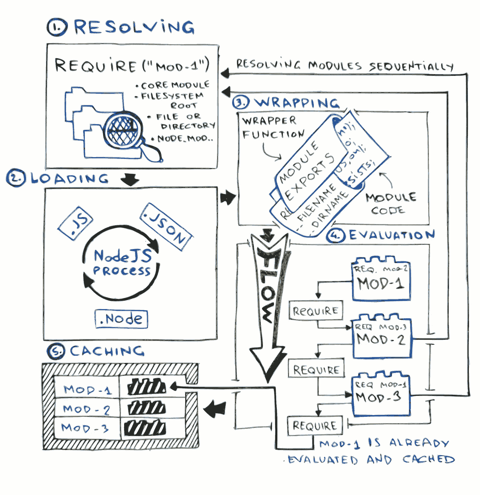

# JavaScript 模块

> 原文：<https://itnext.io/a-couple-of-years-ago-javascript-developers-were-blessed-with-a-new-es6-standard-which-brought-us-51d585382704?source=collection_archive---------1----------------------->

几年前，JavaScript 开发人员有幸获得了一个新的 ES6 标准，它给我们带来了许多新奇的语言特性，比如模块、类、箭头函数、async/await 等等。然而，我们仍然必须将代码移植到 ES5 中，并用 polyfills 捆绑起来，以适应遗留浏览器用户，这带来了一堆不必要的代码。

幸运的是，我们可以通过简单地利用 **JavaScript 模块**来检测浏览器是否支持 ES6 特性，并向现代浏览器提供必要的最低限度。虽然在服务器端，事情比较复杂。

今天，我将深入探讨一个主题，模块实际上是什么，当今最流行的标准，即 CommonJS (CJS)和 JavaScript 模块(ESM)之间有什么区别，以及为什么开始在所有地方使用单一标准如此困难。

仅提及模块格式( [AMD](https://github.com/amdjs/amdjs-api/wiki/AMD) 、 [CommonJS](http://www.commonjs.org/) 、 [UMD](https://github.com/umdjs/umd) 、 [JavaScript 模块](http://www.2ality.com/2014/09/es6-modules-final.html#an_overview_of_the_es6_module_syntax))、捆绑工具( [Browserify](http://browserify.org/) 、 [Webpack](http://webpack.github.io/) 、 [Rollup](http://rollupjs.org/) 、[package](https://parceljs.org/))和动态加载器( [RequireJS](https://requirejs.org/) 、 [SystemJS](https://github.com/systemjs/systemjs)

过去，我们必须确保相关功能以正确的顺序包含在页面中，因为前一段代码需要满足某些条件:

由于所有文件共享一个全局状态，开发人员必须手动控制包含脚本的顺序，并确保变量不会覆盖已经定义的变量。

多年来，Javascript 应用程序变得越来越复杂，当应用程序变得更加复杂时，通过将代码分解成封装的功能块，模块成为避免污染全局状态的解决方案，这使得测试、调试和组合更加容易。

这就是我们提出模块模式的时候。

## 揭示模块模式

[模块模式](https://addyosmani.com/resources/essentialjsdesignpatterns/book/#modulepatternjavascript)是一种为变量和函数提供私密性的通用方法，同时公开一个期望的公共 API。

这种方法之所以有效，是因为 Javascript 的作用域被限制在一个函数级别上(至少直到 ES6)，这意味着函数中定义的内容不能暴露在外部。

上面函数周围的圆括号只是为了说明它是一个函数表达式，可以被调用，但是我们可以不用它，因为把它赋给变量`var myUser =`已经把它转换成表达式了。

公共方法由一个返回的对象公开，其余的声明包含在函数范围内，使得它在外部不可访问。

这种方法效果很好。它不需要任何库，并被所有平台支持，但它有其缺点，如管理依赖性，因为`setUserEmail`隐式依赖于`re`模块，但模块定义中没有显示这一点。

然后 NodeJS 出现了，并普及了 CommonJS 用于后端 JavaScript。

# 🛠CommonJS 模块

这是 NodeJS 组件在 2009 年采用的官方模块系统。与模块模式一样，它将每个模块隔离在其闭包中。

最大的[包仓库](http://www.modulecounts.com/) `npm`是基于 CommonJS 格式构建的。

它由两个实体组成——`exports`对象，它将你放入其中的所有东西作为公共符号公开(例如函数和变量):

和一个`require`函数，使用提供的模块说明符将另一个模块的符号放入您的范围:

要返回所需的模块，需要执行五个步骤:

1.  **将模块的指定符解析为 NodeJS 理解的绝对路径或工件。它可以是模块的路径或者是`node_modules`目录中的模块名。NodeJS 将在由`module.paths`定义的路径中搜索模块:**

如果模块说明符是一个文件夹，并且该文件夹中有一个`package.json`文件，加载程序将解析该文件并加载该文件，如*主*字段所示。如果`package.json`丢失，`index.js`文件将被 NodeJS 用作默认条目。

也可以使用`require.resolve("module")`来检查文件是否存在，而不加载它。

2.**加载**决定文件的类型。如果它是一个 JavaScript 文件，那么 NodeJS 假设该文件是一个 CommonJS 模块。在将加载的 JavaScript 字符串传递给 JavaScript 运行时进行评估之前，字符串被封装在函数中。

3.包装赋予文件私有的范围。这使得`require`方法和`exports`对象对于所需的文件都是本地的。

常用的`exports`、`require`、`module`、`__fileame`、`__dirname`等构件不是全局的，而是一个模块的包装函数的参数。

尽管在标准的 CommonJS (CJS)模块规范和节点对`module.exports`对象的实现上存在差异。在 NodeJS 中，`module.exports`是一个被导出的特殊对象，而`exports`只是一个指向`module.exports`的指针。另一方面，CommonJS 没有`module.exports`对象。因此，如果`exports`变量被重新分配，它会丢失一个引用并引入一个新变量，而不是改变`module.exports`对象:

CommonJS 模块是为服务器端实现而设计的，因为它们是同步解析的。这意味着模块是按顺序加载和执行的，它们在源文件中是必需的，并且没有办法知道模块在执行前导出了什么，这使得这种模块不太适合客户端。这也是为什么不能异步改变`exports`对象的原因:

但是模块可以以编程方式包含在源代码中。也可以使用析构:

2011 年，Browserify 发布，将 CommonJS 模块带到浏览器中，通过将所有必需的依赖项捆绑到单个 JavaScript 文件中，允许客户端 JavaScript 到`require` npm 包。

4.**JavaScript 运行时评估**加载的代码。

5.包装函数**缓存**对象用于进一步的`require`调用，如果解析为相同的文件，将得到完全相同的对象。

# 🚀JavaScript 模块(又名 ESM)

JavaScript 模块于 2015 年在 ES6 中引入，作为一种解决方案，用于标准化当时已经存在的所有平台上的模块系统动物园。

要创建一个 JavaScript 模块，只需使用`export`指令导出公共功能供其他模块使用:

要使用一个模块，`import`它的元素在另一个模块的命名空间中:

这种导入模块的语法形式是静态声明:它只接受一个**字符串文字**作为模块说明符，并通过一个*预运行时*“链接”过程将绑定引入局部范围。

因此，尽管破坏 CJS 的进口是可能的，但 ESM 却不可能:

由于 JavaScript 模块被设计成可静态分析的，并且在没有运行程序的情况下，运行时无法预先知道导出的符号将被赋予什么值——这就是为什么`export/import`指令应该只在文件的顶层使用的原因。

import 和 export 指令的静态特性允许静态分析器在不运行代码的情况下构建完整的依赖关系树，它还支持重要的用例，如捆绑工具和树抖动，这非常酷。

JavaScript 模块本质上是异步的，因为它们可以分三个阶段处理。

1.  **构造** —获取并解析文件，生成模块记录。
2.  **实例化** —构建静态模块图，在内存中连接导出/导入。
3.  **评估** —在 Javascript 运行时加载代码。

在 NodeJS 中，模块应该在扩展名为`.mjs`的文件中创建，这表明它是一个模块，而不是用熟悉的`.js`扩展名定义的常规脚本。这个决定被批评了很多次，但可能是目前最理想的。另一方面，浏览器并不真正关心扩展名，只要文件包含具有特殊属性``的脚本元素，并使用正确的`MIME`类型，如 JavaScript 文件的`text/javascript`。

由于 NodeJS 中没有特殊的属性或`MIME`类型，所以决定使用`.mjs`扩展来确定它是`module`还是常规的`script`。

但是为什么它如此重要呢？

规格中的`script`和`module`有区别:

1.  默认情况下，模块启用了[严格模式](https://developer.mozilla.org/en-US/docs/Web/JavaScript/Reference/Strict_mode)(就好像它们在顶部隐含了一个“use strict”)。
2.  静态的`export`和`import`指令只在模块中可用，在常规脚本中不起作用。
3.  模块只被求值一次，而经典脚本被求值多次。

网络上的模块具有额外的显著特征:

1.  模块有一个词法顶级范围。这意味着，举例来说，在一个模块中运行`var foo = 42;`不会*而*创建一个名为`foo`的全局变量，可以在浏览器中通过`window.foo`访问，尽管在经典脚本中会是这种情况。
2.  模块是用 CORS 取的。任何跨源模块脚本都必须使用正确的头文件，比如`Access-Control-Allow-Origin: *`

由于这些差异，JavaScript 引擎在处理模块和经典脚本时会有不同的表现，因此需要理解什么在哪里。

如前所述，浏览器可以通过设置一个`type`属性将`<script>`标签视为模块:

值得注意的是，如果现代浏览器理解模块类型，它将忽略一个`nomodule`脚本标签，而传统浏览器将使用回退脚本！这意味着如果您的`esm-index.mjs`文件使用 ES6 特性，您就不必再传输它了，这些特性是与`window.fetch`、`Classes`、`arrow functions`或`async/await`等模块同时引入的，它们会使您的包变得更小。🤘

我们已经提到过，与 CommonJS 的`require`相比，`import`不是动态的(例如，它不能被有条件地调用)，因为 JavaScript 模块的导出是按词汇定义的*。也就是说，模块导出的符号是在 JavaScript 代码被解析之前确定的。但是有一条出路！*

## *JavaScript 模块:动态导入()*

*在某些情况下，有条件或按需导入模块、在运行时编写模块说明符或从`script`文件导入模块是很有用的。这些在静态导入中都是不可能的。*

*与*词法* `import`不同，*动态* `import()`函数是在当时进行处理或求值的(就像 CJS `require`)。*

*`import()`为所请求模块的模块名称空间对象返回一个`Promise`，它是在构建、实例化和评估模块的所有依赖项以及模块本身之后创建的。*

*因为`import()`返回一个承诺，所以可以用`async/await` 来代替:*

*虽然`import()`看起来像一个函数调用，但它被指定为恰好使用括号的语法(类似于 super())，并且它不继承`Function.prototype`。*

# *欧洲稳定机制和 CJS 的区别*

*以及为什么 NodeJS 对采用 JavaScript 模块如此敏感。*

*从 8.9.0 版本开始，NodeJS 中就提供了带有实验标志`—-experimental-modules`的 JavaScript 模块。在我的理解中，主要的差异和难点是:*

1.  *同步与异步加载器。JavaScript 模块应该支持异步加载。Node 的 CommonJS 模块是同步加载的，因为它们通常是从本地文件系统加载的——所以不太需要支持异步。*
2.  *解决算法(例如裸导入)*

*裸导入是指模块说明符只有在`package.json`中定义的模块名称，例如`require("lodash")`。在这种情况下，NodeJS 会查看`node_modules`目录，这是对算法功能的一个非常简单的解释。这个算法是整个 CommonJS 系统的核心，它是`npm`的基础。*

*根据 JavaScript modules 规范，当`import`调用模块时，说明符必须是完整的 URL，或者以`/`、`./`或`../`开头的相对 URL，但是没有提到裸导入，目前不支持裸导入。*

*因此，NodeJS 实现了与 CJS 相同的解析算法，但用于 ESM。这意味着，例如，如果你做了`import _ from 'lodash'`，它将在`node_modules`中寻找一个`lodash`目录，并寻找它的`package.json`来确定要加载的文件。*

*3.加载模块的默认规则是:*

*   *一个 JavaScript 模块可以使用`import`加载其他 JavaScript 模块。*
*   *JavaScript 模块可以使用`import`加载 CommonJS 模块，但只能默认导入。*
*   *一个 CommonJS 模块可以使用`require`加载其他 CommonJS 模块。*
*   *CommonJS 模块**不能**加载 JavaScript 模块(除了动态`[import()](http://2ality.com/2017/01/import-operator.html)`承诺)，所以后者必须被转换成 CommonJS，比如你可以用 Babel 来做。但是请记住，除了 JavaScript 模块中的命名导出之外，还有一个`default`导出，当它被转换为 CommonJS 模块时，会在`exports`对象中添加一个“默认”属性:*

*所以你必须`const lowerFirst = require("string-case").default`它。*

*在这篇文章中，我试图掌握并演示流行模块系统的基本原理和差异。我认为这对进一步理解不同的生态系统和流行的捆绑器是如何组织的至关重要。*

*感谢阅读！*