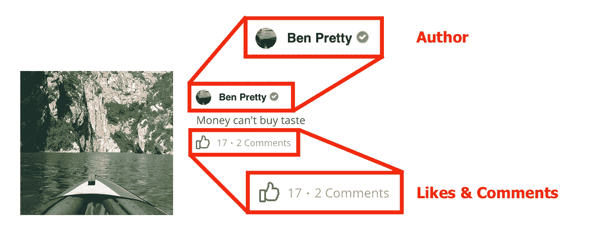
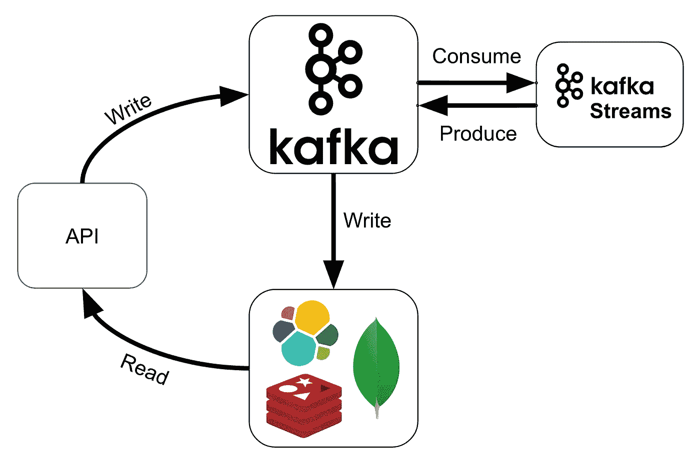
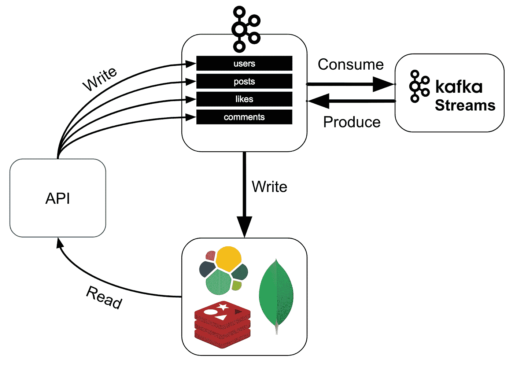
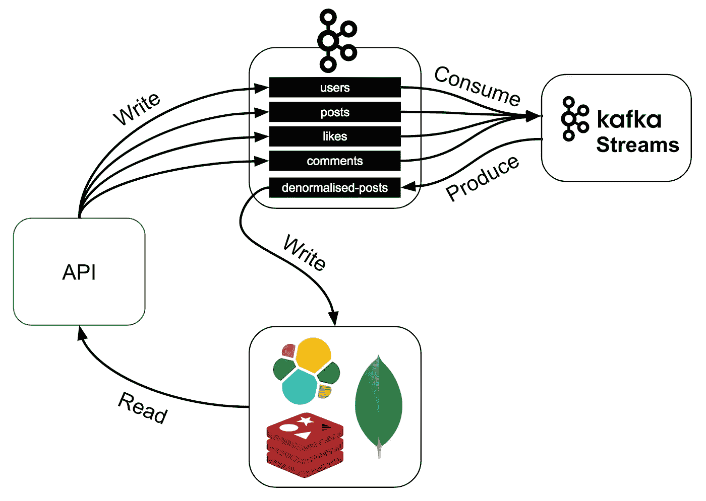

# 用 Kafka Streams 和 Scala 进行函数式编程

> 原文：<https://itnext.io/a-cqrs-approach-with-kafka-streams-and-scala-49bfa78e4295?source=collection_archive---------1----------------------->

# 语境

我最近一直在为一个社交网络工作，在那里我们面临着有趣的业务用例。由知名人士创建，我们从架构的早期设计就预期，联合创始人的粉丝会在网站一上线就推动流量激增。因此，从任何角度来看，这样一个系统都应该是可扩展的，因为我们有大量的人在查看、发布、评论和喜欢...

通常**功率**与系统的**复杂性**直接相关，由于我们是一家拥有小型后端团队的初创公司，我们也需要系统易于运行和维护，因为我们没有数据团队、运营团队、开发团队或其他团队……我们更像是一个由大约 4 名开发人员组成的独特团队，他们每个人都了解系统的每个部分。

那么，我们如何在不增加复杂性的情况下实现这样一个可扩展的系统呢？这就是我们将在这个故事中看到的。

# 用例

为了简单起见，在这个故事中，我将把用例归结为一个最小的功能集。

作为一个社交网络，可以发布帖子:

如你所见，还可以通过评论和赞与帖子互动。让我们仔细看看这些帖子中的一个:

我们可以看到这张小卡片已经包含了安静的一些信息:

*   **帖子**本身带有文字“钱买不到品味”和船图，
*   还有关于作者的信息，包括他的名字和头像
*   以及一些关于本帖收到的**点赞**和**评论**数量的统计。

# 模型

让我们定义上面 UI 的模型表示。

我们的系统中到处都有 id，所以我们为它定义了一个 case 类，并扩展了`AnyVal`以尽可能避免装箱，这让我们比使用简单的`String`更加类型安全:

以下是`User`、`Post`、`Like`和`Comment`的所有案例类别:

# CQRS 模型

我们的主要要求是系统应该在读写上水平扩展。

## 阅读优化方法

一种简单的方法是将所有数据存储在某个数据库中，并通过查询帖子本身、用户名和带有作者 id 的头像，以及计算喜欢和评论的数量来生成帖子视图，所有这些都是在阅读时进行的。
即使你可以通过索引和缓存来优化读取，如果我们有太多的读取，这也不会扩展。

## 编写优化方法

另一种方法可能是在写的时候进行一些反规格化。因此，我们可以创建一个`DenormalisedPost` case 类，包含所有必要的阅读信息:

然后我们可以在写的时候更新这个`DenormalisedPost`，例如当有人喜欢这个帖子时，增加 like 计数器。
这将使读取非常快，但如果我们有许多写入，它将不会扩展。例如，如果一个帖子非常受欢迎，那么多人争相喜欢，我们就会过多地锁定非规范化的帖子。

## CQRS 方法

真正的解决方案是实现 CQRS(命令查询责任分离)模型:

这基本上是将读取和写入分开，让它们可以扩展。因此，我们将能够通过 **API** 在**命令模型**中以高吞吐量编写新用户、帖子、评论和赞，并在**查询模型**中读取非规范化的帖子。

但是，如果我们将读取和写入分开，那么我们在**命令模型**中写入的数据将如何在**查询模型**中结束呢？
这就是 **Kafka Streams** 的用途，它是一个**数据处理**库，可以消费来自主题的数据，转换它们并沉入其他主题。

下面是我们如何用卡夫卡和卡夫卡流来实现 CQRS 的方法:

API 将在一些 Kafka 主题中编写它的**命令**。那些主题将被卡夫卡的溪流所消费，被转化并沉入其他一些主题中。这些其他主题将被连接到数据库中，如 Elasticsearch、MongoDB、Redis…无论哪一个都是 API 查询的最佳选择。

请注意，这种架构最终是一致的，这意味着如果我喜欢一个帖子，并立即查询这个帖子上的赞数，它可能不会增加。我们通常通过前端在计数器中伪造增量来解决这个问题。

# 命令模型

让我们看看它在我们的社交网络中是怎样的:
我们将有 4 个关于**命令模型的卡夫卡主题**，你可能已经猜到了，它们将映射到我们的模型类:

*   *用户*
*   *帖子*
*   *喜欢*
*   *评论*

因此 API 将能够编写先前在它们相应的主题中定义的 case 类:

# 查询模型

但是现在你可能想知道我们要在 API 将要读取的数据库中写什么，以及如何写。

Kafka Streams 将使用**帖子**、**用户**、**评论**，以及**喜欢**命令主题来生成`DenormalisedPost`，我们已经在**写优化方法**中看到了一个`denormalised-posts`主题，该主题将被连接以写入数据库供 API 查询:

# 喀尔刻和卡夫卡·塞德斯

我们几乎没有接触一行代码就走到了这里，有计划是好的，但实施计划更好。
正如我们在模式上看到的，这里有大量的**写/产生**和**读/消费**。所以在开始任何实现之前，让我先介绍一下 [**喀尔刻**](https://circe.github.io/circe/) ，它可能是 Scala 中最好的 JSON 库。

很简单，喀尔刻为你定义了两个类型类，`Encoder[T]`和`Decoder[T]` *，*，它们分别知道如何编码和解码`T`。所有这些都在《https://circe.github.io/circe/》中有很好的记录。

卡夫卡也提出了同样的概念，只不过它们被称为`Serializer[T]`和`Deserializer[T]`。他们每个人都知道如何序列化和去序列化`T`。但不是专门针对 JSON 的！如果你想序列化/反序列化成字节，你可以这样做。

Kafka Streams 在 ***Serde*** 方面走得更远，它本质上只是将同一类型的`**Ser**ializer[T]`和`**De**serializer[T]`组合成一个知道如何序列化和去序列化`T`的类型`Serde[T]`。

那么我们为什么要关注这些概念呢？嗯，我们可能希望将我们的记录序列化到 JSON，因为这是一种简单且常用的格式，因此使用喀尔刻。但是我们肯定不想为每一个(自动生成的)写一个**卡夫卡式的 Serde** ？)**喀尔刻编码器/解码器**。这正是卡夫卡溪流喀尔刻能为你做的。你只需要添加一个导入，这将带来所有的 Kafka Serde，我们有一个喀尔刻编码器/解码器:

# 卡夫卡制片人

我们看到了如何将一些 Scala 对象序列化和反序列化为 JSON。现在是时候使用这种能力在**命令模型**主题中产生数据了。

让我们看看我们将在 API 服务器代码中使用的 Kafka 生成器:

在这个代码片段中，我们创建了一个 post producer，然后向 **posts** 主题发送一个`Post`。
正如你所看到的，发送一个帖子是安静的模板。每当我们想要发送一个记录时，我们需要附加一些配置到它上面。当我们只想发送一条记录时，这不仅会增加开销，而且还会导致错误，将帖子发送到错误的主题或使用了错误的连载。如果我们能让编译器帮我们检查一下，那就更好了。

事实上，这可以通过创建一个类型类*记录*得到很大的改善，它将包含关于一个记录的所有配置。然后，这个类型类将被一个新的`send()`函数使用，该函数只接受要发送的对象(本例中为`Post`),并自动配置这个记录的主题、id 和时间戳:

我们现在需要做的就是在`Post`的伴随对象中添加一个隐式的`Record[Id[Post], Post]`:

然后我们可以直接发送 post，配置将通过隐式解析自动找到:

这看起来更好，更容易理解，并且没有错误，因为编译器会为我们完成这项工作。

# 卡夫卡溪流

既然我们已经生成了**命令模型**主题，我们将需要使用它们来生成**查询模型**。这就是 Kafka Streams 发挥作用的地方，作为一个数据处理框架，它将让我们进行有状态转换。

## 流

首先让我们创建这些流:

正如我们看到的，这里还有一些锅炉板，可能会导致运行时错误**正如我们在创建 Kafka Producer 时看到的那样。我们不仅要再次重写 3 个信息(键类型、值类型、主题)，而且如果类型与主题不匹配，没有**编译时检查**，它将在运行时爆炸！
幸运的是，有一种方法可以解决这个问题，即重用之前创建的`Record[K, V]`类型类:**

这可用于创建我们需要的所有流，如下所示:

非常简洁，但是不要忘记最后的空括号。

## KTables

好吧，你已经读了太长时间，现在终于看到了第一个流处理代码，它将为我们的社交网络提供动力，小心马克·扎克伯格！
这里的目标是在我们收到*用户*、*帖子*、*赞*和*评论*时生成`DenormalisedPost`，为此，我们需要构建将代表我们的**状态**的`KTable`，然后我们将能够在它们的公共键上**连接**它们。

因此，我们希望通过他们的 id 的用户的`KTable`与通过作者 id(用户 id)的帖子的`KTable`相结合。

你可能想知道为什么在帖子中使用`KTable`？为什么不使用原始的按作者 id 重设密钥的`KStream`与按用户 id 重设密钥的`KTable`相结合，实质上是查询用户的每个帖子呢？由于这个原因，如果一个用户在发帖后得到更新，我们将需要找到他创建的所有帖子来更新那里的用户。这只有在我们将帖子保存在`KTable`中，有效地为它们建立一个可查询的状态时才能实现。

## 交换性

这就给我们带来了**交换性**的概念。一个简单的例子是:

> 1 + 2 + 3 = 6
> 3 + 2 + 1= 6

因此，我们可以说 **+** 运算符是可交换的，因为数字出现的顺序无关紧要。

这正是我们在这里对 *Post* s 和 *User* s 所做的，它们出现的顺序并不重要，输出应该总是相同的`DenormalisedPost`。

好了，让我们看看创建这两个`KTable`的代码:

*   `usersByKey`按键(用户 id)分组，减少我们得到的同一个键的所有用户，只保留它的最新版本。对`isAfter`的检查确保了**的可交换性**，因为 reduce 接收用户的顺序无关紧要，所以结果是相同的。
*   `postsByAuthor`根据帖子的作者(用户 id)进行分组，并聚合我们获得的相同作者 id 的所有帖子。我们也在检查`isAfter`以保持**可交换**。
    这里很重要的一点是，我们不是按关键字分组，而是按文档的另一个字段(作者)分组，这个操作比按关键字分组更昂贵，因为它涉及流的重新划分。尽管我们将在后面看到这是必需的，但是我们要加入的 2 个`KTable`或`KStream`需要共同分区。

## 结合性

这里很重要的一点是，我们也尊重**结合性**的概念。例如，一起使用的 **+** 和 ***** 运算符是不关联的:

> (3*5)+6 = 21
> 3*(5+6) = 33

正如我们所看到的，即使元素的顺序是相同的，结果也不会相同，这取决于如何应用操作符。

如果我们看一下`usersByKey`的归约操作，我们如何将其应用于它们的`updatedOn`场并不重要:

> (*2018–05–20*，*2018–05–01*)，2018–05–28 = 2018–05–28
> 2018–05–20，(2018–05–01，2018–05–28)= 2018–05–28

结果总是一样的。

让我们像添加 s 和*注释* s 一样添加*的`KTable` s:*

很简单，我们根据是喜欢还是不喜欢来添加或删除喜欢，对于评论，我们在计数器上加 1 或减 1。

## 幂等性

但是注释计数器有一个问题，它不是**幂等的**。想象一下这样一种情况，用户点击发布评论两次(就像我母亲，因为她认为这是一个文件浏览器)，然后两个事件可能被触发。在这种情况下，我们将错误地计算 2 个而不是 1 个评论。

如果 API 做得很好，id 应该由前端生成，因此重复事件将具有相同的 id。一个解决方案是使用`Set[Id[Comment]]`而不是`Int`:

*集合*将确实保证**幂等**。

## 半格

如果你把所有的**交换性**、**结合律**和**幂等性**结合起来，你将得到我们所说的**半格**。当我们设计健壮的数据管道时，这是一个要记住的概念。

它保证不管事件以什么顺序出现，不管我们如何应用我们的操作，如果有重复的事件，结果总是相同的。

## 连接

我们从`KStream` s 开始，从他们那里我们建立了一个有`KTable` s 的国家，现在是时候**加入**他们所有人来创造期待已久的`DenormalisedPost` s 了；

好吧，这里发生了很多事！

*   我们首先将`postsByAuthor`与`usersByKey`连接起来，用一个空的`Interactions`创建我们的`DenormalisedPost`。
*   我们转换成一个流，这样我们就可以展平*反规范化 Post* 并再次创建一个`KTable` of `DenormalisedPost` s，但这次以 post id 为键。
*   然后我们用`likesByKey`添加`leftJoin`到*交互*中。我们在这里使用`leftJoin`,因为可能没有任何 likes。
*   我们对`commentCountByKey`做同样的事情。
*   最后，我们转换成一个流来持久保存到`denormalised-posts`主题中。

我们能在这里改进一些东西吗？
我们总是可以改进一些东西……在这种情况下,`.to("denormalised-posts")`看起来不太安全，原因和我们在生产者和流构建者身上看到的完全一样。尽管这里没有赘述，但在运行时不能保证给定的主题包含正确类型的文档。

同样，我们可以用一个`toTopic`函数来修饰`KStream` *流*类型，该函数将重用我们的`Record`类型，并为流的输出类型提供正确的主题:

用法变得很简单:

还有什么我们可以改进的吗？

# 单片眼镜

我不太喜欢我们在赞和评论连接中使用的这种倍数`.copy()`:

对于每个级别的对象，我们需要手动复制它们，修改我们想要的部分。与可变结构相比，这是乏味，在可变结构中，我们只能做类似于`denormalisedPost.interactions.likes = likes`的事情。

幸运的是，我们可以使用来自 [**单片眼镜**](http://julien-truffaut.github.io/Monocle/) 的镜片，让我们做到:

即使我们没有达到可变结构的简单性，这也更容易使用。

# 结论

这个故事通过一个简化的例子展示了我们如何构建一个完全可扩展的系统，但仍然易于运行和维护。

希望你已经理解了**交换性**、**结合性**和**幂等性**这三个属性构成了一个**半格**，这是构建健壮数据管道的一个重要概念。

除了**卡夫卡流**，我们还了解了一些不错的图书馆，比如**喀尔刻**和**单片眼镜**。

别忘了在 Github 上查看完整代码，评论，分叉和改进:

 [## Joan 38/社会网络

### 在 GitHub 上创建一个帐户，为 socialnetwork 的发展做出贡献。

github.com](https://github.com/joan38/socialnetwork) 

欢迎在 Twitter 上关注我:

 [## 琼·戈雅(@JoanG38) |推特

### Joan Goyeau 的最新推文(@JoanG38)。与斯卡拉、卡夫卡和库伯内特一起创作。英国伦敦

twitter.com](https://twitter.com/JoanG38)