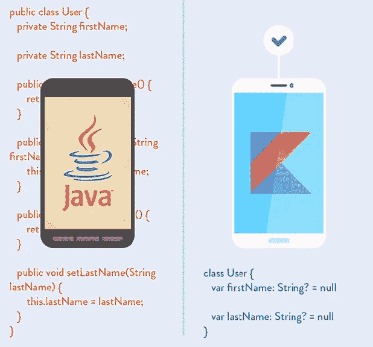

# 与科特林共度的一天

> 原文：<https://itnext.io/a-day-with-kotlin-5a55eba1965e?source=collection_archive---------1----------------------->

## Kotlin 拥有而 Java 没有的。



所以，我最近听说了很多关于科特林的事，并决定试一试。学习一门新语言会很有趣，也许我会发现它对某些产品或应用程序很有用。

Kotlin 的官方[文档](https://kotlinlang.org/docs/reference)很棒，并且有许多关于 Kotlin 语言的介绍文章，所以我不会解释基础知识和语法，而是想展示一些 Java 没有的独特特性，这些特性使 Kotlin 脱颖而出。

## 1.零安全

包括 Java 在内的许多编程语言最常见的缺陷之一是，访问空引用会导致空引用异常。在 Java 中，这被称为`NullPointerException`或 NPE。

Kotlin 的类型系统消除了代码中空引用的危险。只有在以下情况下，科特林才会抛出`NullPointerException`:

*   程序员显式调用`throw NullPointerException();`
*   `!!`操作器的使用
*   关于初始化的一些数据不一致
*   Java 插值

科特林区分了`null`(可空引用)和非`null`(非空引用)类型。默认情况下，类型是非空的，可以通过添加一个`?`使其可为空

```
var a: String = "abc"  // non-null reference by default
a = null               // compile time error!// now if you call a method on a, its guaranteed not to cause a NPE
var len = a.length     // finevar b: String? = "abc" // nullable reference
b = null               // okay// but if you access same property on b
// that won't be safe and compiler throws an error!
var len = b.length     // error: b can be null// you can use safe call operator ?. though
var len = b?.length    // okay, this will return the length
// if b is not null and will return null otherwise
```

## 2.智能转换

Kotlin 跟踪您的逻辑，并在可能的情况下自动转换类型。不再像在 Java 中那样，在显式强制转换之后进行`instanceof`检查。

```
var s = "abc"
if (s is String)
    println(s.length)
```

Kotlin 跟踪`is` 检查，你不必使用显式的强制转换操作符。

```
fun demo(x: Any) {
    if (x is String)
        println(x.length) // x is automatically cast to String
}
```

## 3.字符串模板

字符串可能包含模板表达式，即被评估的代码，其结果被连接到字符串中。

模板表达式以一个`$`符号开始，可以是一个简单的名称，如下所示:

```
val n = 10
println("n = $n") // prints n = 10
```

或者可以是大括号中的任意表达式，如下所示:

```
val s = "abc"
println("$s.length is ${s.length}") // prints abc.length is 3
```

您可以像这样计算表达式:

```
val a = 3
val b = 5
println("Sum of $a and $b is ${a + b}")
// prints Sum of 3 and 5 is 8
```

## 4.性能

Kotlin 中的类可以有属性。不需要像在 Java 中那样用显式编写的 getters 和 setters 来扩充代码。属性可以使用`var`关键字声明为可变的，或者使用`val`关键字声明为只读的。

```
class Address {var name: String = ""
    var street: String = ""
    var city: String = ""
    var state: String? = ""
    var zip: String = ""}
```

用法:

```
fun copyAddress(address: Address): Address {val result = Address() // there is no new keyword in Kotlin!
    result.name = address.name // accessors are called
    result.street = address.street
    // ...
    return result}
```

## 5.主构造函数

Kotlin 中的类声明包括:

*   类别名
*   类头(主构造函数和其他类型参数)
*   班级团体

Kotlin 中的类可以有一个主构造函数，如下所示:

```
class Person(firstName: String) {}
```

您可以将 initalizer 块用作:

```
class Customer(name: String) {val customerKey = name.toUpperCase()}
```

还有二级构造函数，看看。

## 6.类型推理

科特林推断变量和属性的数据类型。因此，您可以在任何您认为可以提高可读性的地方省略类型。

```
**val** a = "abc"                         // type inferred to String
**val** b = 4                             // type inferred to Int**val** c: Double = 0.7                   // type declared explicitly
**val** d: List<String> = ArrayList()     // type declared explicitly
```

也支持显式转换。较小的类型不会隐式转换为较大的类型。这意味着我们不能将类型为`Byte`的值赋给`Int`变量，除非进行如下显式转换:

```
val b: Byte = 1  // fine, literals are checked statically
val i: Int = b   // Error!// use explicit conversions to widen numbers
val i: Int = b.toInt()  // Okay, explicitly widened
```

Kotlin 从上下文中推断类型，算术运算被重载以进行适当的转换。例如

```
val num = 1L + 3  // Long + Int => Long
```

## 7.范围

Kotlin 中的范围表达式是用`..`、`in`和`!in`运算符编写的。

```
for (i in 1..10) // i ∈ [1, 10] both inclusive
    println(i)
```

如果你想逆序迭代。使用`downTo()`功能如下:

```
for (i in 4 downTo 1)
    print(i) // prints 4321
```

以任意步长迭代数字，而不是默认的 1，使用`step()`函数，如下所示:

```
for (i in 1..4 step 2)
    print(i) // prints 13for (i in 4 downTo 1 step 2)
    print(i) // prints 42
```

要排除最后一个元素吗？使用`until()`功能。

```
for (i in 1 until 10) // i ∈ [0, 10) 10 is excluded.
    print(i) // prints 123456789
```

参见这里的其他重要功能。这就是为什么我喜欢说 Kotlin 是 Java 世界的 Python！

## 8.扩展功能

Kotlin 为您提供了用新功能扩展现有类的能力，而不必从该类继承或使用任何类型的设计模式，如 Decorator。这是通过称为*扩展*的特殊声明来完成的。Kotlin 提供了*扩展函数*和*扩展属性*。

将`swap`功能添加到`MutableList<Int>`的示例如下:

```
fun MutableList<Int>.swap(index1: Int, index2: Int) {
    val temp = this[index1] // 'this' corresponds to the list
    this[index1] = this[index2]
    this[index2] = temp
}// now you can call such a function on any MutableList<Int> object
val numbers = mutableListOf(1, 2, 3)
numbers.swap(0, 2)
println(numbers) // prints [3, 2, 1]
```

## 9.运算符重载

Java 不支持运算符重载。科特林*做*。在 Kotlin 中使用操作符时，会调用其对应的成员函数。例如，表达式`a + b`转换为引擎盖下的`a.plus(b)`。`plus`函数被重载，与各种 Kotlin 基本类型和`String`一起工作。

您可以为自己定义的类型重载运算符。例如

```
class Point(val x: Int = 0, val y: Int = 10) {// overloading plus operator
    operator fun plus(p: Point): Point {
        return Point(x + p.x, y + p.y)
    }}// now you can add 2 Point's as
val p1 = Point(3, -8)
val p2 = Point(2, 9)val sum = Point()
sum = p1 + p2
println("sum = (${sum.x}, ${sum.y})") // prints sum = (5, 1)
```

这里加号函数被标记为`operator`以告诉编译器`+`操作符在这里被重载。表情`p1 + p2`转化为引擎盖下的`p1.plus(p2)`。

## 10.析构声明

将一个对象析构成许多变量是很方便的。例如

```
val (name, age) = person
```

这被称为析构声明。析构声明被编译成以下代码:

```
val name = person.component1()
val age = person.component2()
```

析构声明在 for 循环中也起作用，如下所示:

```
for ((a, b) in collection) { ... }
```

穿越地图最好的方式可能是

```
for ((key, value) in map) {
    // do something with key and value
}
```

析构声明也有助于从函数中返回两个值。例如

```
data class Result(val result: Int, val status: Status)
fun function(...): Result {
    // other code
    return Result(result, status)
}
```

除了上面提到的主要特性，Kotlin 还支持`==`(结构等式)和`===`(引用等式)、默认参数、命名参数、`when`表达式作为更好的`switch` case 语句、lambdas 和高阶函数。

## 结论

总的来说，我认为 Kotlin 是一种很棒的语言，默认情况下是安全的，而且使用起来非常愉快。我在这里只谈了冰山一角，还有很多要谈的。如果你是一个 Scala 开发者，你可能不会在 Kotlin 中发现很多新东西。但是，如果你是一名 Java 开发人员，厌倦了样板文件和开始实际工作之前的所有仪式，那么 Kotlin 就是适合你的。

干杯！