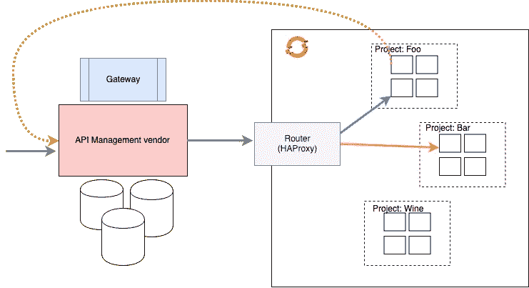
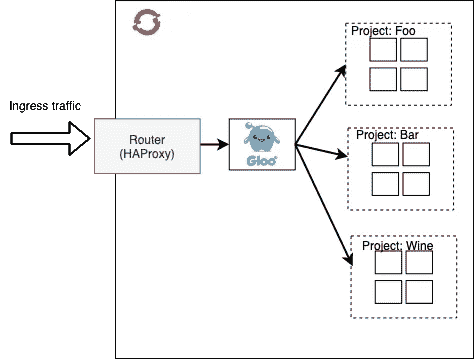
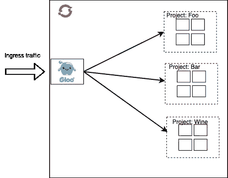
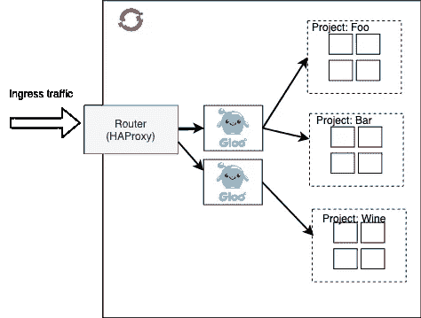
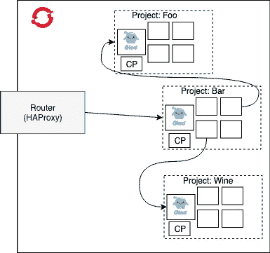

# 在通向服务网格的道路上实现 OpenShift 的 API 网关的分散方法

> 原文：<https://itnext.io/a-decentralized-approach-to-api-gateways-for-openshift-on-your-way-to-service-mesh-58c11f45044d?source=collection_archive---------7----------------------->

我遇到过很多客户，他们试图在自己的云原生架构中解决服务到服务的通信挑战。我特别感兴趣的是服务网格技术([我正在编写 Istio in Action](https://www.manning.com/books/istio-in-action) 以便全面披露)，比如 [LinkerD](https://linkerd.io) 、 [Istio](https://istio.io) 或[consult](https://www.consul.io)。在我工作的地方，我们帮助组织成功地采用和管理这些系统，但是我们注意到我们的客户有一个有趣的趋势:

> *传统 API 管理解决方案正被用于解决一些相同的服务到服务的通信挑战，而服务网格现在可以更好地解决这些挑战。*
> 
> *传统 API 管理已成为其架构和流程的瓶颈，因此需要一种分散的方法。*

因此，我们最终看到人们构建他们的策略来采用服务网格来取代他们的遗留 API 管理解决方案，以应对这些服务到服务的通信挑战。

这些人没有错——但是，服务网格不是 API 管理解决方案。虽然服务网格可以很好地解决困难的服务到服务的通信挑战，但它仍然留下一些空白需要填补。例如，我们仍然需要处理最终用户认证和授权。我们可能需要整合现有的安全流程。我们可能需要某种轻量级协议或消息转换。我们可能需要更多特定领域的速率限制，以及许多其他限制。为此，我们的架构中仍然需要 API 网关功能— [但是我们不希望像我们在旧的 API 管理解决方案中遇到的那样，只是重新创建相同的旧的集中式、类似 ESB 的瓶颈](https://medium.com/solo-io/api-gateways-are-going-through-an-identity-crisis-d1d833a313d7)。为此，[我们需要一些 Gloo](https://gloo.solo.io) :一个 API 网关，它很好地补充了服务网格(当你准备好采用服务网格时),并解决这些问题，允许你抛弃臃肿的 API 中间件。

我们的许多客户将他们的微服务部署到 [OpenShift](https://www.openshift.com) 作为他们的 Kubernetes。有时候，大型企业组织的*现实*决定了容器平台(即基于 Kubernetes 的平台)的哪些特性和流程会被使用，以及它们如何被使用。你们 OpenShift 用户知道我在说什么:)

例如，OpenShift 有一个很好的开箱即用的[源代码到 docker 容器构建](https://blog.openshift.com/create-s2i-builder-image/)管道。根据我的经验，组织更喜欢对构建如何完成和供应链看起来如何有更多的控制，所以他们禁用了这个特性。还有其他一些场景，安全团队或网络团队会根据现有的网络规则和策略来强制执行 OpenShift 安装。一个这样的例子是，当一个团队部署一个应用程序(通常是一组服务)时，他们将应用程序部署到一个名称空间，并完全锁定对该名称空间的网络访问入口/出口。他们使用 OpenShift 的[多租户 SDN 插件](https://docs.openshift.com/container-platform/3.5/architecture/additional_concepts/sdn.html)来做到这一点。在某些情况下，去往集群内另一服务的流量会被强制带出集群，到达外部负载平衡器或 API 管理软件，然后返回集群。在很多方面都不理想，但这让网络和安全人员很高兴。

我们可以使用 [Gloo，一个基于 Envoy Proxy](https://gloo.solo.io) 构建的 API 网关，即使在这些【有时】令人不舒服的约束*中，它也可以很好地适应分散式 API 网关，并且*可以充当您最喜欢的服务网格的垫脚石。

明确地说，本文的其余部分将集中在如何:

*   构建一个分散的 API 网关基础设施
*   很好地适应了这些不方便的现实
*   支持传统 API 管理通常不支持的新协议
*   按照您自己的步调，提供通向全面服务网状网络的踏脚石

# 直接 Gloo 部署

OpenShift 自带一个[路由器](https://docs.openshift.com/container-platform/3.9/install_config/router/index.html)组件，它是集群的主要入口点。该路由器基于 HAProxy，基本上充当 L4 反向代理和连接负载平衡器。它可以完成 TLS 终止并收集基本指标。对于 Gloo 的基本部署，我们可以将其添加到 OpenShift 路由器的后面。

在这种情况下，尽管我们采取了额外的跳跃，但我们可以访问 API 网关功能，如最终用户身份验证/授权、请求缓存、请求/响应转换等，以及重要的 L7 网络控制，以执行流量阴影、流量转移和金丝雀部署等操作。这是一个巨大的收获，也是向服务网格所提供的更近了一步。另一方面，在集群中，这仍然是一个共享网关。在接下来的部分中，我们将看到如何部署更加分散的。

还要注意，虽然在这种情况下 Gloo 运行在 OpenShift(一种 Kubernetes)中，但 Gloo 仍然可以路由到不在 OpenShift 中托管的外部 API，包括路由到像 Lambda 和 Cloud 函数这样的服务。

除了在 OpenShift 路由器后面运行之外，我们还可以在基础设施节点上运行 Gloo 作为 NodePort。这有直接暴露 API 网关和消除 HAProxy 跳跃的优点，但是有网络人员通常不喜欢 NodePort 的缺点。

您还可以使用 BGP 路由或 metallb 之类的工具，通过负载均衡器直接公开 Gloo。[更多](https://medium.com/solo-io/running-gloo-as-a-kubernetes-ingress-for-bare-metal-clusters-with-metallb-35dd45d80629)请看本博客。

在这一点上，这给了我们最简单的基本 API 网关功能，但是我们想探索分散部署的方法。目前，它仍然是相当集中和共享的，尽管从过程的角度来看不那么集中和共享，因为我们可以使用 GitOps 和其他声明性的、SCM 驱动的方法来自助配置 Gloo。Gloo 的配置是声明性的，在 Kubernetes/OpenShift 中定义为 CRDs。

如果我们需要进一步的隔离，我们也可以使用 Gloo 支持的代理分片，并将某些 API 分配给它们自己的网关。这涉及到少量的管理开销，但是允许您为更高价值的 API 分离故障域。

这解决了遗留 API 管理供应商遇到的一些问题，在这些问题中，单个 API 可能会关闭整个 API 集的网关，因为没有实施隔离或批量处理。

# 每个名称空间一个 Gloo 网关

我们还可以为每个名称空间部署一个网关。正如我们所说，一些 OpenShift 环境不允许流量直接通过名称空间，除非通过众所周知的出口/入口点(通常由多租户 SDN 或网络策略控制)。

在这个场景中，每个代理都有自己的 API 网关配置，并由每个团队控制。我们可以访问 API 网关的全部功能，如速率限制、认证、缓存、流量路由/分流等。并且非常适合锁定的名称空间。请注意这是如何开始在集群中形成简单的路由网格的，但是是由各自的项目团队配置和控制的，而不是集中的配置存储。这种方法为 API 网关提供了很大的灵活性和团队所有权，并在组织内减少了争用点。

# 每个命名空间一个 Gloo 网关+控制平面

在前面的场景中，我们让每个 OpenShift 项目/名称空间都有自己的代理，但是 Gloo 控制平面仍然是共享的。对于更严格的环境，这可能并不理想，您可以只运行每个项目/名称空间的整个控制平面。Gloo 的控制平面非常小，不占用太多资源，因此这可能是一种获得完全多租户并在强加的限制内舒适生活的好方法。当服务或用户与这些服务通信时，他们将通过 OpenShift 路由器(HAProxy)进入集群，然后路由到特定的应用程序及其 API 网关。

# 摘要

在这篇博客中，我们探讨了组织如何部署 OpenShift Kubernetes 以及如何利用遗留 API 管理基础设施的一些现实情况。我们还看到，由于一些 OpenShift 部署的现实，这些限制成为部署服务网格(如 Istio)的高障碍，并有助于解释为什么 OpenShift 还不支持 Istio。使用 Gloo，我们不仅可以在这种环境中很好地发挥作用，让您更接近服务网格，而且我们可以解决现有 API 管理功能与您希望从服务网格中获得的东西之间的差距。最后，Gloo 可以在任何服务网格中插入，并且可以在您的网格中扮演入口或共享网关的角色。我个人的建议一直是迭代地采用服务网格功能，这是使用 Gloo(它基于与大多数服务网格相同的 Envoy 技术)来实现这一点的一个很好的例子。关注[@ solio _ Inc](https://twitter.com/soloio_inc)和 [@christianposta](https://twitter.com/christianposta) 了解更多关于这些话题的信息！

*原载于 2019 年 8 月 9 日*[*https://medium.com*](https://medium.com/solo-io/decentralized-approach-to-api-gateways-for-openshift-on-your-way-to-service-mesh-cd3b4892c73f)*。*