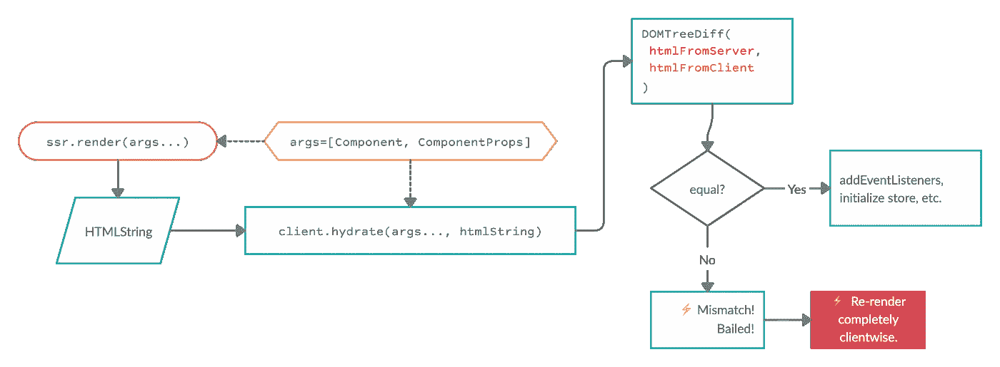
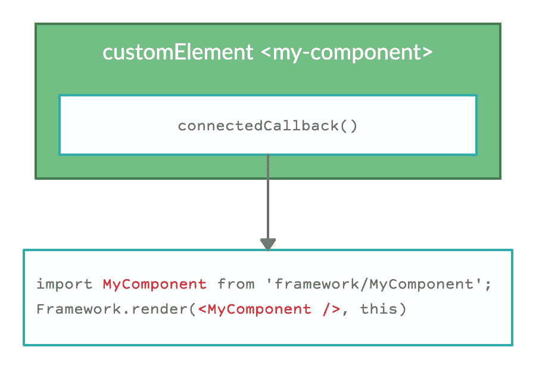
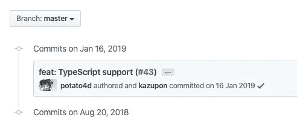
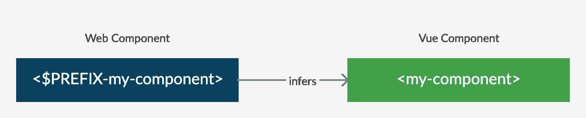
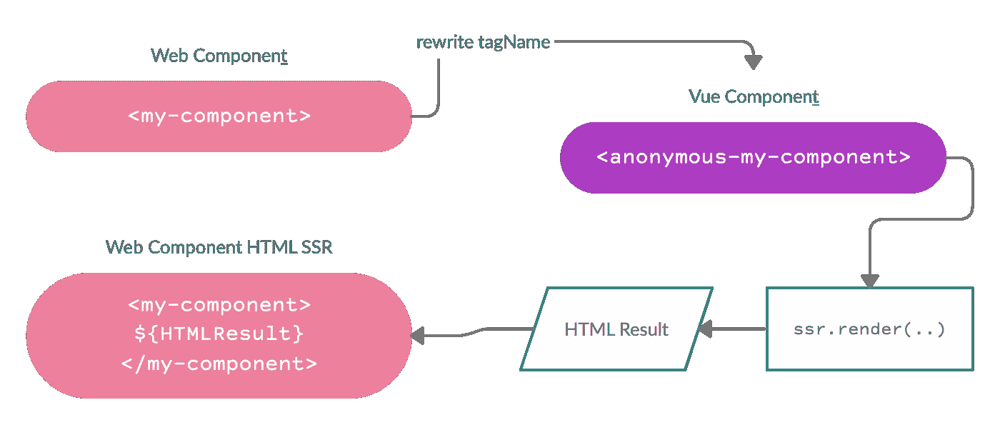
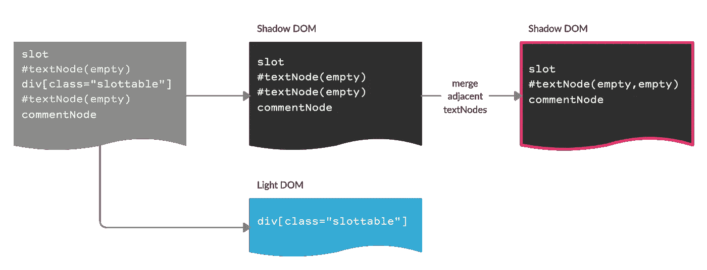

# 深入分析同构、自治的跨框架使用#微前端

> 原文：<https://itnext.io/a-deep-analysis-into-isomorphic-autonomous-cross-framework-usage-microfrontends-364271dc5fa9?source=collection_archive---------3----------------------->


这篇文章可能被认为不容易读懂。所以，慢慢来，集中精力👌如果你想了解框架、它们的 SSR 和 WebComponents 的连接的深层问题，以及你在“解决所有问题的 Web 组件微前端”(这显然是一种讽刺性的夸张)中遇到的问题，通读是至关重要的。

[*Vue*](https://vuejs.org/) *将用于大多数样本，但是这些原理也适用于其他框架。*

## 序言:

每个人都在谈论#微前端。每个人都有自己的观点——这很好。但我喜欢更多的事实。利弊，潜在的技术需求和问题。无论是在私人场合还是在梅赛德斯-奔驰的工作中，我都喜欢思考自主部件的复杂性。这篇文章将试图阐明以下问题

# 如何将 WebComponents 与不同的框架集成在一起，同时能够进行 SSR？

> 本文不会解释**为什么**要使用 WebComponents 或 SSR。这是一篇关于可行性、陷阱和技术细节的架构文章。为了更深入地挖掘各自的细节，我在最后添加了一些资料。

## 同构的短途旅行(如果你知道同构，跳过)

进行服务器端渲染的主要需求是在服务器上渲染将在客户端上渲染的内容——这被称为[同构](https://www.lullabot.com/articles/what-is-an-isomorphic-application)。

代码示例是同构的——服务器和客户端都应该返回`<strong>The default greeting text</strong>`

**为什么同构如此重要？**

框架试图**不**重新呈现任何通过 SSR 提交的 HTML。只有额外的步骤，如`addEventListener`，当你没有相等的输出(=没有同构)，那么大多数框架将**完全重新渲染—** 这是非常昂贵的。所以你会失去水合作用的关键点。查看下面的可视化图表。



## 到 web 组件的短途旅行

一些人喜欢讨论一个 WebComponent 的定义是否包括 ShadowDOM 等等。我们不要吹毛求疵，将术语[**web component**](https://www.webcomponents.org/introduction)**定义为**

> **由`customElements` API 定义的元素。**

****一个简单的例子:**现在你可以在你的 HTML 中使用<我的组件>/我的组件>**

**现在无论你在哪里使用`<my-component>`，它都会自动初始化并说`I am a simple component`。**

**这意味着你变得**独立于框架**(和 DOM 独立)，因为你不需要依赖你显式初始化的现有元素(比如经常看到的`render('#app')`)，而是就地初始化🥰:**

```
connectedCallback() {
 ...
 render(<Component />, this) // this = <my-component> instance
}
```

## **让我们来看看基于框架的 web 组件**

**这将是一次深度潜水。WebComponents 客户端的实际使用往往非常容易。请看这里的反应例子:[https://reactjs.org/docs/web-components.html](https://reactjs.org/docs/web-components.html)。**

****

**然而，默认情况下，这些流行的框架没有一个是同构的( [Stencil](https://stenciljs.com/docs/prerendering) 可能是个例外，但我还没有将它纳入研究)。**

****为什么 WC+SSR 提供头痛:****

**在服务器上，您需要定义一个呈现 web 组件的组件，以便它可以在客户机上初始化。现在，当客户端初始化时，它需要呈现框架组件。但是我们定义了那个框架组件来扮演一个 web 组件:**你最终陷入了一个无限循环。****

**让我们研究一下如何避免无限循环**

**如果在客户端(前端)使用组件`my-component` ，那么它必须作为`customElement`对浏览器可用。所以在前端有一个`customElements.define(‘my-component’, …)`是前提。**

**为了简单起见，让我们定义一个底层的`Vue.component`:**

**这是一个`Vue.component`定义，它将简单地呈现以下内容**

```
<my-component>
  <div>Foobar</div>
</my-component>
```

**为了能够补充水分，我们需要在 Vue 中注册。
简单:`Vue.component(‘my-component’, Component);`**

**恭喜你！我们创造了前面提到的无限循环。`my-component`会渲染`my-component`从而渲染`my-component` …**

**Vue 有一个官方的 Web 组件包装器。你为什么不用它？使用官方组件包装器不是一个选项，因为它也不是同构的。你已经可以从它的定义类型看出:**

**它实际上是一个仅在客户端运行组件的包装器。而且他们很长一段时间都没有发展。**

****

**截至撰写本文之日，官方包装的最后一次提交是在 2019 年 1 月**

**我们需要找到一种解决方案来实现以下目标:**

**您的创作系统(static site、Drupal、AEM、Hybris 等)会播放下面的 HTML，我们将呈现这些 HTML:**

```
<my-component>
  <my-component>
    Hello encapsulation
  <my-component>
</my-component>
```

**如上所述，我们不能定义一个与其 WebComponent 具有相同标记名的 Vue 组件。**

**因此，下一个方法是，每个组件都有一个特定的应用程序前缀，该前缀仅在客户端用于`customElements.define`，因为我们可以推断相应的`Vue.component`具有相同的名称，但没有前缀(以避免无限循环)。**

****

**根据这个逻辑，我们总是能够推断出`app-my-component`对应于组件`my-component`。让我们来试试:**

**现在这会呈现下面的嵌套示例**

```
<app-my-component>
  <app-my-component>
    Hello encapsulation
  <app-my-component>
</app-my-component>
```

**到第一级-只有一个，没有子节点，也没有“Hello 封装部分”:**

```
<my-component>
  <div>
    Hello
  </div>
</my-component>
```

**我们失去了内部子组件，因为在这个例子中我们无法访问子组件(我们稍后将讨论 Vue `slot`)。结果是**在前端没有水合**，因为我们没有注册名为`my-component`的`customElement`。(如果你问自己为什么，那么重读关于无限循环的部分)。**

**我们可以通过使用匿名组件来摆脱这种命名思维。**

**在渲染时，我们期望来自`my-app-component`的 childNode 出现在 Vue 模板中`<slot>`所在的位置。因此，我们必须在 WebComponent 中获取 childNode，并将其提供给 Vue。**

**你可以在这个 [**沙盒示例**](https://codesandbox.io/s/vue-simple-ssrcsr-no-nesting-raw-html-template-e8hjb?fontsize=14&hidenavigation=1&theme=dark) 中找到演示。您将看到输出不是同构的。事实上，SSR one 什么也没做。它接受字符串，添加`data-server-rendered="true"`(因为 Vue 把它添加到所有通过`renderToString`的内容中)就这样。但是为什么呢？**

**我们正在向服务器发送这个:**

```
<app-my-component>
  <strong>I am Foo</strong>
</app-my-component>
```

**现在从上面检查我们的代码。你看到`Vue.component('app-my-component', ..)`的定义了吗？没有吗？是的，这就是问题所在。希望你还记得为什么我们没有它:无限循环避免。你可能会像我一样头脑发热:**

> ***所以我只是将* `*app-my-component*` *定义为一个 Vue 组件，但只是在服务器上，这样客户端就不会出现无限循环！？***

**为了简单起见，我想说:试试看。但我可以提前告诉你:行不通。为了让客户端工作并识别组件，您需要在`app-my-component` Vue 组件中呈现一个`app-my-component`标签。所以你遇到了完全相同的问题…**

**让我们试着在下一步运行 SSR one。下一个沙箱包含了我们所知道的知识，即`app-my-component`有一个叫做`anonymous-app-my-component`的底层 Vue 定义。因此，对于 SSR，我们将标记替换为 Vue 标记。现在 Vue 可以渲染了。但是它仍然会替换标签。所以我们需要用组件标签名再次包装它。见 [**沙盒示例此处**](https://codesandbox.io/s/vue-simple-ssrcsr-no-nesting-raw-html-template-2ren8) 。**

****

**tldr:将 *my-component* 重写为`*anonymous-my-component,*` render，然后再次用`*my-component*`手动包装成同构的 HTML。**

**这适用于这个简单的组件，但不适用于嵌套其他组件的情况，因为这样你只能手动添加外层包装，但所有内层包装都将丢失(再次引起:Vue 渲染并替换它们)。同样，当我们添加包装器时，Vue 中的`data-server-rendered`突然出现在里面。**

**我们需要做的是定义一个仅在服务器端使用的`Vue.component`,然后将其渲染回一个在客户端称为`CustomElement`的标签。**

**这意味着我们使用为服务器重命名`tagName`的方法，但是我们将其重命名为客户端永远不会看到的名称。演示中 SSR 之前的预处理**

```
const htmlStringBeforeSSR = ... ;const ssrableString = htmlStringBeforeSSR.replace(
  new RegExp("app-my-component", "g"),
  "server-app-my-component"
)
```

**请参见此处的 工作和可嵌套的[沙盒示例。🥳:在我们进一步评估之前，让我们深呼吸一下，消化一下。](https://codesandbox.io/s/vue-simple-ssrcsr-no-nesting-raw-html-template-auto-ssr-fix-qb4sk)**

**到目前为止(没有深入到所有可能的用例中),这将解决无限循环的问题，我们可以像看起来那样有同构。**

**不幸的是，这还不是解决方案:**

1.  **我们现在只有集成的 Vue**
2.  **不幸的是，我们集成的 Vue 部分只有**部分同构，因此在真实用例**中不可用。如果我们用 SSR 渲染`slots`，我们就失去了位置是 HTML 的哪一部分的上下文。您实际上是在向客户端呈现纯本地 HTML。现在，您如何识别作为`<slot>`替换提供给服务器的子节点是什么？我们需要能够在客户机上识别来自服务器的原始子节点，从服务器渲染的 DOM 中克隆它们，将它们作为渲染子节点放回组件实例，以便能够进行`hydrate`。稍后会有更多的细节。**
3.  **slot 子组件可以再次成为 web 组件，因此它们可以自己触发一个 init 进程，并自主地更改它们的 html 结构(因为它们也是呈现模板的基础)。因此，父组件将与其子组件不同步，因为子组件中的 DOM 更改不是由父组件处理和呈现的，而是在子 web 组件的实例中。🧐**

# **为什么还要同构？我们能不能简化一下，用木偶师？**

**如果你想为 SEO 进行预渲染，这实际上是一个非常好的主意。但是对于我们的用例来说，这是行不通的:**

**1.异步呈现的组件，尤其是那些具有加载状态的组件，可能会使无头浏览器呈现的组件处于损坏状态(尽管这可能是可以避免的)。**

**2.一些框架需要一些 SSR 的标识(例如`data-server-rendered=true`)。当 CSR 发生在木偶师身上时，不会添加它们。所以我们必须对它们进行后处理(理论上我们可以用变通的方法来做，但是这里已经变得很乱了)。**

**3.对于有子元素的元素来说，水合作用会是什么样子？因为孩子不容易被识别(正如我们在上述所有文本中所分析的)。**

**使用木偶师不会给我们带来任何额外的好处。**

## **让我们更深入地了解我们所面临的`children`问题。**

**看看下面服务器上的渲染图(再反应一下):**

**水合作用要求客户机上的参数与服务器上的参数相同。这允许框架构建一个可以区分的虚拟 DOM 树。简而言之，我们需要**

```
.hydrate(
  <CoolComponent>
   <strong>hello</strong>
  </CoolComponent>
)
```

**但是我们**甚至不知道我们应该在此时渲染这个**。我们的`CoolComponent`通过以下方式反映在客户身上**

```
// pseudo-code 🔽
customElements.define('cool-component', ...

  hydrate/render(<CoolComponent>$children</CoolComponent>));
```

**SSR 为我们提供了完整的 HTML**

```
<cool-component>
  <div>foo<strong>hello</strong>bar</div>
</cool-component>
```

**`cool-component`只知道是 a 引用为`CoolComponent`。所以我们能做的就是:`hydrate(<CoolComponent />)`。但是我们不知道`$children`是什么。我们应该放一个`<strong>hello</strong>`，但是你在`cool-component`哪里有这个信息？那么你会在根级别查询一个`strong`标签，取出它，然后使用`JSX.parseFromStrin(strongTagThatIfound)`，再把它放回`render`函数中吗？然后筑巢呢？思想他妈的对吗？⚡️**

**所以我们的问题是:当你只有结果 HTML 时，你如何预先知道哪一个是服务器上呈现的`CoolComponent`的子组件？你看看就知道了。但是程序化？我们做 SSR 的时候孩子信息丢了。你可以在没有孩子的情况下渲染组件，然后在有孩子的情况下进行不同的渲染，但这听起来像是用硝化甘油做的实验😶**

**让我们更进一步，将需要标识的子组件作为一个定制元素，以便我们在 SSR 之后知道哪个是作为子组件提供的:**

**现在我们可以查询`.wc-comp`来识别子节点。然而，我们**不能**使用`querySelectorAll`，因为我们只想匹配直接子节点，而不是子节点。子进程应该由子进程来处理，而不是由`this`来处理，否则你会将错误的子进程匹配到错误的父进程，并开始在 HTML 中混日子。这就是问题再次出现的地方。如果在中我们没有一个带有`.wc-comp`的子节点，但是在一个不属于这个实例的嵌套子节点中呢？**

**示例:**

```
const MyComp = 
<wc-without-own-children>
  <a-sub-web-component>
    {props.children}
  <a-sub-web-component>
<wc-without-own-children>
```

**所以事实上被创造的`<MyComp />`确实带走了孩子。但是它会立即将它们传递给`<a-sub-web-component>.`a,`props.children`内标有`class="wc-comp"`的子节点将由`a-sub-web-component`处理，因此应该从该引用中获取。但是父组件将首先触发，并将这个`props.children`提供给`MyComp`，幸好`MyComp`在正确的位置提供了正确的标记，但是它仍然会让子组件再次触发自身进行渲染。双重工作，多余处理。**

**所以假设你可以把它拿出来，作为一个实际的孩子提供给框架。**

**让我们回想一下我们头脑中的同构:React、Vue 和其他框架做了一个 **1:1** 的比较，以水合完全有意义的组件。如果 SSR DOM 不同于客户端 DOM，大多数框架会放弃并重新呈现。**

**现在它变得有趣了，因为我们正在讨论跨框架的使用。假设`my-strong`是一个 web 组件。它有自己的生命周期，可以包含也可以不包含框架(这在这里并不重要)。它呈现如下:**

```
<my-strong class="wc-comp">hello</my-strong>
```

**对此**

```
<my-strong class="wc-comp"><strong>hello</strong></my-strong>
```

**这是我们努力实现的一个完全合理的设想。作为一个孩子，我们最初在 render 函数中赋予框架的是**

```
<my-strong class="wc-comp">hello</my-strong>
```

**因此，即使我们能够正确地识别原始的子节点并提取它，然后在下一个渲染周期中(每当你改变父组件的状态时)，渲染父组件的框架可能会发现一个差异，因为现在它突然看到一个它不知道的`strong`标签。它知道外在的`<my-strong>`，却不知道内在的`strong`。在这一点上，渲染生命周期变得**不同步**(用技术术语来说，这是一个不想要的副作用)**。****

**换句话说:组件之间互不了解。它们总是可以(例如通过交互)改变它们的状态，并因此单独改变 DOM。并且组件会突然失去同步，这是由这些组件的独立性决定的。**

**即使您提出*“我将只使用两者共享的存储，因此它们的状态是同步的”*那么您将会注意到它们仍然会不同步💩。我来告诉你为什么:中间的 WebComponent 层(`customElement`)是你从父组件的角度做改变的接口，所以父组件永远不能告诉为什么它自己的子组件的内部 html 突然改变了。**

**在一个有警告的以牙还牙的世界里。React 检测到它正在被不同的渲染器重新渲染。但是 React 不了解其他框架！tldr: React 在这种“不同步”(至少是我使用的版本 16)方面非常可靠。**

> **作为一个补充说明:嵌套和 html 复制的负面影响是子组件可能已经触发自身初始化——因为浏览器识别它们(例如，添加事件侦听器),然后再次移动(失去事件侦听器)只是为了再次初始化。因此，即使复制是一种解决方案，也会导致性能下降。我们不希望大量增加的复杂性只会恶化客户端的 CPU 负载。**

> **正如我们已经看到的，复制初始 HTML，然后用任何动态框架呈现都不是要考虑的选项，因为使用给定的方法，我们既不能正确地识别子组件，也不能正确地通知父组件子组件树已经改变。**

**一般来说，问题是我们试图将“未知”的预编译内容放在“静态”的上下文中，但实际上是动态的。我们正试图在不同框架的生命周期中处理特定于浏览器的生命周期(`connectedCallback`等)，所有这些都有可能*无限*嵌套。这是一个棘手的难题。**

# **我们定义了这么多问题，我们能有一些解决方案吗？**

## **提案 1(琐碎)**

> **不要处理 WebComponents 中的子级。**

**按照这种逻辑，你只需要处理顶层的渲染就可以了，因为你不需要识别子组件。**

**这个建议对于一个非常简单的网站来说可能是可以的，但是对于我们大多数人来说，这不是一个解决方案，因为自定义元素嵌套子元素是完全正常的，所以这个建议看起来没什么用，但是也许它适合你。**

## **提案 2 影子 DOM**

**让我们再一次把需求放在一起:**

*   **我们想要渲染已经定义的子元素，例如`<my-wc> <children…> </my-wc>`**
*   **我们希望有多种不同的框架**
*   **我们想要 SSR**
*   **我们想要网络组件**

**这些巨大的需求可能会被影子 DOM 满足。我个人倾向于尽可能不使用影子 DOM，但这不是我的观点，而是找到一个解决方案。**

**影子 DOM 从同一个文档继承了 CustomElements，这很好，因为这意味着在影子 DOM 范围内，我们可以使用在它之外定义的`customElements`。**

**让我们仔细看看它是如何把我们提升到一个解决方案的。**

**我们的第一个示例是一个 WebComponent 的实现，它使用 React 进行呈现，并且有一个我们没有复制到呈现函数中的子组件:**

**请看这里的运行示例[https://code sandbox . io/s/react-we B- component-with-slot-judt](https://codesandbox.io/s/react-web-component-with-slot-jutdt)。**

**在我们开始框架渲染之前，`customElement` `my-component`中的所有子节点都被移出了阴影 DOM。他们仍然坐在`my-component`里，但是现在他们在光明世界里。由于 React 只呈现原生的[**HTMLSlotElement**](https://developer.mozilla.org/en-US/docs/Web/HTML/Element/slot)它不存在需要知道孩子的问题，浏览器会处理这些问题。它们就在那里，它们可以是它们想要的任何东西(来自 SSR ),因为 React 组件保持同构，只呈现`<slot>`标记。**

**首先，这实际上很好，因为它有助于保持一致性。浏览器不会将任何内容复制到 slot 元素中。它只引用插槽所在的元素，就像它在那里一样。**

**如果你选择`this.shadowRoot.innerHTML`，它将返回:`<div><slot></div></slot>`。这完全符合预期，因为 slot 是一个占位符，浏览器不会将 slotted 元素放在那里。它只是引用它。**

**也就是说，innerHTML 保持一致😲🤩。记住一致性是同构的关键。**

**现在让我们通过使用影子 DOM 的方法再次尝试解决上面的问题。**

## **影子 DOM 嵌套(无 SSR)**

**假设这是你的 CMS 播放的 HTML:**

```
<wc-slider>
  <wc-slider-elem>
    
  </wc-slider-elem>
  <wc-slider-elem>
    
  </wc-slider-elem>
</wc-slider>
```

**我们之前的分析表明，所有作为孩子被给与`customElement`的孩子都必须表现得静止不变。**

**框架期望它不知道的东西具有一致性。我们可以认为任何具有影子 DOM 槽的原子组件都是静态的，因为`customElement`的子节点不会不知不觉地改变——只有 WebComponent 子节点的`shadowRoot.innerHTML`会改变——但这从外部/父节点是看不到的。如果开槽组件有子组件，那么子组件应该在它们的影子 DOM 范围内再次开槽，这样它们就在框架呈现的范围之外。所以那些行为是“静态的”,因为同样的原则也适用于它们。#递归#思维爆炸🤓**

> ****重要提示:** Vue 使用与实际`HTMLSlotElement`相同的[元素标记名](https://vuejs.org/v2/guide/components-slots.html)作为其模板处理的子元素，因此我们不能简单地使用`<slot>`，因为在我们的例子中它只会使其为空(“嘿，你没有为我提供 Vue 子元素，所以我只是为你移除了`slot`)。**
> 
> **Vue 实际上不赞成使用属性用法的`slot`，而赞成使用`v-slot`。**
> 
> **“在所有未来的 2.x 版本中，将继续支持`slot`和`slot-scope`属性，但官方已弃用，最终将在 Vue 3 中删除”**
> 
> **不幸的是，这个改变并没有解决与原生`<slot>`
> 元素的冲突。**

**使用插槽*嵌套而不使用* SSR 似乎相当容易。但是首先我们需要在 Vue 中找到一种方法来将`<slot>`渲染到 HTML 中，这样我们就可以在影子 DOM 中使用它。**

**我想到了这个:**

**我使用 **Vue 和 React together**:[https://code sandbox . io/s/Vue-shadow DOM-native-slot-sample-with-consistence-dynamic-changes-with-React-and-Vue-16 brq](https://codesandbox.io/s/vue-shadowdom-native-slot-sample-with-consisten-dynamic-changes-with-react-and-vue-16brq)建立了一个广泛但可理解的自治 web 组件示例。**

**所有这些的核心是使用插槽和这部分代码:**

**为了实现一致性，我们需要我们的子节点被开槽，但是开槽的元素存在于阴影 DOM 之外的光 DOM 中。因此，通过在附加阴影 DOM 之后调用`this.appendChild`，我们在触发框架渲染之前将子节点从阴影 DOM ( `this.shadowRoot`)移动到`customElement` ( `this`)的根。**

**以更直观的方式，会发生以下情况:**

**接下来的一步是在中渲染**阴影 DOM，它将渲染一个`HTMLSlotElement`，这样我们移出的子节点就可以在里面看到了。****

**下面是 Vue 的通用代码片段。请注意，Vue 会替换它所挂载的元素，这就是为什么会创建一个额外的“ghost”div:**

**这里是反应的等式:**

**这太棒了。因为即使我们改变了 Light DOM 中的内容，Shadow DOM 中的`.innerHTML`我们的框架组件仍然保持一致！🤩🤩这是一个巨大的成就。谁会想到这只是几行代码呢？**

**到目前为止，我们的第一点终于解决了:嵌套(不同的)框架，包括 web 组件。哇，花了点时间。**

**但是我们还没有解决 SSR。**

## **带 SSR +嵌套的阴影 DOM**

**快速回顾:在不使用 Shadow DOM 的情况下，将 WebComponents 与一个有自己生命周期的框架(React、Vue 等等)相互嵌套使用似乎是不可能的。这种说法甚至只适用于一个将自定义元素嵌套在一起的框架。**

**现在的问题是，在服务器上没有影子 DOM 或 CustomElement 这样的东西。所以我们不能在服务器端发布影子 DOM。**

**我们将不得不接受的事实是，我们需要影子 DOM，并且影子 DOM(到目前为止)不能以声明方式实现(也许将来我们会有一个`shadowDOM`属性甚至一个`<ShadowFragment>`标签？).**

**让我们首先取一个未嵌套的 SSR 样本:**

```
<my-component>
  
</my-component>
```

**现在让所需的渲染结果成为**

```
<my-component>
  #shadowDom 🔽
  <div>
   <slot @ref={}></slot>
  </div>
  #shadowDom 🔼 #lightDOM 🔽
  
  #lightDOM 🔼
</my-component>
```

**现在我们需要 SSR 来传递这个结果。**

## **SSR 影子 DOM /方法 1:琐碎。**

```
<my-component 
 ssr="true" 
 shadowDomHtml="<...>" 
 lightDomHtml="<...>">
...
</my-component>
```

**我们可以立即废弃这个解决方案，因为您将获得一些预呈现的 HTML，但您将看不到它，直到 WebComponent 被执行并将其移动到正确的位置。因此，您在服务器端做的事情只有在 JavaScript 执行时才起作用。这听起来一点也不像 SSR 的目的。这个解决方案有更多的问题，但是给出的理由应该足够了。**

## **SSR 影子 DOM /方法 2:隐藏槽。**

**嵌套组件必须被开槽(如上所述)，因此不在父组件的渲染路径内，而是在父组件的渲染路径外(根据槽的定义)。**

**这意味着您的组件需要嵌套为其父组件的兄弟组件。这听起来有些矛盾，但对于插槽来说是完全正常的，并且符合插槽的定义。但是只要影子 DOM 还没有被附加(所以 JS 还没有被执行),这些槽就不是活动的。子节点作为父节点的兄弟而不是实际的子节点在技术上和语义上都是错误的(想想你的 CSS 样式)。当从服务器作为兄弟提供时，它们实际上处于错误的位置。**

**但是我们仍然有好处，我们的 HTML 是预先呈现的。如果我们确保错误放置的插槽被隐藏，那么我们可能有 SSR 优势，而*相对*劣势较小。**

**正如你所看到的，我们正在玩一个 slider 父元素，它的内部有`.slider` div 和它的“子节点”`.wc-slider`作为兄弟。`data-ssr`帮助我们认识到我们应该补充水分。**

**现在我们需要为每个 web 组件提取“slottables ”:**

**对于某些用例来说，这是可行的。但是，如果您嵌套了多个组件，那么最上层的父组件也会选择所有不属于它但属于另一个子组件中的插槽的可开槽子组件(在最后一节“**附加信息**”中，您会找到 WebComponents 初始化的顺序)。我们可以通过使用一个约定来解决这个问题:每个`customElement`都需要一个内部有特定`className`的包装器，这样我们就可以使用`.wrapperClass > [unslotted="true"]`直接子选择器。**

**所以每个组件在渲染时看起来总是这样:**

```
<some-component>
  <div class="some-component-wrapper">
   ...
   <slot />
   ...
  </div>
</some-component
```

**在这里找到一个演示实现:[https://codesandbox.io/s/nested-shadowdom-ssr-slots-1kehq](https://codesandbox.io/s/nested-shadowdom-ssr-slots-1kehq)。**

## **SSR Shadow DOM /方法 3:就地渲染，而不是作为兄弟，以获得最佳的初始结果**

**方法 3 遵循方法 2，但是将组件精确地呈现在它在语义上应该在的地方——而不是在技术上。它将它精确地呈现在`slot`标签的旁边，这样它就处于“正确的”DOM 位置，以获得正确的视觉外观(CSS 正确适用)。**

**然后，当 JS 被执行时，我们添加一个影子 DOM，将开槽子对象的 DOM 引用移到影子 DOM 之外，我们得到了预期的结果。**

**在这里找到使用该方法的演示:[https://code sandbox . io/s/nested-shadow DOM-SSR-slots-step-2-improved-xuvwy](https://codesandbox.io/s/nested-shadowdom-ssr-slots-step-2-improved-xuvwy)。你可以看到你没有看到任何闪烁。可爱的❤️**

**如果这个没有陷阱，那就太容易了，对吗？没错。当一个框架可以 1:1 地呈现相同的客户端和服务器端时，同构就产生了。在这个例子中我们没有。**

**让我解释一下为什么。服务器返回:**

```
<wc-slider-elem>
  <div class="slider-elem">
    <slot></slot>

    <div unslotted="true">
     some text
    </div>
  </div>
</wc-slider-elem>
```

**我们的客户端代码对其进行了调整，使其具有适当的封装，并使其:**

```
<wc-slider-elem>
  #shadowDom 🔽
  <div class="slider-elem">
    <slot></slot>
  </div>
  #shadowDom 🔼 #lightDom 🔽
  <div unslotted="false">
   some text
  </div>
  #lightDom 🔼
</wc-slider-elem>
```

**由于我们的框架将在影子 DOM 内部呈现**，同构的问题是，一旦我们水合，它将试图呈现这个:****

```
<wc-slider-elem>
  #shadowDom 🔽
  <div class="slider-elem">
    <slot></slot>

    <div unslotted="true">
      some text
    </div>
  </div>
  #shadowDom 🔼 #lightDom 🔽
  <div unslotted="false">
   some text
  </div>
  #lightDom 🔼
</wc-slider-elem>
```

**所以现在同构突然成了我们的问题。🤓🤯**

**所以我们的问题是我们的框架(Vue，React，无论什么)需要在服务器上呈现不同于客户端的东西。所以你实际上需要在不同的地方播放 DOM 元素，这取决于它们是呈现在服务器上还是客户端上。**

**示例:**

**🔼以上是一个理论世界的例子。它有点让你的代码变得复杂，带有一点肮脏的味道。我们让组件**同等地**呈现 SSR 和 CSR，并为**所需的差异使用后处理器，如何？****

**下一个示例显示，我们对 SSR 使用了与客户端上相同的组件，但是我们在将子位置发送到客户端之前对其进行了后处理，以使“初始视图/绘制”看起来正确——之后在客户端上将它移回 Light DOM:**

**真了不起！同构，检查✅。但是在这种移动 DOM 的情况下，后处理也做了一些让人感觉不干净的事情。**

# **90%清洁有效的解决方案🤓**

**用 Vue 检查这个例子:[https://codesandbox.io/s/brave-chatelet-pql3y](https://codesandbox.io/s/brave-chatelet-pql3y)。它有一个循序渐进的方法，可能是 90%的解决方案。您将在控制台中看到一个错误，我们将在本文的最后 5%部分清除它，但现在不用担心它。我们还得谈谈另外 5%的人。**

****这一切都归结为 3 个关键点:****

*   ****匿名框架组件**(如本文上文所述)**
*   ****用`.module-className`包装器检测直接`[unslotted=”true”]`子对象的影子 DOM****
*   **与`<framework-slot />`一起使用`<native-html-slot />`**
*   **web 组件到框架组件的映射**

******先决条件:******

****每个组件都需要有一个匿名定义，它们各自的客户机/服务器都继承了这个匿名定义:****

```
**MyAnonymousComponent := 
<div>
  <framework-slot />
  <native-html-slot />
</div>;MyClientComponent := <MyAnonymousComponent /> MySSRComponent := 
<my-component>
  <MyAnonymousComponent>
    ... // potential nesting
  </MyAnonymousComponent>
</my-component>**
```

****我们有这个要求，因为我们需要在服务器端播放实际的`customElement`标签，而不是在客户端播放(还记得无限循环吗？).****

> ****此外，在客户端，我们永远不会有真正的框架子框架，因为我们的子框架本来就是有插槽的。****

****这也是为什么服务器上的`framework-slot`实际上会将 HTML 放在那里(这是我们进行正确的 SSR 所需要的),而`native-html-slot`只播放一个实际的`HTMLSlotElement` `<slot>`。****

****在我的 Vue 示例中，它看起来像这样:****

```
**<div>
  <SlotFactory />
  <slot></slot>
</div>**
```

****从我的 Vue 2.6.11 版本开始，`<slot>`不是`HTMLSlotElement`而是 Vue 占位符，所以我使用我的`SlotFactory` Vue 组件来创建一个实际的本机插槽，Vue 不会将它视为 Vue 占位符。****

****因此，我们将使用上面描述的在子元素上具有属性`unslotted`的系统，并且我们在组件内部为每个包装器使用适当的`className`。我们附加了阴影 DOM，然后我们可以找到直接的子元素，并把它们从阴影 DOM 移到亮 DOM。****

****我们快到了！😯****

****但是我提到的**映射**是怎么回事呢？****

****在一个通用的、自主的微前端世界中，我会将这个发送给 SSR 服务:****

```
**<my-component>
  <whatever />
</my-component>**
```

****由于`my-component`是一个客户端独有的东西(`customElement`)，服务器会立即返回我们的输入作为输出，没有任何渲染的变化，因为它根本不知道那个组件。在 Vue 中定义该组件不是一个选项，因为我必须注意它永远不会出现在客户端，否则我们不仅会打破同构，还会有一个无限循环(我们已经详细讨论过这个问题)。****

******所以我想出了这个:******

1.  ****HTML 到达 SSR 服务****
2.  ****HTML 通过 XMLParser 运行****
3.  ****被定义为`customElement`的 HTML 元素被映射回它们在服务器上各自的`Vue.component`，这样 Vue 就可以渲染它，并再次用我合适的自定义元素标记名返回它(在我的演示中点击`ssrService.js`查看)****

****所以在我的例子中，一切都归结于这个映射****

## ****陷阱 1:为什么是 90%的解决方案？另外 10%在哪里****

****这是第一个陷阱，我喜欢称之为**前 5%。**
如果插槽被提供为 WebComponent 的直接子插槽，则上述解决方案解决了子插槽。如果您在它周围添加另一个 div，它将找不到直接的子元素。因此，它可能会解决您的用例，但也可能不会。****

****所以这个问题也有解决的方法。例如，如果你说`wc-slider`中的可开槽子节点必须有类`.wc-slider-elem`，并且不能有另一个`wc-slider`或`wc-slider-elem`递归嵌套，那么你可以省略直接子节点`.wrapper > [unslotted=true]`选择，而是通过`.wrapper .wc-slider-elem[unslotted=true]`搜索你的插槽。这是可行的，但也使你的`customElement`变得非常具体，并且需要大量的文档和精神负担，因为它不是一个通用的解决方案。****

****但是我猜想只要有足够的文档，比如“这个`wc-slider`只能包含`wc-slider-elem`组件”，它就可以工作得很好。****

## ****缺陷 2:由于 textNode 缺陷，丢失了另外 5%****

****提供的解决方案会出现一个非常奇怪(但合乎逻辑)的问题:这是 Vue 在我的`customElement`初始化之前为我呈现的一个代码示例。****

```
**slot
#textNode(empty)
div.slottable
#textNode(empty)
comment**
```

****对用户来说，视觉上只有以下内容****

```
**div.slottable**
```

****当我们附加阴影 DOM 并将`slottableNode`提取到光照 DOM 中时，阴影 DOM 看起来像这样:****

```
**slot
#textNode(empty)
#textNode(empty)
comment**
```

****灯光 DOM 看起来像这样:****

```
**div.slottable**
```

****看起来没什么问题。但是 Vue 抱怨不能`hydrate`和 bails 的水化有利于重新渲染。如果你深究，就会发现:****

****客户端 Vue 将呈现两个的**一个** textNode，这是完全符合逻辑的。但是我们只是把一个组件`div.slottable`移到了外面，剩下的就留在服务器上。这构成了存在于 ShadowDOM 中的两个*# textNode*，而对于给定的架构，Vue 只会找到一个连续的文本(因为两个相邻的文本是一个 text node)。所以存在文本节点不匹配的情况。****

****我长话短说:你需要找到相邻的文本节点，并将它们连接成你的`customElement`中的一个文本节点，以获得适当的水合作用。****

********

# ****结论/ IMHO****

****这是我分析后的感受。****

****我们希望 WebComponents 实现自治，SSR 实现更好的 UX 和性能。同构是 SSR 的必备。通过使用 WebComponents，我们在两者之间添加了另一个生命周期层，它是**而不是**内置在框架中的。如果您设置了一些规则(参见“陷阱 1…”和文档)，您可以让`customElements`与 SSR 一起工作，如所述。****

****然而:**你想要那样吗？******

****理解为什么提出的影子 DOM 解决方案被认为是主流的，尽管影子 DOM 在服务器上并不存在，以及为什么其他解决方案似乎不能一致地工作而没有巨大的缺点和副作用，这是非常重要的。****

****在这一点上，您需要问问自己，在 SSR+CSR 的复杂性基础上增加的总体复杂性是否值得实现。此外，你应该想出一些约定，使整个过程更加通用，比如你不需要一直手动定义一个新的`customElement`。****

****最有可能的是，为什么 **Nuxt.js** 和 **Next.js** 存在而**all frameworks together . js**不存在是有原因的(也许我应该开发那个)。****

****有些事情我们没有详细讨论:如果我们 SSR 一个包含 Vue 组件的 React 组件会怎么样？如果 Vue 分量输出反作用分量，反作用分量输出 Vue 分量呢？那么我们是应该只做`ssrVue(ssrReact(ssrVue(ssrReact(...))))`还是应该创建一个递归，当它不再找到任何匹配的 web 组件时就停止？以及如何以及何时加载外部化的库？我相信你可以找到更多的问题，但目前就这些了。我受够了——暂时的。****

****如果你真的想使用这个解决方案，那么我建议只为你选择的一个框架实现这个解决方案，并允许其他人连接到相同的机制客户端，而不是服务器端。这样你就享受到了你的主框架被 ssr'ed 的奢侈，同时还能把 WebComponents 和其他框架一起放在那里(只支持 CSR)。****

****所以，把你的头转过去，在评论区给我提供你的意见。****

# ****附加说明****

****还不足以阅读？还有一些细节需要了解。我分析了初始化的方式和顺序。了解浏览器如何初始化自定义元素是值得的。****

****具备上述条件会触发以下情况:****

```
**logs >x-foo triggered
x-bar triggered
x-boo triggered
x-faa triggered**
```

****所以这意味着自定义元素是由内向外、自顶向下初始化的。或者 tldr:从外向内从上到下。****

****这意味着最外面的自定义元素将首先触发初始化。****

****考虑到嵌套框架的一致性(不使用插槽)，这种情况很糟糕。因为如果它是从内向外的，那么最外面的元素将能够获得所有正确的内部呈现的子元素(假设它们被立即呈现)。然而，由外向内(浏览器就是这样做的)的意思正好相反:首先，最父组件知道子结构，然后子结构改变->不同步。****

> ****你可以尝试通过构建一个 orchestrator 来克服这种不一致性，以克服浏览器初始化的方式，但我再次问你，如果你正在改变它们的核心行为，你为什么还要费心使用 CustomElements 呢？那么我宁愿“建议”您使用一个可变的 Observer 并构建您自己的 CustomElements，而不是使用这种奇怪的副作用很大的编排方法。****

## ****来源****

*   ****[https://developers . Google . com/web/tools/puppeter/articles/SSR](https://developers.google.com/web/tools/puppeteer/articles/ssr)****
*   ****[https://github.com/vuejs/vue/issues/11211](https://github.com/vuejs/vue/issues/11211)****
*   ****[https://ssr.vuejs.org/#what-is-server-side-rendering-ssr](https://ssr.vuejs.org/#what-is-server-side-rendering-ssr)****
*   ****[https://vuejs.org/v2/guide/render-function.html](https://vuejs.org/v2/guide/render-function.html)****
*   ****https://reactjs.org/docs/react-dom.html#hydrate****
*   ****[https://developer . Mozilla . org/en-US/docs/Web/HTML/Element/slot](https://developer.mozilla.org/en-US/docs/Web/HTML/Element/slot)****
*   ****[https://developer . Mozilla . org/en-US/docs/Web/API/HTMLSlotElement](https://developer.mozilla.org/en-US/docs/Web/API/HTMLSlotElement)****
*   ****[https://www.mosaic9.org/](https://www.mosaic9.org/)****
*   ****[https://www.webcomponents.org/introduction](https://www.webcomponents.org/introduction)****
*   ****[https://dev . to/deval nor/running-jsx-in-your-browser-without-babel-1 AGC](https://dev.to/devalnor/running-jsx-in-your-browser-without-babel-1agc)****
*   ****[https://stenciljs.com/docs/hydrate-app](https://stenciljs.com/docs/hydrate-app)****
*   ****由 [Markus Spiske](https://unsplash.com/@markusspiske?utm_source=unsplash&utm_medium=referral&utm_content=creditCopyText) 在 [Unsplash](https://unsplash.com/s/photos/connect?utm_source=unsplash&utm_medium=referral&utm_content=creditCopyText) 上拍摄的照片****