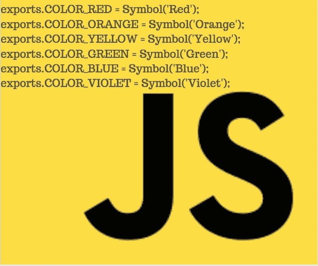

# JavaScript 符号的深度指南(ES-6 及更高版本)

> 原文：<https://itnext.io/a-deep-dive-guide-into-javascript-symbols-es-6-and-beyond-8e23e1432215?source=collection_archive---------5----------------------->



ES2015 增加了大量有用的新功能，其中包括符号类型。符号让我们避免了属性名冲突，我们几乎可以在 JavaScript 对象中实现私有属性。

在我看来，符号类型的主要吸引力在于:

```
const _note_key = Symbol('key');
const _note_title = Symbol('title');
const _note_body = Symbol('body'); module.exports = class Note {
     constructor(key, title, body) {
         this[_note_key] = key;
         this[_note_title] = title;
         this[_note_body] = body;
     } get key() { return this[_note_key]; }
     get title() { return this[_note_title]; }
     set title(newTitle) { this[_note_title] = newTitle; }
     get body() { return this[_note_body]; }
     set body(newBody) { this[_note_body] = newBody; }
};
```

我们已经定义了一个类，*，其属性的键是使用符号实例定义的。然后我们添加了 *get* 和 *set* 函数来访问属性。目标是，符号的不透明性将使这些属性足够私有，这样其他代码就不能访问它们。*

*换句话说，我们有了像私有财产一样行走和说话的东西，即使这些领域不是真正的私有。*

*正如我在别处提到的，JavaScript 不允许我们实现完全私有的属性。但它足以提供少量的保护。参见:[JavaScript ES-2015 类中的隐藏数据、创建封装](https://techsparx.com/nodejs/esnext/class-data-hiding.html)*

*同时，更好地理解 JavaScript 符号对象是有用的。*

# *JavaScript 符号对象概述*

*在 ES6 中，Symbol 成为了 JavaScript 中一种新的原始类型。符号是这样创建的:*

```
*> const sym2 = Symbol();
> console.log(sym2);
Symbol()
> const sym = Symbol('description');
> console.log(sym);
Symbol(description)*
```

*符号由工厂函数`Symbol()`创建。您可以像第一个实例一样创建一个空符号，或者给它一个描述字符串。*

*符号实例的关键属性是每个都是唯一的。*

```
*> Symbol('description') === Symbol('description')
false*
```

# *使用符号实例作为对象键*

*我们已经在前面定义的 Note 类中看到了这一点。但是我们先用一个简单的例子来尝试一下。*

```
*> const obj = {}; 
> obj 
{} 
> const name = Symbol('name'); 
> const addr = Symbol('addr'); 
> obj[name] = "John Smith"; 
'John Smith' 
> obj[addr] = "123 Main St"; 
'123 Main St' 
> obj 
{ [Symbol(name)]: 'John Smith', [Symbol(addr)]: '123 Main St' } 
>*
```

*该对象开始是空的，但现在有两个字段，每个字段的关键字是符号实例。访问这些字段的唯一方法是拥有那个确切的符号实例。*

```
*> obj.name 
undefined 
> obj[name] 
'John Smith' 
> obj[Symbol('name')] 
undefined*
```

*请记住，每个符号实例都是唯一的。访问该字段的唯一方法是使用正确的符号实例。创建符号实例时传递的*描述*字符串完全是为了您的利益。*

# *符号实例不是对象*

*说*符号对象*很有诱惑力，但那是不正确的。*

```
*> const name = Symbol(‘name’); 
> typeof name 
‘symbol’ 
> name instanceof Object 
false*
```

*换句话说，符号实例不是对象，因为它们不是对象类型的实例。相反，它们是符号类型的实例。*

# *使用符号来识别概念*

*符号实例的一个可能用途是标识概念值。在许多语言中，我们能够定义全局常量——例如在 C 或 C++中，预处理器让我们`#define`一个可以在整个应用程序中使用的常量。*

*假设你想用一种象征性的方式来描述一些颜色:*

```
*exports.COLOR_RED = Symbol('Red');
exports.COLOR_ORANGE = Symbol('Orange');
exports.COLOR_YELLOW = Symbol('Yellow'); 
exports.COLOR_GREEN = Symbol('Green');
exports.COLOR_BLUE = Symbol('Blue');
exports.COLOR_VIOLET = Symbol('Violet');*
```

*任何使用这个模块的代码都可以引用使用这个导出的`COLOR_RED`概念。应用程序中的任何代码都可以引用`COLOR_RED`，并知道它引用的是该符号的同一个实例。*

*只是不要试图在另一个应用程序中使用这些符号值。请记住，每个符号实例都是唯一的。即使有可能将一个符号实例保存到数据库中，那也是没有用的，因为在另一个应用程序中`Symbol('description')`有不同的值。*

# *使用符号定义对象中的半私有属性*

*我们现在可以回到顶部的例子。*

*在典型的 JavaScript 实践中，一个对象实例可能通过这个或那个模块将混合的*片段*附加到对象上。按照惯例，一个对象的公共字段用一个*字符串*键来标识，使得访问该字段变得容易。但是存在这样的风险，两个附加私有属性的模块可能使用相同的密钥字符串，导致名称冲突。如果这些模块使用符号实例，就不会有名称冲突。*

*使用这种做法，我们可以避免名称冲突。*

```
*> const obj = {}; 
undefined 
> obj[Symbol(‘foo’)] = ‘bar’; 
‘bar’ 
> obj[Symbol(‘foo’)] = ‘bar’; 
‘bar’ 
> obj 
{ [Symbol(foo)]: ‘bar’, [Symbol(foo)]: ‘bar’ }*
```

*即使在每次赋值时传递了相同的描述字符串，对象最终还是有两个字段，因为每个符号实例都是唯一的。这可能是将字段附加到同一个对象的两个模块，每个模块都使用`Symbol('foo')`作为键，但是因为它们使用了一个符号，所以保证不会影响到彼此。*

*我们得不到完全的隐私。你可以清楚地看到这个对象有两个属性。如果有正确的符号实例，这两个字段的值都可以访问，并且可以更改。*

*一些检索对象键列表的机制没有告诉我们哪些键是符号实例。*

```
*> Object.keys(obj)
[]
> Object.getOwnPropertyNames(obj)
[]
> for (let key in obj) { console.log(key); }
undefined
>
> obj['public'] = 'public value';
'public value'
> 
> obj
{ public: 'public value', [Symbol(foo)]: 'bar', [Symbol(foo)]: 'bar' }
> 
> Object.keys(obj);
[ 'public' ]*
```

*使用前面定义的同一个对象，我们看到`keys`和`getOwnPropertyNames`函数没有告诉我们关于符号实例的按键。循环也没有告诉我们这些键。但是一旦我们添加了一个键是普通字符串的字段，`Object.keys`就会告诉我们这个公共字段*

*但是我们可以使用新的反射类来访问每个键:*

```
*> Reflect.ownKeys(obj);
[ 'public', Symbol(foo), Symbol(foo) ]*
```

*现在让我们进入对象的私有字段:*

```
*> const foo1 = Reflect.ownKeys(obj)[1]; 
> const foo2 = Reflect.ownKeys(obj)[2]; 
> foo1 
Symbol(foo) 
> foo2 
Symbol(foo) 
> obj[foo1] = 'foobar'; 
'foobar' 
> obj 
{   public: 'public value',   [Symbol(foo)]: 'foobar',   [Symbol(foo)]: 'bar' }*
```

*该字段先前的值为“bar ”,但现在的值为“foobar”。我们这样做是通过侧门进入场地。底线是，JavaScript 没有给我们私有字段，只是一种避免将字段附加到对象时发生冲突的方法。*

# *摘要*

*符号是 JavaScript 中一个强大的新特性。*

*似乎私有字段以前的最佳实践是使用一个模糊的字段名。例如，Angular 使用以`$`开头的字段名来表示私有字段，并在某些情况下去掉这些字段。但是如果一个 Angular 程序需要与另一个使用以`$`开头的字段名用于不同目的的系统接口，该怎么办呢？*

**最初发表于*[T5【https://techsparx.com】](https://techsparx.com/nodejs/esnext/symbol.html?utm_source=dlvr.it&utm_medium=facebook&fbclid=IwAR2zBgCt-oOGA2glKilqaD-vRKzGEOo31gdbJITBY15e4gGQtwf35bRozbw)*。**