# 使用 AWS X 射线和 Lambda 深入了解无服务器跟踪

> 原文：<https://itnext.io/a-deep-dive-into-serverless-tracing-with-aws-x-ray-lambda-5ff1821c3c70?source=collection_archive---------0----------------------->

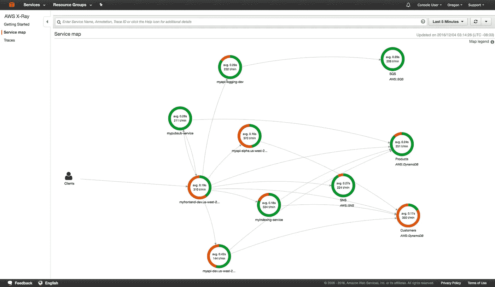

在过去的几周里，我一直在尝试在 AWS 上构建一个无服务器 API，目标是拥有运行生产系统所需的一切。一个必要的部分是分布式跟踪。虽然我已经看到了一些非 AWS 选项必须提供的东西，但服务本身的额外成本，以及实际获得数据的成本，对于我想象的只有 AWS 才可能实现(并且更便宜)的事情来说有点令人望而却步，这让我想到了 X 射线。因此，我想看看是否可以使用 AWS X 射线从跟踪解决方案中获得我想要的一切。首先，我将对产品跟踪解决方案的需求设定一些期望，作为研究过程的目标。

# 编辑 02/20/21

在发布这个帖子的几个月后，我在尝试 X 射线追踪采样规则时被提醒我错过了一些东西(大声喊 [Vishnu Prasad](https://twitter.com/vishnuprasad73) 来找我)。虽然你似乎可以增加 API Gateway 的采样率，但 Lambda 实际上固定在每秒 1 个请求，根据[这份文档](https://docs.aws.amazon.com/lambda/latest/dg/services-xray.html)，比这个数字高出 5%。显然，提高λ采样率的能力正在[进行中，目前还没有发布日期](https://forums.aws.amazon.com/message.jspa?messageID=941643)。不幸的是，这使得 X 射线对于业余爱好项目之外的无服务器开发毫无用处。Cloudwatch 日志很棒，但是作为一个跟踪解决方案，每秒 1 个请求是非常低的吞吐量。幸运的是，有一些替代品，如 Lumigo 和 Epsagon 似乎正在接受这一挑战。

# 要求

1.  分布式跟踪。在较高的层次上，我希望看到请求从服务到服务的路径，以及错误的位置和延迟的细节。
2.  内部跟踪，或“火焰图”。我希望能够看到 lambda 中请求的分解，以及错误发生时的堆栈跟踪。这也将帮助我找出 lambda 中运行效率特别低的部分。

# 设置

首先，一个标准的无服务器项目设置和代码演练。顺便说一下，我在这篇文章中使用的所有代码都可以在[这里](https://github.com/5t33/production-mock-serverless-api-demo)找到。

```
npm i -g serverless
sls create --template aws-nodejs --path lambda-demo-api
cd lambda-demo-api && npm init && npm i --save-dev serverless-offline
```

我们将要部署的 lambda 的文件结构如下所示:

```
├── anotherFile.js
├── index.js
├── logger.js
├── node_modules
├── package-lock.json
├── package.json
├── serverless.yml
└── utils.js
```

稍后我将解释这些文件。现在，让我们来看看初始的无服务器配置。

为了测试不同的配置选项，我添加了三个端点:一个健康检查返回 200 状态代码，第二个返回 400 状态代码，第三个抛出错误并返回 500 状态代码；三种典型的 API 响应。这里的想法是，我们应该能够通过我们的跟踪解决方案(X 射线)隔离返回 500 的 api 调用，以及伴随它们的堆栈跟踪。我在 provider 下添加了 lambda tracing，它为每个 lambda 打开 X 射线，这是一个更新的选项，以前需要一个插件。

当对所有功能使用默认的全局角色时，Serverless 会自动为 Cloudwatch 提供权限，但是当提供特定功能的角色时，您需要自己授予他们访问 Cloudwatch 的权限。我还提供了一些权限，允许 lambda 连接到 X 射线进行跟踪。

另外，我已经下载了[无服务器离线](https://github.com/dherault/serverless-offline)插件，这对于使用无服务器框架的本地开发很有帮助。它被保存为开发依赖项，因此不会包含在已部署的节点模块中。任何额外的依赖项都会增加冷启动时间，所以保持依赖项的分离非常重要。

在第 10 行和第 34 行，我们使用＄{ opt:stage }选项来访问运行以下命令时提供的值:

```
sls deploy --stage <test | dev | staging | prod>
```

在此设置中，如果不包含此标志，Serverless 将抛出一个错误。强制您显式声明阶段有助于防止不正确的部署。Serverless 在每个已部署资源的名称中包含您的 stage，这是一个很小但很有用的功能，有助于搜索资源，这是 AWS SAM 所不具备的，至少在默认情况下是不具备的。

你可以在这个[提交](https://github.com/5t33/production-mock-serverless-api-demo/tree/23eb0b174f7a75967555634ade51cbcc643dabf2)中找到我所有的初始设置代码。对这个回购的提交将遵循本文中的代码更新，但是我也将检查每个文件。模拟 API 的初始处理程序如下所示。

如你所见，我们正在做一些路由，考虑到我们使用的是无服务器，你可能会觉得有些多余。我们*可以*使用我们的无服务器配置将每个端点路由到不同的功能，这样我们就不必做这些条件。我可以就此写一整篇文章，所以现在我只能说这主要是个人偏好。尽管如此，if 块还是有点难看，还有一个更好的内部路由选项，我将在后面介绍，但它现在可以工作了。让我们进入我在处理程序中导入的其他文件。

第一个“utils.js”:

上面是几个简单的函数，集中了模拟 API 的响应格式。首先是一个扩展原生 JS 错误类的类，名为“ApiError”。这样做的目的是区分自定义/预期错误和意外异常，并提供提供状态代码和自定义响应主体的选项。第 21–30 行的 handleError 函数是根据自定义错误类检查当前错误类的地方。最后，还有 formatError 和 formatResp，它们标准化了输出和头格式。

最后是“anotherFile.js”

这些函数模拟了我前面提到的 3 个 API 响应。我将它们放在另一个文件中，这样当我们到达那里时，堆栈跟踪会更加详细。

现在是时候在本地运行它了:

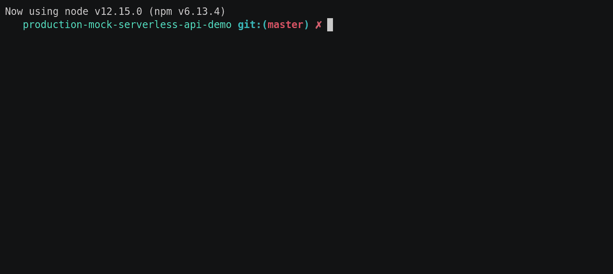

以下是回应:

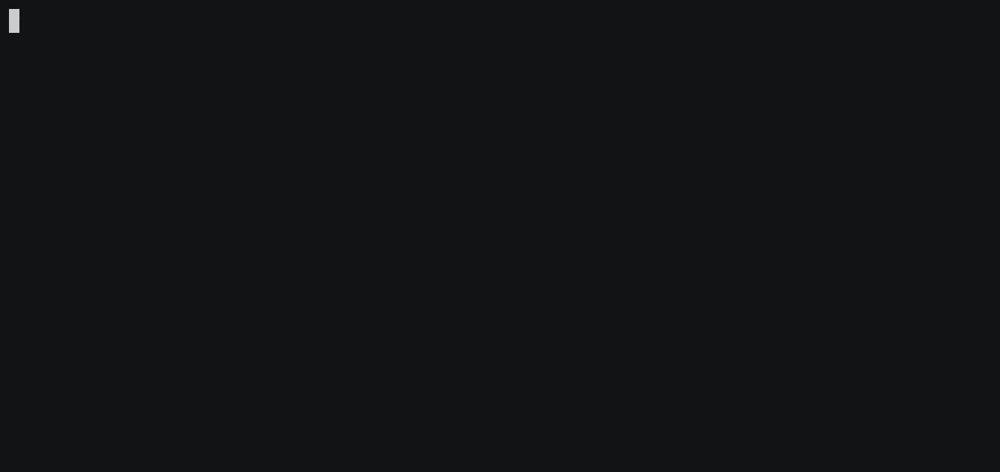

太好了，一切正常。现在让我们在 AWS 上部署和使用它。

```
sls deploy --stage dev
```

# x 光

我不会告诉你部署输出，但是部署后我们得到了 3 个 URL，现在可以发送一些请求了。当我们像上面本地所做的那样到达每个端点时，我们得到预期的输出和状态代码。我们可以通过导航到 AWS 控制台的 lambda 部分并单击 AWS X 射线下的“查看活动跟踪”,来查看 X 射线的跟踪效果。X 射线仪表板看起来像这样:

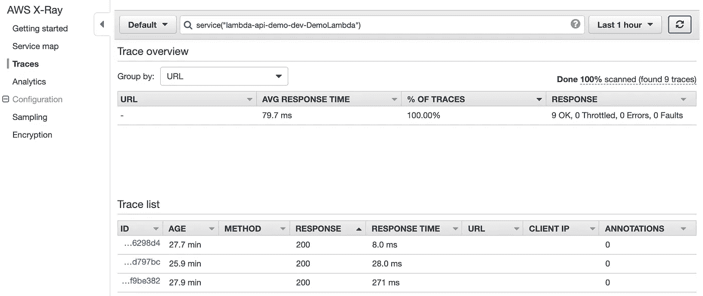

端点被击中 9 次，平均响应时间为 79.7 ms 酷！但是有些事情有点奇怪。为什么所有的回答 200 都没问题？我多次碰到“/dev/throw_error”端点，所以不应该出现这种情况。此外，我们不知道我们到达的具体端点，这不是很有帮助。让我们通过在跟踪列表下选择一个蓝色的超链接 id 来看看跟踪的结果。


有意思。我们可以看到调用和 lambda 函数，但是我们看不到任何与我们在 lambda 中调用的特定函数有关的东西，甚至看不到处理程序。这里有几个问题，但有一个有点明显的是，我们没有在我们的无服务器配置中设置 [API Gateway X 射线集成。这是一个相对简单的单行修复。我们只需要将“apiGateway: true”添加到无服务器配置的“provider”块的跟踪部分，就像这样(这里的代码是](https://www.serverless.com/blog/framework-release-v141)):

```
provider:
name: aws
runtime: nodejs12.x
stage: ${opt:stage}
region: us-east-2
tracing:
  lambda: true
  apiGateway: true
```

但是由于某些与云形成相关的原因，如果不完全删除堆栈，就无法添加 API 网关跟踪，因此我们必须运行以下代码:

```
sls remove --stage dev && sls deploy --stage dev
```

在尝试了新的端点并导航回 X 射线仪表板后，我们可以看到立即的改进。它现在不仅有预期的状态代码，而且我们的响应也按端点分组。漂亮。我们还可以看到客户的 IP 地址，出于隐私考虑，我屏蔽了这个地址。

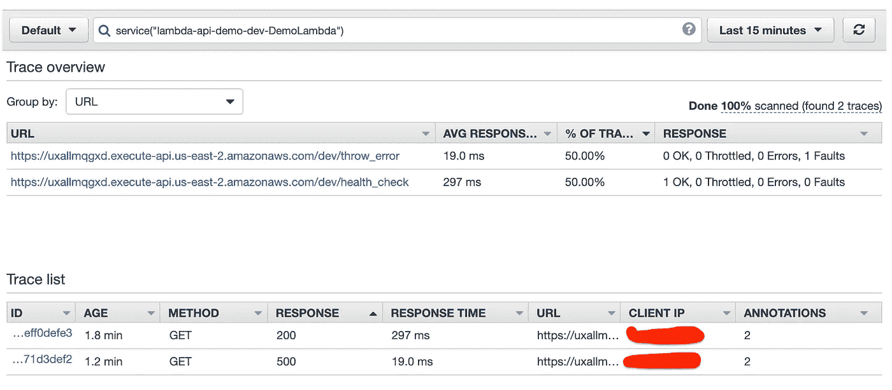

单击 500 响应的跟踪，您可以看到这里还有更多信息:

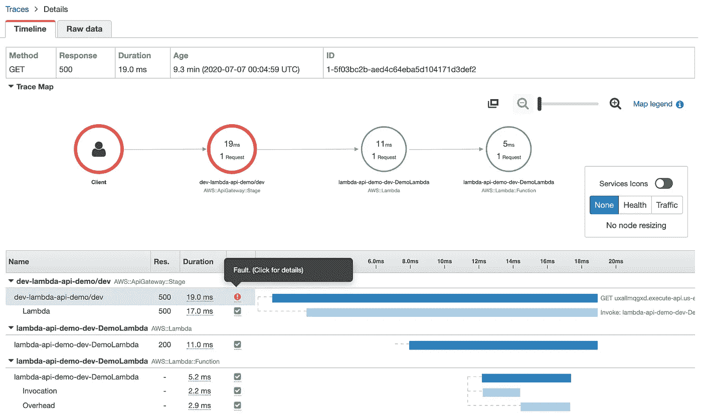

API 网关现在位于跟踪图和火焰图中。然而，我们仍然没有对 lambda 内部调用的函数进行任何内部跟踪，但我们马上就会谈到这一点。您现在还可以看到发生了一个错误，尽管它不是“错误”，这表明返回了一个 400+代码。这是指示 500+状态代码的“故障”。点击详细信息并导航到“exceptions”选项卡，我们可以看到我们的错误不幸没有堆栈跟踪，这是我前面提到的需求之一(见下文)。

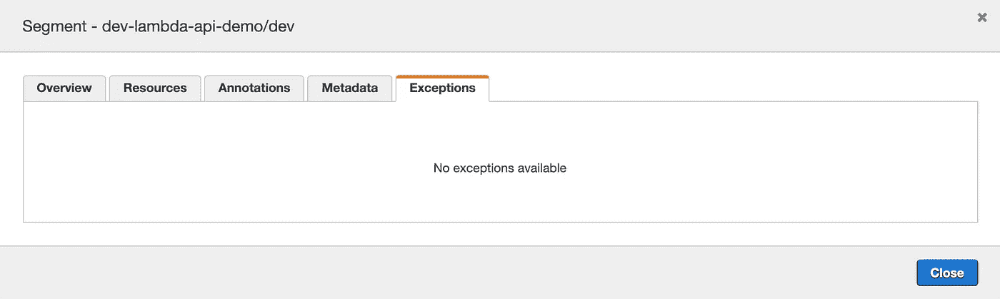

为了理解这是为什么，我们需要看看λ和 X 射线是如何一起工作的。为了让 X 射线报告一个错误，它实际上需要你的 lambda 失败(至少只要我们不使用 SDK，我马上就要谈到它)，当你考虑它的时候，这是有意义的。X 射线必须传递的唯一信息是你从 lambda 返回的信息。因此，如果您返回一个没有实际错误对象的已解决的承诺或正常响应，它没有理由报告错误，即使报告了也没有什么可报告的。失败的 lambda 的响应格式如下所示:

```
{
  "errorType": "...",
  "errorMessage": "...",
  "trace": [
    "..."
  ]
}
```

x 射线需要该错误输出来提供堆栈跟踪(不使用 SDK，我将在后面介绍)。为了失败，lambda 将需要使用 context.fail 函数，即所提供的 lambda 回调函数的第一个参数(例如 callback(error))，或者在异步 lambda 的情况下，返回一个被拒绝的承诺。让我们看看在 500 的情况下，当我们在错误处理函数中拒绝而不是解决时会发生什么。utils.handleError 函数现在将如下所示:

重新部署后，我们看到来自 throw_error 端点的以下 Postman 输出:


响应代码不再是 500，错误消息现在是 JSON。发生了什么事？我们现在看到的错误消息实际上不是从 API 响应发送的错误消息(正如我前面提到的，我们现在拒绝错误本身，而不是使用 formatError 函数)。502 响应表示路由我们请求的代理服务器下游出现错误。这是有意义的，因为 API 网关就是代理服务器。

现在在跟踪中可以看到一个错误和一个错误。当检查异常细节时，我们现在可以看到堆栈跟踪。

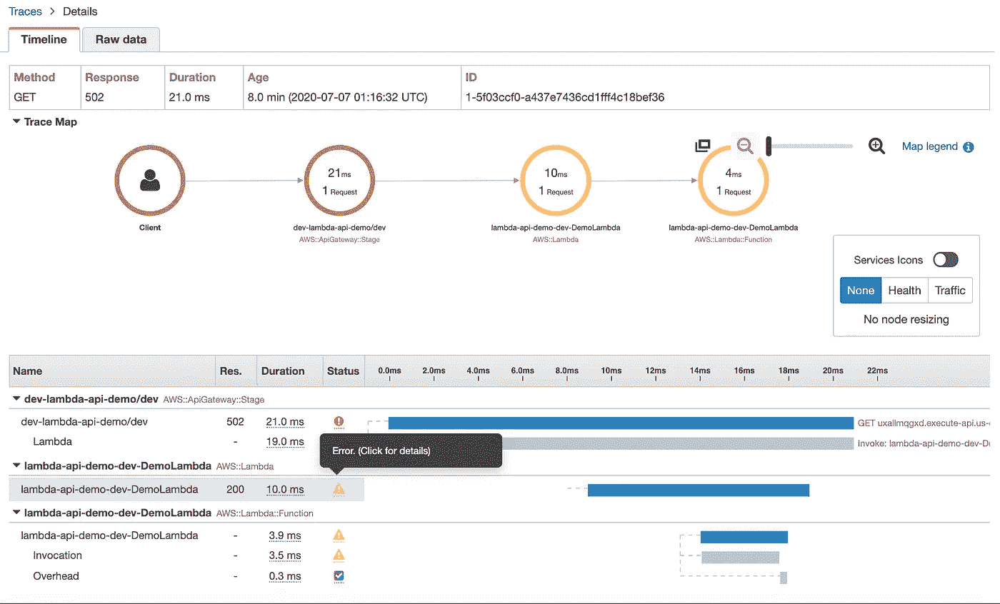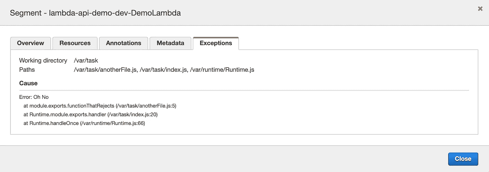

厉害！这就完成了第一个要求。内部跟踪还没有建立，但是现在我们可以一直跟踪一个请求，直到出现任何错误，并立即找到堆栈跟踪，而不用在日志中挖掘。

一个缺点是不能用不同的 5XX 错误来指示不同的问题。在这种设置下，lambda 必须无法为 X 射线提供跟踪，因此我们只能在出现意外错误时使用 502 API 网关响应。但是，有两种方法可以解决这个问题。一个是使用“Lambda 集成”而不是 API Gateway 的“Lambda 代理集成”,它使用正则表达式和映射模板的组合来生成您的响应。你可以在这里阅读更多关于那个[的内容。另一种选择是使用 SDK 通过 X 射线片段提供错误，这要容易得多。我将在下一节讨论这个问题。](https://medium.com/@lakshmanLD/lambda-proxy-vs-lambda-integration-in-aws-api-gateway-3a9397af0e6d)

## 抽样

在继续之前，非常重要的是要注意，默认情况下，X 射线不能捕获每个请求。默认算法是[每秒 1 个请求，在那之后的 5%的请求是](https://docs.aws.amazon.com/lambda/latest/dg/services-xray.html)。这是从一个端点捕获的轨迹图像，我点击了 100 次，没有任何延迟:

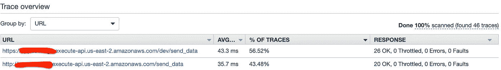

旁注，我不确定为什么我的一些请求通过 http，一些通过 https？我不确定这是 Axios 的错误还是 API Gateway 的错误，但如果有人能解决这个问题，请告诉我。

不管怎样，只捕获了 46 条轨迹。那还不到一半。如果你有一个错误，而你找不到相关的跟踪，这将是相当恼人的，对不对？要解决这个问题，你需要[改变应用于你的函数](https://docs.aws.amazon.com/xray/latest/devguide/xray-console-sampling.html)的采样规则。这是您将在控制台中找到的默认设置:

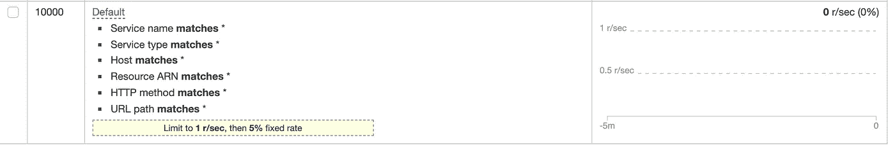

还有我刚刚加的那个:

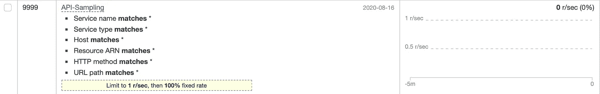

通过将固定比率更改为 100%，我会认为它将捕获我的所有请求。不幸的是，这只让我得到了 100 分中的 65 分:

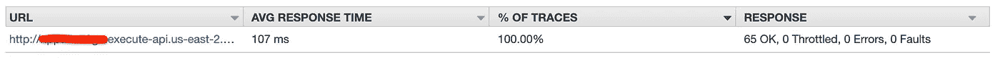

看起来，如果你的初始请求/秒限制足够低，固定速率就跟不上了。经过一番折腾后，我能够以每秒 100 个请求获得 100%的覆盖率。显然，这将取决于您的用例。您的 API 可能会受到速率限制，因此您将对每秒可能会看到多少请求有所了解。或者，如果您经常获得大量的流量，您可能希望限制 X 射线的跟踪量以节省资金(我认为这是采样选项的初衷)。

不利的一面是，云形成对重要细节的随机支持似乎取决于风吹的方向或杰夫·贝索斯今天早上吃了什么早餐，似乎不支持采样配置。好的一面是，您的控制台更改似乎不会被后续部署覆盖，并且该规则可能不会改变太多，因此您可以在初始部署后设置它并忘记它。然而，如果你喜欢地形，他们确实有一个选项。

# X 射线内部追踪

既然 X 射线已经设置好了，我们可以看到请求从 API Gateway 转移到 lambda，很快也会转移到下游的 AWS 服务。让我们看看一些 X 射线函数，它们允许我们跟踪 lambda 内部，添加元数据，并将错误附加到我们的跟踪中。

首先，安装 X 射线 sdk，它可以让您访问这些选项。([你可以在这里阅读更多关于套餐的信息](https://github.com/aws/aws-xray-sdk-node/tree/master/packages/core)

```
npm i aws-xray-sdk-core
```

## 地方发展

一个简短的说明。X 射线 sdk 并不真的玩无服务器-离线。当 lambda 运行时，它需要一个跟踪 id，否则它会抛出以下错误:

```
Error: Missing AWS Lambda trace data for X-Ray. Expected _X_AMZN_TRACE_ID to be set.
```

您可能看到的另一个本地运行的错误如下:

```
"Error: Failed to get the current sub/segment from the context.
```

至少可以防止这些错误导致 lambda 失败的一个选项是这个环境变量:

```
AWS_XRAY_CONTEXT_MISSING=LOG_ERROR sls offline --stage dev
```

这告诉 X 射线记录错误，而不是抛出错误。然而，日志输出相当冗长和烦人。要关闭它，您可以将 X 射线输入您自己的记录器，并将级别设置得足够低，这样它就不会在您的测试中显示出来，如下所示:

```
f(process.env.NODE_ENV === 'local_dev' ) {
  AWSXRay.setLogger(Logger('silent'));
}
```

如果您走这条路，重要的是在一个工具文件中导入 X 射线一次，其他时间从该文件导入，否则 X 射线的一些实例不会有您提供的记录器。

## 片段

首先，理解“细分市场”的概念很重要。一个段仅仅是由时间跨度度量的代码的一部分。段都是树的一部分，顶部是一个根段，下面是子段。子段只是另一个段的子段。两者之间只有细微的功能差异。有两个与段相关的函数需要注意:“addNewSegment”将生成调用段的子段，“addSubsegment”将一个段作为子段添加到任何其他段。

正如您在上面看到的，在这个选项中，您必须显式地将您的段向下传递给较低的函数，并在那里创建一个新的子段。下面是它在拒绝函数中的样子:

您 ***必须*** 对您的所有段调用“close ”,否则您的所有段都不会显示，并且您会丢失堆栈跟踪(这也是为什么您还想打印日志而不是仅仅依赖 X 射线)。另一个要提到的重要事情是，Lambda 是特殊的，它带有一个自动生成的根段，您可以通过 AWXRay.getSegment 访问它。它是不可变的，因此您不能向它添加注释或元数据，并且在调用时其他段函数都不工作，但是您可以将它用作其他子段的父段(作为普通段)。

让我们看看这些部分在仪表板中的样子:

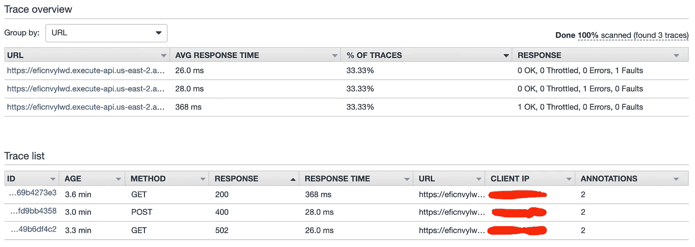

厉害！我们可以看到三种不同的输出:1 个正常响应(200)、1 个错误(400 +)和 1 个错误(500 +)，现在我们可以深入到被调用的函数，看看它们用了多长时间，以及哪里发生了错误。现在迹线图:

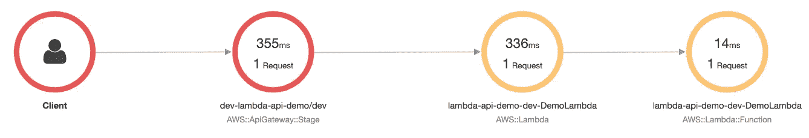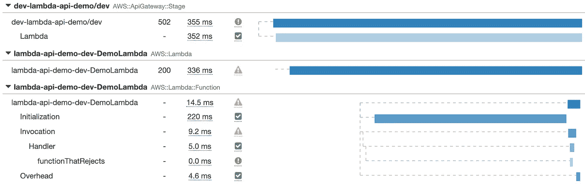

现在，我们可以更深入地了解该函数所花费的时间，并可以看到错误发生在哪里。

## addError

正如您可能已经注意到的，在上面的例子中，“addError”在失败的函数段中被调用。这解决了以前需要拒绝 lambda 在 X 射线中发送堆栈跟踪的问题。让我们看看仪表板是什么样子的，如果我们现在解决了 lambda 不需要为堆栈跟踪失败的承诺。

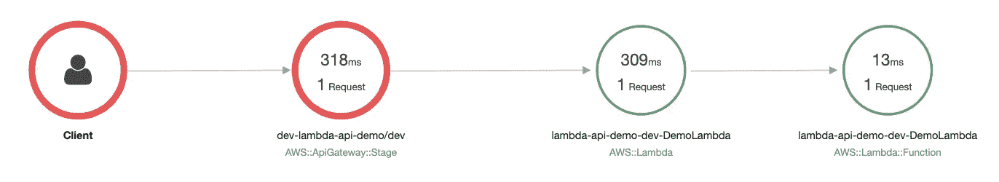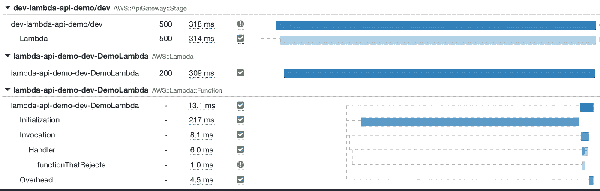

错误仍然存在，您可以获得堆栈跟踪，但是 X 射线不再显示 lambda 本身失败，只显示端点和函数。

## 添加批注和添加元数据

作为 Segment 对象的一部分，您可能还想利用其他几个函数，其中两个是“addAnnotation”和“addMetadata”。这些允许您将信息添加到单个区段，您将能够在 X 射线仪表板中看到这些信息。两者之间的一个关键区别是，您可以搜索 X 射线注释，但不能搜索元数据。另一个原因是元数据允许存储整个对象，而注释是键值对。你可以在这里阅读更多关于追踪搜索[。](https://docs.aws.amazon.com/xray/latest/devguide/xray-console-filters.html#xray-console-filters-details)

下面是一个查询示例，用于在所有跟踪中搜索调用花费不到一秒钟且注释为“a = b”的失败:

```
service("lambda-api-demo-dev-DemoLambda") AND duration < 1 AND !ok AND annotation.a = "b"
```

如果你想了解更多关于 X 射线的概念，你可以在[这里](https://docs.aws.amazon.com/xray/latest/devguide/xray-concepts.html)阅读。

## captureFunc & captureAsynFunc

您可能想要利用的另外两个函数是“captureFunc”和“captureAsynFunc”。addNewSegment 不支持承诺，因此“captureAsynFunc”解决了这个问题。下面，你可以看到我是如何在“anotherFile.js”中使用 captureAsyncFunc 的(顺便说一下，所有这些代码都可以在 [this commit](https://github.com/5t33/production-mock-serverless-api-demo/tree/915a4ebe98a2c44863701b8a2491cdf3ba1730be) 中找到)。

将 addNewSubsegment 与 async/await 一起使用更简洁一些，但是直到我写了这一部分之后，我才意识到它是异步调用的一个选项，所以在本文的其余部分，我将使用 captureAsynFunc。

下面是包含 X 射线包装器的更新处理程序:

以及“anotherFile.js”:

虽然你在上面看不到它，但我在处理程序中调用了“close”。在记录错误之前，您可能也想在 errorHandler 中调用 addError，但是这样会将错误报告为发生在错误处理程序函数中，而不是实际发生的函数中。

## 几句告诫的话

在继续之前，我要暂停一下，补充几句警告的话。虽然分段很酷，但我不推荐在这种程度上使用它们。达到这一点对代码来说是非常具有侵略性的*。我也不喜欢包装我写的每一个函数的想法，事实上你*必须*在你的异步段上调用 close，否则你的内部跟踪将会崩溃，这是一个很大的精神开销。几乎就像写 c 一样。*

然而，能够用您喜欢的任何状态代码来解析您的函数，并且仍然向 X 射线报告一个错误，这是非常好的。因此，如果您不想包装所有的函数调用，用单个段包装您的函数可能是使用该功能的合理限制。有了 X 射线的其他特性，跟踪每一个函数调用可能都是不必要的，您将在接下来的几节中看到这一点。

## captureAWS & capturePostgres

我说的“其他功能”是指 X 射线提供的跟踪您的功能所涉及的任何东西的功能。让我们看三个选项:其他 AWS 服务、http 请求和数据库。为此，我将创建一些额外的资源:一个 DynamoDB 表、一个 SQS 队列、一个 SNS 主题和另一个 lambda 函数。这种设置是人为设计的，对于任务来说过于复杂，但它只是提供一个示例。我将添加一个端点，它将从 dynamo 表中提取 5 个值，并将它们推送到 SNS。SNS 将推送到 SQS，在那里另一个功能将提取数据并将其发送到一个 slack 通道。你可以在这里找到这部分[的代码。我通过 https://randomuser.me/](https://github.com/5t33/production-mock-serverless-api-demo/tree/d4e67509e3a42593e73c41f8bf107741baa647ce)的[生成了虚假的用户数据，我用](https://randomuser.me/)[这个 slack app](https://stevensteam-workspace.slack.com/apps/new/A0F7XDUAZ-incoming-webhooks) 做了 slack webhook。部署后，您可以使用以下内容作为数据库的种子:

```
npm run seed-dev
```

我还在“common”文件夹中添加了两个文件:dynamodb.js 和 sns.js。每个文件都包含这两行(您也可以在处理程序的顶部调用一次):

```
const AWSXRay = require('aws-xray-sdk-core')
const AWS = AWSXRay.captureAWS(require('aws-sdk'));
```

这就是为您使用的任何 AWS 资源提供跟踪所需要做的全部工作。一旦我们调用新端点“/dev/send_data”，然后查看 X 射线控制面板，我们将看到一些新信息:

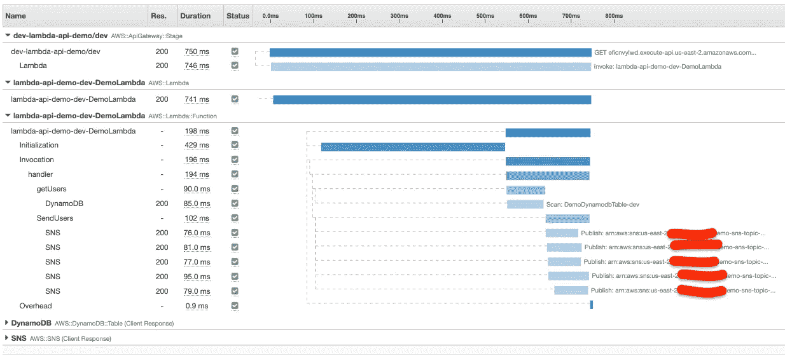

现在有 DynamoDB 扫描和 5 个 SNS 调用的分段。如果我们看一下轨迹图，我们会发现它也发生了一些变化:

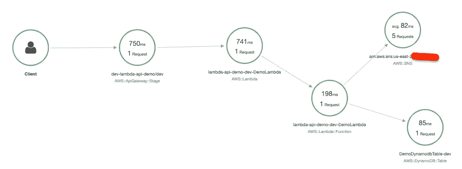

DynamoDB 和 SNS 现在包括在内了，但是等一下…为什么我们没有看到 SQS 或其他 lambda 函数？我一会儿就会谈到这个问题，首先让我们看看另一个函数的处理程序:

前三行是最重要的。与“captureAWS”包装 AWS 资源调用的方式相同，captureHTTPsGlobal 包装所有出站 http(s)调用。如果我们查看该功能的 X 射线仪表盘，我们会看到以下内容:

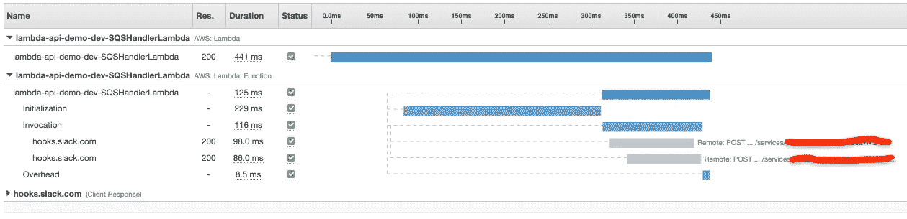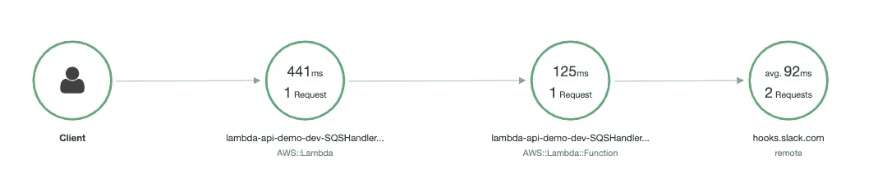

我们可以在图形和图表中看到对 slack 端点的调用。然而，在这里你仍然看不到 SQS 队。不幸的是，一旦你与你的 lambda 超过一个分离度，X 射线就无法连接轨迹，或者至少从 SNS 到 SQS 到另一个 lambda，正如你在 github 的[中看到的。显然，AWS 正在进行一些更新，其中包括对这个问题的修复，所以我们现在只能等待并处理单独的仪表板。显然，你至少可以将 sqs 放入你的跟踪中(就像那期的海报一样)，但我不知道如何做。](https://github.com/aws/aws-xray-sdk-node/issues/208)

至此，我们已经介绍了如何跟踪 http 请求和对其他 AWS 服务的调用。然而，我们仍然需要涵盖数据库。这里需要一个 VPC/RDS 实例，我用了 Terraform，所以它不在 repo 中，抱歉。但是，如果您自己设置它们，您应该注意到我使用 SSM 拉入了安全组 id、vpc id 和 rds 端点，您也可以复制它们。准备就绪后，您可以使用以下脚本来播种您的数据库:

```
npm run seed-rds-local
npm run seed-rds-dev
```

现在，在 lambda 中，X 射线的设置相当简单。与 aws-sdk 和 http 非常相似，您只需将数据库导入封装在一个函数调用中，如下所示(您可以在 [this commit](https://github.com/5t33/production-mock-serverless-api-demo/tree/81ac39a111be284463ab318be3ee0c1069f4aeb4) 中找到添加的 RDS 代码)。

我在这个例子中使用 pg-promise，所以我在导入之前调用 capturePostgres，就像导入 Axios 之前调用 captureHTTPsGlobal 一样。如您所见，我们现在在跟踪图中有一个 SQL 段:

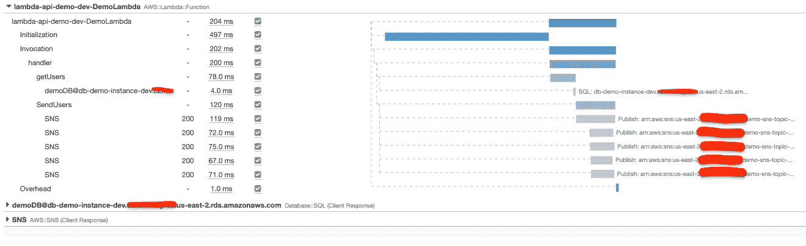

有了这三种捕获段的方法，手动包装函数似乎就没什么必要了，除非您需要深入了解是什么导致了性能问题。

# 用λ和 X 射线表示

在这篇文章的开始，我提到有一个更好的方法在每个 lambda 的基础上在内部路由请求(如果你不想对所有的路由都使用 API Gateway 的话)。一种选择是快递。使用 [aws-serverless-express](https://www.npmjs.com/package/aws-serverless-express) 模块，您可以在 lambda 中使用 express，它为您提供路由、中间件和查询参数的自动解析，只需花费很少的成本来设置路由和在冷启动时调用“listen”。我知道有些人可能会认为这是一种反模式，但我不认为这是什么大不了的事情，如果你只是为一个端点加载几个路由。然而，使用 express 意味着我们必须更新处理程序代码来适应 express。见下文(顺便你可以在这里找到这个代码)。

使用 [aws-serverless-express](https://www.npmjs.com/package/aws-serverless-express) 包，路由现在使用 express 处理。为了像以前一样给记录器添加一个惟一的请求 id，我将它包含在一个中间件函数中。还有一个名为 aws-xray-sdk-express 的 X 射线快速中间件包，尽管它似乎只不过是添加了一个包装段，我在上面使用的是包装段，而不是手动的“处理程序”段。我认为它至少可以跟踪中间件的功能，但事实似乎并非如此。可能它在 lambda 中的行为与在 express 容器中不同。

x-ray 中间件的另一个小缺点是，它不是为 lambda 设计的，所以它创建了两个单独的跟踪——一个用于 lambda 调用，一个用于处理程序，如下所示。这可能是由于 express 插件试图创建自己的根段。这似乎会导致所记录的测量值之间的微小差异。您可以看到输出如下所示:

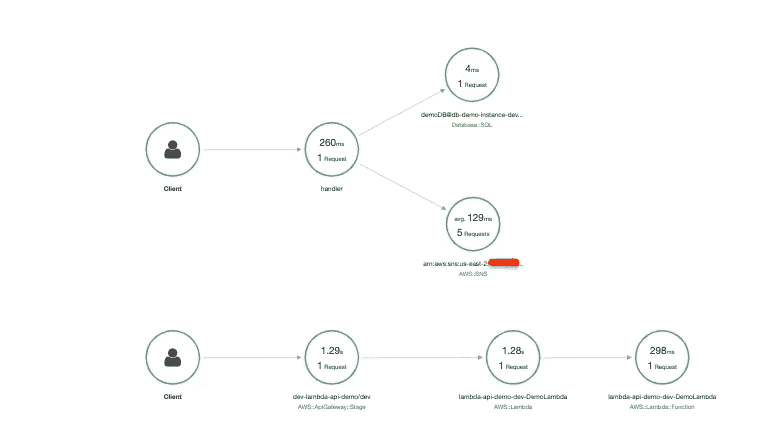

这并不理想，中间件也没有增加太多东西，所以我决定回到 lambda 的单一包装器，如下所示:

*这里有一个警告*:现在我们正在返回 express 的结果，你有机会向你的客户发送一个堆栈跟踪。只有在错误处理程序上游的中间件中出现未捕获的错误时，才会发生这种情况。aws-serverless-express 处理这个错误，但是它用一个 500 来解决这个问题，这个 500 会返回完整的错误。

# 结论

差不多就是这样。这篇文章比我预想的要长得多，但是我认为投入进去做一些实验是值得的。我没有讨论 X 射线控制台中可用的监控，但我建议快速浏览一下。我希望 X 射线中增加的一点是一种将跟踪与日志记录联系起来的简单方法。看起来好像有另一个名为“ServiceLense”的服务可以做到这一点，但它无法想象在 X 射线跟踪的相关日志流中添加一个按钮会有多困难。无论如何，感谢您的阅读，我希望这能帮助您开始在您的无服务器 API 中使用 X 射线。

顺便说一下，我想大声说出崔琰的[这个课程](https://www.manning.com/livevideo/production-ready-serverless)，以及[他的博客](https://theburningmonk.com/)，这两个资源是我反复参考的关于构建无服务器系统的信息。