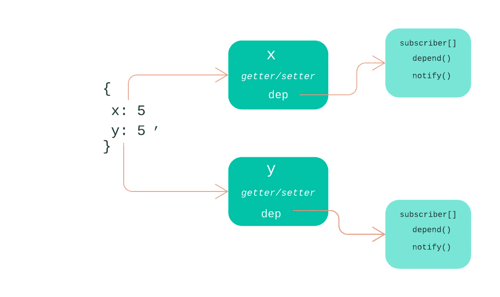

# 深入了解 Vue 的反应系统—第 1 部分

> 原文：<https://itnext.io/a-deep-dive-into-vues-reactivity-system-part-1-7b9f889b5a44?source=collection_archive---------3----------------------->

本文分为两个部分。第一部分讨论了反应式系统的一般概念，以及我们如何用 JavaScript 创建自己的原始反应式系统。[第二部分](https://medium.com/@jyotishb/a-deep-dive-into-vues-reactivity-system-part-2-ac678fb631f9?sk=e2bed33ccc0a4f086165f8407133cbe4)检查了当前版本的 **Vue** 如何使用相同的想法来实现其引擎盖下的反应。

反应式系统是一种可以自动注册和运行由系统内的各种数据属性变化引起的副作用的系统，以便系统总是能够保持一致的状态和输出。当我们谈论一个不仅仅只有几个变量、关系和计算的系统时，一个自主反应系统对于可扩展性变得至关重要。

> TL；速度三角形定位法(dead reckoning)
> 
> 本文讨论了如何通过将数据对象的属性转换为 getter/setter 来实现反应性，并让每个属性维护一个使用该属性的计算列表，以便在属性值发生变化时可以运行它们。

JavaScript 显然没有内置反应能力。例如，在下面的代码片段中，当*价格*或*数量*的值发生变化时，*总计*的值不变。为了改变 *total* 的值，我们需要在第 2 行再次运行计算。

让我们通过将第 2 行中的计算移到一个函数中来对上面的代码块做一个小的改变。现在，当我们通过运行函数来运行计算时，我们得到了计算出的 *total* 的值。

如果我们在*价格*或*数量*的值突变后再次运行计算(第 11 行),那么我们将获得*总数的更新值。*

所以本质上，如果一个计算( *f* )依赖于一组值( *a，b，c，..n* )来产生一个输出( *t* )，如果这些值中的任何一个发生变化，我们需要再次运行计算来保持 *t* 的值是最新的。在上面的代码片段中，我们在*价格*和*数量*的值发生变化后手动运行计算，但是如果我们能够在计算所依赖的任何值发生变化时自动运行计算，那么我们就可以得到一个简单的反应系统。同样重要的是要记住，这个想法可以扩展到任何数量的变量、计算和计算值。

比方说，如果我们能自动进入某个变量的值何时被**访问**或**突变**，我们可以尝试存储访问该变量的计算(即*该计算依赖于该变量的值*)。如果在未来的任何时候，该变量的值发生突变，我们会通知计算再次运行，以更新系统的状态。如果我们所有的变量都是一个对象的属性，[*object . define property()*](https://developer.mozilla.org/en-US/docs/Web/JavaScript/Reference/Global_Objects/Object/defineProperty)静态方法就可以做到这一点。

让我们修改上面的代码，使计算中使用的变量是一个名为 *data，*的对象的属性，而不是全局变量。

现在，如果我们使用*object . define property()*在 *data* 对象上定义一个与 *price* 和 *quantity* 同名的属性，并提供一个 *getter/setter* 定义，它会将 *price* 和 *quantity* 转换为 *getter/setter* ，如下所示。

我们递归地扫描数据对象中的所有属性，并将它们转换成 getters 和 setters。下面的代码会将每个属性更改为一个 *getter/setter* ，而不会更改或添加任何新的行为。

我们所创建的是一种每次访问或修改一个属性时都要做的事情。在上面的例子中，我们有一个名为 *computeTotal()，*的函数，它使用*价格*和*数量*的值来计算*总计*的值。换句话说， *computeTotal()* 取决于*价格*和*数量*的值。当*价格*和*数量*在*计算总计()*的主体中被访问时，我们可以使用捕获的变量存储对*计算总计()*的引用。在将来的任何时候，如果*价格*或*数量*的值通过*设置器*改变，我们可以从存储器中调用*computo total()*再次运行计算。让我们看看代码。

1.  我们用参数*computo total(第 34 行)*调用 *RegisterComputation()* ，将全局变量*current computo*的值设置为*computo total(第 29 行)*并运行*computo total*(*第 30 行*)。
2.  当我们运行当前计算(*第 30 行*)时，它调用*价格*和*数量*的 getter，从而将 *computeTotal* 注册为一个依赖实体。(*第 17 行*)。
3.  当 d *ata.price* 的值在*行 36* 中发生突变时，它调用执行所有存储的相关计算的 setter(*行 22* )，并更新 *total* 的值。
4.  如果我们有多个计算，我们可以让 *RegisterComputation()* 用一个数组来注册它们。

为了使代码更加优雅，我们可以在一个单独的类中抽象出依赖逻辑，并让每个属性维护这个依赖类的一个实例。这类似于 Vue 2 为每个属性维护一个依赖实例。

每个属性都有自己的 dep 实例

在这一部分中，我们讨论了用 JavaScript 创建一个微型反应系统的方法。完整的代码文件可以在这里找到[。在](https://gist.github.com/jyotishbora/023fad61fab3a9e63dd7f7fa3cde5217)[下一部分](https://medium.com/@jyotishb/a-deep-dive-into-vues-reactivity-system-part-2-ac678fb631f9?sk=e2bed33ccc0a4f086165f8407133cbe4)中，我们将研究 Vue 2 如何使用相同想法的增强版本来实现其自身的反应性。

编码快乐！！