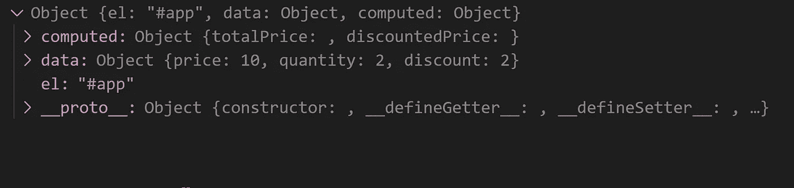
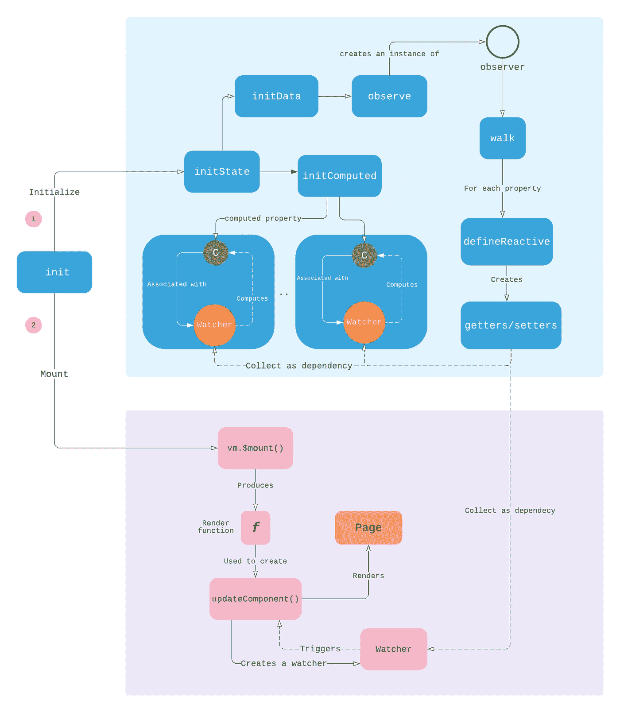

# 深入了解 Vue 的反应系统—第 2 部分

> 原文：<https://itnext.io/a-deep-dive-into-vues-reactivity-system-part-2-ac678fb631f9?source=collection_archive---------4----------------------->

在本系列的第一部分中，我们讨论了如何通过将数据属性转换为 getter/setter 并将相关计算存储在捕获的数组中来创建一个原始的反应式系统。在这一部分中，我们将回顾 Vue 如何应用相同的思想来实现其引擎盖下的反应。

在下面的代码片段中，我们创建了一个 Vue 实例，它具有三个数据属性，*价格、数量和折扣*，以及两个计算属性*总价*和*折扣价格。*接下来，我们将实例挂载到 id 为 *app* 的 div，以便在浏览器中呈现页面。

让我们研究一下当我们使用[构造函数](https://github.com/vuejs/vue/blob/dev/src/core/instance/index.js#L8)创建 Vue 实例时会发生什么。它用选项参数中的所有数据调用 Vue 原型上定义的 [_init](https://github.com/vuejs/vue/blob/dev/src/core/instance/init.js#L16) 方法。在我们的例子中，选项对象看起来像这样。



下面的代码显示了 *_init* 方法的关键。所有重要的初始化都在这里完成。对于反应性主题，我们将重点关注突出显示的 *initState()* 和 *$mount()* 。

```
vm._self = vm;
initLifecycle(vm);
initEvents(vm);
initRender(vm);
callHook(vm, 'beforeCreate');
initInjections(vm); // resolve injections before data/props
**initState(vm);**
initProvide(vm); // resolve provide after data/props
callHook(vm, 'created');
if (vm.$options.el) {
    **vm.$mount(vm.$options.el);**}
```



Vue 数据初始化

我们可以看到 [*initState*](https://github.com/vuejs/vue/blob/dev/src/core/instance/state.js#L48) 调用 [*initData*](https://github.com/vuejs/vue/blob/dev/src/core/instance/state.js#L112) 和 [*initComputed*](https://github.com/vuejs/vue/blob/dev/src/core/instance/state.js#L169) 。 [*initData*](https://github.com/vuejs/vue/blob/dev/src/core/instance/state.js#L112) 的主要目的是[遍历](https://github.com/vuejs/vue/blob/dev/src/core/observer/index.js#L55)所有属性(*价格、数量和折扣*)并为每个属性定义一个反应式 getter 和 setter，稍后将使用它们来收集和通知依赖项。这类似于我们在本文第一部分中讨论的内容。 *initData* 也将每个属性代理给 Vue 实例，因此它们可以通过 *this 访问。*

接下来，*[*init computed*](https://github.com/vuejs/vue/blob/dev/src/core/instance/state.js#L169)遍历所有计算的属性，在我们的例子中是 *totalPrice* 和*discount price*，并为每个属性创建一个 **watcher** 实例。我们可以将观察器视为实际计算的封装。观察器的值是计算的结果。观察器可以被创建为懒惰的，在这种情况下，观察器的值不会立即被评估。计算属性观察器被创建为懒惰观察器。*

*观察器的关键点是，它包含一个依赖于某些数据属性的计算。在计算观察器时，任何被访问的数据属性都可以收集观察器作为依赖项，并将其存储在本地 [dep](https://github.com/vuejs/vue/blob/dev/src/core/observer/index.js#L163) 实例中，以便在属性值发生变化时通知它。*

*除了为计算属性创建的所有观察器之外，还为负责呈现页面的计算创建了一个特殊的观察器。从上面的流程可以看出， ***初始化*** 之后的下一步是*进程，解析我们#app 标签里面的模板，创建一个 render 函数，这个函数是一个匿名函数，返回一个虚拟的 DOM 节点。例如，一个简单标签的渲染函数如下所示:**

```
**> Vue.compile("<label>{{price}}</label>").render.toString() **"function anonymous( ) { with(this){return _c('label',[_v(_s(price))])} }"****
```

**运行 render 函数并创建 vnode 之后的下一步是修补过程，以呈现实际的 DOM 元素。从 render 函数创建虚拟 DOM (vnode)和从 vnode 创建实际 DOM 这两个步骤都封装在一个名为[*update component*](https://github.com/vuejs/vue/blob/dev/src/core/instance/lifecycle.js#L189)*的函数中，如下所示。由于 *updateComponent* 是一个依赖于其他数据元素的计算，因此为其创建了一个新的 [*观察器*](https://github.com/vuejs/vue/blob/dev/src/core/instance/lifecycle.js#L197) ，称为渲染观察器。***

```
 **updateComponent = function () {
   vm._update(vm._render(), hydrating);
};//Create the new watcher for updateComponent function 
new Watcher(vm, updateComponent, noop, {
    before: function before () {
        if (vm._isMounted && !vm._isDestroyed) {
                callHook(vm, 'beforeUpdate');
    }
 }
}, true /* isRenderWatcher */);**
```

**渲染观察器被创建为 eager，这使得 *updateComponent* 函数立即执行。在这个过程中，它使用我们计算的属性( *totalPrice* 和*discount price*)和数据属性( *price* 和 *quantity* )的值，因为它们用于呈现我们的 DOM。如果您还记得，我们的计算属性观察器被创建为懒惰的，因此在呈现过程中也需要对它们进行评估。由于所有的观察器依次运行(呈现观察器，然后是计算属性观察器)，当数据属性获取器在其评估期间被调用时，它们将作为依赖项被收集。记住一次只能运行一个观察器是很重要的。**

**在我们的示例中， *price* 数据属性在其依赖列表中有计算属性和呈现观察器，当 price 的值通过 setter 发生变化时，所有三个观察器将被通知以特定的顺序再次运行。值得指出的是，render watcher 会更新虚拟 DOM 元素，在打补丁过程中会与旧的虚拟 DOM 进行比较，只有更改才会应用到实际的 DOM 中，这使得过程非常高效。**

# **结论**

**在这两部分系列中，我们已经讨论了 Vue 2 如何在引擎盖下实现其反应性。即将发布的 Vue 3 版本使用 ES6 代理对象，而不是 getters 和 setters，这将在下一篇文章中介绍。**