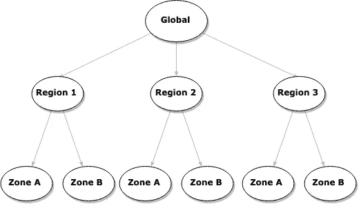

# 开发人员对云的介绍

> 原文：<https://itnext.io/a-developer-introduction-to-the-cloud-91012abbaed4?source=collection_archive---------0----------------------->

*(也发表在* [*我的博客*](https://blog.segersian.com/2019/03/30/cloud-introduction/) *)*

云已经成为许多企业的主流。像网飞这样的大公司部署在亚马逊网络服务上，其他公司做混合解决方案，还有一些公司甚至离开大的云供应商，创建自己的数据中心/云(例如 Dropbox)。

作为一名开发人员，与云服务或供应商合作的机会与日俱增，你们中的一些人可能只与云合作过。在这篇文章中，我将详细阐述主要的云供应商(Google Cloud，AWS 和 Azure)是如何构建的，以及你如何能够很容易地理解他们众多看起来如此相似的产品。目标是在阅读本文后，您可以很容易地了解任何提供商的任何云产品的功能，以及它与其他产品的区别。

# **核心资源类型**

云供应商为您提供不同类型的资源，帮助您构建任何类型的解决方案:

*   **计算**:你运行代码、软件、工作等的计算能力。(*例如 EC2、Lambda、云功能和 Azure 虚拟机*)
*   **存储**:数据的方法，这可以是存储简单的文件，虚拟机的文件系统，或者数据库的存储空间。
    ( *例如 AWS S3、AWS EBS 和 Azure 存储磁盘*)
*   **网络**:组织存储和计算资源网络的资源，它们是如何通信的？他们能交流吗？我们如何访问这些资源？
    ( *例如 VPC、虚拟网络、固定 IP 地址和 DNS* )

大多数云服务和产品通常提供基于上述资源类型之一或组合的服务。当你阅读一个产品/服务时，问问自己:

> ***产品/服务使用哪种资源类型？***

例如，像 AWS RDS 这样的数据库服务是**计算**和**存储**资源的组合。像 AWS S3 这样的服务是一种**存储**资源。

*有人可能会争辩说，每个资源总是与网络资源结合在一起进行访问，这可能是真的，但这是云供应商在幕后处理的事情。*

# 管理的尺度

每个云供应商都有各种各样的服务和产品，试图解决特定的问题。有些产品在提供的内容上非常相似，通常关键的区别(除了定价)是"**如何管理**"服务。

服务的管理越好，使用和运营该服务的维护和开销就越少。

*   例如:Lambda/Cloud 函数，您不需要提供服务器，也不需要编写引导服务器的代码，您只需要编写与解决您的用例相关的代码。你不必为软件和操作系统打补丁，也不必对执行这些代码的服务器进行安全访问。

服务的管理越少，你就有越多的自由，但在操作和使用这些服务时也有更多的责任。

*   例如:EC2/虚拟机，您自己调配服务器实例，决定计算特性(RAM、CPU)，为其附加存储，维护操作系统，安装安全补丁等，但您可以完全控制这些虚拟机。

例如，计算资源有许多只专注于计算的不同产品/服务，但它们的管理规模不同。

当你阅读一个产品/服务时，问问自己:

> ***产品/服务在管理的等级上属于哪一级？***

我们对不同类型的计算有一些很酷的命名:

*   IaaS:基础设施即服务
*   平台即服务
*   FaaS:功能即服务

# 位置

您提供或部署的产品/服务可能会也可能不会绑定到您想要部署和运行的(物理)位置。每个云供应商都有一个“全球”、“区域”和“地带”的概念。

*   **全局**:这个级别的服务通常不部署服务，像 AWS IAM 基本上是对某个组织的所有 AWS 用户的用户管理。这与地区/区域无关。假设我希望系统管理员 Peter 拥有配置虚拟机的权限。根据云供应商的不同，我可能会限制 Peter 可以调配虚拟机的区域，但我们会在全局范围内组织这些用户及其权限。
*   **Region**:Region 是地理上特定的位置，通常用国家或城市来表示。这将一组区域组合在一起，或者更确切地说，是彼此在一定范围内的数据中心。
*   **(可用性)区域**:每个区域(通常)有两个或更多区域。每个区域都是一个不同的数据中心。其理念是每个区域都有自己的电源、网络和备用电源基础设施，与其他区域隔离。这些区域在地理上也彼此远离。这种隔离意味着，如果一个区域因自然灾害或电网故障而关闭，该区域内的其他区域不会受到影响。大多数供应商将在同一地区的区域之间创建高速网络连接。

这个想法是你提供你的资源接近你的用户群。如果您的大部分用户在欧洲，那么德国法兰克福地区可能是一个不错的选择，因为您的服务离您的用户很近。但是，为了保持高可用性，明智的做法是将您的资源部署到该区域内的不同区域，以防一个区域由于电源故障而关闭。

区域通常用字母值表示(如 a、b、c)，区域通常用它们的大陆和方向表示。

*   在 AWS 中，法兰克福地区被命名为 **eu-central-1** 。如果有 3 个区域，这些区域将被命名为 **eu-central-1a** 、 **eu-central-1b** 、 **eu-central-1c** 。

**有趣的事实**:一个区域的名称通常是随机分配给每个云供应商客户的。这意味着，如果您在 **eu-central-1a 中调配虚拟机，it** 并不意味着当我在调配虚拟机**时指定 **eu-central-1a** 时，它将是同一个区域。**这样做的原因(至少在 AWS 中)是，许多客户通常在默认选择的区域(例如“a”)进行供应，这将导致区域“a”过载，而区域“b”和“c”未得到充分利用。

当你阅读一个产品/服务时，问问自己:

> ***给定的服务/资源是全球性的、区域性的(即跨区域的)还是特定于区域的？***

虚拟机始终在一个区域内调配，一些受管数据库服务可能会部署在区域内，因为它们在幕后负责不同区域中的故障转移实例，然后该数据库服务在一个区域内调配，而不是在一个区域内调配。

虚拟网络(AWS/GCP VPC 的)通常也是区域性的。您在一个区域内创建了一个虚拟私有云(VPC ),但是在 VPC 内，您在不同的区域中配置了多个虚拟机。VPC 被分成子网，并且(至少在 AWS 中)一个子网只能存在于一个区域中。

# 产品/服务类型

产品和服务通常被归入不同的领域和类型。其中一些与资源类型(计算、存储和网络)密切相关，而另一些使用资源的组合(如数据库)，而另一些是民主化的服务(如文本到语音服务)。

一些服务与上述无关，只是用于开发您的解决方案(如托管 git 服务器或 CI 管道)或管理您的云环境(如 AWS IAM，用于管理您的云帐户中的用户和权限)的实用程序。

不可能(也不值得)列出云提供商的所有类型和服务，因为它们每天都在变化，但这些是最常见的:

*   **计算**:虚拟机、托管、无服务器和机器学习解决方案。
*   **存储**:虚拟机文件存储、AWS S3 之类的块存储或等效的“桶”解决方案。
*   **数据库**:托管数据库的服务。
*   **开发者工具** : CI 管道、部署、存储库托管……
*   民主化的服务和 API:文本到语音，语音到文本，图像识别，自然语言处理。
*   **监控**:监控和记录您使用的所有服务的集合。
*   **管理**:用户管理、权限、密钥管理、认证和计费。

这些服务和产品中的许多结合了不同的资源。除了在如何“管理”它们上有所不同，一些服务试图解决一个利基或非常具体的挑战，像 AWS 中的“批处理作业”。它主要是“计算”，但有一个非常具体的使用案例。

使用单个云供应商构建解决方案的优势在于，云供应商倾向于创建工具和接口，以便他们的所有产品和服务可以相互交互。这可以是直接的方式(我的虚拟机中的 web 服务将文件上传到像 S3 这样的存储解决方案)，也可以是通过监听事件的间接方式。(当事件“一个新文件被上传到 S3”发生时，触发一个 lambda 函数。如果 S3 上的文件超过 30 天，请将其移至冷存储解决方案。

这对于以快速经济的方式构建解决方案非常有帮助，但是请记住，它确实会增加您的供应商锁定。

# 定价

不同供应商的定价不同，但他们通常会对相似的特性开具发票。做好尽职调查，了解每件产品/服务的价格。它们会随着时间的推移而变化，因此最好是读取最新的值。因此，在阅读时，我的陈述可能是过时的或错误的。

*   **数据输入/输出**:除了您可能使用的产品和服务，例如，AWS 会根据将**移出**某个地区的数据向您收费。您不必为同一地区内不同区域之间的带宽付费。
*   **计算时间**:您通常为运行服务所需的计算时间付费，这可以是每 x 毫秒(如云函数/Lambdas)或每小时(如虚拟机)。
*   **存储**:存储类型和使用量也会影响定价。请注意，像托管数据库这样的复合服务使用计算和存储。当我们谈到像 S3 这样的块存储时，您可能会对访问数据的频率和速度进行定价。使用冷储存还是热储存。

任何服务都有其特定的定价，或者是计算时间、存储和数据输入/输出等不同部分的累计定价。仔细阅读每项服务/产品的定价和常见问题，了解总成本。

当你阅读一个产品/服务时，问问自己:

> 定价是如何运作的？

# 摘要

当您试图了解云服务/产品时，您应该问自己以下 4 个问题:

*   产品/服务使用哪种资源类型？
*   **给定的服务/资源是全球性的、区域性的(也称为跨区域的)还是特定于区域的？**
*   **产品/服务在管理水平上属于哪一级？**
*   **定价是如何运作的？**

这些是理解云供应商为您提供的任何产品和服务的关键问题。两种类似产品/服务的主要区别在于 4 个关键问题的答案。

理解这些问题的答案，你就能决定一个产品/服务是否合适。请记住，服务管理得越好，创建和部署解决方案的速度就越快。但是你确实失去了某些自由。您的需求越具体，您需要的自由越多，您就越不希望您的服务受到管理，这将导致更高的维护开销。

**一些有用的链接**

*   [AWS 和 Azure 的对比](https://docs.microsoft.com/en-us/azure/architecture/aws-professional/services)
*   [AWS 和 Google Cloud 的对比](https://cloud.google.com/free/docs/map-aws-google-cloud-platform)
*   [Google 云和 Azure 的对比](https://cloud.google.com/free/docs/map-azure-google-cloud-platform)

如果你喜欢读这篇文章，a👏🏻非常感谢，如果您不喜欢这个，请留下您的想法，您可以在 [Twitter](https://twitter.com/SegersIan) 和 [LinkedIn](https://www.linkedin.com/in/segersian/) 与我联系。我的更多文章…

 [## 如何选择启动堆栈

### 去年 1 月，我开始在 Saveboost 担任全栈工程师。我负责引导产品作为…

medium.com](https://medium.com/saveboost/how-i-chose-our-startup-stack-70ddd8e164b)