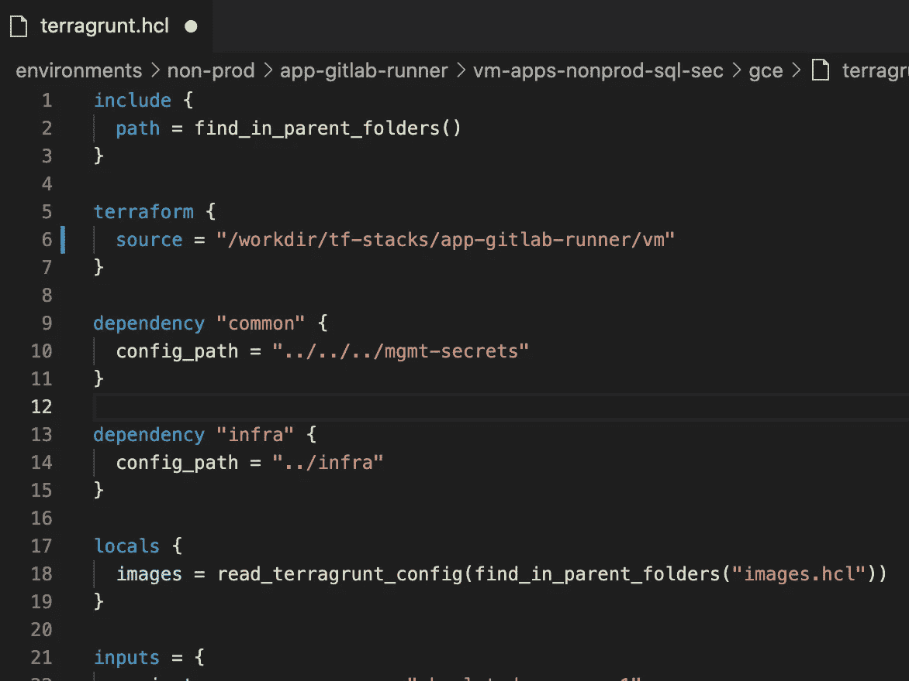
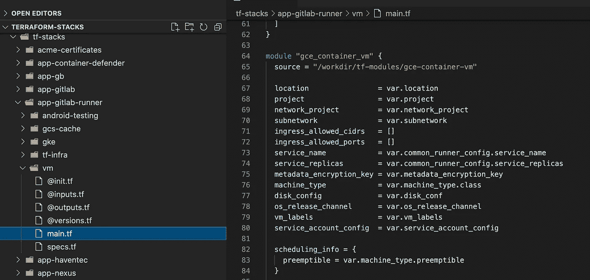
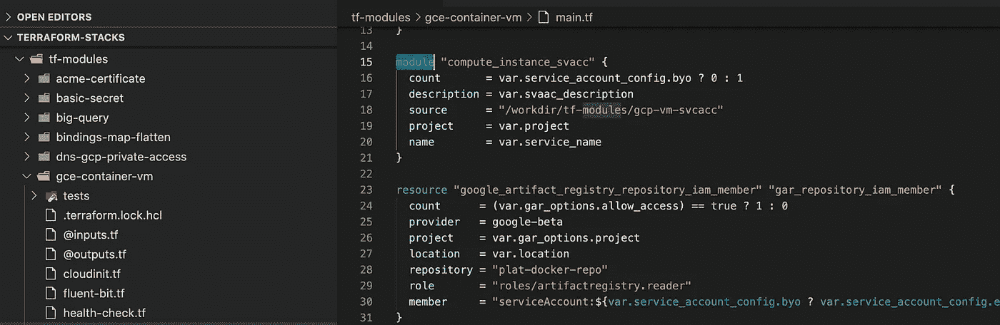
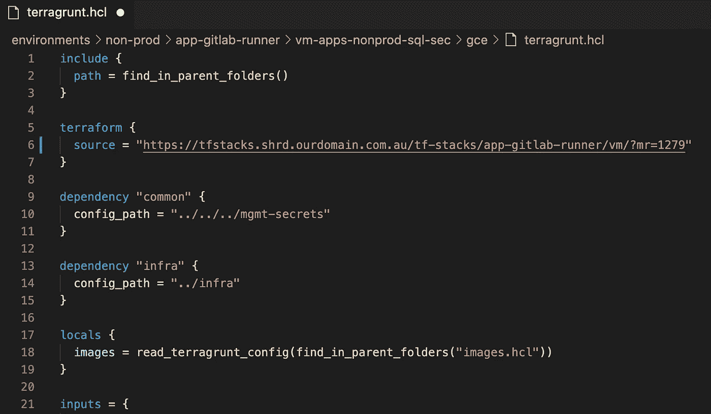
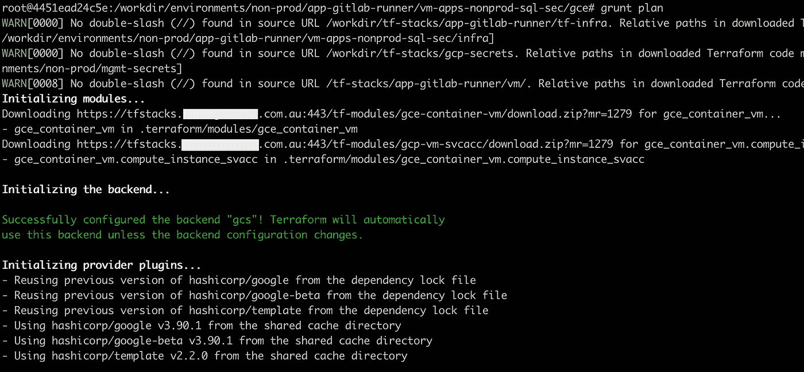

# 对平台依赖版本管理的不同看法

> 原文：<https://itnext.io/a-different-view-to-terraform-dependency-version-management-3cb32691b82b?source=collection_archive---------0----------------------->

[保罗·尼科莱洛在 Unsplash 上拍摄的照片](https://unsplash.com/photos/tzeMMBUNmVg)

在下面的文章中，我分享了我们最近建立的一些东西，用于在部署到多个环境时管理跨共享模块的 Terraform 依赖性变化。当许多人不得不针对相同的 Terraform mono-repo(具有嵌套依赖性)工作时，在寻找一种简单而直接的方法来限制爆炸半径的漫长旅程之后，这一点终于实现了。

为了说明这个问题，让我们以传统的通用虚拟机(VM) Terraform 模块为例。这个基础模块通常在代码库的许多地方被引用，如果对它的更改没有经过适当的测试，可能会导致重大的中断。当查看 Terraform 文献时，推荐建议:*到* t *将模块创建为版本化的人工制品，并让代码引用它的时间点版本。*这听起来确实是正确的做法，你会认为这应该很容易实现，对吗？。细节决定成败！:事实是，一旦你开始将理论付诸实践，就会发现很多隐藏的复杂性:

*   您是否必须将所有模块转移到单独的回购协议中，并在它们被其他栈引用之前为每个模块构建一个完整的测试-发布生命周期？如果堆栈引用了 6 个模块，每个模块都需要更新，这需要多长时间？
*   你是否将所有的模块保存在同一个 mono-repo 中，并围绕它构建一些智能版本化自动化工作流？这个工作流程如何处理有 2-3 个嵌套模块的情况？
*   代码库中有这么多固定版本，您如何确保不断向前滚动更改，以便您可以依赖您的环境在所有使用共享模块的工作负载中拥有最新的预期特性。
*   最后但同样重要的是，谁为这些工作买单？

我确信一些团队在投入大量时间和金钱解决这个问题后，已经成功地采用了教科书式的方法。对我们来说，无论何时试图解决这个问题，传统上都是在浪费时间和金钱。然而这一次，我想我们终于找到了一个相当不错的替代工作流程:

## 我们正在对“批次”进行版本控制！

在我们的新设置中，我们决定放弃模块版本化，转而支持回购级版本化。这意味着，我们没有尝试为我们拥有的每一个小模块建立一个发布过程，我们只是保持了 mono-repo 方法，每当 Terraform 文件有更新时就“快照”，然后将所有更改的代码指向引用快照(虽然不是字面上的)。

为了做到这一点，我们利用良好的旧的合并请求人工制品来保存代码的不可变视图，然后在跨环境部署 Terraform 堆栈时引用该标识符(一旦合并请求进入主分支，就不能再更新了)。此外，合并请求表示开发人员本地工作站上 Terraform 文件的时间点状态，因此，这非常类似于开箱即用的 Terraform 用户体验。

然后我们欺骗 Terraform 递归地从父栈版本的相同合并请求标识符中提取嵌套模块代码。[遵循文档中的建议](https://www.terraform.io/language/modules/sources#http-urls)并使用非常普通的 python 编码技术，我们很快组装了一个小型的“类似 Terraform 注册表”的服务器，它在代码报告中充当中间人，并在将文件返回给 Terraform 客户端时动态重写模块地址。

## 开发工作流程

新设置下的开发工作流如下所示:

1.  我们首先创建一个空白的合并请求来获得一个标识版本化代码的 ID:

2.我们用指向本地文件系统的代码进行所有的更新。在我们的例子中，我们使用 Terragrunt 来引用和运行我们的 Terraform 堆栈，但是这个过程应该很容易使用普通的 Terraform 模块来模拟。

代码本身可以包含嵌套模块，这些模块也指向本地文件系统:

2.一旦我们准备好版本化栈，我们更新顶级地址指向我们的定制 Terraform 服务器并指定我们的合并请求 ID。我们还需要确保我们的变更被推送到 MR 分支。

3.坐下来放松一下:下次我们运行堆栈时，我们将看到 Terraform 使用父堆栈中使用的相同 MR ID 从服务器下载所有嵌套代码。

## 家政

这种方法有一些注意事项，这是我们目前正在做的事情:

1.  *有人炸毁了版本控制服务器，或者代码回购变得疯狂:*
    我们已经创建了一个紧急模式的工作流，我们在本地运行堆栈，并使用 MR id 来引用 git 标签。
2.  *当有更新时，我们的堆栈需要强制引入 Master 的最新和最棒的版本:*
    这实际上是一件好事，因为它强制尝试用最新的代码来维护 Prod，但它也允许快速获得对潜在的损坏代码的反馈。我们还设置了一个循环计划来检查所有需要重新应用或在非生产中中断的堆栈，以便我们可以尽可能保持非生产最新。
3.  *需要在 prod:*
    中应用紧急更改，到目前为止我们还没有遇到这个问题，但计划是从固定的 MR 最后提交 ID 创建分支，并在那里修复这个问题，作为绝对临时的解决方案。

## 分享是关怀

下面的代码针对 Gitlab 实例运行服务器，但是修改它以针对任何其他源代码控制系统应该很简单。快乐的地球化！